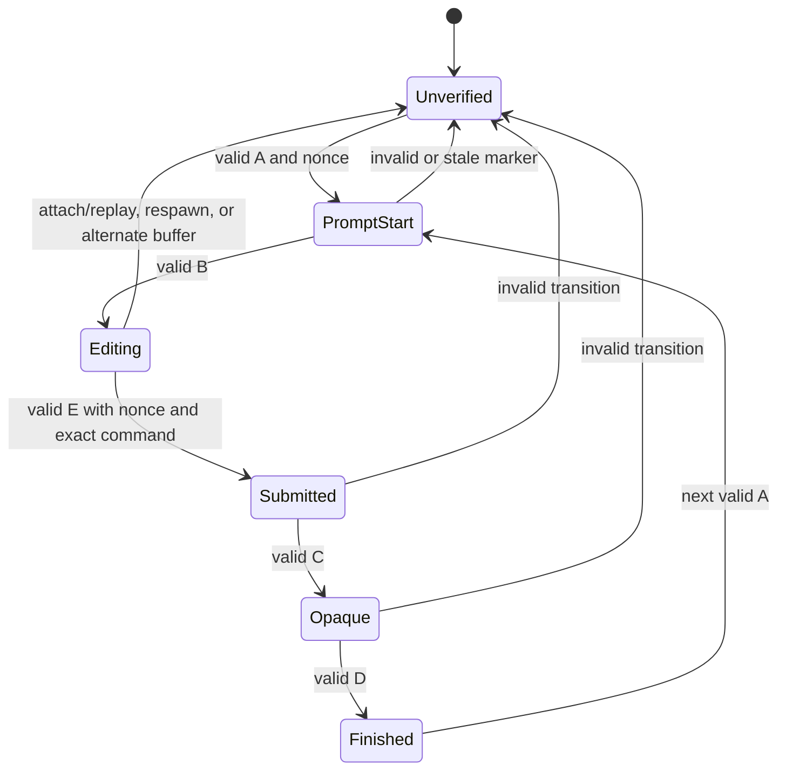
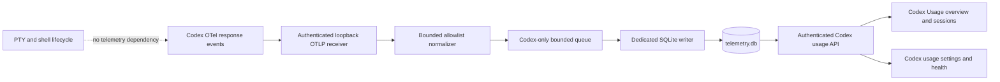
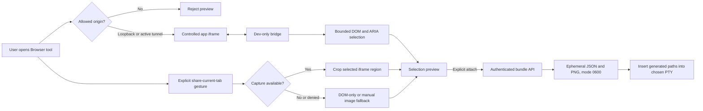
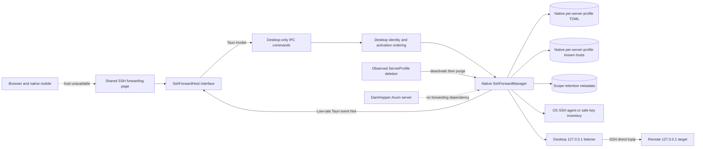
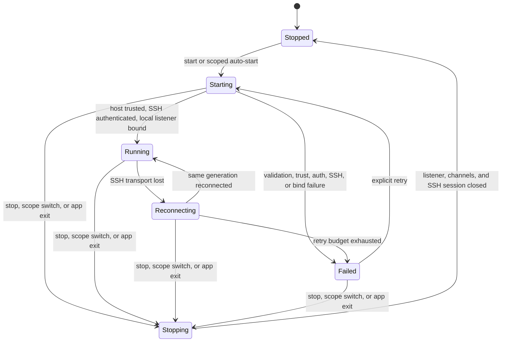

# System Architecture

## High-Level Overview

```
┌─────────────────────────────────────────────────────────────┐
│  Browser / Native WebView                                    │
│  ├─ Thin Vite host (apps/web/dist/)                        │
│  ├─ Tauri native host (apps/native)                        │
│  ├─ Shared React UI package (packages/ui)                  │
│  ├─ Shared runtime utilities (packages/shared)             │
│  ├─ Cooperative browser-debug preview + picker             │
│  ├─ fetch(/api/*) for REST queries                         │
│  └─ WebSocket(/ws) for terminal I/O + events               │
└──────────────────────┬──────────────────────────────────────┘
                       │ HTTP/WebSocket
┌──────────────────────▼──────────────────────────────────────┐
│  dam-hopper-server (Rust, Axum, port 4800)                    │
├─────────────────────────────────────────────────────────────┤
│  ┌─ AppState (shared across all handlers)                  │
│  │  ├─ workspace_dir: Arc<RwLock<PathBuf>>                │
│  │  ├─ config: Arc<RwLock<DamHopperConfig>>                  │
│  │  ├─ pty_manager: PtySessionManager                     │
│  │  ├─ port_forward_manager: Option<PortForwardManager>   │
│  │  ├─ agent_store: Arc<AgentStoreService>                │
│  │  ├─ event_sink: BroadcastEventSink                     │
│  │  ├─ fs: FsSubsystem                                    │
│  │  ├─ ssh_creds: Arc<RwLock<Option<...>>>               │
│  │  ├─ auth_token: Arc<String>                            │
│  ├─ opaque_server_setup: Arc<ServerSetup<...>>            │
│  ├─ opaque_registrations: OpaqueRegistrations (in-mem)   │
│  ├─ Router                                                 │
│  │  ├─ /api/projects → ProjectList handler                │
│  │  ├─ /api/pty/* → PTY spawn/send/kill                   │
│  │  ├─ /api/ports → Port detection list                   │
│  │  ├─ /api/git/* → Clone/push/status/branch/root ops     │
│  │  ├─ /api/fs/* → [conditional] List/read/stat (per-proj)│
│  │  ├─ /api/agent-store/* → Distribution/import           │
│  │  ├─ /api/workspace/* → Config switching                │
│  │  ├─ /api/usage/* → Codex OTel usage (opt-in)           │
│  │  ├─ /api/browser-debug/* → Ephemeral artifacts         │
│  │  └─ /ws → WebSocket upgrade                            │
│  └─ Services                                               │
│     ├─ PtySessionManager (Arc<Mutex<Map<uuid, ...>>>)     │
│     ├─ TelemetryStore/Worker (opt-in, separate SQLite)     │
│     ├─ BrowserDebugArtifactManager (ephemeral, TTL/sweep)  │
│     ├─ FsSubsystem (Arc<Mutex<ProjectSandbox>>)           │
│     ├─ AgentStoreService (symlink distribution)           │
│     ├─ CommandRegistry (BM25 search)                      │
│     └─ Broadcast channels (PTY output, git progress)      │
└─────────────────────────────────────────────────────────────┘
```

## Module Breakdown

### Browser debug artifacts (Phase 2; Phase 6 hardened)

The authenticated `/api/browser-debug/artifacts` routes provide ephemeral handoff storage for browser-debug tooling. `BrowserDebugArtifactManager` keeps metadata in memory and writes generated JSON/PNG paths beneath a temporary root; it exposes create, one-shot PNG upload, and delete only—there is intentionally no read/list route. Create accepts a live `terminalId` plus validated `selection` JSON (64 KiB request cap). PNG upload requires `image/png`, is capped at 4 MiB, and performs structural plus decoded-image verification before writing. Artifacts expire after 10 minutes, a 60-second sweeper removes expired files, and shutdown cleanup removes the root.

### config/

Handles registry loading, legacy discovery fallback, and feature flags.

**Key types:**

- `DamHopperConfig` — parsed project registry
- `ProjectConfig` — individual project settings

**Registry and sandbox semantics:**

- Canonical registry path is `~/.config/dam-hopper/dam-hopper.toml`, with `--config` and `DAM_HOPPER_CONFIG` as explicit overrides
- Relative `projects[].path` values resolve against the loaded registry file directory; absolute paths are preserved
- File API security is enforced by per-project roots in `ProjectSandbox`, not by `workspace_dir`
- Example: with a registry at `~/.config/dam-hopper/dam-hopper.toml`, `path = "./apps/web"` resolves to `~/.config/dam-hopper/apps/web`, while `path = "D:\\repos\\api"` stays `D:\repos\api` on Windows

**Path resolution priority:**

1. `--config` CLI flag or `DAM_HOPPER_CONFIG` env var
2. `--workspace` CLI flag or `DAM_HOPPER_WORKSPACE` env var
3. `~/.config/dam-hopper/dam-hopper.toml` global registry path
4. `~/.config/dam-hopper/config.toml` `defaults.workspace`
5. Current working directory via legacy upward `dam-hopper.toml` discovery
6. Empty config fallback

### shared/

Dependency-free runtime helpers shared by browser packages.

- `logger.ts` centralizes `configureLogger`, `getLoggerConfig`, `resolveLogLevel`, and `logger.debug/info/warn/error`
- Phase 01 adds `addLoggerSink()` fanout. The primary sink stays in place, and extra sinks are isolated so one sink failure cannot break the app path
- Sensitive metadata is redacted recursively before sink delivery by default
- Web bootstrap reads the desired log level from Vite env and falls back to `debug` in development or `warn` in production

### xterm agent notifications (Phase 2)

Pure frontend notification pipeline in `packages/ui/src/lib/`:

- `agent-command-recognizer.ts` identifies tracked agent commands from terminal input
- `agent-activity-tracker.ts` turns submitted command, output, user input, and enhanced exit events into activity state changes
- `terminal-notification-signal-parser.ts` converts BEL and OSC 9/777/99 terminal signals into normalized notification events
- `terminal-notifications.ts` keeps a bounded, memory-only notification history and transient toast IDs in Zustand
- `terminal-notification-sound.ts` reuses one Web Audio context to synthesize the built-in `default`, `soft`, `two-tone`, and `urgent` in-app chimes at the persisted volume. `default` preserves the existing single-chime behavior for compatible configurations; sound has no effect on native browser popups and requires no audio assets or dependencies. Unavailable or blocked audio is a silent no-op.
- `browser-notification-service.ts` applies permission, rate-limit, and delivery guards before creating browser `Notification` objects
- `TerminalNotificationCenter` and `TerminalNotificationToastViewport` render the shared in-app bell/feed and top-right live alerts

On terminal attach or reconnect, notification delivery is marked replay-active before
the retained buffer is written and remains suppressed until xterm invokes that write's
completion callback. Live chunks queue during that interval, so historical OSC 9
signals cannot alert while an identical signal received after replay completion can.

Runtime delivery is intentionally UI-only, while its preferences use the server-backed global UI-config persistence path. The API uses camelCase and global TOML uses snake_case: the master `terminalCodexNotificationsEnabled` / `terminal_codex_notifications_enabled` defaults to off, while toast, browser-popup, and sound preferences default to on, volume defaults to `100`, and the sound pattern defaults to `"default"`. Valid patterns are `"default"`, `"soft"`, `"two-tone"`, and `"urgent"`; invalid values are rejected during config deserialization. The master is the OSC 9 capture gate and the only setting that synchronizes Codex TUI configuration. While it is on, history is always recorded; toast, browser-popup, and chime delivery have independent child gates. Child delivery and sound preference updates do not modify `~/.codex/config.toml`. It is covered by unit tests around parsing, recognition, tracking, notification gating, callback-gated replay suppression, restart suppression, and cleanup behavior, plus a Chromium regression test that verifies queued live chunks resume only after retained replay completes.

Phase 03 adds the delivery controls to the shared UI package:

- `TerminalAgentNotificationSettings` exposes the master, **In-app toast**, and **Browser popup** switches; `TerminalNotificationSoundControls` exposes the Sound switch, fixed Sound style selector, Volume slider, and user-activated **Play sound** button
- `AgentCommandPatternEditor` lets users add literal aliases such as `CODEXNSB` or custom regex matches without editing config files by hand
- browser permission state is read from the runtime `Notification` API and is never persisted into server config; only the explicit request button can request it, while preview plays Web Audio only
- diagnostics for unsupported/default/denied/rate-limited/factory-error paths are emitted as frontend `custom` events under scope `terminal-agent-notifications`
- the Codex notification setting gates event capture and child controls, but does not reset saved child choices; toast off still retains bell/feed history, and the Sound switch/style/volume gate only the best-effort chime. Browser popup delivery additionally requires runtime native permission, so browser permission denial or lack of support does not affect the in-app bell/feed
- in-app history is session-memory only, capped at 50 records; at most three toast alerts are shown and each expires after six seconds

Notification scope remains xterm-only. DamHopper does not watch external terminals, OS process tables, or native notification daemons for this feature.

### inline terminal suggestions

Automatic suggestions and history capture remain fail-closed until the server verifies
a shell lifecycle for the current PTY incarnation. The server supports launch-only local
interactive zsh, fish, and Bash adapters; every other command or shell remains unsupported.
Terminal and outgoing PTY bytes are passive: the feature
never infers command boundaries from Enter, output silence, replayed scrollback, or
arbitrary input. Command history is browser-local and users can clear it or disable
future persistence from Settings.

Supported adapters emit OSC 633-compatible `A`/`B`/`E`/`C`/`D` markers carrying a
fresh, per-incarnation nonce. `ShellLifecycle` is a bounded (8 KiB) streaming parser:
it accepts BEL or ST terminators and validates marker order, nonce, and the base64url
command payload in `E`. Bash uses normalized `BASH_COMMAND` text for simple commands
and emits no submission marker for ambiguous syntax. The nonce exists only in the child
environment and lifecycle observer; it is never persisted or sent to clients. Valid private markers are stripped
from live output and scrollback, while malformed, invalid, or oversized markers remain
visible verbatim and reset trust.

The server broadcasts only typed `terminal:lifecycle` events (`editing`, `submitted`
with the exact command, `opaque`, or `unverified`) and an opaque generation number.
It resets lifecycle trust on a terminal attach/replay, invalid marker or transition,
alternate-buffer entry, and a new PTY incarnation. No lifecycle event establishes
trust for unsupported shells.



The security boundary is that only `Editing` may query or show a passive suggestion. `E` supplies
the exact submitted command; `C` closes editing before command output or password/REPL/
TUI input. Browser-local history commits only from a current-generation, server-validated
`submitted` lifecycle event carrying that exact `E` command. Outgoing PTY bytes, Enter,
terminal silence, and replayed scrollback never establish a history boundary.
The Bash adapter preserves scalar and array `PROMPT_COMMAND` hooks and disables itself when
an existing `DEBUG` trap would make command capture ambiguous. Bash commands containing
compound, multiline, substitution, or redirection syntax also fail closed rather than
submitting an approximation. Nonce validation limits accidental or child-process marker spoofing; it is not isolation
against malicious same-user code, so invalid sequences always reset to `Unverified`.

Phase 03 implements a per-session, client-only suggestion controller with immutable
snapshots and monotonic prompt epochs and input revisions. Each lifecycle, input, output,
replay, or composition transition synchronously invalidates outstanding searches. A result
can enter a `ghost` snapshot only when its session, epoch, revision, exact raw input, verified
editing lifecycle, and byte-exact true-prefix relation still match. Phase 04 renders only the
remaining suffix of that snapshot; it never redraws or replaces the typed prefix.

The controller accepts only one printable grapheme as an append while a verified prompt is
clean. Control sequences, Enter, cursor edits, completion, multi-grapheme/paste input, IME
composition, terminal output, reconnect/replay, and buffer ambiguity fail closed to `opaque`
or `unverified`. The terminal adapter remains passive except for three explicit desktop
shortcuts: `Alt+Right` accepts the full remaining verified suffix, `Alt+Shift+Right` accepts
its next token, and `Ctrl+Alt+H` opens the explicit history workflow when enabled. Acceptance
atomically clears the ghost before writing the suffix once through the normal PTY path; it never
sends Ctrl+U, the existing prefix, or Enter. Every other xterm key and input byte—including Tab,
Enter, Escape, Ctrl+R, paste, and TUI input—continues unchanged. Coarse-pointer and
native-keyboard-suppressed surfaces disable automatic ghost and history-shortcut behavior.
Fuzzy/non-prefix results remain for an explicitly focused accessible list rather than passive
completion.

History v2 is browser-local under `dam-hopper:command-history` as `{ version: 2, entries }`.
Each entry retains an exact raw command, a stable v2 id, last-used timestamp, total use count,
current project, and a per-project usage map. Its NFKC-lowercased `searchText` and Unicode
word tokens are derived search fields only; they never reconstruct or alter the raw command.
The shared ranking puts byte-exact raw prefixes ahead of normalized token-prefix matches, then
uses recency and usage as tie-breaking signals. Legacy records are normalized in memory and
are not rewritten until a later verified command write. Disabled or inaccessible local storage
fails closed, and the Settings controls can stop future writes or clear stored history.

The server preserves ordering at the prompt boundary: visible PTY output is emitted before its
pending `editing` lifecycle snapshot. A marker-only chunk cannot flush `editing`; it waits for
visible prompt output (or a previously established visible boundary). This prevents the client
from treating an unseen prompt marker as a usable editing surface.

Cursor placement is isolated behind one fail-closed geometry adapter. It measures the
xterm textarea relative to the current terminal host and has one validated screen-grid fallback.
It recomputes once per animation frame on cursor/output/resize/scroll/zoom/font changes; the
terminal host attachment invalidates it after reparenting. Detached hosts, alternate buffers,
scrollback, invalid rectangles, and out-of-bounds measurements hide the ghost rather than guess.
The visual suffix is `aria-hidden`, unfocusable, pointer-inert, single-line, and clipped/faded at
the available terminal width. Proposed xterm decoration APIs are not a default dependency;
adopting them requires a renderer/reflow spike and pinned compatibility.

The explicit history path is a focus-managed dialog, never a passive preselected menu. It searches
browser-local entries and exposes full command text with Copy and Use actions. Use writes only a
single-line command to the current PTY without Enter; a multi-line entry stays visible but is
copy-only. The dialog and ghost consume only immutable controller snapshots and do not record
history, alter lifecycle trust, or add terminal protocol messages.

History stores exact raw commands separately from normalized search fields, remains
local-only, and provides clear/disable controls. Desktop is the first support boundary;
mobile direct-write paths remain explicitly unsupported until all input routes share the
same controller.

### Codex OTel usage analytics

Usage is a Codex-only observability feature. Codex `response.completed` log records exported over
OTLP are the sole write source. PTY creation, input, output, shell integration, command lifecycle,
and restart paths perform no usage work and carry no usage correlation identifiers.



The receiver binds to loopback only, requires the generated bearer secret, decodes only bounded
allowlisted fields, and queues normalized `CodexUsageEvent` values directly. The Codex usage
runtime owns queue admission, batching, retention, deletion, and shutdown. There is no generic
`TelemetrySink`, PTY capture snapshot, command classifier, terminal correlation registry, marker
injection, or output redactor in this dataflow. Collector or storage failure cannot affect terminal
latency or behavior.

Collector health preserves the aggregate `dropped` count and adds five fixed-cardinality,
in-memory reason counters: missing source identity, invalid timestamp, paused admission, full
queue, and unavailable worker. Normalization and enqueue outcomes increment exactly one reason
counter alongside the aggregate; the counters never include source versions, models, identifiers,
paths, errors, or payload content, and reset on process restart. The missing-identity field is
retained for health API compatibility and remains zero when the bounded fallback is active.
Queue-full and worker-unavailable outcomes retain retryable `503` responses, while normalization
and paused records retain their existing `202` behavior.

Codex CLI 0.146.1 emits token fields in `response.completed`, but its OTLP records provide no safe
per-event trace/span or provider event ID. When trace/span are absent, Usage derives a
domain-separated HMAC fallback from bounded decoded fields: source version and timestamp,
conversation/model identifiers, bounded token components, duration, and counter semantic. Raw
content, receipt time, conversation ID alone, and fabricated random IDs are never fallback keys.
Valid trace/span identity takes precedence over the fallback.
The fallback is stable for replay but can dedupe identical same-millisecond decoded events; this is
an explicit compatibility tradeoff, and those events remain `unverified`. Invalid timestamps still
fail closed. This is an ingestion-admission decision only: it makes no Codex event or SQLite schema
change.

Development invariant: remove the Usage middle layer from every PTY production path, including
constructor parameters, session options, restart/restore handoff, reader-loop state, environment
mutation, admission locks, and no-op abstractions. Do not retain a disabled Usage hook “for later.”
Codex usage may depend on the independent OTLP runtime; PTY production modules must not import or
call it. A negative production dependency scan and an enabled-versus-disabled PTY
latency/throughput comparison gate this refactor so future Usage work cannot silently reintroduce
terminal overhead.

The target store contains `codex_sessions`, `codex_usage_events`, `codex_daily_rollups`, and
`telemetry_health`. It retains keyed dedupe/session identifiers, bounded model/source/status fields,
response count and duration, nullable token components, and explicit quality only. The database is a
fresh v1 Codex-only store; it has no legacy-data migration or import. During development, startup
checks `user_version` and the complete allowlisted object definitions. If the configured telemetry
file is legacy, malformed, or otherwise not this target schema, the store performs a bounded,
transactional reset of that telemetry file's user tables/views/triggers/indexes and recreates the
fresh schema. A current schema is reopened without resetting its data.

The protected API exposes Codex totals, time/model buckets, bounded session summaries, receiver and
storage health, retention, and deletion controls. Shell, terminal, command, project, category,
agent, capture-quality, terminal-correlation, and inferred-lineage filters or fields do not exist in
the target contracts. The Usage page shows Codex token/response/session/duration trends and model
breakdowns. Settings contains one “Codex usage telemetry” setup surface. Neither UI surface mentions
terminal analytics; cost stays omitted until authoritative versioned pricing exists.

For an intentional clean reset, stop DamHopper and remove the effective
`server.telemetry.db_path` file plus its `-wal` and `-shm` sidecars. The default is
`~/.config/dam-hopper/telemetry.db`. The separate `sessions.db` must not be removed.
Runtime initialization also rejects configurations that resolve telemetry and session persistence to
the same database file.

#### Development reset boundary

Legacy combined telemetry data is intentionally unsupported during development. On startup,
`TelemetryStore` checks SQLite `user_version` and the object list/schema definitions; any non-v1 or
non-Codex database is cleared and recreated from the fresh schema, with no migration or data import.
The reset is scoped to the configured telemetry database and uses a single transaction; current
Codex v1 data survives a normal reopen. For a manual reset, stop DamHopper and remove
`telemetry.db` plus its `-wal` and `-shm` sidecars; `sessions.db` is unrelated and must remain intact.

#### Flat Codex session summaries

OTel remains authoritative for input, cached-input, output, and reasoning token components. The
runtime stores one privacy-safe flat summary per Codex session and never infers parent/child edges
from event order, model names, titles, or text. Direct reads from Codex SQLite or rollout files are
forbidden in production.

Idempotent upserts preserve summaries before detail purge. `delta` counters add; `cumulative`
counters accept only newer non-regressing observations, rejecting stale, conflicting, or regressing
updates as summary conflicts.

The protected API exposes cursor-bounded `GET /api/usage/sessions` and
`GET /api/usage/sessions/{id}` routes. List pages are capped at 100 rows (default 25) across a
maximum five-year range; cursors are authenticated and bound to the range and model filter. Each
session contains only a derived ID, timestamps, optional model data, bounded token components, and
bounded model summaries. Detail returns the same flat projection. Active sessions preserve a null
end timestamp while cursor ordering uses their start timestamp as the effective sort key. Terminal,
project, shell, capture-quality, category, agent, correlation, lineage, and raw-content fields are
not part of the contract.

Model identifiers are generalized rather than tied to a fixed model-name allowlist. They are
bounded to 1–64 safe ASCII characters, must start and end alphanumeric, and may contain `.`, `_`,
`-`, `/`, or `:`; URL-like values, repeated separators, and content-bearing forms are rejected
before storage or filtering.

Codex app-server metadata is intentionally outside this usage contract. OTel aggregate usage remains
the sole source for persisted Codex session summaries until a future, privacy-safe metadata
projection is separately specified.

Key invariants:

- Shell lifecycle validation remains the only command boundary.
- Telemetry persistence stays off the PTY hot path.
- Raw commands and AI content never cross the persistence boundary.
- Availability and paused state are reported explicitly; missing token components remain null.
- Codex telemetry adds no MCP call or model-token consumption.
- Metrics stay descriptive; no productivity or employee scoring.
- Session detail remains one compact Codex summary row bounded by detail retention; no permanent
  turn/event transcript.

Notification selection also stays frontend-only. Native notification clicks
publish a typed browser event keyed by the stable PTY `sessionId`;
`WorkspacePage` consumes it because that page owns workspace mode, compact
surface selection, terminal selection, and xterm focus orchestration. A click
preserves the current IDE/Terminal mode: desktop IDE mode opens its Terminal
bottom tool, while compact mode reveals the Terminal surface without toggling
the mode. Displayed
notification context uses `Project · Bash #N`, with the ordinal read from the
current 1-based open-terminal order; the original sanitized body keeps its own
payload allowance below that context line. Project names and terminal ordinals
are display only and are never used as navigation identity. Navigation requires
a mounted target that is explicitly alive, or a mounted and registered xterm
only when liveness is unknown. Explicitly dead, unmounted, and stale session
clicks no-op without changing server state, the WebSocket protocol, or persisted
terminal layout. Compact coarse-pointer layouts with the mobile custom keyboard
enabled still reveal and refit the exact session but suppress forced native
xterm focus so selection does not unexpectedly open the browser keyboard.

### frontend diagnostics (Phase 01)

The browser host now initializes a diagnostics client before React render. This creates a local-only ring buffer for client-side troubleshooting and keeps the capture path active from app startup onward.

**Host init flow:**

1. `apps/web/src/main.tsx` calls `initializeClientDiagnostics()` before `createRoot(...).render(...)`
2. `WsTransport` status changes are fed into the diagnostics client
3. `RouteDiagnostics` in `packages/ui/src/embed/dam-hopper-app.tsx` records route changes
4. `ErrorBoundary` records React render failures
5. Window `error` and `unhandledrejection` events are captured

**Stored signals:**

- shared logger entries via logger sink fanout
- browser runtime errors
- unhandled promise rejections
- React error boundary failures
- route changes
- WebSocket transport status changes

**Storage model:**

- persisted in `localStorage` under `damhopper_diagnostics_frontend_v1`
- bounded ring buffer, trimmed by time and entry count
- storage budget is capped at a small fixed size; oldest entries are dropped first when the cap is hit
- diagnostics stay best-effort if browser storage is blocked or full

Phase 01 is client-side only. It does not add a backend export endpoint yet.

### backend diagnostics store + export (Phases 02-04)

The server now keeps a local-only diagnostics store for backend events and exposes a protected export endpoint for debugging. Request/response payloads use camelCase on the wire.

**Storage model:**

- JSONL file under the config dir: `~/.config/dam-hopper/diagnostics/backend-log.jsonl`
- file mode is `0600` on Unix
- retention window is 60 minutes
- compaction keeps the newest in-window events and drops older ones
- storage is local only; there is no remote upload path

**Privacy model:**

- event message text and fields are redacted before persist
- redaction is best effort, not a hard privacy boundary
- export also returns the already-redacted backend events

**Export API:**

- `POST /api/diagnostics/export`
- protected by auth like other backend routes
- invoked by Settings > Maintenance > Export Diagnostics and terminal-title context menus in the UI
- workspace terminal exports use the shared terminal-panel time window and pass only the right-clicked session ID as `terminalIds`
- request accepts `frontend` and also the legacy `frontendSnapshot` alias
- response schema version is `1`
- top-level export sections:
  - `scope`
  - `manifest`
  - `frontend`
  - `backend`
  - `terminals`
  - `system`

**Scope fields:**

- `windowMinutes`
- `includeTerminalOutput`
- `terminalTailBytes`
- `terminalIds`
- UI defaults: 60-minute window, terminal tails included, `terminalTailBytes=65536`

**Manifest fields:**

- `backendEventCount`
- `terminalSessionCount`
- `retentionMinutes`
- `storage` = `localConfigJsonl`
- `droppedPersistEvents`
- `persistErrorCount`

**Terminal tails:**

- `terminals.sessions` includes detailed session snapshots
- `terminals.tails` includes capped per-session scrollback tails when `includeTerminalOutput=true`
- `terminalTailBytes` controls how much tail data is returned per session
- exported files use `dam-hopper-diagnostics-{timestamp}.json`
- terminal tails may still contain sensitive local/dev output even after best-effort redaction; exported bundles should be reviewed before sharing

### Cooperative browser debug preview

The browser host exposes a global Browser tool for controlled development
applications. V1 does not inspect arbitrary public pages. Supported preview
URLs may use an HTTP loopback origin or the origin of a `Ready` tunnel URL
returned by the connected server's `TunnelSessionManager`; paths, query
strings, and hashes remain inside that approved origin boundary.

The DamHopper Browser Debug extension injects a framework-neutral, dev-only
content script into the cross-origin iframe. The target application does not
install anything. The extension owns element highlighting, DOM/accessibility
extraction, path synchronization, and bounded console previews. Parent and extension communicate through a
versioned `postMessage` protocol with WindowProxy/source checks, a per-load
nonce, exact target/parent-origin checks, request IDs, schema validation, and
bounded payloads. Loopback parent origins are allowed for local development;
deployed parent origins are compiled into the extension from
`VITE_DAM_HOPPER_EXTENSION_PARENT_ORIGINS`. The target route must still permit
iframe embedding through its browser policy; DamHopper does not bypass
`X-Frame-Options` or restrictive CSP.

The web build packages the extension as
`/browser-debug-extension/dam-hopper-browser-debug.zip`. When the Browser
tool cannot complete the bridge handshake, it offers this download and directs
the client to extract it and use Chromium's `chrome://extensions` Developer
mode / Load unpacked flow. The target application remains unmodified; a normal
website cannot silently install a browser extension.



**Client state and UI rules:**

- `WorkspacePage` registers Browser beside existing tool definitions for IDE,
  terminal, and compact layouts without creating another PTY lifecycle.
- One `BrowserDebugKeepAliveHost` owns the iframe for the lifetime of
  `WorkspacePage`. The host keeps the iframe in one fixed overlay and moves
  that overlay off-screen when no Browser viewport is active; viewport
  geometry is recalculated on shell, resize, and compact-surface changes. Tool
  close, IDE/terminal switching, and compact surface changes do not recreate
  the iframe or its browsing context. Leaving Workspace, changing server
  profile, or changing the preview URL disposes it and invalidates the bridge
  nonce.
- Preview metadata is browser-local. Captured `MediaStream` objects are never
  persisted; closing the visible Browser panel stops all capture tracks for
  privacy even though the iframe stays alive in its off-screen overlay.
- `getDisplayMedia()` is invoked only from a user gesture. Current-tab and
  browser-surface options are hints, not silent permission or proof of the
  selected surface. Capture failure degrades to semantic metadata plus manual
  image upload.
- Page text renders only as React text. Input values, password/file controls,
  cookies, storage, auth data, event attributes, hidden surrounding DOM, and
  unbounded HTML are excluded.
- Captured content and artifact paths are excluded from frontend diagnostics.

**Artifact and terminal handoff rules:**

- `BrowserDebugArtifactManager` owns a server-instance temporary directory and
  an in-memory metadata map. Bundle files are random, mode `0600`, size-capped,
  TTL-bound, and removed on explicit discard, expiry sweep, and server shutdown.
- The protected browser-debug API accepts one bounded structured selection and
  optional cropped PNG. It never accepts a client-provided filesystem path.
- The create response includes the server-generated JSON path; an optional PNG
  path appears only after the PNG upload commits. The selected PTY must still
  be mounted/live and is addressed by stable `sessionId`.
- Terminal insertion contains generated paths and an untrusted-data warning,
  not raw page content. Strip CR/LF, C0/C1, ESC/CSI/OSC/DCS sequences; never
  append Enter or auto-submit.
- Browser-debug JSON/PNG data never enters diagnostic JSONL, diagnostic export,
  terminal replay, project roots, or the persistence database.

**Failure invariants:**

- iframe navigation invalidates the nonce and selection;
- a stopped/replaced tunnel immediately removes its origin from the allowlist;
- stale, dead, or unmounted terminal targets are safe no-ops;
- capture denial never blocks DOM-only inspection;
- disconnect/reconnect does not extend bundle TTL or expose bundles to a
  different server profile.

### apps/native

Tauri v2 native client that reuses the same `packages/ui` runtime as the web
host. It is a remote client only: it does not embed the Rust server as a
sidecar, does not rewrite PTY behavior in native code, and keeps Tauri
permissions to `core:default`.

**Frontend host:**

- `apps/native/src/main.tsx` mirrors `apps/web/src/main.tsx`: configures the shared logger, initializes `WsTransport(getNativeServerUrl())` when an active profile exists, otherwise installs an idle transport for the setup screen, creates the TanStack Query client, and mounts `DamHopperApp`.
- `apps/native/vite.config.ts` uses Tauri's fixed dev port `1420`, strict port mode, `TAURI_DEV_HOST` HMR support on port `1421`, and ignores `src-tauri` in Vite file watching.
- The shared `ServerProfileGuard` still controls startup. If no server profile exists, the native host installs an idle transport and opens the server setup dialog instead of relying on the packaged webview's same-origin URL.

**Tauri shell:**

- `apps/native/src-tauri` contains the default Tauri builder, the main window config, and the checked-in Android Studio project under `src-tauri/gen/android`.
- No filesystem, shell, opener, HTTP, or sidecar plugin permissions are granted in Phase 03. The native CSP allows local/profile HTTP and WebSocket connections but keeps default script execution to self.
- Native desktop dev uses `http://localhost:1420`. Android dev uses `tauri android dev --host`, which sets `TAURI_DEV_HOST` so the Vite dev server and HMR bind to the LAN-reachable address for an emulator or physical device. Packaged desktop webview requests can present `tauri://localhost`, `http://tauri.localhost`, or `https://tauri.localhost` depending on platform/webview. DamHopper servers that enforce CORS must allow the origin used by the packaged client when it connects cross-origin.

**Native browser-debug controller (Phase 03):**

- `apps/native/src-tauri/src/browser_debug/` owns one stable-label `browser-debug` child WebView, its serialized lifecycle, geometry, visibility, navigation generation, nonce/request state, and main-window-only commands.
- Target navigation is parsed and restricted to HTTP loopback or explicitly supplied HTTPS tunnel origins. Credentials, unsafe schemes, popups, downloads, external redirects, and Windows WebView2 permission requests fail closed.
- The existing built browser bridge is embedded by `build.rs` and injected at document start. The native relay accepts only bounded, schema-validated events matching the child label, committed origin, generation, nonce, and issued request ID.
- Child cookies, cache, and page storage use a profile-scoped hashed directory under application data. Clearing a profile destroys the active child before removing only that profile’s directory. Linux is build-only until a real engine verification pass; macOS remains deferred.

### persistence/ (Phase 04)

SQLite-backed session persistence infrastructure for live resume and server-restart relaunch.

Persistence is always enabled when the configured SQLite database can be opened. It does not preserve exact shell/process memory across DamHopper server or host restart.

**Schema (001_initial.sql):**

| Table           | Purpose                                                                                                                                      |
| --------------- | -------------------------------------------------------------------------------------------------------------------------------------------- |
| sessions        | Session metadata: id, project, command, cwd, session_type, restart_policy, restart_max_retries, env_json, cols, rows, created_at, updated_at |
| session_buffers | Scrollback buffers: session_id, data (BLOB), total_written, updated_at                                                                       |
| persisted_ports | Stdout-detected safe port candidates: session_id, port, project, updated_at                                                                  |

Indexes on `project` and `updated_at` for efficient queries.

**SessionStore API:**

- `open(path) → Result<Self>` — Creates/opens database, runs migrations, sets 0o600 permissions (Unix)
- `save_session(meta, env, cols, rows, restart_max_retries) → Result` — INSERT OR REPLACE into sessions
- `save_buffer(id, data, total_written) → Result` — Persist scrollback buffer
- `load_sessions() → Result<Vec<PersistedSession>>` — Load all saved sessions from database
- `load_buffer(id) → Result<Option<(Vec<u8>, u64)>>` — Load buffer data + byte count for session
- `delete_buffer_before(cutoff_ms) → Result` — TTL-based cleanup of expired buffers
- `delete_session_buffer(id) → Result` — Remove buffer for specific session

**Thread Safety:** Arc<Mutex<Connection>> — safe for concurrent access across async runtime.

**Session Storage Format:**

```rust
pub struct PersistedSession {
    pub meta: SessionMeta,        // id, project, command, cwd, session_type, restart_policy
    pub env: HashMap<String, String>,  // Stored as JSON blob in database
    pub cols: u16,                // Terminal width
    pub rows: u16,                // Terminal height
}
```

**Data Integrity:**

- RestartPolicy and SessionType enums stored as lowercase strings in database
- Environment variables serialized to JSON for portability
- created_at / updated_at in milliseconds (Unix epoch)
- total_written counter tracks bytes for buffer offset tracking (Phase 02)

### Persist Worker (Phase 05)

**Purpose**: Async worker thread that batches terminal session buffers and persists them to SQLite without blocking the PTY hot path.

**Architecture:**

- **Dedicated thread**: `persist-worker` (std::thread, not tokio)
- **Non-blocking design**: PTY threads use `try_send()` to send commands
- **Bounded channel**: sync_channel(256) prevents unbounded memory growth
- **Batching**: HashMap deduplication (only latest buffer per session written)
- **Throttling**: 16KB snapshots (prevents 256MB/sec → 16MB/sec memory churn reduction)

**Worker Commands (PersistCmd enum):**

| Command          | Source            | Trigger             | Behavior                                 |
| ---------------- | ----------------- | ------------------- | ---------------------------------------- |
| `BufferUpdate`   | PTY reader        | Every 16KB output   | Batches per session, overwrites previous |
| `SessionCreated` | PtySessionManager | On spawn            | Records metadata to SQLite               |
| `SessionExited`  | PTY reader        | On EOF              | Immediate flush (no 5s wait)             |
| `SessionRemoved` | PtySessionManager | On kill             | Deletes from database                    |
| `Shutdown`       | main.rs           | On drop(persist_tx) | Final flush and exit                     |

**Main Loop** (`PersistWorker::run()`):

1. `recv_timeout(1s)` with periodic 5s flush timer
2. On command: batch into HashMap, update database
3. On timeout: flush all pending buffers to SQLite
4. On channel disconnect: call `flush_all()` and exit

**Graceful Shutdown:**

1. Server receives SIGTERM
2. main.rs drops `persist_tx`
3. Worker detects channel disconnect
4. Worker calls `flush_all()` (no data loss)
5. Worker thread exits

**Performance Characteristics:**

| Metric             | Value                  | Improvement                 |
| ------------------ | ---------------------- | --------------------------- |
| Snapshot frequency | ~6/sec (16KB throttle) | 94% reduction vs every-read |
| Memory churn       | 16MB/sec               | 16× reduction vs 256MB/sec  |
| Worker CPU         | <1%                    | Minimal overhead            |
| Non-blocking sends | 100%                   | PTY never waits on DB       |

**Integration Points:**

1. **PtySessionManager** — holds `Option<Sender<PersistCmd>>`
   - `create()` sends SessionCreated
   - `kill()` sends SessionRemoved
   - Reader thread sends BufferUpdate (throttled)
   - Reader thread sends SessionExited

2. **main.rs** — manages worker lifecycle
   - Spawns worker thread on startup (if enabled)
   - Holds persist_tx; drops on shutdown
   - All pending buffers flushed before process exit

3. **SessionStore** — shared via Arc<Mutex>
   - Worker calls save_session, save_buffer, delete_session
   - No blocking on hot path (worker runs on dedicated thread)

**Use Cases:**

- Server restart recovery: restore active sessions + their scrollback on reboot
- Long-running tasks: preserve build/run output across server updates
- Debug experience: buffer history available immediately without re-running commands

### fs/ (Phase 01+: IDE File Explorer + Editor)

**error.rs** — `FsError` enum (Unavailable, NotFound, PermissionDenied, TooLarge, Conflict).

- `Conflict` variant (Phase 04): raised when write rejected due to mtime mismatch.

**sandbox.rs** — `ProjectSandbox` validates paths against per-configured project roots.

- HashMap<project_name, canonical_root> initialized at startup + workspace switch
- Cheap clone; canonicalization done at init time
- Never held across `.await`

**ops.rs** — Filesystem operations:

- `list_dir()` — directory contents with metadata
- `read_file()` — text/binary detection, range reads (max 100MB, Phase 04: capped at 10MB per REST call, unlimited via WS)
- `stat()` — file metadata (kind, size, mtime, mime, isBinary)
- `detect_binary()` — heuristic detection
- `atomic_write_with_check()` (Phase 04) — mtime-guarded atomic write via tempfile + rename
- `search()` (Phase 07) — .gitignore-aware text search using `ignore` crate; returns file + match context; results capped at 1000

**mod.rs** — `FsSubsystem` (Arc<Mutex<Inner>>):

- Lazy init: ProjectSandbox stored as Option (Unavailable if init failed)
- Seeded/reinitialized from config projects on startup and workspace switch
- Cheap clone pattern

### git/

Git operations and repository discovery helpers.

**types.rs** — shared API types for git surfaces.

- `VcsRoot` — root descriptor returned by `/api/git/{project}/roots`
- `VcsRootKind` — `Primary`, `Submodule`, or `NestedRepo`
- `VcsRootMappingState` — `Mapped`, `Unmapped`, `Missing`, or `Uninitialized`
- `SubmoduleGitlinkInfo` — gitlink path, object id, optional module name, optional URL

**vcs_roots.rs** — discovery and resolution helpers.

- `discover_vcs_roots(project_path)` scans the primary repo, gitlinks, `.gitmodules`, and nested repos.
- `resolve_vcs_root(project_path, root_id)` validates root ids, blocks traversal, and returns the canonical path for a usable VCS root.
- `resolve_git_request_root(project_path, requested_root)` and `resolve_git_path_root(...)` normalize root-scoped API requests so branch, diff, staging, and history actions stay inside one VCS root.
- `staged_vcs_root_ids(project_path)` reports which discovered roots currently have staged changes.
- Primary root accumulates warnings when `.gitmodules` is invalid or gitlink state is inconsistent.

Root discovery treats `.gitmodules` as optional metadata. The index gitlink is
the source of truth for submodule rows, and a child `.git` marker promotes that
path to an actionable VCS root. This keeps parent gitlink state separate from
child repository file state: parent diffs can show `modules/child` as a
submodule entry while root-scoped child diffs show `README.md`, `src/*`, and
other child-local paths.

### Web Frontend Shared File Decorations

**Location:** `packages/ui/src/lib/`

- `file-decoration.ts` is the single lookup table for file icons, badge text, display language, and Monaco language.
- Lookup order: exact filename > extension > MIME fallback > neutral default.
- `file-decoration-icon.tsx` is a thin rendering wrapper around the shared registry.
- `mime-to-language.ts` remains as a compatibility wrapper for MIME-only callers.
- Shared consumers include the file tree, editor tabs, search headers, and path labels, so file identity stays consistent across the IDE.

**Design notes:**

- Exact-name matches cover dotfiles and toolchain files like `.env`, `.gitignore`, `Dockerfile`, `Makefile`, and lockfiles.
- Registry returns safe defaults for unknown files, no throw path.
- UI components should consume the shared helpers instead of re-implementing filename parsing.

### Multi-Server Profile Management (Phase 2)

**Client-side only** — no backend involvement. React component integration:

**File:** `packages/ui/src/api/server-config.ts`

- `ServerProfile` interface: { id (UUID), name, url, authType, username?, createdAt (timestamp) }
- Functions: `getProfiles()`, `saveProfiles()`, `createProfile()`, `updateProfile()`, `deleteProfile()`, `setActiveProfile()`, `getActiveProfile()`, `migrateToProfiles()`
- Storage: localStorage with keys `damhopper_server_profiles` (all profiles) + `damhopper_active_profile_id` (current)

**Components:**

- `ServerSettingsDialog.tsx` (organisms/) — create/edit profile form with URL + auth type selector
- `ServerProfilesDialog.tsx` (organisms/) — list profiles, switch active, delete, edit (calls callbacks to parent)
- `Sidebar.tsx` — displays active profile name; "Change Server" button opens `ServerProfilesDialog`

**Integration in shared UI and host bootstraps:**

- `DamHopperApp` calls `migrateToProfiles()` at startup to convert legacy config
- Browser host initializes `WsTransport(getServerUrl())`
- Native host initializes `WsTransport(getNativeServerUrl())` when an active profile exists, otherwise installs `IdleTransport`
- Sidebar triggers profile switcher dialog and the setup flow remains profile-driven in both hosts

**Data Persistence:**

- Profiles: localStorage (survives browser close, shared across tabs)
- Active profile ID: localStorage (survives browser close, shared across tabs)
- Auth token: sessionStorage (cleared on tab close, isolated per tab) — password never stored

### SSH Credential Persistence (Phase 02)

SSH passphrases are session-only by default. Save-for-later uses the host OS credential store on Linux, not app config or browser storage.

**Server behavior:**

- `SshCredStore` keeps the active key path plus passphrase in memory.
- In-memory passphrase bytes use `Zeroizing<Vec<u8>>` and are cleared on drop.
- `POST /api/ssh/keys/load` accepts `saveForLater`.
- `POST /api/ssh/keys/load` validates the key before any persistence attempt, so wrong passphrases never overwrite saved credentials.
- `saved=true` means a stored credential is available after the request, not necessarily that the current request created it.
- `GET /api/ssh/credentials` returns metadata only: `saved`, `keyPath`, `error`.
- `DELETE /api/ssh/credentials` forgets the saved entry and clears the current session credential if it matches.

**Persistence behavior:**

- Saved passphrases use `secret-tool` on Linux.
- Stored key scope is derived from workspace path + SSH key path + public-key fingerprint when available.
- No plaintext passphrase is written to app config, localStorage, or logs.
- API responses never include secret material, only status metadata.

**Trust boundary:**

- OS keyring gives encrypted-at-rest protection against disk disclosure.
- It does not protect against a compromised same-user process or DamHopper itself while running.
- If keyring support is unavailable, save-for-later falls back to session-only use with an error.
- The frontend retry hook performs only one automatic retry after a successful key load and does not keep a long-lived success cache, so later SSH auth failures can reopen the prompt instead of being masked by stale session state.

### SSH port-forwarding control (Phase 01 feasibility gate; limited GO)

Phase 01 feasibility passed for Windows ACLs, SSH-agent access, and the
no-follow/contained-handle primitives. Phase 02 contracts may continue, but
the forwarding manager and runtime remain planned, not implemented. A durable
native store remains blocked until production evidence proves deterministic
per-operation race/fault handling and durable replacement. Linux, macOS, and
iOS remain deferred; see the Phase 01 native dependency/platform gate report.

When implemented, SSH forwarding will be a native desktop capability. The shared React UI talks to a host interface; only
`apps/native` supplies a Tauri-backed implementation. Rust code in `apps/native/src-tauri` owns the
SSH protocol, desktop loopback listeners, profile/trust/meta persistence, host trust, credentials,
activation ordering, scope purge, lifecycle, and shutdown. The Axum server has no forwarding CRUD
route, manager, store, flag, state, or WebSocket event. Existing `server/src/port_forward/**`, PTY
port detection, `/api/ssh/*`, Git credentials, and shared `WsTransport` behavior remain protected,
unrelated, and unchanged.

V1 supports SSH local forwarding only:

`desktop 127.0.0.1:localPort -> native Rust SSH client -> remote 127.0.0.1:targetPort`.

The SSH endpoint defaults from the active DamHopper server profile hostname with port 22 prefilled,
but the user must review and save it. The persisted SSH endpoint is explicit and editable; later
HTTP profile URL changes never silently rewrite it. Both bind and remote target hosts are fixed
IPv4 `127.0.0.1`; only their integer ports are configurable in `1..=65535`. Remote forwarding,
SOCKS, non-loopback targets, wildcard/IPv6, port `0`, password authentication, desktop keychain,
arbitrary paths/options, and browser/mobile support are out of v1 scope.



`apps/native/src/native-ssh-forward-host.ts` is the only **SSH-forwarding** frontend module that
imports Tauri invoke/event APIs; other native adapters remain separate. `packages/ui` defines the
host interface/context and renders no route, navigation, query, invoke, or listener when the host is
absent. Commands return authoritative snapshots. Events are bounded refetch hints, never patches.
The adapter rejects stale desktop/manager/client/activation/scope/profile identities.

Activation ordering is manager-authoritative. Rust persists a stable desktop UUID, creates a random
manager-session UUID per native process, and atomically issues a monotonically increasing client
epoch to each webview adapter. Within its epoch, the caller issues canonical decimal-string
`activationToken` values. Rust strictly parses both counters to `u64` and compares epoch then token
numerically; wire strings are never compared lexicographically (`9 < 10`, `99 < 100`). Rust records
the latest `(clientEpoch, activationToken)` intent before the
serialized activation gate, then rechecks it after each stop/load await and before commit,
auto-start, event, or response. Delayed A or B can never overwrite latest C. A new reload epoch that
activates the same scope takes ordering ownership but rehydrates the existing listener without
stop/start or generation change. Process restart changes manager-session ID, so memory-only epochs,
tokens, scope/runtime generations safely reset; old IPC clients/tasks no longer exist.

Native state separates durable intent from live resources:

- `NativeSshForwardProfile`: UUID, active DamHopper server-profile scope ID, name, explicit SSH
  host/port/user, auth mode (`agent` or safe inventory key reference), desktop local port, fixed
  remote target host `127.0.0.1`, target port, auto-start, and bounded reconnect policy. It contains no passphrase, private key,
  HTTP auth token, task handle, socket, or raw SSH option.
- `NativeSshForwardRuntime`: profile ID, scope ID, generation, state, desktop bind address,
  timestamps, retry count, channel count, and stable redacted error code. It is memory-only.
- Profile, known-host, and scope-meta files live under Tauri `app_config_dir`, partitioned by a hash
  of the active server-profile UUID. Writes are serialized/atomically replaced; Unix files use mode
  `0600`; Windows/macOS behavior needs native proof. Observed `ServerProfile` deletion deactivates
  then calls inactive `purge_scope`. Unobserved absent scopes quarantine 30 continuous days;
  unavailable browser storage never advances aging; active/staged scopes never purge.
- The app-config root, scope directories, and every profile/trust/meta read, temp write, atomic
  replace, backup, quarantine, tombstone, and purge use retained no-follow/reparse-safe contained
  directory handles. Link/reparse/hard-link/component swaps fail closed; validated paths are never
  reopened by string.

All IPC revisions, scope/runtime generations, client epochs, and activation tokens are canonical
unsigned decimal strings, never JSON numbers. Strings are wire encoding only; Rust parses to `u64`
and TypeScript parses to `BigInt` before numeric equality/order/freshness decisions. Lexical compare
is prohibited. Rust uses checked `u64` increments and fails
`COUNTER_EXHAUSTED` rather than wrap/reset. Wire timestamps are RFC3339 UTC with exact milliseconds
and `Z`. Persisted profile/trust revisions survive restart; manager/client/activation/runtime
counters are memory-only as described above.

V1 prefers the OS SSH agent. An optional key mode selects only an inventory entry beneath the
desktop user's SSH directory and loads it through a platform no-follow/contained-handle operation.
Encrypted key files must already be unlocked in the SSH agent; passphrases never cross IPC and are
not stored by DamHopper. There is no path picker, keychain, password, or subprocess fallback.

Host trust lookup is endpoint-first. SSH host is canonical safe ASCII DNS (lowercase, trailing dots
removed) or canonical IPv4 plus port. An endpoint with no records produces one bounded unknown-key
challenge. Approval must echo the exact canonical algorithm and `SHA256:` fingerprint; Rust persists
the held full key and requires an explicit later Start. A trusted endpoint accepts only exact
pre-recorded algorithm/full-key pairs (up to eight algorithms). Same algorithm/new key or an
unrecorded algorithm at an existing endpoint hard-fails without an approval shortcut.

Changed-key/algorithm remediation is stopped-app only. The trust file is
`<Tauri app_config_dir>/ssh-forward/scopes/<sha256(scope UUID)>/known-hosts.toml`; the root is resolved
by Tauri for identifier `com.damhopper` (normally `%APPDATA%\com.damhopper`,
`$HOME/Library/Application Support/com.damhopper`, or
`${XDG_CONFIG_HOME:-$HOME/.config}/com.damhopper`), never by hardcoded username. The signed executable
offers a pre-webview `--ssh-forward-trust-repair` mode with scope/host/port or opaque backup ID only,
no path/key argument or IPC. It requires the normal manager's runtime lock exclusively, creates a
contained protected whole-file backup and optional endpoint quarantine, removes only the canonical
endpoint records, checked-increments trust revision, fsyncs, and permission-preserving atomically
replaces. Recovery verifies backup checksum/scope and unchanged post-repair revision, imports records,
increments again, and never rolls revision back. Reopen, Start to obtain unknown challenge, compare
the exact algorithm/fingerprint out of band, approve, then explicitly Start. Direct key insertion,
`trust anyway`, and running-state trust deletion are prohibited.

The exact user copy is: “Connection blocked because the saved SSH host identity no longer matches.
Do not approve it yet. Stop all forwards, quit DamHopper, verify the expected fingerprint with the
server administrator, then run the displayed trust-repair command. Reopen DamHopper, start the
forward, compare the fingerprint exactly, approve it, then start again.”



The native manager serializes operations per profile. Start/stop are idempotent; restart performs a
bounded stop before a new generation. CRUD never implicitly edits a live worker: update/delete of an
active profile returns `PROFILE_ACTIVE`, and the UI exposes Stop then Update/Delete as two explicit
operations. Activating a different DamHopper server-profile scope stops all forwards from the prior
scope before committing the new scope. Auto-start candidates sort by `(createdAt, id)`, reserve the
first 16 slots deterministically, launch at most four handshakes concurrently, and leave overflow
stopped with visible `AUTO_START_SKIPPED_LIMIT`. Reloading the webview with the same scope rehydrates
the existing runtime without duplicating listeners.

Unknown trust leaves the admitted generation failed with one challenge. Repeated Start/Restart while
that challenge is current returns it without another generation; Stop clears it; expiry allows a new
generation/challenge. Approval consumes it but never auto-starts. Reconnect keeps the same listener
and generation, rejects new local clients until SSH returns, re-verifies trust, and closes channels
from the lost transport.

Tauri registers exactly 12 desktop commands: open client, activate scope, snapshot, profile CRUD,
start, stop, restart, key inventory, exact host-key approval, and inactive scope purge. `build.rs`
uses `AppManifest::commands`; checked-in `permissions/ssh-forward.toml` allows exactly those names;
`ssh-forward-main` grants that app permission only to `main` on Linux/macOS/Windows. The existing
main `default` capability still grants `core:default` (including event listen/unlisten/emit), and
capabilities merge; this feature adds no core permission and makes no false minimal-core claim. No
shell/general filesystem/HTTP/opener capability is granted. Every
command validates UUID/scope, safe ASCII SSH endpoint hosts, integer ports `1..=65535`, fixed local
bind `127.0.0.1`, fixed remote target `127.0.0.1`, bounded strings, revision, and lifecycle state.
Local port `0`, wildcard binds, alternate remote targets, and client-supplied paths are rejected.
The sole `ssh-forward:changed` hint includes desktop instance, manager session, client epoch,
activation token, scope ID/generation, revisions, and optional profile/generation. The adapter
requires exact current desktop/manager/client-epoch/activation/scope identity before a numeric
freshness check may schedule refetch. Mismatched hints do nothing; events never become authority.

SSH/agent/native-handle Cargo dependencies use desktop target-OS dependency sections and modules/
handlers use `cfg(desktop)`. Android/iOS Cargo trees and generated handlers contain none of the 12
commands or accepted SSH dependencies; native mobile frontend creates no host/call.

Profiles are capped at 64 per scope, active forwards at 16, and channels at 64 per forward. Connect
and authentication share a 15-second timeout; channel open uses 10 seconds; shutdown grace is 5
seconds. Reconnect uses at most five attempts with exponential 1-second delay capped at 30 seconds
and at most 20% jitter. Error/event detail is capped at 512 characters and excludes usernames, key
labels, paths, targets, payload bytes, and source error chains.

V1 sets no application-level channel idle timeout so long-idle database/debug clients remain alive.
Channels close on peer EOF, SSH loss, Stop, scope switch, exit, or cap enforcement. SSH keepalive is
30 seconds with three unanswered probes before transport-loss/reconnect handling.

Actual app shutdown uses one idempotent coordinator fed by main `WindowEvent::CloseRequested` and
Tauri `RunEvent::ExitRequested`. It prevents close/exit, rejects new forwarding commands, disposes
SSH manager and existing Browser Debug cleanup under one 5-second deadline, force-closes handles/
aborts leftovers, then exits. `RunEvent::Exit` is last-chance non-async fallback. Webview reload does
not close the main window and therefore does not dispose native forwards.
`createUpdaterArtifacts` is packaging metadata, not runtime updater support. V1 registers no updater
plugin/capability, in-app update/restart control, or Tauri restart/relaunch call. Enabling one is
blocked until it enters the same disposal coordinator and packaged tests prove old listeners close
before relaunch on Windows, macOS, and Linux.

Loopback binding prevents LAN exposure but is not isolation from other processes on the desktop.
Any local process able to connect to the chosen port can use the transparent TCP forward. V1 makes
this explicit in UI/docs; adding per-client authentication would change the forwarded protocol and
is not part of generic TCP forwarding. Product owner must explicitly accept this before release;
security must accept fixed remote-loopback target/trust/ACL. Automated build is distinct from
hash-bound packaged runtime evidence owned by a release engineer. Windows/macOS/Linux evidence must
show the listener works for a second local process before Stop and is unreachable after Stop, scope
switch, and graceful app exit; missing/manual-pending evidence is not a release pass.

### pty/ (Phase 04: Restart Engine ✅ / Phase 07: Idempotency ✅)

Manages portable terminal sessions with automatic restart capabilities and idempotent creation.

**manager.rs** — `PtySessionManager` (Arc<Mutex<Inner>>):

- Map<id, LiveSession> for active sessions
- Map<id, DeadSession> tombstones (60s TTL; auto-evicted by cleanup task)
- Set<id, String> killed tracks manually terminated sessions (used to prevent supervisor respawn race)
- PTY child env is rebuilt from a safe baseline allowlist, then `TERM` and the resolved session env snapshot are applied before spawn
- `create()` fully idempotent: removes dead tombstone, inserts into killed set pre-spawn, removes post-spawn (TOCTOU guard)
- `kill()` marks session dead + adds to killed set, retains 60s tombstone for reconnect
- `remove()` immediately evicts session + adds to killed set (no restart on user kill)
- `spawn_cleanup_task()` runs every 30s: prunes expired tombstones AND orphaned killed set entries (prevents unbounded memory growth)
- Bounded respawn channel (256 slots) prevents DoS

**api/terminal.rs** — terminal creation env resolution:

- Loads project `env_file` into a per-session env map without mutating the server process env
- Request `env` values override `env_file` values
- Missing `env_file` logs a warning and continues
- Malformed `env_file` returns a clear terminal creation error

**session.rs** — Session state management:

- `SessionMeta` — public status (id, alive, exit_code, restart_count)
- `LiveSession` — owns master PTY + writer, reader thread reference
- `DeadSession` — tombstone with exit code, restart decision, backoff delay
- `RespawnOpts` — cloneable subset of PtyCreateOpts for respawn

**Restart Engine (Phase 04):**

**Supervisor Pattern** — decouples blocking I/O from async restart logic:

1. Reader thread (std::thread) reads PTY output blocking
2. On EOF: infer exit code → decide restart → send RespawnCmd
3. Supervisor task (tokio) receives cmd, waits backoff, calls create()
4. New session inherits same ID (no frontend navigation needed)

**Decision Matrix:**
| Policy | Exit=0 | Exit≠0 | Killed |
|--------|--------|--------|---------|
| Never | ✗ | ✗ | ✗ |
| OnFailure\* | ✗ | ✓ | ✗ |
| Always | ✓ | ✓ | ✗ |

\*OnFailure currently acts like Always due to portable-pty API limitation

**Exponential Backoff:**

- 1s, 2s, 4s, 8s, 16s, 30s (max)
- Cap at `MAX_RESTART_DELAY_MS` (30s)
- Resets to 1s on clean exit (exit_code == 0)

**Exit Code Inference** (Limitation):

- portable-pty API only signals EOF (no waitpid equivalent)
- Inferred as: process in live map → exit 0; not found → exit -1
- Cannot distinguish exit 0 from exit 1 (architectural limitation)
- Upstream issue filed: requires std::process wrapper as future work

**Known Issues (Phase 04 Review):** Both fixed before merge:

1. Bounded channel prevents unbounded respawn queue growth (DoS vector) — ✓ Fixed
2. Exit code always 0 for natural exits (OnFailure policy broken) — ✓ Fixed

**Phase 07 Improvements:**

- Killed set prevents double-spawn on concurrent create (50-100ms lock contention reduction)
- Idempotent create eliminates client need for alive status filtering
- Cleanup task prevents killed set from accumulating orphaned entries (was potential memory leak)

**Killed Set Lifecycle (Phase 07 Idempotency Mechanism):**

Prevents supervisor from restarting a session during the kill window and enables full idempotency on create:

1. **User kill**: Session moved to killed set immediately (before reader sees EOF)
2. **Reader exit**: Checks killed set — if present, skips restart decision
3. **Supervisor restart**: Checks killed set — if present, skips delayed respawn
4. **Cleanup task**: Every 30s, removes orphaned IDs (not in live or dead maps)

Example race sequence (create during backoff):

- T0: Process exits, reader sends RespawnCmd with 1s backoff
- T200ms: User calls `terminal:create` with same ID
- T200ms: Create inserts ID into killed set (cancels pending respawn)
- T200ms: Create spawns fresh process, reacquires lock, removes ID from killed set
- T1.2s: Supervisor wakes up, checks killed set — not there anymore but session exists with different PID, skips restart
- Result: Single shell, no race condition

**Buffer Offset Tracking (Phase 01 - F-08 + Phase 02 Protocol Extension):**

Enables efficient delta replay for WebSocket reconnections. ScrollbackBuffer tracks monotonic byte counter and provides differential read API.

**buffer.rs** — `ScrollbackBuffer` enhancements:

- `total_written: u64` — monotonic counter tracking all bytes ever written (survives eviction)
- `current_offset() → u64` — returns total bytes written, used for client checkpoint
- `read_replay(Option<u64>) → BufferReplay` — returns data, current offset, `reset`, and `truncated`
- Ring buffer algorithm unchanged; offset tracking has zero performance cost

**Delta Replay Logic**:

1. Client requests bytes from stored offset
2. Server calculates buffer start offset: `total_written - buffer.len()`
3. If requested offset within buffer: return delta (new bytes since offset)
4. If requested offset too old (evicted): return full buffer with `reset=true`, `truncated=true`
5. If requested offset = current: return empty slice (no new data)

**Phase 02: Protocol Messages**

New WebSocket protocol messages enable explicit buffer attachment:

**manager.rs** — `PtySessionManager` enhancements:

- `get_buffer_with_offset(id: &str, from_offset: Option<u64>) → Result<TerminalBufferReplay, AppError>` — returns utf8-lossy data, current offset, reset, and truncated
- Error handling: returns `SessionNotFound` if session not in live map
- Integration with existing session lifecycle: returned data respects current buffer state

**ws.rs** — WebSocket handler:

- `ClientMsg::TermAttach { id, from_offset }` — client requests buffer replay
- Handler calls `get_buffer_with_offset()` → sends `ServerMsg::TermBuffer`
- Error behavior: session not found → logs warning and sends no response; the client confirms absence with `terminal:listDetailed` before creating a replacement
- Response `ServerMsg::TermBuffer { id, data, offset, reset, truncated }` — contains delta or full buffer plus client replay instructions

**Use Case (Phase 02+)**: On WebSocket reconnect, client sends `terminal:attach` with last stored offset instead of requesting full buffer, reducing data transfer by ~90% in typical scenarios.

**Error Handling:**

- Silent failure (no response) on session-not-found requires guarded client recovery: a timeout probes `terminal:listDetailed`; alive sessions retry with capped exponential backoff, while missing/dead sessions are created once before reattach
- No error response required; client uses timeout as a trigger to verify session state, not as proof of session death
- Server logs warning for diagnostics

**Buffer States:**

- Empty buffer (no writes yet) → offset = 0, data = ""
- Old offset (evicted from ring buffer) → fallback to full buffer with `truncated=true`
- Current offset → data = "" (no new content)
- Mid-range offset → data = delta (new bytes since offset)

**Tests (Phase 02)**: 4 Unix integration tests + 2 Windows unit tests (6/6 passing)

- `get_buffer_with_offset_returns_full_buffer_when_no_offset` — returns full buffer when from_offset=None
- `get_buffer_with_offset_returns_delta_when_offset_provided` — returns delta between two offsets
- `get_buffer_with_offset_returns_full_buffer_when_offset_too_old` — fallback to full buffer when offset evicted
- `get_buffer_with_offset_returns_error_for_nonexistent_session` — error handling for dead sessions
- Unit test (manager.rs): `get_buffer_with_offset_session_not_found`
- Unit test (manager.rs): `get_buffer_with_offset_with_some_offset_session_not_found`

**Tests (Phase 04-07):**

- 8 decision matrix rows (all 8/8 passing)
- 5 base integration tests (Phase 04, all passing)
- 1 race condition test: `create_during_backoff_cancels_pending_restart` (Phase 07, validates idempotency)
- Covers: session create/list, write/buffer, resize, kill, remove, respawn, concurrent create race

### port_forward/ (Phase 03: Port Detection ⧖)

Automatic detection and tracking of ports opened by running processes in PTY sessions.

**manager.rs** — `PortForwardManager` (Arc<RwLock<HashMap<u16, DetectedPort>>>):

- In-memory registry tracking up to 100 detected ports (prevents unbounded memory growth)
- Port states: `Provisional` (from stdout regex), `Listening` (confirmed via /proc/net/tcp), `Closed` (detected lost)
- `report_stdout_hit()` — PTY scanner fires on regex match, inserts Provisional entry, broadcasts `port:discovered`
- `confirm_listen()` — /proc poller upgrades Provisional → Listening, re-broadcasts `port:discovered` with state update
- `report_lost()` — cleanup on close detection, broadcasts `port:lost`
- Non-blocking design: write lock released before broadcasting (I/O)

**detector.rs** — Port detection logic:

- `strip_ansi()` — removes ANSI CSI (`\x1b[...m`) and OSC (`\x1b]...\x07`) sequences from stdout
- `PORT_REGEXES` (lazy via `once_cell`) — 7-pattern bank: listening on, localhost:port, http://localhost:port, etc.
- `port_is_safe()` — safety filter: blocks system ports (<1024) + danger list (22, 25, 110, 143, 3306, 5432, 6379, 27017)
- `scan_chunk()` — called per PTY output chunk, ANSI-stripped, regex applied, returns first safe port match

**session.rs** — Port state and metadata:

- `DetectedPort` — port number, detection source (stdout_regex or proc_net), session_id, project, state
- `PortState` enum — Provisional, Listening, Closed

**mod.rs** — Poller integration:

- Linux-only /proc/net/tcp poller (2s interval via `procfs` crate)
- Confirms provisional ports by checking /proc state, detects lost ports (no longer in /proc)
- Cross-references session IDs to label port origin (which project/session discovered it)

**Integration:**

- PtySessionManager reader thread calls `detector::scan_chunk()` for each stdout chunk
- PortForwardManager methods called from detector + poller
- EventSink broadcasts port events to all connected WebSocket clients

**Limitations:**

- Linux-only poller (Windows/macOS no /proc/net/tcp, fallback: stdout-only detection)
- Poller 2s latency before state confirmation
- Port 0 (ephemeral) not tracked (not useful for proxying)

### crypto/ (Phase Stealth-01: OPAQUE PAKE)

Server-side OPAQUE password-authenticated key exchange for the encrypt-in-transit upload feature.

**mod.rs** — Re-exports `DamHopperOpaqueSuite`, `OpaqueRegistrations`, `load_or_create_server_setup`, `validate_identifier`.

**opaque.rs** — Core OPAQUE logic:

- `DamHopperOpaqueSuite` — `CipherSuite` impl: Ristretto255 group, TripleDH key exchange, Identity KSF (no key stretching). Matches `@serenity-kit/opaque` client defaults.
- `OpaqueRegistrations` — `Arc<RwLock<HashMap<String, ServerRegistration<...>>>>` type alias; in-memory only (ephemeral — lost on server restart, which is intentional for the encrypt-in-transit model).
- `load_or_create_server_setup()` — loads `ServerSetup` from `~/.config/dam-hopper/opaque-server-setup` or generates a new one with 0o600 permissions (Unix).
- `handle_register_start(setup, identifier, request_bytes) → Vec<u8>` — returns serialized `RegistrationResponse`.
- `handle_register_finish(upload_bytes) → ServerRegistration` — deserializes `RegistrationUpload`; caller stores in `OpaqueRegistrations`.
- `handle_login_start(setup, identifier, registration, request_bytes) → (ServerLogin, Vec<u8>)` — returns intermediate login state + serialized `CredentialResponse`; caller stores state in per-connection HashMap.
- `handle_login_finish(login_state, finalization_bytes) → Zeroizing<Vec<u8>>` — completes handshake; derives 32-byte AES key via `HKDF-SHA256(session_key, label="dam-hopper-aes-256-gcm-v1")`; wrapped in `Zeroizing` (zeroed on drop).
- `validate_identifier(id) → bool` — alphanumeric + `-` + `_`, max 128 chars.

**Key security properties:**

- Passphrase never crosses the wire (OPAQUE zero-knowledge property)
- All group operations run in `tokio::task::spawn_blocking`
- Per-connection caps: 16 in-flight `ServerLogin` states, 16 active AES session keys
- `ServerSetup` private key never logged or exposed

### git/

Git operations use `git2` for repository inspection plus remote transport
operations (`fetch`, `pull`, `push`). Real `git` CLI porcelain remains for
history/worktree flows where porcelain semantics matter, and for the
`pull --ff-only` fallback when libgit2 fetch succeeds but merge application
should defer to Git itself. CLI calls are built with
`Command::new("git").args(...)`; request data is never interpolated through a
shell.

**repository.rs** — Shared git2 repository operations for status, branch reads,
fetch, pull, push, log, and branch actions.

**Shared remote credential callbacks** — Fetch, pull, and push now share the
same libgit2 `RemoteCallbacks` credential priority:

1. loaded `SshCredStore` key + passphrase from `POST /api/ssh/keys/load`
2. SSH agent
3. Git credential helper
4. default credentials

Push uses `Remote::push(...)` with pack/upload progress callbacks and
`push_update_reference` rejection handling. The backend intentionally pushes
only the checked-out branch to its configured upstream; missing
`branch.<name>.remote` or `branch.<name>.merge` returns a clear server error
instead of emulating broader `git push` inference modes.

**Git push credential flow (Phase 01)** — Push is now a first-class root-aware
operation in the UI and the backend. `ProjectInfoPanel`, `WorkspaceGitPanel`,
and `GitPage` forward the selected VCS root through the existing push payload,
and the server resolves that root before running the shared libgit2 push path.
Successful pushes invalidate the broader Git cache set so branches, git log,
project status, diffs, conflicts, file tree, and project list refresh together
after the retry completes.

**Git push and SSH retry follow-up (Phase 03)** — The web Git page now uses the
same root-aware push path for single-project views, the SSH passphrase retry
dialog can optionally save credentials for later, and retry status text is
shared across the frontend instead of being duplicated per caller. The retry
dialog loads credentials into the shared backend callback stack; it does not
depend on CLI `ssh_askpass` helpers or TTY prompt shims. The explicit
force-push action only changes the push refspec mode; it does not relax the
drop/undo protections for pushed or shared history.

**commit_file_ops.rs** — IntelliJ-compatible history actions:

- `drop_commit()` — local unpushed commit removal; uses hard reset for `HEAD`
  and `rebase --onto` for non-HEAD commits with descendants.
- `drop_commit_files()` — removes selected file changes from an unpushed commit
  while preserving the rest of the commit.
- `revert_commit()` — creates an inverse commit for safe shared-history changes.
- `revert_commit_files()` — applies inverse selected-file changes to the
  worktree without rewriting history.

History rewrite preflights check dirty worktree state, root commits,
reachability, upstream pushed/shared status, detached HEAD, and active
merge/rebase/cherry-pick operations. Safe operations like revert stay available
for shared history, while blocked or conflicted rewrite operations return
`GitActionResult` with `blockedReason`, `recovery`, and `recommendation` so the
web UI can show recoverable state instead of generic errors.

**types.rs** — Shared data types:

- `DiffFileEntry` — file status, staged flag, additions/deletions, optional root/submodule metadata
- `FileDiffContent` — hunks, original+modified content, language detection, binary flag
- `HunkInfo` — hunk position + header for unified diff display
- `ConflictFile` — 3-way merge content (ancestor, ours, theirs)

**diff.rs** (Phase 01) — Diff and conflict operations:

- `get_diff_files()` — list changed files (staged + unstaged)
- `get_file_diff()` — hunked diff for single file
- `append_submodule_status_entries()` — surfaces dirty submodule gitlinks from parent repo status
- `stage_files()` — stage paths for commit
- `unstage_files()` — unstage paths
- `discard_file()` — restore file from HEAD
- `discard_hunk()` — revert single hunk (destructive)
- `get_conflicts()` — list merge-conflicted files with 3-way content
- `resolve_conflict()` — write resolved content, mark resolved

### agent_store/

Distributes `.claude/` items across projects.

**distributor.rs** — Ship/unship/absorb operations.

**health_check.rs** — Detects broken symlinks.

### api/

HTTP request handlers + WebSocket upgrade.

**router.rs** — Route definitions (ide_explorer routes are feature-gated).

**fs.rs** — File explorer handlers:

- `GET /api/fs/list` — directory contents with metadata
- `GET /api/fs/read` — file text/binary content
- `GET /api/fs/stat` — file metadata
- `GET /api/fs/search` (Phase 07) — global file content search, .gitignore-aware, results capped at 1000

**git_diff.rs** (Phase 01) — Git diff/staging/conflict handlers:

- `GET /api/git/:project/diff?root=ID` — list changed files for a VCS root
- `GET /api/git/:project/diff?root=*` — read-only aggregate local changes grouped by VCS root metadata
- `GET /api/git/:project/diff/file?path=REL&root=ID` — file diff with hunks inside one root
- `POST /api/git/:project/stage` — stage files, root-aware
- `POST /api/git/:project/unstage` — unstage files, root-aware
- `POST /api/git/:project/discard` — discard file changes, root-aware
- `POST /api/git/:project/discard-hunk` — discard single hunk, root-aware
- `GET /api/git/:project/conflicts?root=ID` — list merge conflicts for one root
- `POST /api/git/:project/resolve` — resolve merge conflict, root-aware
- `POST /api/git/:project/commit` — create commit, supports `amend` and root scoping

**git.rs** — Git history and branch action handlers:

- `GET /api/git/:project/branches?root=ID` — list local and remote branches for one root
- `GET /api/git/:project/roots` — discover primary, submodule, and nested repo roots
- `POST /api/git/:project/branches` — create branch, optional checkout, root-aware
- `POST /api/git/:project/branches/checkout` — checkout branch with `normal`, `stash`, or `force`, root-aware
- `POST /api/git/:project/branches/update` — update a branch from its remote tracking branch, root-aware
- `POST /api/git/:project/cherry-pick` — cherry-pick a commit
- `POST /api/git/:project/reset` — reset current branch with `soft`, `mixed`, `hard`, or `keep`
- `POST /api/git/:project/undo-last-commit` — safe local commit recovery; blocks pushed/shared history and recommends revert for published commits
- `POST /api/git/:project/commit/:hash/drop` — drop an unpushed commit by default; pushed/shared commits are blocked
- `POST /api/git/:project/commit/:hash/drop-files` — drop selected changes from an unpushed commit by default; pushed/shared commits are blocked
- `POST /api/git/:project/commit/:hash/revert` — revert a commit with an inverse commit
- `POST /api/git/:project/commit/:hash/revert-files` — apply inverse selected-file changes to the worktree
- `POST /api/git/push` — root-aware single-repo push; body carries `{ project, root?, force? }`

**port_forward.rs** (Phase 03) — Port detection handler:

- `GET /api/ports` — returns all detected ports: `{ "ports": [{ port, session_id, project, state }, ...] }`
- On non-Linux or when manager absent: returns empty ports array
- Protected endpoint (requires auth token)

**error.rs** — Maps AppError to HTTP status codes.

**ws_protocol.rs** — WS message envelopes. Phase Stealth-01 additions:

- `ClientMsg`: `AuthRegisterStart`, `AuthRegisterFinish` (with `overwrite: bool`), `AuthLoginStart`, `AuthLoginFinish`, `FsPutBegin`, `FsPutChunk`, `FsPutCommit`, `FsPutSave`
- `ServerMsg`: `AuthRegisterStartResponse`, `AuthRegisterFinishResponse`, `AuthLoginStartResponse`, `AuthLoginFinishResponse`, `FsPutBeginOk`, `FsPutChunkAck`, `FsPutResult`, `FsPutSaveResult`

All `auth:*` and `fs:put_*` kind names are intentionally neutral (no `stealth:` prefix) to avoid IDS fingerprinting.

### state.rs

`AppState` holds:

- Workspace config (Arc<RwLock>)
- PTY manager (cheap clone pattern)
- FS subsystem (cheap clone pattern)
- Auth token (Arc<String>)
- Feature flags (captured at startup)
- `opaque_server_setup: Arc<ServerSetup<DamHopperOpaqueSuite>>` — long-term OPAQUE server keypair, loaded from disk at startup (Phase Stealth-01)
- `opaque_registrations: OpaqueRegistrations` — in-memory OPAQUE credential store, shared across all WS connections (Phase Stealth-01)

### main.rs

Server bootstrap:

- Config loading
- PTY manager init
- FS subsystem init
- `load_or_create_server_setup()` — OPAQUE server keypair (Phase Stealth-01)
- `AppState` construction
- Router registration (ide_explorer routes conditional)
- Port binding + graceful shutdown

## Data Flow: File List Request

```
GET /api/fs/list?project=web&path=src
         ↓
    resolve() handler
         ↓
    AppState.project_path("web")
    → finds project in config
    → returns absolute path
         ↓
    ProjectSandbox.validate("web", proposed_path)
    → checks path stays within project root
    → returns canonical path
         ↓
    ops::list_dir()
    → tokio::fs::read_dir()
    → collects DirEntry (name, kind, size, mtime, isSymlink)
         ↓
    JSON response: { entries: [...] }
```

## Data Flow: File Search Request (Phase 07)

```
GET /api/fs/search?project=web&q=pattern[&case=true&max=50]
         ↓
    search() handler (fs.rs)
         ↓
    ProjectSandbox.validate(project, search_root)
         ↓
    spawn_blocking: walk_dir via ignore crate (respects .gitignore)
    → filter by path + file type
    → regex-escaped plain text search
    → collect matches (file, line, column, context)
         ↓
    cap results at max (default 200, hardcap 1000)
         ↓
    JSON response: { results: [{ file: "...", matches: [...] }] }
```

## Frontend Components (Phase 06+)

Frontend now uses a split host/package layout: `apps/web` is the thin Vite browser host, `apps/native` is the implemented Tauri v2 remote client, and `packages/ui` contains the shared React UI. The hosts own DOM mount plus transport/query bootstrapping; the shared package owns components, hooks, stores, styles, assets, and tests.

### Component Architecture

**TerminalPanel** (`packages/ui/src/components/organisms/TerminalPanel.tsx`)

- Renders single terminal session using xterm.js
- Subscribes to Transport events: `onTerminalExit`, `onProcessRestarted`, `onTransportStatus`
- Owns a session-local xterm search controller backed by the official search addon
- Routes Ctrl/Cmd+F from the active pane to that controller; the browser default is suppressed and the keystroke stays client-only, so it never enters PTY input. Ctrl/Cmd+Shift+F remains the file-search shortcut.
- Stores the base xterm key handler so temporary `PaneContainer` routing can be removed without disabling terminal shortcuts, including split-to-runtime transitions
- Closes find state for inactive, detached, or reparented terminals so stale queries and decorations do not survive host changes
- Writes ANSI banners for lifecycle events:
  - Exit: Green (code=0), Red (code≠0, no restart), Yellow (willRestart)
  - Restart: Yellow `[Process restarted (#N)]`
  - Reconnect: Dim `[Reconnecting…]` / `[Reconnected]`
- Reconnects through one in-flight `terminal:attach`; a timeout verifies session liveness, then retries with capped exponential backoff or creates one confirmed-dead replacement

**TerminalTreeView** (`packages/ui/src/components/organisms/TerminalTreeView.tsx`)

- Sidebar tree displaying projects + commands + sessions
- Renders `StatusDot` component (NEW: Phase 6) for each session
- Status dots reflect session lifecycle via `getSessionStatus()` helper
- Color mapping:
  - 🟢 Green: alive
  - 🟡 Yellow: restarting (willRestart=true, within backoff)
  - 🔴 Red: crashed (exit≠0, no restart)
  - ⚪ Gray: exited cleanly (exit=0)
- Expandable profile nodes show instance children + alive count badge

### Terminal selection and active-project synchronization

`TerminalTreeView` remains presentational: row clicks flow through
`WorkspacePage` into `useTerminalManager`. The terminal manager resolves the
selected session's project with `findSessionMeta`. When the persisted global UI
preference `terminalAutoSwitchProjectEnabled` is enabled, the resolved project
is non-empty, and the session is project-owned rather than a `free:` session,
`handleSelectTerminal` and already-open terminal-tab selection update
`useWorkspaceStore`'s `activeProject` before the terminal or project panel
renders. Free terminals are excluded even when incidental
metadata contains a project; unknown sessions, including sessions with
unrecognized ID prefixes, and unowned terminals without a non-blank project
continue to open normally without changing the active project. The preference is part of `UiConfig` and uses the existing
`globalConfig:get` / `globalConfig:updateUi` persistence path, so the behavior
is shared across workspace sessions without changing project configuration or
terminal APIs. The preference defaults to `true` so terminal selection follows
the requested project context immediately; users can opt out from Settings >
Appearance.

**DashboardPage** (`packages/ui/src/components/pages/DashboardPage.tsx`)

- Main view: all sessions with metadata (uptime, exit code)
- **SessionRow** renders:
  - Status dot (via `getSessionStatus`)
  - Restart badge `↻ N` (when `restartCount > 0`, yellow background)
  - Uptime and command
- Queries invalidated on `process:restarted` event → auto-refresh

### Session Lifecycle Helpers (Phase 06)

**session-status.ts** (`packages/ui/src/lib/session-status.ts`)

- `getSessionStatus(sess: SessionInfo): "alive" | "restarting" | "crashed" | "exited"` — determines UI status
- `getStatusDotColor(status): string` — maps status to Tailwind class
- `getStatusGlowClass(status): string` — optional glow effect for active states
- Centralized logic prevents UI inconsistencies across components

**session-status.test.ts**

- Unit tests for all status transitions
- Color mapping validation
- Edge cases (null exit code, missing fields)

### Transport Events (Phase 06)

**WebSocket Transport** (`packages/ui/src/api/ws-transport.ts`)

- New event listeners (Phase 5 contract):
  - `onTerminalExit(id, callback)` — trigger exit banner, call onExit
  - `onProcessRestarted(id, callback)` — trigger restart banner, invalidate queries
  - `onTransportStatus(callback)` — listen to WS connection status changes

### SessionInfo Type Extensions

```ts
export interface SessionInfo {
  id: string;
  project?: string;
  command: string;
  cwd: string;
  type: "build" | "run" | "custom" | "shell" | "terminal" | "free" | "unknown";
  alive: boolean;
  exitCode?: number | null;
  startedAt: number;
  // Phase 3 restart policy fields
  restartPolicy?: "never" | "on-failure" | "always";
  restartCount?: number;
  lastExitAt?: number;
  // Phase 5 exit event fields
  willRestart?: boolean; // Indicates if process will auto-restart
  restartInMs?: number; // Milliseconds until restart attempt
}
```

### Data Flow: Terminal Lifecycle

```
User launches terminal
  ↓
terminal:spawn → Backend creates PTY
  ↓
terminal:spawned → Frontend stores SessionInfo (alive=true)
  ↓
TerminalPanel mounts, xterm renders, streams output
  ↓
Process exits
  ↓
terminal:exit (willRestart flag set by backend)
  ↓
TerminalPanel writes exit banner (color based on exit code + willRestart)
  ↓
If willRestart=true, waits for restart...
  ↓
process:restarted event
  ↓
TerminalPanel writes restart banner, UI updates badge
  ↓
xterm resumes streaming (same session ID, new PTY)
```

**FileTree.tsx (react-arborist)**

- `onMove` callback enabled for drag-and-drop
- Drop on directory → move file/folder into directory
- Drop on file → move into file's parent directory
- All moves validated through server `ops.move()` sandbox

### Context-menu placement invariant

The shared Radix foundation lives in `packages/ui/src/components/ui/ContextMenu.tsx`. Consumers use `ContextMenu.Root` with `ContextMenu.Trigger` (always `asChild`) and body-only `ContextMenu.Portal`; `ContextMenu.Content` also self-portals as a guard when a consumer omits the explicit portal. Radix owns pointer anchoring, collision handling, focus, keyboard navigation, and dismissal. The wrapper adds an 8px collision padding, shared layering/max-space styles, one-open coordination, and capture-level scroll close.

This portal boundary is required because floating terminal panels use `backdrop-filter` and `overflow-hidden`; fixed descendants below those panels can otherwise receive a panel-relative containing block and be clipped. Menu-specific components own only action content and trigger state; they must not reimplement viewport clamps, guessed dimensions, portal targets, or document-level dismissal listeners. `DamHopperApp` prevents the native browser context menu at document capture for every unmarked event path, without stopping propagation. Enabled shared `ContextMenu.Trigger` elements are marked and left to Radix, which prevents the default and opens the menu; disabled triggers remain unmarked and are globally suppressed. Thus unconfigured and disabled right-clicks show nothing while enabled configured menus retain their normal event path. All seven consumers now use the shared Radix surface. Custom trigger components forward Radix refs and DOM props; branch menus lift their Root beside Radix Select so Select dismisses before the menu opens, while lifted diagnostics retain a local native trigger for pointer anchoring.

The Explorer tree keeps the Arborist row itself as the direct `asChild` trigger. Opening or dismissing its menu must not update `FileTree` state, since that can recreate virtualized rows during Radix's opening lifecycle. Tree menu callbacks instead close over the originating row's `FsArborNode`; only a selected action may update dialog, upload, operation-error, or other parent state. This preserves pointer and keyboard invocation, the composed Arborist drag ref, and exact action targeting.

Test boundary: JSDOM wrapper and consumer tests verify the shared contract, portal/body mounting, trigger compatibility, scroll close, and disabled-item wiring. Chromium browser tests own the real portal geometry and the focus/navigation regression path, including Arrow/Home/End behavior and the first-enabled-item focus result. Phase 03 is the verification boundary for the wrapper and consumer migration; Phase 04 keeps the browser geometry/focus regression coverage.

**Phase 02 migration notes:** the consumer rollout kept the shared Radix foundation as the single menu primitive, forwarded trigger refs through the wrapper layers, isolated the branch `Select` control from the generic context-menu trigger path, and lifted the diagnostics trigger into its own dedicated consumer wiring. A local branch option prevents only right-button Select handling, then hands the pointer-up event to the lifted branch-menu presenter; the native `contextmenu` event remains the fallback, and `ContextMenu`/`Shift+F10` use the same opener. This closes Select before the single menu mounts, so a branch is never checked out by opening its action menu. Escape and outside dismissal clear the lifted state and return focus to the Select trigger when practical; Delete preserves the checked-out-branch guard and transfers focus to the confirmation dialog. The intent is to standardize trigger ownership without expanding the menu API surface or coupling unrelated selectors to the context-menu shell.

## Concurrency Model

**Tokio async:** All I/O non-blocking.

**Mutexes:**

- AppState.workspace_dir, config, global_config: RwLock<T>
- PtySessionManager.inner: Mutex<Map<...>>
- FsSubsystem.inner: Mutex<Option<Sandbox>>
- SshCredStore: Mutex<...>

**Broadcast channels:** PTY output fan-out to multiple WebSocket clients.

**Important:** Never hold FsSubsystem, PtySessionManager locks across `.await` — clone fields out first.

## Authentication & Security

**Bearer token:**

- Hex UUID stored in `~/.config/dam-hopper/server-token`
- Validated via `subtle::constant_time_compare()`
- All routes protected via middleware

**Filesystem sandbox:**

- Projects cannot traverse above their root
- Symbolic links are allowed but validated
- Binary file detection prevents accidental text parsing

**CORS:** Configurable via `--cors-origins` flag.

## Feature Gating: IDE Explorer

Routes `/api/fs/*` (list, read, stat) only registered when:

- OR env: `DAM_HOPPER_IDE=1`

If disabled, requests return 404.

FsSubsystem still initializes (needed for future phases), but routes are gated at router level.

## Error Handling Strategy

Each module defines error enum:

- `FsError` — sandbox/ops errors
- `AppError` — top-level (Fs, Git, NotFound, etc.)
- `ApiError` — HTTP mapping

API layer (handlers) catch AppError → HTTP status:

- 400 Bad Request (validation)
- 404 Not Found
- 503 Service Unavailable (feature disabled)

## Phase Progression

**Phase 01 (Complete):**

- File explorer foundation—sandbox, list/read/stat REST endpoints.
- Git diff/staging/conflict API—8 endpoints for change management. `DiffFileEntry`, `FileDiffContent`, `HunkInfo`, `ConflictFile` types. `git::diff` module with hunked diff parsing, hunk-level discard, 3-way merge visualization.

**Phase 02 (Complete):** Watcher subsystem via inotify/notify; WebSocket subscription protocol `{kind:}` envelope (hard cut from legacy `{type:}`); fs:subscribe_tree/fs:unsubscribe_tree/fs:event channels; health endpoint with feature flags.

**Phase 03 (Complete):** Web IDE shell—react-resizable-panels layout (file tree | editor | terminal); react-arborist tree component; TanStack Query + useFsSubscription hook for live tree sync; applyFsDelta merges server events into client cache; feature flag `ide_explorer` gates routes and sidebar link; /ide lazy route with fallback placeholder.

**Phase 03 (Complete):** IntelliJ-compatible Git actions—shared safe-vs-rewrite history menu, undo-last-commit endpoint, revert-selected-changes vs drop-selected-changes split, and pushed/shared history protections that steer users toward revert.
**Phase 04 (Complete):** Verification and docs for real Git semantics—tests cover active-operation blocking, recovery metadata, pushed-history rewrite guards, and UI refresh behavior after history mutations.
**Phase 01 (Complete):** Root-aware Git push and SSH retry flow—ProjectInfoPanel selects the active VCS root, push requests forward the selected root for child repos, retry results are normalized before auth detection, and successful pushes invalidate the broader Git cache set.

**Phase 04 (Complete):** Monaco editor with tab mgmt + save. WS write protocol (fs:write_begin → fs:write_chunk\* → fs:write_commit). File tiering (normal <1MB, degraded 1-5MB, large ≥5MB, binary). Conflict detection via mtime. Ctrl+S save, MonacoHost, EditorTabs, LargeFileViewer, BinaryPreview, ConflictDialog components.

**Phase 05 (Complete):** CRUD + WS-chunked upload + streaming download.

**Phase 06 (Complete):** Unified workspace—merge IdePage + TerminalsPage into single WorkspacePage. Tabbed left sidebar (Files/Terminals), multi-terminal bottom panel with TerminalTabBar + MultiTerminalDisplay. Terminal state extracted to `useTerminalManager` hook. Single `/workspace` route; `/terminals` and `/ide` redirect. Feature flag `ide_explorer` controls editor/file-tree visibility within page (not route access).

**Phase 07 (Complete):** IDE explorer enhancements:

- **Markdown split-view preview:** `MarkdownHost` + `MarkdownPreview` components in packages/ui/src/components/organisms/. EditorTabs routes .md/.mdx files to MarkdownHost. Toggle modes: Edit | Split | Preview-only.
- **Drag-and-drop file move:** FileTree.tsx DnD via react-arborist's built-in `onMove`. Drop on dir → move into dir. Drop on file → move to file's parent. Calls existing `ops.move()` with server-side sandbox validation.
- **Backend search API:** `GET /api/fs/search?project=X&q=QUERY[&case=bool&max=N]` in server/src/api/fs.rs. Uses `ignore` crate v0.4 for .gitignore-aware directory walking. Plain text search (regex-escaped server-side). Results capped at 1000, default 200.
- **Frontend search panel:** New "SEARCH" tab in SidebarTabSwitcher. SearchPanel component with debounced input (useDeferredValue), results grouped by file with match highlighting. `useFileSearch` hook in packages/ui/src/hooks/. Ctrl+Shift+F keyboard shortcut to focus search. Gated behind ide_explorer feature flag.

**Phase 08 (Complete):** IDE Tool Windows Refactoring.
Refactored `IdeShell.tsx` into a flexible, extensible "Tool Window" system.

- **ActivityBar:** A thin vertical strip for switching between tool windows (Explorer, Terminals, Search).
- **ToolPanel:** A generic container for active tool content with resizable handles and a consistent header.
- **ToolWindowDef:** Standardized interface for defining tools (id, label, icon, content).
- **Persistence:** Active tool IDs are persisted in `localStorage`.
- **Extensibility:** Enables easy addition of new side panels without modifying `IdeShell` layout logic.
- **Terminal floating-panel layering:** In terminal mode, Files and tool overlays use a shared base `z-index` of `20`; activating one raises it to `25`. Global Browser/debug overlays remain above this layer.
- **Bottom panel maximize toggle:** The bottom tool panel header exposes an IntelliJ-style maximize/restore button (session-only state, not persisted). Maximizing hides the top area (explorer/editor/right panels via `display:none`) and stretches the bottom panel to fill the workspace body; activity bars stay visible. Closing the maximized bottom tool resets the state. Implemented as sibling-only CSS class flips so the terminal keep-alive element is never remounted (no PTY duplication); layout decisions live in the pure `resolveBottomPanelLayout` helper. Maximizing also unselects active top tools on both sides; reselecting a top tool from the activity bar (or a reveal-active-file request) restores the normal layout. State transitions live in the pure `resolveMaximizeToggle` / `resolveTopToolToggle` helpers.

**Native Browser Debug (Windows v1; Linux experimental):** The Tauri host
keeps the existing Browser tool contract and selects a host adapter at the
edge. Windows creates a labeled child WebView, injects the shared bridge at
document start, and relays only bounded, versioned events through the native
controller. Navigation is restricted to loopback or server-reported HTTPS
tunnel origins; popups, downloads, and permissions are denied. The child uses
per-server profile storage and is destroyed on target/profile changes and main
window shutdown. Linux builds use the same controller but remain explicitly
unverified at runtime; setting
`VITE_DAM_HOPPER_NATIVE_BROWSER_DEBUG=0` selects the existing web iframe host.
