# System Architecture

## Unified-profile workbench (Phases 00–09; Phase 09 web qualification complete 2026-09-17)

This is the frontend ownership cutover for the unified workbench. It is
separate from the backend workspace-registry redesign later in this document.
Phases 00–08 are implemented and the web/Linux shared behavior is qualified;
Windows-native Phase 09 S13 remains explicitly blocked.
The Phase 03 files/editor/search/Git contract, Phase 04 terminal/workflow
contract, Phase 05 agents/ports/Browser contract, Phase 06
preferences/settings/usage/host contract, Phase 07 media/encryption contract,
Phase 08 native scope contract, and Phase 09 qualification/release contract
are summarized in their dedicated workbench guides:

The 2026-09-20 Phase 01 transport-safe filesystem subscription follow-up
hardens this ownership boundary and adds local Explorer failure containment;
its architecture note appears below the Phase 03 ownership section.

- [Phase 03: Files, Editor, Search, and Git](./phase-03-files-editor-search-git.md)
- [Phase 04: Terminal Continuity, Workflow, and Owner Navigation](./phase-04-terminal-continuity-workflow-navigation.md)
- [Phase 05: Agents, Ports, and Browser](./phase-05-agents-ports-and-browser.md)
- [Phase 06: Preferences, Settings, Usage, and Host Resources](./phase-06-preferences-settings-usage-and-host.md)
- [Phase 07: Media Isolation and Encryption](./phase-07-media-isolation-and-encryption.md)
- [Phase 08: Native Scope Concurrency and Platform Integration](./phase-08-native-scope-concurrency.md)
- [Phase 09: Integration and end-to-end qualification](../plans/260916-2137-unified-profile/phase-09-integration-and-qualification.md)

### Phase 07 media and encryption ownership

Phase 07 extends the profile/generation ownership boundary to capabilities
that outlive a React render or cross asynchronous work:

- `connections.ts` allocates an in-memory UUIDv4 `mediaClientId` per exact
  profile generation. The identifier is sent on media issue, revoke, and
  media-session logout; it is not persisted or reused by a new generation.
- The server's `MediaTicketStore` is shared by image and video routes. Every
  ticket stores the authenticated actor, client ID, session digest, target,
  purpose/kind, file identity/version, and an incarnation. Workspace
  replacement advances the generation and invalidates stale capabilities.
- A media cookie is namespaced as
  `damhopper-media-session-<canonical-uuidv4>`. During stream authorization,
  the stored ticket binding chooses the cookie name; the caller cannot choose
  another namespace. Duplicate selected cookies fail closed. Exact-origin
  requests may use the opaque ticket without a cookie; untrusted origins may
  not use that fallback.
- Stream routes sit outside bearer middleware because native image/video
  elements send credentialed cookies. Shared response handling authorizes
  before opening the file, revalidates target/version and ticket incarnation
  after asynchronous checks, then touches bounded idle deadlines. It serves
  only the requested kind and purpose and returns non-disclosing `404` for
  unknown, expired, revoked, wrong-kind, or stale capabilities.
- The browser client probes each opaque URL with credentialed `HEAD` and then
  assigns it directly to a native element. Image and video preview teardown
  detaches the source before invoking a captured `RemoteCleanupHandle`.
  Handles are owner-scoped, resource-scoped, five-second bounded, concurrent
  call-deduplicated, and best effort; server TTLs cover unreachable cleanup.
- `EncryptContext` keys passphrases and OPAQUE/AES session material by
  `profileId@generation:project`, keeps prompts queued and explicitly
  profile-labelled, and zeroes mutable key buffers on disable or retirement.
  `use-encrypted-write` captures one owner and one `WsTransport`; OPAQUE
  authentication, WebCrypto, and the final filesystem write all use that
  transport, with freshness fences and no plaintext or alternate-owner
  fallback.

The full request/response examples and lifecycle rules are in the
[Phase 07 guide](./phase-07-media-isolation-and-encryption.md). The
backend endpoint summary is in the [API Reference](./api-reference.md).

- `DamHopperApp` mounts one shell and route tree even when profiles are empty,
  offline, login-required, or unsupported. Startup reads profiles and launches
  independent per-profile auto-connect tasks; one failed profile never gates a
  healthy profile or the shell.
- `packages/ui/src/api/connections.ts` owns one keyed runtime per profile.
  Each runtime has a captured `ConnectionRef` generation, status/intent/error
  snapshot, bounded reconnect, owner-bound API client, and event bridge.
  Focus/navigation does not create, destroy, or reconfigure a connection.
- `ServerProfile.autoConnect` controls startup intent. Existing records missing
  the field migrate to `true`; explicit `false` is preserved. `ProfileAuthV2`
  stores `{version, serverUrl, authType, token}` under
  `damhopper_profile_auth_v2_<profileId>`. Public token reads require a profile
  ID and return no token when URL or auth type does not match.
- Profile rows expose Connect, Disconnect, Login, Logout, Edit, Remove, and
  Auto-connect. Disconnect retires only the profile runtime and keeps
  credentials; Logout revokes that profile's media session and clears
  credentials; Remove performs local profile/native cleanup and never deletes
  remote PTYs or server data.
- `workspace.selectedProject` is a qualified `{profileId, project}` reference.
  `ProjectSwitcher` groups results as `Profile → Project`, displays URL/path
  disambiguation, and serializes selection as a JSON tuple key. Selecting a
  project is navigation only: it does not change connection intent, auth,
  settings, Browser target, or preferences source.
- Preferences, Settings, project, and Browser target ownership are separate
  persisted selections. `preferencesProfileId`, `settingsProfileId`, and
  `browserTargetProfileId` start unset after the fresh-state cutover; removing
  a preference source keeps its last safe snapshot with `source-removed`.
- `performFreshStateReset()` removes only enumerated legacy resource records
  and old quarantine backups. It is idempotent, never calls
  `localStorage.clear()`, preserves profiles/auth/native/server data, and
  rejects unqualified legacy links that lack `profileId`.
- Web and native hosts create one ordinary TanStack `QueryClient` and render
  once. Query ownership is carried by profile/generation key builders, not a
  profile-specific QueryClient hash or legacy transport singleton. Native
  support is explicit: Browser/Windows accepts HTTP(S) remote profiles;
  non-Windows native accepts exact same-origin profiles and leaves unsupported
  rows editable without fallback traffic.

The top navigation identifies the shared **DAM-HOPPER WORKBENCH** and summarizes
all profile connection states. Server registry selection remains backend
configuration: `ServerSettingsDialog` presents `WorkspaceSwitcher` under
**Server configuration** for the selected profile; it is not another level in
the Profile → Project hierarchy.

### G0 contract-freeze status (2026-09-17)

Phase 00 is a documentation-only contract freeze, not an application rollout.
The [inventory](../plans/260916-2137-unified-profile/inventory-and-contract-freeze.md)
and [phase record](../plans/260916-2137-unified-profile/phase-00-contract-freeze.md)
freeze profile/generation ownership, endpoint-bound client/API and transport
operations, query/event/cleanup boundaries, protocol-2/media-v2 and
artifact-incarnation admission, native-scope identity and single-writer gates.
Cycle 2 approved the baseline at 9.9/10 and recorded 3,090/3,090 tests (1,412 Cargo +
1,678 Vitest) as prior review evidence. Phase 00 changed no runtime source and
makes no runtime-qualification claim; Phases 01–04 are implemented in the
frontend ownership cutover, while later phases and S01–S13 remain future
implementation and qualification work. Qualified web and native release gates
remain independent.

### Phase 01 ownership and connection foundation (2026-09-17)

Phase 01 delivers the explicit ownership runtime and connection foundation:

- `packages/ui/src/api/ownership.ts`: canonical identity types (`ProfileId`, `ConnectionRef`, `ProjectRef`, `ProjectTargetRef`, `TerminalRef`, `TerminalInstanceRef`, `ResourceBinding`, `Owned<T>`) and tuple key builders (`projectKey`, `projectTargetKey`, `terminalKey`, `terminalInstanceKey`, `connectionKey`). `normalizeProjectTargetRef` preserves profile identity; `toServerProjectTarget` projects server wire payloads without leaking `profileId`.
- `packages/ui/src/api/connections.ts`: keyed external store with immutable `ConnectionSnapshot`, per-profile generation, intent tracking, exponential backoff reconnect (1s–30s cap), and `setConnectionRegistryQueryClient` for dependency injection. Validates server `workbenchProtocol: 2` in `GET /api/auth/status` before WS initialization.
- `server/src/api/auth.rs`: `status()` route returns `workbenchProtocol: 2` in both dev and authenticated modes.
- `packages/ui/src/api/ws-transport.ts`: per-instance generation, external cancellation via `TransportInvokeOptions`, active `AbortController` tracking, credentials `"omit"` for REST invoke and PNG upload, and listener cleanup on `destroy()`.
- `packages/ui/src/api/client.ts`: `createApiClient(owner, transport)` factory and concrete `ApiClient` interface. Methods project wire targets and assert owner matches.
- `packages/ui/src/api/query-client.ts` & `workflow-queries.ts`: canonical query key factories (`profileQueryKey`, `profileProjectsQueryKey`, etc.) and owner-aware query/mutation hooks.
- `packages/ui/src/hooks/use-sse.ts` & `use-sse-events.ts`: `IpcEvent` envelopes with profile and generation context; scoped cache invalidation per profile; `installTransportBridge` and `removeProfileListeners`.
- Tests: 78/78 focused UI unit tests, 200/200 UI API tests, 1699/1699 full UI suite tests, and 5/5 backend auth status tests pass cleanly with zero TypeScript errors. Code review cycle 2 approved at 9/10 with 0 critical issues.

The backend workspace-registry redesign in the next section is a separate
proposal; it is not part of this baseline and must not be treated as sharing
its identity, migration or acceptance gate.

### Phase 03 files, editor, search, and Git ownership (2026-09-17)

Phase 03 consumes the Phase 01 owner/generation runtime and extends it from
project navigation to every IDE resource. The browser identity is
`{ profileId, project, worktreePath? }`; `profileId` chooses the connection,
while the server wire target contains only `project` and optional
`worktreePath`. `toServerProjectTarget()` is the single projection boundary.

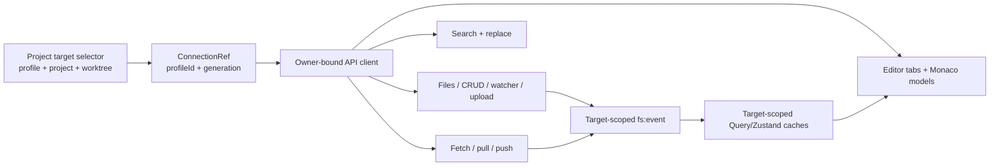

Ownership invariants:

- `project-target.ts` stores root/worktree selection and unavailable targets
  per profile/project. A missing worktree fails closed; it does not become the
  project root by implication.
- `editor.ts` and `MonacoHost` qualify tab/model keys and in-memory URIs with
  the profile and target scope. Identical paths on different profiles never
  share a Monaco model or dirty state.
- Filesystem reads, mtime-guarded writes, CRUD, watcher subscriptions, and
  chunked uploads capture the owner generation. `fs:event` updates or refetches
  only the matching target.
- Clean editor tabs reload after external/Git changes. Dirty tabs retain local
  bytes and become stale/conflicted; no remote event can overwrite edits.
- Federated search issues independent owner-bound requests, preserves profile
  and target metadata on each match, and caps the aggregate UI result set at 500. Replace operations resolve the target from the match and skip dirty
  files.
- Git fetch/pull preserve independent target results. SSH passphrase retry
  retains successful initial results, retries only authentication-failed
  targets after owner validation, and cancels on generation change.

Large files use bounded 64 KiB range reads in a read-only viewer. Image/video
previews use session-bound opaque capabilities; credentials are never embedded
in media URLs and the editor never falls back to whole-file Blob materialization.
The detailed source map is in
[Phase 03: Files, Editor, Search, and Git](./phase-03-files-editor-search-git.md).

### Phase 01 transport-safe filesystem subscriptions (2026-09-20)

The Phase 03 live tree uses one owner-first transport resolver. A qualified
`ProjectTargetRef` captures the target profile's current `ConnectionRef` and
resolves its transport through `connections.ts`; it does not fall back to the
ambient singleton when the owner is missing, disconnected, or stale. The
ambient transport remains available only for explicit legacy, unqualified
targets. `useTransportGeneration(profileId)` fences profile reconnects and
replacement generations.

```text
qualified ProjectTargetRef
  -> captureConnection(profileId)
  -> getTransport(owner)
  -> fs:subscribe_tree
  -> originating transport
       |-> onFsEvent or onEvent("fs:<sub_id>")
       |-> fs:list child hydration
       |-> fs:unsubscribe_tree + listener cleanup
       `-> exact QueryClient payload retirement
```

The transport returned by the subscription is retained for event registration,
lazy child loading, cleanup, and unsubscribe. Cleanup removes the exact
`{ sub_id, nodes }` query payload after retiring the server watch, so a
same-cache remount requests a fresh subscription before binding events. An
aborted subscribe also retires the returned ID. This preserves the existing
`fs:subscribe_tree`, `fs:event`, and `fs:unsubscribe_tree` wire contract while
coupling cache lifetime to server watcher lifetime.

`IdleTransport` implements the FS capability shape for empty/setup/offline
screens: event registration and unsubscribe are callable no-ops, while
subscription and mutation methods reject with `Server profile required`.
It cannot fabricate a tree or silently route an unavailable target through
another profile. `disconnectProfile` compares the entry transport with the
actual ambient transport before replacement; non-ambient disconnects leave a
healthy ambient owner untouched, while the true ambient owner fails closed to
idle.

Each `WorkspacePage` Explorer surface (desktop IDE, compact IDE, and terminal
floating panel) has a keyed local `ErrorBoundary` around its `Suspense` and
`FileTree`. A FileTree render/effect failure is therefore contained to that
Explorer region; the shell, editor, and active terminal hosts are not remounted.
The boundary key includes surface and target identity so a profile/project
change clears a latched error without resetting unrelated workspace state.

### Phase 04 terminal continuity, workflow, and owner-directed navigation (2026-09-17)

Phase 04 completes the terminal side of the unified-profile workbench. A
terminal is identified by the qualified tuple `{ profileId, id }`; a live
incarnation adds `incarnation`. `terminalKey()` and `terminalInstanceKey()` in
`packages/ui/src/api/ownership.ts` are the canonical key builders. A bare
session ID is accepted only as a compatibility lookup and must not decide
which profile owns a request.

The registry, mounted-session list, activity tracker, incarnation fence, and
layout tree all use qualified identity:

- `terminal-registry.ts` stores canonical tuple keys and keeps a raw-ID alias
  only when it is unambiguous. Raw removal verifies that the alias still
  points at the requested entry before deleting it.
- `terminal-mounted-sessions.ts` matches `{ profileId, sessionId }`, so a
  session mounted in another profile is preserved during auto-attach.
- `terminal-incarnation-state.ts` rejects older lifecycle incarnations before
  they can replace newer state. Output activity uses the same owner key and a
  bounded three-second observation window.
- `TerminalPanel`, `TerminalTabBar`, `PaneContainer`, and keep-alive hosts
  derive a `TerminalRef` before registering, attaching, focusing, or removing
  an xterm. PTY DOM lifetime follows the qualified terminal, not a global
  session ID.

Owner-bound transport is the other half of the boundary. `createApiClient()`
captures an owner and transport; terminal and workflow requests project only
server-wire fields after checking the owner. Hooks include profile and
connection generation in query keys and reject stale generations before
publishing. A small ambient `api` fallback remains for compatibility paths;
new owner-aware code must use the bound client rather than the active profile.

Browser persistence is explicitly versioned and partitioned:

| Store           | Key/version                                                       | Boundary                                                                             |
| --------------- | ----------------------------------------------------------------- | ------------------------------------------------------------------------------------ |
| Terminal layout | `dam-hopper:terminal-layout:v3:<encoded-owner-group>`; payload v2 | `{ profileId, groupId }`; raw session IDs remain inside the owner partition          |
| Terminal pins   | `dam-hopper:terminal-pins:v2:<encoded-profileId>`; payload v2     | Profile-specific IDs-only records; legacy v1 is removed                              |
| Command history | `StoredHistory.version: 3`                                        | Profile-salted IDs; owner-aware callers filter reads; exact command text stays local |

`fresh-state-reset.ts` removes unqualified legacy terminal layout and pin
records, while preserving valid v3 layout and v3 command-history records. It
does not migrate an unqualified terminal into a profile or clear unrelated
profile/auth/native/server state.

Workflow links carry the profile and may carry a terminal incarnation.
`workflow-queries.ts` uses owner/generation-qualified keys and bound API
clients. `workflow-workspace-integration.ts` checks profile ownership and, when
available, the expected incarnation before revealing a terminal; missing,
cross-profile, missing-session, and incarnation-mismatch links are unavailable
instead of being redirected to another terminal. Notification selection uses
the same qualified target and routes to the owning terminal surface.

Diagnostics export is owner-directed. The frontend filters the diagnostics
snapshot by `profileId` and optional terminal IDs before exporting bounded
terminal tails (default 60-minute window and 65,536-byte tail limit). Export
filenames include the profile when supplied. Browser/react/route diagnostics
remain available, but terminal output from another profile is excluded.

The implementation map, persistence formats, compatibility notes, review
warnings, and focused verification evidence are maintained in
[Phase 04 Terminal Continuity, Workflow, and Owner Navigation](./phase-04-terminal-continuity-workflow-navigation.md).

### Phase 05 agents, ports, Browser, and capability isolation (2026-09-17)

Phase 05 extends the unified-profile ownership boundary to the Agent Store,
detected ports, tunnels, Browser Debug, and terminal handoff. The implementation
does not create a backend workspace hierarchy: every catalog, project, tunnel,
PTY, and artifact remains local to its server connection.

**Agent Store.** `AgentStorePage` selects a concrete profile and captures its
`ConnectionRef { profileId, generation }`. Agent item/content/scan/matrix/
health queries and project queries use owner-qualified React Query keys. Ship,
unship, absorb, bulk ship, import, memory, and health mutations stay on that
owner and invalidate only its cache. `MemoryEditor` keeps a draft identity of
`{ profileId, projectName, agent }`; fresh data for another identity cannot
replace a dirty draft. `ImportDialog` binds its server-generated `tmpDir` or
local `dirPath` to the opening owner and fences late scan results with a
`scanRevision`. A profile change closes pending dialogs rather than sending
server-local paths to a new profile.

**Ports and tunnels.** Aggregate port queries run independently per profile.
The detected-port identity is the tuple
`(profileId, port, terminalId, incarnation)`; tunnel identity is
`(profileId, tunnelId)`. Equal numeric ports or raw terminal IDs therefore
remain separate rows. Port and tunnel events patch only the event owner's
generation-qualified query cache. Incarnation fences reject delayed
observations and a loss event removes only the matching terminal/port/
incarnation. Create, stop, install, and kill callbacks capture an explicit
owner; ownerless tunnel mutations are not valid.

**Browser target trust.** `BrowserDebugTarget` carries the owner, URL/origin,
source, optional tunnel ID, and a monotonic revision. The resolver accepts
HTTP loopback or an exact origin of a ready owner-local tunnel and rejects
credentials, parent-origin targets, stale/unready tunnels, and arbitrary
external URLs. Address history is profile-partitioned. Explicit navigation
increments the revision and clears selection, picker, capture, bridge
capabilities, console state, and pending capture; project focus alone does not
replace the target. Tunnel loss invalidates only the owning target.

**Same-profile handoff pipeline.** Workspace capture snapshots the Browser
owner/generation, target revision, and `TerminalInstanceRef` before creating
an artifact. Cross-profile candidates are rejected before create. The client
rechecks all three fences after artifact creation and after optional PNG
upload, deletes stale artifacts, and builds terminal input only from sanitized
server-generated artifact paths. Handoff requires a mounted, registered, live
same-profile terminal and an acknowledged `{ inserted: true }` response.

**Artifact incarnation and PTY admission.** `browser-debug:create` requires
`terminalIncarnation`, verifies the live PTY incarnation before persistence, and
stores the authoritative terminal ID/incarnation in private expiring metadata.
`claim_handoff` reserves one write and releases the claim on a failed write.
`PtySessionManager::write_if_incarnation` holds the manager lock through live
lookup, incarnation comparison, input-revision admission, and PTY write. It
retains handoff/closing/disposing guards and rolls back activity revision state
on write failure. A reused public ID therefore returns
`TERMINAL_INCARNATION_MISMATCH` without writing to the replacement PTY or
advancing its input revision.

**Availability.** `useFeatureAvailability` subscribes to the selected profile's
connection snapshot and reports `unknown`, `loading`, `available`, or
`unavailable` with a reason. Offline, login-required, unsupported, or
disconnected state in one profile never disables another profile. The boolean
`useFeatureFlag` result is only the owner-local projection; it is not inferred
from another profile or a version string.

The detailed source map and maintenance invariants are in the
[Phase 05 Agents, Ports, and Browser guide](./phase-05-agents-ports-and-browser.md).

### Phase 06 preferences, Settings, usage, and host resources (2026-09-17)

Phase 06 closes the unified-profile ownership boundary for the remaining
browser-facing settings and host surfaces. It does not create a multi-workspace
server model: each profile still owns its configuration, usage store, host
monitor, idle-suspend coordinator, fleet, and revisions.

**Independent selectors.** `useWorkbenchSelectionsStore` persists
`preferencesProfileId`, `settingsProfileId`, and `browserTargetProfileId`
independently under the existing preferences-source record plus the explicit
Settings target key. The preference source supplies only the allowlisted
workbench UI state. The Settings target supplies global/workspace configuration,
maintenance, usage setup, and host policy. Project navigation changes neither.
Removing a preference source retains its last safe snapshot with
`source-removed`; removing a Settings target clears that selection. Profile
deletion also drops that profile's host-alert presentation state.

**Captured preference writes.** `stores/settings.ts` captures
`ConnectionRef { profileId, generation }`, the bound global-config client, and
an edit revision when a debounced allowlisted patch is scheduled. The 500 ms
timer coalesces local edits; a serialized save chain never reroutes a pending
or already-dispatched write through a later profile. Source changes cancel only
undispatched work. Late success and rollback apply only to the captured source
and current edit revision; an unavailable source keeps the last safe snapshot
and disables remote writes.

**Settings and config.** `SettingsPage` labels both selectors with the profile
name and endpoint. `GlobalConfigEditor`, `ConfigEditor`, maintenance actions,
workspace TOML import/export, usage setup, and idle-suspend timing receive the
selected `OwnerInput`. Import captures the target and connection generation
before confirmation and file reading, keeps the 1 MiB browser limit, and
rejects a changed target before dispatch. Target-local query invalidation
prevents config, project, workspace, and cache data from crossing profiles.

**Usage.** `UsagePage` resolves `profileId` from the URL (then Settings target
and configured fallback), and retains it in deep links with `view`, `session`,
and `cursor`. Summary, session, health, setup, settings, mutation, and delete
hooks use `profileQueryKey(owner, ...)`. Session list/detail polling runs only
for visible documents, and destructive confirmation retains the captured owner
and range.

**Host and suspend.** `HostResourcePopover` keeps explicit-owner compatibility
first: an `owner` prop, or at most one configured profile, renders the existing
single-host drilldown and resolves its owner through Settings/active-profile
fallbacks. With no explicit `owner` and more than one configured profile it
enters Fleet mode. The fleet trigger uses the Phase 01 summary; the Fleet Deck
and profile pills never merge host telemetry or change connection intent.

Fleet mode opens on the deck. Its header toolbar keeps a `Fleet` toggle plus one
profile pill per watched entry; connected pills inspect that profile and
disconnected pills remain status-only. Opening Fleet marks no profile read;
entering a connected drilldown marks only that profile read. The shared
drilldown body binds snapshot/history/config/pin/idle-suspend/force-suspend
reads and mutations to the selected `ConnectionRef`, with no ambient fallback.

The fleet hook continues 15-second snapshot reconciliation per watched
connected profile. Detail compatibility metrics use an isolated 1-second query
only while the popover is open on a connected drilldown; Fleet, close, and
offline views disable it. If the selected profile is removed or disconnects,
the popover clears the selection, diagnosis/action context, and returns to
Fleet rather than retargeting another profile. Single-profile ownership,
status, focus, and action guards remain unchanged.

`HostIdleSuspendStatus` presents server-authoritative fleet/timing/measurement
state without turning unknown values into quiet or zero. `ForceSleepDialog`
captures owner, endpoint label, generation, fleet snapshot, status revision,
and request ID before confirmation. Stale connection/revision conflicts require
fresh review; active managed sessions require explicit confirmation; ambiguous
force-suspend POSTs are not retried. Existing actor, origin, no-auth, helper,
inhibitor, and backend revision guards remain unchanged.

```text
profile ConnectionRef
  -> owner-qualified React Query key + bound API client
  -> Settings / Usage / Host read or mutation
  -> owner-scoped cache patch and invalidation
  -> REST snapshot remains reconciliation authority
```

The complete source map and privacy/safety limits are in the
[Phase 06 Preferences, Settings, Usage, and Host Resources guide](./phase-06-preferences-settings-usage-and-host.md).

### Fleet Deck & Drilldown Popover (Phase 03, 2026-09-20)

`HostResourcePopover` selects Fleet mode exactly when
`owner === undefined && configuredProfileCount > 1`. Otherwise it retains the
single-profile trigger, acknowledgement, owner fallback, and shared
drilldown contract. Fleet mode is non-persisted view state: it opens on
`HostResourceFleetDeck`, while the existing glance/diagnosis/idle-suspend body
is reused for a selected profile.

The fleet header adds a labelled toolbar with a `Fleet` toggle and one pill per
watched profile in configured order. Connected pills switch to that profile's
drilldown; disconnected pills remain non-actionable status text. The summary
surfaces watched/connected, attention, and unread counts without relying on
color. Fleet opening does not acknowledge alerts; entering a connected
drilldown acknowledges only that profile.

`useMultiHostResources` continues owner/generation-qualified 15-second snapshot
watching for the fleet. The compatibility metrics query is enabled only for
the visible, connected drilldown (`open && isDrilldown`) and remains bound to
the selected owner, so no Fleet view or background popover starts 1-second
metrics polling. If the selected profile is removed or disconnects, selection
and local diagnosis/force-sleep context reset and the view returns to Fleet;
it never falls through to Settings or the active profile.

### Phase 04 verification and testing (Multi-profile Host Resources, 2026-09-20)

Phase 04 closes the verification gate for the Fleet Deck and owner-bound
Host Resources drilldown. The existing Chromium suite was extended in
`packages/ui/browser-tests/host-resource-monitoring.browser.tsx`; no second
harness or production transport was introduced. The architecture above
matches the implementation: no owner fallback, no fleet-wide acknowledgement,
no aggregate metric calculation, and no background 1-second sampler.

Focused evidence:

| Boundary | Evidence | Result |
| --- | --- | --- |
| Scope, owner/generation keys, 15s snapshots, partial failure, stale generations, alert buckets, fleet/card/popover semantics | Six focused Vitest files under `packages/ui/src/` | 83/83 passed |
| Fleet/profile navigation, keyboard focus and Escape restoration | Existing Chromium suite plus five multi-profile flows | 19/19 passed |
| Tiered polling and action ownership | Fleet disables detail polling; visible connected drilldown enables only its owner; disconnect/close disables it | Verified |
| Layout and accessibility | 320x700 and 1280x800 viewports, safe areas, no horizontal overflow, contrast, semantic state, 44px controls | Verified |
| Security negatives | Markup-like profile/host text remains literal; offline cards expose no actions; force-sleep stays bound to the inspected owner | Verified |

The browser flows retain the prior single-profile cases while adding
Fleet -> profile A -> Fleet -> profile B navigation, duplicate incident-ID
unread isolation, generation/disconnect cleanup, and owner-specific host
labels. Tests use synthetic profiles, snapshots, transports, and suspend
mutations only; they do not contact a host, invoke RTC/systemd, use
credentials, or persist profile state.

Phase 04 found no architecture drift. The durable dataflow remains:

```text
profiles + ConnectionRef generations
  -> owner-qualified fleet snapshot queries (15s)
  -> Fleet Deck / profile cards
  -> one selected connected drilldown (1s compatibility metrics)
  -> owner-bound diagnosis, pin, idle-suspend, and force-sleep boundaries
```

The focused regression gate and review record are maintained in the
[Phase 04 verification plan](../plans/260920-0137-multi-profile-host-resources/phase-04-verification-and-testing.md),
[QA report](../plans/reports/tester-260920-1130-phase04-multi-profile-host-resources.md),
and [code review](../plans/reports/code-review-260920-1132-phase04-verification-and-testing.md).

### Phase 09 integration, qualification, and release cutover (2026-09-17)

Phase 09 integrates the owner-qualified workbench across the shell, API clients,
remote effects, media lifecycle, host safety, and native boundaries. The
integration rule is unchanged: every asynchronous operation captures a
`ConnectionRef { profileId, generation }`, resolves a bound API/transport, and
rejects stale owner state rather than consulting an ambient active profile.

The final integration fixes include:

- `connections.ts` keeps one in-memory UUIDv4 `mediaClientId` per exact
  connection owner, supplies a stable profile fallback while disconnected, and
  removes all owner tuple keys when a profile connection is removed.
- `media-session.ts` accepts an optional client ID and uses a bounded generated
  fallback only at the legacy cleanup boundary. Settings/logout callers pass
  the profile's client ID explicitly.
- Project aggregation, command search, port/tunnel queries, Dashboard terminal
  actions, Workspace Browser handoff, TopNav, and Settings dialogs resolve
  owner-bound clients. `ImportDialog` captures its opening owner; idle-suspend
  UI treats nullable fleet snapshots as unavailable/zero only for presentation.
- Browser qualification uses the fixed Vite API server port `15173`, strict
  port binding, and one configured Chromium channel or executable. The Linux
  release runtime test seam names its fake descriptor range
  `tests::FAKE_FD_BASE` so test cleanup cannot close a real descriptor.

The live harness
[`scripts/qualify-phase09-workbench.mjs`](../scripts/qualify-phase09-workbench.mjs)
creates isolated Server A/B roots on ports `14801`/`14802`, equal `web` projects
and `shared-session` PTYs with distinct markers, then checks S01–S12 remote
effects and four embedded browser assertions. It owns temporary processes,
configuration, repositories, media fixtures, and cleanup; idle suspend is
disabled and no host power/process action is invoked. Its `--no-auth` fixture
proves deterministic endpoint/resource isolation, not production actor
isolation; normal-auth suites remain required for that boundary.

The reconciled ledger is **3,504 passed / 9 skipped or ignored** across Rust
server (1,416), UI unit (1,769), UI browser (209), shared (15), Browser bridge
(19), native host (48), live harness (24), and embedded browser (4). This is
execution evidence, not a line-coverage percentage. G2-Web is qualified;
G2-Native remains blocked until real Windows S13 runtime, SSH, WebView2/DPAPI,
and Browser relay evidence passes.

Release cutover is atomic for protocol contracts: ship matching frontend and
backend builds with `workbenchProtocol: 2`, media `session-cookie-v2`, and
terminal-incarnation admission. The allowlisted browser-resource reset is
idempotent and deliberately lossy; old layouts/history are not restored.
Rollback uses a mutually compatible frontend/backend pair, with fresh login
when endpoint-bound credentials are invalid. A qualified web release does not
authorize an unqualified native package.

See the [Phase 09 plan](../plans/260916-2137-unified-profile/phase-09-integration-and-qualification.md),
[verification matrix](../plans/260916-2137-unified-profile/verification-matrix.md),
[multi-server user guide](./user-guide-multi-server-profiles.md),
[API reference](./api-reference.md), and
[configuration guide](./configuration-guide.md).

## Proposed concurrent runtime cutover (2026-09-16; not implemented)

Reference note: the source all-workspaces implementation plan is not present in
this checkout. This section is retained only as a separate, unimplemented design
reference.

The existing sections below describe the current runtime; this proposal does not
claim that concurrent workspaces or profiles have shipped.

- One unified workbench uses explicit browser-local server profile references and
  persistent server-owned workspace UUIDs. Project focus changes navigation only.
- Each server keeps one authentication boundary, PTY fleet, persistence worker,
  telemetry runtime, host monitor, and suspend coordinator. A workspace registry
  supplies independent configuration, sandbox, target resolver, lifecycle guard,
  agent service, SSH credential, and publication revision per workspace.
- Startup-selected configuration remains authoritative for server settings.
  The global catalog stores workspace identity and registration tombstones;
  workspace configuration/import cannot overwrite server-owned settings.
- Workspace REST routes, WS continuations, events, terminal keys, persistence,
  workflow mappings, media tickets, queries, editor resources, and secret caches
  carry explicit ownership. Connection generations reject stale async results.
- Legacy unscoped terminal data blocks terminal admission until explicit
  server-specific clearing; it is never automatically attributed or discarded.
- Browser connections and native SSH profile scopes coexist independently.
  Existing transport capability, trust, origin, sandbox, and host-action limits
  remain unchanged. Shared UI preferences come from one explicitly chosen server.
- Implementation and release require the plan's multi-server isolation,
  migration/failure, live browser, and supported-native verification gates.

## Proposed trusted plugin platform (2026-09-20; not implemented)

This is a planning design only. No runtime plugin loader, registry, runner,
dynamic route, or embedded plugin UI exists yet. The implementation plan is
[DamHopper plugin platform](../plans/260920-1603-plugin-platform/plan.md);
its cross-repository contract is owned by the companion evcrate plan.

- DamHopper remains the network and authentication boundary. It derives the
  actor from `AuthenticatedActor.subject`, resolves the configured project or
  worktree with the existing server resolver, and applies explicit
  actor/installation/target/operation grants. Plugin administration uses a
  separate subject allowlist whose default is empty; login, registration, and
  `--no-auth` never imply administrator authority.
- A root-provisioned, owner-account systemd runner is the sole durable
  installation/source/grant registry and sole worker supervisor. The API
  reaches it through a peer-credential-checked Unix socket and exposes only an
  authorized façade; every invoke rechecks the actor session and current grant
  revision. The runner starts one private framed-pipe worker per enabled
  installation. Plugins expose no listener. The initial deployment configures
  one explicit advisor-data owner and preserves the dedicated `dam-hopper` API
  identity.
- Administrator-approved `.tar.gz` packages are validated into immutable
  version directories. Lifecycle state atomically selects one matching
  backend/UI digest generation, retains the prior compatible pair for rollback,
  and never treats source history, policy, or evaluation data as package state.
  Trusted executable plugins are not advertised as a malicious-code sandbox.
- The browser receives approved navigation through its captured
  profile/connection-generation/project owner. It fetches the approved
  self-contained document from a non-navigable, `nosniff`
  `application/octet-stream` endpoint; the host verifies bundle identity,
  injects/enforces restrictive CSP, and mounts the bytes as opaque-origin
  `srcdoc` in `sandbox="allow-scripts"`. A nonce- and generation-bound
  `MessageChannel` must acknowledge its transferred port before any context or
  data is released. The frame receives no host credentials, arbitrary
  transport, filesystem API, or network path.
- Contract/security/isolation feasibility freezes at G0. A real evcrate
  owner-worker read slice is required at G1, the four-view separate-LAN-browser
  flow at G2, package lifecycle and rollback at G3, and Linux workload plus
  deployment qualification at G4. A loader or fixture worker alone is never
  platform completion. The standalone evcrate viewer remains operational until
  joint G4 acceptance, then is replaced rather than retained as a second mode.

## High-Level Overview

```
┌─────────────────────────────────────────────────────────────┐
│  Browser / Native WebView                                    │
│  ├─ Thin Vite host (apps/web/dist/)                        │
│  ├─ Tauri native host (apps/native)                        │
│  ├─ Shared React UI package (packages/ui)                  │
│  ├─ Shared runtime utilities (packages/shared)             │
│  ├─ Cooperative browser-debug preview + picker             │
│  ├─ fetch(/api/*) for REST queries                         │
│  └─ WebSocket(/ws) for terminal I/O + events               │
└──────────────────────┬──────────────────────────────────────┘
                       │ HTTP/WebSocket
┌──────────────────────▼──────────────────────────────────────┐
│  dam-hopper-server (Rust/Axum; 4801 systemd; 4800 legacy)   │
├─────────────────────────────────────────────────────────────┤
│  ┌─ AppState (shared across all handlers)                  │
│  │  ├─ workspace_dir: Arc<RwLock<PathBuf>>                │
│  │  ├─ config: Arc<RwLock<DamHopperConfig>>                  │
│  │  ├─ pty_manager: PtySessionManager                     │
│  │  ├─ port_forward_manager: Option<PortForwardManager>   │
│  │  ├─ agent_store: Arc<AgentStoreService>                │
│  │  ├─ event_sink: BroadcastEventSink                     │
│  │  ├─ fs: FsSubsystem                                    │
│  │  ├─ media_tickets: MediaTicketStore (shared lifecycle)  │
│  │  ├─ video_stream_tickets: VideoStreamTicketStore       │
│  │  ├─ image_stream_tickets: ImageStreamTicketStore       │
│  │  ├─ ssh_creds: Arc<RwLock<Option<...>>>               │
│  │  ├─ auth_token: Arc<String>                            │
│  ├─ opaque_server_setup: Arc<ServerSetup<...>>            │
│  ├─ opaque_registrations: OpaqueRegistrations (in-mem)   │
│  ├─ Router                                                 │
│  │  ├─ /api/projects → ProjectList handler                │
│  │  ├─ /api/pty/* → PTY spawn/send/kill                   │
│  │  ├─ /api/ports → Port detection list                   │
│  │  ├─ /api/git/* → Clone/push/status/branch/root ops     │
│  │  ├─ /api/fs/* → [conditional] List/read/stat (per-proj)│
│  │  ├─ /api/fs/video/* → Ticket issuance/stream/revoke     │
│  │  ├─ /api/fs/image/* → Preview ticket/stream/revoke     │
│  │  ├─ /api/agent-store/* → Distribution/import           │
│  │  ├─ /api/workspace/* → Config switching                │
│  │  ├─ /api/workflow/* → WorkflowService REST boundary  │
│  │  ├─ /api/browser-debug/* → Ephemeral artifacts         │
│  │  ├─ /api/system/idle-suspend/v1/* → Status/timing pair │
│  │  ├─ /api/settings/export/workspace.toml → Raw TOML     │
│  │  ├─ /api/settings/import/workspace.toml → Import/backup│
│  │  └─ /ws → WebSocket upgrade                            │
│  └─ Services                                               │
│     ├─ PtySessionManager (Arc<Mutex<Map<uuid, ...>>>)     │
│     │  └─ WorkflowObservationRecorder → bounded worker     │
│     │     (`sync_channel(256)`, non-blocking PTY handoff)   │
│     ├─ TelemetryStore/Worker (opt-in, separate SQLite)     │
│     ├─ BrowserDebugArtifactManager (ephemeral, TTL/sweep)  │
│     ├─ FsSubsystem (Arc<Mutex<ProjectSandbox>>)           │
│     ├─ AgentStoreService (symlink distribution)           │
│     ├─ WorkflowService → WorkflowStore + startup reconcile │
│     ├─ CommandRegistry (BM25 search)                      │
│     ├─ IdleSuspendCoordinator (fleet quiescence & timing) │
│     │  └─ SystemdIdleSuspendExecutor → Unix-socket IPC    │
│     └─ Broadcast channels (PTY output, git progress)      │
└─────────────────────────────────────────────────────────────┘
```

### Phase 01 runtime-state boundary (2026-09-14)

Phase 01 completes the Linux API runtime-state cutover after the Phase 00
merge. The final API unit still renders
`--config /var/lib/dam-hopper/dam-hopper.toml`; the descriptor-relative
provisioner now owns canonical config and server audit creation, validates
legacy config read-only for one-time migration, and refuses unsafe metadata or
publication races before API start. Phase 02–03 semantic event writing remains
separate from this gate.

### Phase 03 preflight, installer, and reset boundary (2026-09-14)

Production state has one active authority:

| Concern                    | Authority and mutation boundary                                                                                  |
| -------------------------- | ---------------------------------------------------------------------------------------------------------------- |
| API startup configuration  | `/var/lib/dam-hopper/dam-hopper.toml`, the sole systemd `--config` operand                                       |
| Server timing/manual audit | `/var/lib/dam-hopper/idle-suspend-audit.jsonl`, API-owned `0600` JSONL                                           |
| Initial state              | The API runtime provisioner at the privileged pre-start; it seeds or performs the validated one-time legacy copy |
| Normal config updates      | Authenticated API, same-directory atomic replacement as the API identity                                         |
| Release preflight          | Read-only SQLite discovery and holder checks before quiesce or service switch                                    |
| Bootstrap installer        | Release staging only; no daemon TOML creation, copy, chmod, chown, or repair                                     |
| Emergency reset            | Canonical config by default; explicit `--config` only for a controlled alternate layout                          |

For `server` and `both` candidates, preflight opens the canonical TOML first and
an extant `/etc/dam-hopper/dam-hopper.toml` second with no-follow semantics,
`fstat` regular-file verification, a 64 KiB read bound, and UTF-8/TOML parsing.
Unsafe presence (including links, special files, unreadable, oversized, or
malformed content) fails closed; only a missing file is absent. Each file's
effective `server.session_db_path` is resolved using the API's fixed
`HOME`/working directory `/var/lib/dam-hopper`; `~user` syntax is rejected.
When both TOMLs are absent, preflight includes the canonical default
`/var/lib/dam-hopper/.config/dam-hopper/sessions.db`; it also retains the
explicit `/etc/dam-hopper/sessions.db` compatibility candidate during the
migration window. Paths are normalized and stable-deduplicated, then each
candidate's database, `-wal`, and `-shm` handles are checked. Web-only
preflight skips this API-state discovery. No preflight path creates or changes
files.

The bootstrap installer leaves Server/Both installs pending and contains no
`/etc` TOML provisioning. The first explicit start invokes the runtime
provisioner; a Web-only install never provisions API state. The canonical
server audit and any legacy config/audit remain available for rollback evidence,
but legacy files are not startup authorities.

## Server-Authoritative Terminal Idle Suspend Architecture

The opt-in terminal idle suspend subsystem adds fail-closed Linux suspend
automation with two startup-selected policies: `empty-fleet` requires no live,
creating, or restart-pending managed PTYs, while `agent-activity` uses
configured-agent PTY/process/TCP evidence and may suspend with service-only
terminals still open. Both policies use single-flight idle epochs, bounded
authenticated timing mutations, and a hardened Unix-socket helper service.
Automatic idle timing remains bounded; the helper's execution-only
`wakeAfterSeconds: 0` sentinel represents indefinite sleep.

```
┌─────────────────────────────────────────────────────────────┐
│  Browser UI                                                 │
│  ├─ SettingsIdleSuspendTimingSection (PATCH /timing)        │
│  ├─ HostResourcePopover / HostIdleSuspendStatus             │
│  ├─ ForceSleepDialog (POST /force-suspend)                  │
│  └─ WsTransport ← host:idleSuspendChanged revision hint    │
└──────────────────────┬──────────────────────────────────────┘
                       │ REST (GET /status, PATCH /timing, POST /force-suspend)
┌──────────────────────▼──────────────────────────────────────┐
│  dam-hopper-server (Axum, Tokio)                            │
│  ├─ IdleSuspendCoordinator (Async state machine)            │
│  │  ├─ PtyFleetWatcher (empty-fleet; lifecycle fences)      │
│  │  ├─ IdleSuspendTimingStore (atomic TOML pair write)      │
│  │  ├─ IdleSuspendServerAudit (server-side mode 0600 log)    │
│  │  └─ BroadcastEventSink (isolated revision hint channel)   │
│  └─ SystemdIdleSuspendExecutor (Unix domain socket client) │
└──────────────────────┬──────────────────────────────────────┘
                       │ /run/dam-hopper/idle-suspend.sock (SO_PEERCRED)
┌──────────────────────▼──────────────────────────────────────┐
│  dam-hopper-idle-suspend-helper (Root-owned Systemd Helper) │
│  ├─ Peer auth verification (UID matching server, MainPID)   │
│  ├─ SysfsPreflightChecker (/sys/class/rtc/rtc0/wakealarm)   │
│  ├─ Active inhibitor preflight (systemd-inhibit)              │
│  ├─ RTC clear/program/readback verification                  │
│  ├─ Fixed `systemctl suspend` execution path                 │
│  └─ HelperAudit (/var/log/dam-hopper/idle-suspend-helper.jsonl)
└─────────────────────────────────────────────────────────────┘
```

### Phase 01 policy/configuration contract

`IdleSuspendConfig` accepts an `automatic_policy` selector and an
`agent_executables` list. The selector defaults to `empty-fleet` and also
accepts `agent-activity`; selecting the latter stores the startup policy while
Phase 05 combines private PTY, process, and TCP evidence for automatic
eligibility and final admission. The default executable list is `codex`, `omp`,
`claude`, and `agy`.

Executable entries are literal, case-sensitive basenames or absolute paths.
Validation requires 1–32 unique entries, 1–256 UTF-8 bytes per entry, and only
ASCII letters, digits, `_`, `-`, `.`, `+`, and `@` in path components.
Whitespace, controls/NUL, disallowed shell/glob/regex metacharacters,
relative slash-containing paths, `.`/`..`, repeated or trailing `/`, and
generic interpreter basenames (`node`, `nodejs`, `bun`, `python`, names
beginning with `python` followed by an ASCII digit, `sh`, `bash`, `dash`, `zsh`,
`ksh`, and `fish`) are rejected.
Validation is lexical: it does not expand variables, launch a process, or
require the executable to exist.

`StartupIdleSuspendPolicy` captures `enabled`, enrollment, capability
selection, the automatic policy, and the validated executable set once at
startup. Config reload, settings import, and workspace activation overlay
those startup-owned values back onto the newly loaded config; only the timing
pair remains runtime-mutable. The canonical TOML writer emits
`[server.idle_suspend]` with snake_case keys; config-shaped JSON serializes the
same fields as `server.idleSuspend`, `automaticPolicy`, and
`agentExecutables` (snake_case aliases are accepted on input). Default policy
and list values may be omitted from TOML and then resolve to their defaults.
The matcher list is retained by startup authority and is not a status or
WebSocket field.

### Workspace Settings Import/Export Boundary

Workspace settings import/export transfers only the active workspace's
`dam-hopper.toml`; global configuration is never read or written by these
routes.

- **Export (`GET /api/settings/export/workspace.toml`)**: Reads and returns the
  active file's exact bytes without parsing or reserialization. The response
  uses `Content-Type: application/toml; charset=utf-8`,
  `Content-Disposition: attachment; filename="dam-hopper.toml"`, and
  `Cache-Control: no-store`; comments, whitespace, and ordering are preserved.
- **Import (`POST /api/settings/import/workspace.toml`)**: Accepts a raw
  `application/toml` payload (optional UTF-8 charset) under a route-local 1 MiB
  cap. It validates UTF-8, TOML/schema semantics, and destination-relative path
  rules before mutation. The effective `server.idle_suspend` and
  `server.telemetry` values must match their authoritative runtime values;
  protected-field deltas return `400`. The request snapshots the active config
  path, acquires workspace write ownership, and rechecks that path; a workspace
  change during admission returns `409`.
- **Transaction and retention**: The server creates an exclusive
  mode-`0600` `dam-hopper.toml.bak.<UTC>` containing the exact prior bytes,
  atomically replaces the active file with the original request bytes, and
  reloads runtime state and its dependent sandboxes/resolvers/monitors. A
  reload failure atomically restores the prior bytes and reapplies the prior
  runtime state; the transaction backup is removed only after confirmed rollback
  and is retained if recovery fails. Successful imports best-effort retain the
  five newest
  server backups whose basenames match the exact timestamp format
  `%Y%m%dT%H%M%S_%6fZ`; manual backups with other names, including
  similar-prefix names, are not pruned. Non-TOML media
  types return `415`, and oversized requests return `413`.

### Key Invariants

1. **Fleet Quiescence & Latching**:
   `empty-fleet` arms only after an active-to-empty transition; `agent-activity` arms only after a complete baseline, qualifying activity context, clear lifecycle, and an unspent epoch revision. Both policies are single-flight: one admitted execution per eligible period; resume/failure reconciles state, and agent recovery does not advance `current_epoch` or silently re-trigger a spent epoch.
2. **Admission & Handoff Order**:
   A timing update received while armed cancels the arm deadline, commits both values to canonical TOML and memory, and re-evaluates the fleet. Once a handoff claim is accepted (`CoordinatorState::HandedOff`), incoming timing updates immediately return `409 idleSuspendHandoffInProgress` with zero memory or disk mutation until resume reconciliation.
3. **Non-blocking In-Flight Handoff**:
   The coordinator event loop manages the in-flight suspend future concurrently with the command receiver, ensuring timing requests during suspend are responded to immediately with `409` rather than blocking the server.
4. **Root & Server Audit Separation**:
   Privileged helper operations are recorded to `/var/log/dam-hopper/idle-suspend-helper.jsonl` (mode `0600`). Server timing and manual-action records are appended to `idle-suspend-audit.jsonl` beside the canonical registry/config directory (mode `0600`; recent-read APIs cap results at 10,000). No tokens, credentials, terminal contents, or command strings are ever audited.
5. **Authenticated Manual Force Sleep & Active Fleet Confirmation**:
   Manual force sleep (`POST /api/system/idle-suspend/v1/force-suspend`) provides a production action for authenticated, enabled operators with database authentication. When the PTY fleet is active (`live + creating + restartPending > 0`), the request requires explicit confirmation (`force: true`); `force: false` returns `409 idleSuspendActiveFleetConfirmationRequired` with content-free counts. `force: true` bypasses fleet quiescence only—never authentication, CSRF/same-origin checks, generation verification, durable audit logging, capability preflight, inhibitor checks, or helper peer authentication. Once admitted, the coordinator admits one handoff (`CoordinatorState::HandedOff`), cancels any in-flight automatic armed grace period, audits the intent, dispatches the helper request, and reconciles state upon resume.
6. **Release-manager helper lifecycle and verification**:
   When the selected role includes `server`, `dam-hopper start` starts
   `dam-hopper-idle-suspend-helper.service` before `dam-hopper-api.service`.
   Helper start or enable failure is warning-only; API/web startup and health
   failures trigger activation rollback. Stop, backup, restore, and recovery
   manage the helper with the other units; Phase 04 staging/policy suites pass
   9/9 and 10/10, the boundary verifier passes 14/14, and `status --json`
   exposes the API, helper, web, and recovery service records.

### Manual force-suspend admission and reconciliation

The protected endpoint accepts strict JSON `{ "wakeAfterSeconds": 0, "force": false }` (or a bounded nonzero wake value) under the 16 KiB request limit. Execution accepts exactly `0` or `60..=86400`; persisted automatic timing remains `60..=86400`. The fleet snapshot exposes only `generation`, `liveCount`, `creatingCount`, `restartPendingCount`, `disposing`, `closing`, and `handoffActive`.

- `202 Accepted` means the audited handoff was admitted, not that the host has already suspended. The response carries `state: "handedOff"`, `requestId`, `statusRevision`, `wakeAfterSeconds`, `forced`, and the fleet snapshot; every response is `Cache-Control: no-store`.
- The browser submits at most one POST (`retry: false`). If delivery is ambiguous because the host suspends, reconnect and reconcile with the status endpoint and `host:idleSuspendChanged` revision hint; never replay the action.
- Automatic scheduling may be disabled while manual execution remains available to an authenticated enabled actor when the helper is enrolled and capability checks pass. Missing helper, capability, inhibitor, RTC ownership, audit, generation, or handoff preconditions still fail closed.

Manual suspend remains separate from the planned generic host-resource remediation helper. Monitoring and alert surfaces describe host state; only the explicit, authenticated ForceSleepDialog action can request suspend.

### Configured-agent activity evidence (Phases 01–05)

Phase 01 implements the persisted policy/configuration contract. Phase 02
supplies private PTY root identity, raw-read evidence, accepted-input
admission, bounded snapshots, and invalidation handles. Phase 03 adds bounded
configured-agent process discovery, retained attribution, and an
observer-namespace-qualified `OwnedSocketSet`. Phase 04 consumes that set,
reads cumulative TCP counters through an unprivileged Linux socket-diagnostics
transport, and compares per-socket baselines. Phase 05 combines both prepared
samples in a dedicated worker, performs automatic eligibility and
manager-locked final admission, projects bounded measurement warnings, and
drives the `agent-activity` coordinator path. See [PTY Activity Observation](./pty-activity-observation.md),
[Configured-Agent Process Discovery](./agent-activity-process-discovery.md),
and [Owned TCP Byte Observation](./tcp-activity-observation.md); the complete
integration contract is [Agent Activity Automatic Admission](./agent-activity-automatic-admission.md).

- `ProcessDiscovery<S>` performs one bounded, synchronous preparation pass
  through the private `ProcessSource` seam. Production uses `LinuxProcSource`
  over `/proc`; tests can supply a deterministic source. The pass validates
  exact `(pid, start_ticks)` identities, walks root/retained descendants, and
  commits only after the complete sample is accepted.
- Attribution is lineage-based rather than PGID-based. A process must resolve
  to exactly one managed PTY root; reparented descendants remain attributable
  through retained identity state, while ambiguous or stale identities fail
  closed. Native executables match exact configured basename/path entries.
  Supported `node`, `bun`, Python, and shell invocations use finite,
  entrypoint-aware grammars; substring matches and arbitrary command forms do
  not qualify.
- Deep procfs reads are bounded: 256 live roots, 8,192 listed processes,
  1,024 relevant processes, 4,096 file descriptors per process, 8,192 owned
  socket inodes, and 16 KiB command lines. Relevant processes must remain in
  the terminal's network namespace, and stat/executable identity is checked
  around reads to detect reuse or races.
- `tcp_info` parsing requires a 208-byte prefix and decodes
  `tcpi_bytes_received` at bytes `128..136` and `tcpi_bytes_sent` at
  `200..208` with checked slices/native-endian decoding. Extended payloads are
  accepted; raw bytes are never cast to a local C structure.
- `LinuxSocketDiagnostics` opens an unprivileged nonblocking
  `NETLINK_SOCK_DIAG` socket and sends `SOCK_DIAG_BY_FAMILY` dump requests for
  TCP v4/v6, then unresolved UDP/Unix inodes. Polling uses one monotonic
  deadline. Datagram lengths are obtained with `MSG_PEEK | MSG_TRUNC`, and a
  global 16 MiB response budget prevents unbounded allocation.
- Multipart parsing validates sender/sequence identity, framing/alignment,
  attributes, `NLMSG_DONE`, `NLMSG_ERROR`, and `NLM_F_DUMP_INTR`. Interrupted,
  malformed, duplicate, truncated, or overrun streams fail closed. The thread
  network namespace is checked before and after collection; unresolved owned
  inodes are classified as retryable close races.
- `TcpObserver` keeps a transactional baseline keyed by network namespace,
  address family, and diagnostic cookie. `BaselineEstablished` is returned
  for the first valid baseline, `Unchanged` requires identical keys/inodes and
  counters, and `Activity` covers byte changes/resets, new or retired sockets,
  and inode replacement. The inode is comparison metadata, not identity.
- The result contains no terminal bytes, command arguments, environment,
  credentials, addresses, or raw diagnostic payloads. Procfs/netlink
  permission, timeout, disappearance, namespace, identity, malformed-frame,
  unsupported-transport, and bound failures are explicit unavailable
  outcomes; no automatic suspend claim is made here.

### Phase 05 transactional sampler and automatic admission

Under `agent-activity`, `coordinator.rs` starts one `ActivitySampler` with a
joinable `idle-suspend-sampler` thread. The worker owns the stateful
`ProcessDiscovery` and `TcpObserver`, accepts one coalescing mailbox slot, and
handles `Scheduled`, `Final`, and `Recovery` requests. `Final` supersedes
queued work and cancels an in-flight sample cooperatively; recovery invalidates
both baselines.

Each sample captures an initial PTY snapshot, prepares process evidence, prepares
owned-TCP diagnostics, verifies raw-output checkpoints, and captures a second
manager snapshot. A generation or input revision change, cancellation, deadline,
counter overflow, or incomplete root fails the sample before commit. TCP
retryable close races receive one retry within the one-second acceptance
deadline; TCP failure context may include at most 32 safe process identities.
Only after all checks pass does the worker commit process and TCP baselines
back-to-back, classify input/output/network/process/lifecycle activity, and
emit an available observation. An unchanged `Final` observation additionally
mints an opaque ticket with revision, generation, root, input, output, age, and
quiet-deadline fences.

The coordinator presents that ticket to
`PtySessionManager::try_claim_agent_activity_handoff`, which checks policy,
all revisions, deadline, five-second observation age, manager input revision,
fleet generation, exact live root incarnations, raw output counters, and
closing/disposal/creating/restart/handoff lifecycle state under one manager
lock. A successful claim latches the epoch revision, enters `HandedOff`, and
dispatches one executor future. Any failed gate returns to `Watching` without
spending the epoch.

The v1 status snapshot always includes `automaticPolicy`; `activity` is null
for `empty-fleet` and contains measurement state, reason, bounded counts,
timestamps, TCP coverage, and an optional warning for `agent-activity`.
Warnings are sorted and deduplicated by PID, capped at 32 records, and expose
only PID plus optional safe executable identity. Status meaningful-change
filtering ignores heartbeat timestamp and elapsed-duration churn. Coordinator
shutdown joins the sampler before `main.rs` stops PTY readers and tears down
the manager.

### Phase 06 protected status and browser presentation

The protected `GET /api/system/idle-suspend/v1/status` remains the single
server-authoritative snapshot. `packages/ui/src/api/client.ts` receives the
transport result as `unknown`, validates the complete version-1 base and
additive policy/activity shape, and returns a normalized object to the existing
query. It performs only one compatibility branch: a valid old response with
both additive keys absent becomes `automaticPolicy: "empty-fleet"` and
`activity: null`; partial or malformed responses and rejected requests remain
errors.

`HostIdleSuspendStatus` renders coordinator state separately from observer
measurement. Empty-fleet has no invented observer values. Agent mode displays
measurement state/reason, nullable aggregate counts, `tcp4-tcp6` coverage, and
the bounded warning projection. A warning contains only sorted PID/safe
identity examples, blocked onset, reason, and truncation; no private process,
terminal, socket, command, or credential material crosses the REST/UI
boundary. The visible notice describes the heuristic limitation and service-
only blind spot.

The browser derives its sole arm countdown from `armDeadlineMs`. A local
one-second display clock may also compute warning elapsed duration, but neither
wall-clock display fact nor timer tick changes coordinator eligibility, query
state, status revisions, or WebSocket payloads. The existing
`host:idleSuspendChanged` message remains a revision-only GET invalidation hint.
Manual force confirmation continues to use actual fleet counts and existing
handoff/closing/disposal/pending gates, never recognized-agent counts.

### Configured-agent activity integrated qualification (Phase 07, 2026-09-11)

The integrated qualification ladder keeps each authority at its owning boundary:

1. `server/tests/idle_suspend.rs` drives the public coordinator with a real
   `PtySessionManager` and fake executor. It proves service-only PTY output,
   accepted-input invalidation, manual/final-check ordering, disabled
   observation, and sampler shutdown/join behavior.
2. `server/src/api/tests.rs` exercises protected status at the Axum router
   boundary. It checks authentication, `Cache-Control: no-store`, the exact
   empty-fleet/agent-activity union, initializing/disabled/available warning
   states, bounds, and privacy omissions.
3. `packages/ui/browser-tests/idle-suspend-settings-status.browser.tsx` uses
   Chromium to verify rendered counts, heuristic notice, warning duration and
   safe identities, truncation, countdown, manual action, and old-server
   compatibility.
4. The ignored `activity_live_linux_pty_tcp_smoke` test uses a test-owned
   managed PTY, loopback TCP, direct procfs/netlink observation, and a panic
   executor. It qualifies observer seams only; it cannot authorize or invoke
   host suspend.

Configured-agent activity Phase 07 reports **323 backend/PTY/API/integration
tests**, **14/14** boundary checks, **16/16** Chromium tests, a **0.72s** live
Linux smoke, and **9.4/10** code review approval. Automated qualification uses
fakes/temporary resources; the real automatic suspend/resume canary remains an
Operations-owned target-host gate. See [configured-agent Phase 07 verification
report](../plans/reports/qa-260911-1107-phase07-integrated-qualification.md).

### Phase 08 documentation, controlled rollout, and operational boundaries

Phase 08 completes operator documentation, operations runbooks, controlled rollout stages, and explicit failure/rollback procedures for the `agent-activity` idle-suspend enhancement.

#### Implemented observer and coordinator data flow

The implemented configured-agent activity path replaces planned heuristics with strict private symbol ownership across six layers:

1. **Restored and Managed PTYs**: `pty::PtySessionManager` tracks live PTY sessions, allocates a zeroed saturating raw-read counter per incarnation, and records accepted nonempty input with an atomic manager-wide revision before writer dispatch.
2. **Observer and Coordinator Initialization**: When `automatic_policy = "agent-activity"` is active, `idle_suspend::coordinator` starts one `ActivitySampler` worker thread (`idle-suspend-sampler`). The worker thread owns stateful `ProcessDiscovery` and `TcpObserver` instances, so procfs scans and netlink socket baselines remain confined to a single dedicated thread.
3. **Scheduled and Fresh Sampling**: The sampler polls on a two-second cadence. Each sample takes a pre-snapshot of PTY state, prepares process attribution via `LinuxProcSource` under `/proc`, prepares netlink socket diagnostics via `LinuxSocketDiagnostics`, validates raw output counters, and takes a post-snapshot under manager lock. At quiet deadline expiry, a fresh `Final` sample is executed to verify quiescence before handoff.
4. **Ticketed Manager Claim**: An unchanged `Final` observation mints an opaque ticket carrying revision, generation, root, input, output, age, and quiet-deadline fences. The coordinator presents this ticket to `PtySessionManager::try_claim_agent_activity_handoff`, which validates all fences under a single manager lock.
5. **Existing Executor Dispatch**: Upon successful claim, the coordinator enters `HandedOff`, latches the epoch revision, and dispatches the existing suspend future to the systemd helper over `/run/dam-hopper/idle-suspend.sock`.
6. **Baseline Reconciliation and Bounded Shutdown**: Following resume or handoff failure, the coordinator requests a `Recovery` sample that invalidates baselines and requires a new genuine activity transition before re-arming. On server shutdown, the coordinator signals the sampler and joins the thread before `main.rs` stops PTY readers or tears down session state.

#### Explicit limitations and heuristic boundaries

The `agent-activity` policy is an activity heuristic, not semantic proof that an autonomous agent has finished work:

- **Polling race**: Polling can miss a short-lived process or socket created and retired between scans. A cached or fresh final sample does not prove no future autonomous work begins after comparison.
- **Detached descendants**: Newly created detached descendants never observed under a managed root can escape attribution. Already observed identities remain attributed while alive across reparenting.
- **Transport coverage**: Measurement is limited strictly to `networkCoverage: "tcp4-tcp6"`. Owned UDP or QUIC sockets fail closed (`reasonCode: "unsupportedTransport"`). AF_UNIX delegation to an untracked daemon, network namespaces other than the observer's namespace, and external proxies are outside the observation guarantee.
- **Raw PTY anonymity**: Raw terminal bytes cannot identify their writer. Spinner or status output and services in a mixed agent terminal keep the host awake.
- **Silent agent waits**: A silent agent waiting for an LLM provider response, computing locally, or delaying retry does not produce PTY output or TCP traffic. Full quiet is not proof of completed work.
- **Service-only terminals**: Service-only terminals, output, traffic, and listeners do not reset agent-policy quiet. Selecting `agent-activity` explicitly permits automatic suspend while service-only PTYs remain open.
- **Kernel handoff race**: An activity change occurring in the kernel immediately after final comparison can race handoff. The implementation fences server-admitted input, creation, and restarts, but does not freeze processes or guarantee atomic absence of work.
- **Host qualification requirement**: Process/socket permissions, kernel features, namespace topology, or latency exceeding the 1-second budget make a host permanently unavailable for this mode. There is no fallback to unverified interface metrics.

### Production idle-suspend diagnostics (Phases 01–07 completed)

Status: Phase 01 architecture/schema/security contract approved (third
reviewer: 10/10 with no findings). Phase 02 canonical event foundation, Phase
03 coordinator integration, Phase 04 helper audit milestone enrichment, and the
Phase 05 pure bundle/correlation engine were implemented on 2026-09-13.
Phase 06 role-aware host/API/command/probe adapters, secure atomic output, and
`dam-hopper diagnose --json` dispatch were completed on 2026-09-14.
Phase 07 cross-layer verification, architecture check, zero-mutation read-only
Linux smoke, and rollout docs are completed.

The canonical producer foundation is shipped in
`server/src/idle_suspend/event.rs` and re-exported by `idle_suspend::mod`.
It defines the closed server event model, strict identity/correlation
validators, and hardened writer. Phase 03 now constructs one optional writer
through `AppState` and passes it to the coordinator; the existing untagged
server audit remains a separate compatibility stream.

#### Phase 02 canonical event foundation (implemented)

`IdleSuspendEventEnvelopeV1` is the separately tagged, camelCase,
deny-unknown-fields server envelope. The implementation freezes 14 closed
event types, 26 closed reason codes, typed payload variants, attempt scope,
mode legality, and the `eventSchemaVersion: 1` contract. Payload validation
enforces the existing quiet/wake bounds and event-specific reason subsets.

`ProducerIdentity::load` reads and validates the canonical host boot ID and
generates one UUID v4 `producerInstanceId` per process. `ActionCorrelationId`
accepts only canonical lowercase UUID v4 strings and checks helper protocol
request-ID compatibility. The writer starts `producerSequence` at one per
identity, consumes each reserved sequence exactly once, leaves visible gaps
after serialization or I/O failure, and permanently disables itself on
overflow.

`IdleSuspendEventWriter` owns the identity, sequence state, mutex, and fixed
event path. It refuses an unsafe parent or target, appends one bounded JSONL
record to a regular mode-`0600` file with no-follow flags, and calls
`sync_data()` before reporting success. `with_identity` provides deterministic
test construction; production `new` loads host identity.

#### Phase 03 coordinator and correlation integration (implemented)

`AppState::new` derives the canonical event path from the
`DiagnosticStore` log parent and initializes an optional
`IdleSuspendEventWriter`. If that initialization fails, it records a
sanitized backend diagnostic and leaves the writer absent; the coordinator
and suspend service remain available, but later diagnostics must expose the
missing producer evidence as partial. `start_idle_suspend_coordinator` passes
the shared writer through `start_with_sink` into `run_coordinator`.

`run_coordinator` emits one process-wide `coordinatorStarted` event at
startup. It keeps one in-memory `AttemptContext` for each automatic or manual
attempt. The context allocates one UUID v4 before `attemptStarted` and carries
the mode, fleet/activity/timing/status revisions, generation, and wake value
through the attempt. The exact UUID is reused as the helper protocol-v1
`requestId`, accepted manual response ID, existing manual audit ID, and every
attempt-scoped semantic event. Epochs, revisions, timestamps, PIDs, and fleet
generations remain evidence only.

Automatic `empty-fleet` attempts emit `attemptStarted` and `armStarted`, then
`finalCheckStarted`/`finalCheckCompleted`, `handoffClaimAccepted` or
`handoffClaimRejected`, and `helperRequestDispatched`. Active-fleet,
generation, recent-activity, timing, and shutdown invalidations emit typed
`armCancelled`/`terminalRejected` boundaries. `agent-activity` follows the
same correlation lifecycle after an unchanged final observation; process-wide
`measurementUnavailable` and `measurementRecovered` events are emitted only
when availability changes, never once per scheduled sample.

Manual force-suspend allocates the same context type before admission checks.
Accepted requests emit the handoff and dispatch boundaries before the executor
call; an actual executor result emits exactly one `helperOutcomeReceived` and,
after handoff release, one `reconciliationCompleted`. Capability, active-fleet
confirmation, conflict, audit, and shutdown rejections emit typed terminal
evidence without dispatch. Semantic writer failures are warning-only and
cannot replace coordinator state, helper outcomes, audit fail-closed behavior,
or handoff release.

The integration is covered by deterministic writer/coordinator tests and the
public idle-suspend integration suite; fixtures inject trusted temporary event
paths, fake clocks, and fake executors. No event is emitted for scheduled
samples, status heartbeats, unchanged fleet snapshots, or repeated
unavailable measurements. See the
[Phase 03 review report](../plans/reports/code-review-260913-1807-phase03-coordinator-instrumentation.md).

```
IdleSuspendCoordinator ── semantic server events ──┐
                                                    │
SystemdIdleSuspendExecutor ── protocol v1 UUID ────┼─> root helper audit v2
                                                    │
fixed read-only source adapters <──────────────────┘
        │
        └─> typed projection + correlation + redaction
                └─> atomic local diagnostic bundle
```

The collector has no resident process, UI, telemetry, alerting, upload, AI
credential, external egress, shell, operator-selected path/source/command, or
public tuning flag. It never reads terminal/PTY content or mutates RTC,
suspend, systemd, audit, configuration, or source files.

#### Phase 05 pure bundle, bounded readers, privacy, and correlation engine (implemented)

Phase 05 is complete in `server/src/linux_release/diagnostics/`. The
`linux_release::diagnostics` module exports a pure model, four compatibility
readers, explicit projectors, exact-UUID correlation analysis, and bundle
assembly; `server/src/linux_release/mod.rs` declares the module without
widening release-manager exports. The core accepts typed source results and a
captured generation timestamp. It performs no command execution, network
access, output write, producer-file repair, or disk mutation.

`DiagnosticBundleV1` is a camelCase, `deny_unknown_fields` bundle with
`bundleSchemaVersion: 1`, request/window and host metadata, completeness,
bounds, latest status, historical source envelopes, correlations, privacy
manifest, and typed errors. Every source envelope carries collection status,
historicity, applicability/requiredness, record and byte counts, malformed
count, coverage, retention/rotation/drop/truncation indicators, and bounded
typed errors. A readable empty file is `available` with zero records; missing,
denied, malformed, unsupported, partial-tail, retention-limited, and unknown
coverage remain explicit partial evidence.

The shared bounded JSONL scanner verifies regular non-symlink files, opens
read-only with no-follow semantics, scans at most 16 MiB per source, caps each
line at 16 KiB, accepts at most 10,000 records, and discards oversized lines
without an unbounded buffer. Oversize files are tail-scanned and marked
retention-limited; malformed records do not hide valid records on either side.
The four fixed adapters are:

- `read_server_events` — canonical semantic event schema v1;
- `read_server_audit` — legacy timing/manual audit records;
- `read_helper_audit` — helper audit compatibility records across v1/v2;
- `read_backend_diagnostics` — backend diagnostic JSONL with terminal sources
  excluded by projection.

Projectors validate schema, closed enums, and canonical UUIDs before retaining
fields. Server actors are reduced to `actorPresent`; helper detail and free
text become closed detail/outcome codes; backend text is re-redacted and
bounded. Terminal/PTY bytes and tails, argv/environment, credentials/tokens,
socket/IP addresses, inhibitor identity, raw helper frames, journal messages,
and unbounded stderr never enter the bundle. All retained strings and field
maps are bounded before final-size calculation.

Correlation is authoritative only on exact validated UUIDs. The engine
deterministically orders server events, compatibility audits, and helper
records, then reports chains, open chains, orphan records, duplicate or
missing producer sequences, and producer restart boundaries. Time proximity,
epochs, revisions, PIDs, and legacy `epoch-N` values never synthesize a join.
Legacy manual records join only when their UUID validates; helper records
without an `attemptStarted` event remain orphans.

`collector::assemble_bundle` calculates the trailing 60-minute request,
correlations, and historical completeness, then applies a whole-record
reduction when serialized JSON exceeds 8,388,608 bytes. It marks
`bounds.truncated` and affected source envelopes, evicts records in the
frozen source priority (journald, backend diagnostics, compatibility audit,
non-endpoint semantic events, non-endpoint helper records, then remaining
endpoints), and never byte-slices JSON. It reserializes in bounded batches and
recomputes correlations and completeness from the retained records, so
reported chains and gaps cannot refer to evicted evidence. Bundle metadata,
privacy manifest, and the single systemd status projection are retained.

Fixture-driven tests cover empty versus missing files, symlink/non-regular
sources, malformed middle and tail lines, unknown schema/enums, invalid UUIDs,
line/file/record bounds, redaction corpus, exact joins, gaps, duplicates,
restarts, orphan helpers, cap reduction, and source immutability. The
immutability test compares source bytes, length, and permissions before and
after a reader call; no compaction, truncation, rotation, lock, or repair is
performed.

#### Independent version and identity contracts

The following constants are independent; changing one never implies a protocol
change in another:

- `IDLE_SUSPEND_EVENT_SCHEMA_VERSION = 1` is the tagged server semantic stream.
- `HELPER_AUDIT_SCHEMA_VERSION = 2` evolves the existing helper audit in place.
- `DIAGNOSTIC_BUNDLE_SCHEMA_VERSION = 1` is the local collector output.
- `HELPER_PROTOCOL_VERSION = 1` remains the existing bounded 4-KiB wire format.

Each automatic or manual attempt creates one UUID v4 before `attemptStarted`.
One `AttemptContext` carries it unchanged through arm, final admission, claim,
helper dispatch, helper outcome, and reconciliation. The helper wire
`requestId` is exactly that UUID string; `epoch-N`, revisions, timestamps,
PIDs, and fleet generations are evidence only and never identities. A restart
abandons in-memory attempts, so a later producer identity plus an open chain is
a restart boundary, never a synthesized success. Legacy automatic `epoch-N`
records are `legacyAmbiguous`; legacy manual records join only on an exact
validated ID.

Unknown schema or enum versions, invalid UUIDs, duplicate producer sequences,
partial final lines, and malformed JSON are parse evidence. Readers retain
valid surrounding records but mark the affected source partial; they never
coerce unknown input into successful evidence.

#### Producer schemas and durability

`IdleSuspendEventEnvelopeV1` is camelCase, explicitly tagged, and
deny-unknown-fields. It contains `eventSchemaVersion`: strictly `1` (`u32`),
`timestampMs: u64` (wall-clock evidence, not ordering identity), the canonical
lowercase RFC 4122 UUID `bootId` from `/proc/sys/kernel/random/boot_id` (capped at
128 bytes, trimmed), one canonical lowercase UUID v4 `producerInstanceId` per
API process, checked nonwrapping `producerSequence: u64` starting at one, a
closed `eventType`, nullable lowercase UUID v4 `correlationId`, nullable
`"automatic" | "manual"` `mode`, and a closed bounded event payload. Sequence
allocation occurs under the writer lock only after request validation succeeds;
every attempted append (including serialization/open/write/sync failures) consumes
a sequence, so a subsequent record exposes an append failure as a gap.

##### Exhaustive 14-event matrix

| Event Type                | Scope        | `correlationId`  | `mode`                    | Exact Payload Fields                                                                                    | Allowed Payload Rules & Bounds                                                                                                                                                                                                    |
| ------------------------- | ------------ | ---------------- | ------------------------- | ------------------------------------------------------------------------------------------------------- | --------------------------------------------------------------------------------------------------------------------------------------------------------------------------------------------------------------------------------- |
| `coordinatorStarted`      | Process-wide | `null`           | `null`                    | `automaticPolicy`<br>`quietPeriodSeconds`<br>`wakeAfterSeconds`<br>`timingRevision`<br>`statusRevision` | `automaticPolicy`: `"emptyFleet" \| "agentActivity"`<br>`quietPeriodSeconds`: `60 ..= 86400`<br>`wakeAfterSeconds`: `0 \| 60 ..= 86400`<br>`timingRevision`: `u64`<br>`statusRevision`: `u64`                                     |
| `attemptStarted`          | Attempt      | Required UUID v4 | `"automatic" \| "manual"` | `fleetGeneration`<br>`activityRevision`<br>`timingRevision`<br>`statusRevision`<br>`wakeAfterSeconds`   | `fleetGeneration`: `u64`<br>`activityRevision`: `u64 \| null` (must be `null` if `mode == "manual"` or `policy == "emptyFleet"`)<br>`timingRevision`: `u64`<br>`statusRevision`: `u64`<br>`wakeAfterSeconds`: `0 \| 60 ..= 86400` |
| `armStarted`              | Attempt      | Required UUID v4 | `"automatic"`             | `fleetGeneration`<br>`activityRevision`<br>`quietPeriodSeconds`<br>`deadlineAfterSeconds`               | `fleetGeneration`: `u64`<br>`activityRevision`: `u64 \| null`<br>`quietPeriodSeconds`: `60 ..= 86400`<br>`deadlineAfterSeconds`: `1 ..= 86400`                                                                                    |
| `armCancelled`            | Attempt      | Required UUID v4 | `"automatic"`             | `reasonCode`<br>`fleetGeneration`<br>`activityRevision`                                                 | `reasonCode`: Subset **R_ARM**<br>`fleetGeneration`: `u64`<br>`activityRevision`: `u64 \| null`                                                                                                                                   |
| `measurementUnavailable`  | Process-wide | `null`           | `null`                    | `reasonCode`                                                                                            | `reasonCode`: strictly `"measurementUnavailable"`                                                                                                                                                                                 |
| `measurementRecovered`    | Process-wide | `null`           | `null`                    | `activityRevision`                                                                                      | `activityRevision`: `u64`                                                                                                                                                                                                         |
| `finalCheckStarted`       | Attempt      | Required UUID v4 | `"automatic" \| "manual"` | `fleetGeneration`<br>`activityRevision`<br>`timingRevision`                                             | `fleetGeneration`: `u64`<br>`activityRevision`: `u64 \| null`<br>`timingRevision`: `u64`                                                                                                                                          |
| `finalCheckCompleted`     | Attempt      | Required UUID v4 | `"automatic" \| "manual"` | `accepted`<br>`reasonCode`<br>`fleetGeneration`<br>`activityRevision`                                   | `accepted`: `boolean`<br>If `accepted == true`: `reasonCode` must be `null`<br>If `accepted == false`: `reasonCode` must be Subset **R_FINAL**<br>`fleetGeneration`: `u64`<br>`activityRevision`: `u64 \| null`                   |
| `handoffClaimAccepted`    | Attempt      | Required UUID v4 | `"automatic" \| "manual"` | `fleetGeneration`                                                                                       | `fleetGeneration`: `u64`                                                                                                                                                                                                          |
| `handoffClaimRejected`    | Attempt      | Required UUID v4 | `"automatic" \| "manual"` | `reasonCode`<br>`expectedFleetGeneration`<br>`actualFleetGeneration`                                    | `reasonCode`: Subset **R_HANDOFF**<br>If `reasonCode == "staleFleetGeneration"`: `expectedFleetGeneration` and `actualFleetGeneration` must both be `u64`<br>For all other reasons: both must be `null`                           |
| `helperRequestDispatched` | Attempt      | Required UUID v4 | `"automatic" \| "manual"` | `wakeAfterSeconds`                                                                                      | `wakeAfterSeconds`: `0 \| 60 ..= 86400`                                                                                                                                                                                           |
| `helperOutcomeReceived`   | Attempt      | Required UUID v4 | `"automatic" \| "manual"` | `reasonCode`                                                                                            | `reasonCode`: Subset **R_OUTCOME**                                                                                                                                                                                                |
| `reconciliationCompleted` | Attempt      | Required UUID v4 | `"automatic" \| "manual"` | `reasonCode`                                                                                            | `reasonCode`: Subset **R_OUTCOME**                                                                                                                                                                                                |
| `terminalRejected`        | Attempt      | Required UUID v4 | `"automatic" \| "manual"` | `reasonCode`<br>`fleetGeneration`<br>`activityRevision`                                                 | `reasonCode`: Subset **R_TERMINAL**<br>`fleetGeneration`: `u64 \| null`<br>`activityRevision`: `u64 \| null`                                                                                                                      |

##### Closed reason code subsets (`ServerIdleSuspendReasonCodeV1`)

All reason codes belong to the closed set of 26 variants:
`policyDisabled`, `startupGuard`, `emptyFleet`, `activeFleet`, `recentInput`, `recentOutput`, `recentNetwork`, `measurementUnavailable`, `staleActivityRevision`, `staleFleetGeneration`, `graceCancelled`, `finalCheckFailed`, `handoffBusy`, `handoffLost`, `helperUnavailable`, `capabilityUnsupported`, `inhibitorPresent`, `shutdown`, `auditWriteFailed`, `protocolInvalid`, `duplicateRequest`, `rtcBusy`, `rtcProgrammingFailed`, `suspendFailed`, `suspendReturned`, `resumedSuccessfully`.

- **R_ARM** (`armCancelled`): `recentInput`, `recentOutput`, `recentNetwork`, `staleActivityRevision`, `staleFleetGeneration`, `activeFleet`, `graceCancelled`, `shutdown`.
- **R_FINAL** (`finalCheckCompleted` when `accepted == false`): `finalCheckFailed`, `recentInput`, `recentOutput`, `recentNetwork`, `measurementUnavailable`, `staleActivityRevision`, `staleFleetGeneration`, `activeFleet`, `shutdown`.
- **R_HANDOFF** (`handoffClaimRejected`): `handoffBusy`, `handoffLost`, `staleFleetGeneration`, `activeFleet`, `shutdown`.
- **R_OUTCOME** (`helperOutcomeReceived`, `reconciliationCompleted`): `resumedSuccessfully`, `activeFleet`, `inhibitorPresent`, `capabilityUnsupported`, `rtcBusy`, `rtcProgrammingFailed`, `suspendFailed`, `suspendReturned`, `helperUnavailable`, `protocolInvalid`, `duplicateRequest`.
- **R_TERMINAL** (`terminalRejected`): `policyDisabled`, `startupGuard`, `emptyFleet`, `activeFleet`, `recentInput`, `recentOutput`, `recentNetwork`, `measurementUnavailable`, `staleActivityRevision`, `staleFleetGeneration`, `finalCheckFailed`, `handoffBusy`, `handoffLost`, `helperUnavailable`, `capabilityUnsupported`, `shutdown`, `auditWriteFailed`, `protocolInvalid`.

##### Writer concurrency and safety contract

The writer operates under a single-instance, single-process contract: exactly one `IdleSuspendEventWriter` in the API process, serialized across local Tokio threads via one `parking_lot::Mutex`. Sequence allocation starts at 1 per producer instance and increments checked under the lock only after event validation succeeds. Any failure during serialization (< 16 KiB buffer), open, write, or sync consumes the sequence, leaving an observable gap. The parent directory is strictly enforced: missing, symlinked, replaced, non-directory, or non-`0700` parent paths are rejected without repair or traversal (`EventWriteError::ParentPathRejected`). Files are opened with `O_WRONLY | O_APPEND | O_CREAT | O_CLOEXEC | O_NOFOLLOW` with mode `0600`; existing targets are verified with `fstat` and rejected if non-`0600` or non-regular, with zero chmod or repair. All writes are flushed via `sync_data` before returning success.
The untagged server timing/manual audit is now
`/var/lib/dam-hopper/idle-suspend-audit.jsonl` for the fixed deployment
config. It remains mode `0600`, opened with no-follow semantics, and written
as synchronized JSONL. A prior `/etc/dam-hopper/idle-suspend-audit.jsonl` is
legacy operator state that Phase 01 leaves untouched. Semantic events never
become a third `ServerAuditRecord` variant; the server writes a separate tagged
stream at
`/var/lib/dam-hopper/.config/dam-hopper/diagnostics/idle-suspend-events-v1.jsonl`,
also mode `0600`, no-follow, append-only, and synchronized. Semantic event
initialization failure disables only semantic emission and exposes a producer
gap through backend diagnostics/current status; it does not fabricate identity
or stop the server. Post-action writes are diagnostic best effort: they expose
a producer gap but cannot rewrite a real suspend outcome. Existing manual
acceptance audit remains a required pre-action compatibility gate.

The root helper retains one in-place audit at
`/var/log/dam-hopper/idle-suspend-helper.jsonl`. V2 preserves the existing
`acceptedIntent`, `executionCompleted`, and `executionRejected` names and
compatibility fields. Every newly emitted line carries audit schema version,
timestamp, boot ID, producer instance/sequence, a nullable safely parsed
request ID, protocol version, numeric peer PID/UID, applicable wake seconds,
and optional closed reason/outcome codes where applicable. `requestId: null`
is required for authentication or frame failures with no validated ID and for
capability records without an action correlation; no ID is invented. Additive
Rust variants are `RequestRejected`, `CapabilityResult`, `PreflightResult`,
`RtcProgrammingResult`, and `SuspendInvoked` (serialized as lower camel-case
`recordType` values). Restricted legacy `detail` remains source-only and never
enters a bundle.
The helper audit is bounded at 10,000 records. When the limit is exceeded,
pruning retains the newest half through an exclusive `create_new` mode-`0600`
no-follow temporary file, syncs the retained file and parent directory before
atomic replacement, and removes the temporary file on failure; no parallel
helper log is created.

The helper authenticates, decodes one bounded protocol-v1 frame, validates and
deduplicates it, then emits safe rejection/capability/preflight evidence when
possible. It must `sync_all` `acceptedIntent` before RTC mutation; failure
returns an execution failure and invokes no backend. Afterward it records RTC
result and, only on RTC success, emits `suspendInvoked` immediately before the
fixed backend call, captures the actual outcome, and attempts completion. A
post-action failure cannot alter the outcome; it is an evidence gap. No
parallel helper log is permitted.

#### Fixed source, output, and completeness model (Phase 06 implemented)

All adapters use fixed allowlisted authorities; custom or alternate layouts are
`unsupported`, not guessed. The API service has `HOME=/var/lib/dam-hopper` and
`XDG_CONFIG_HOME=/var/lib/dam-hopper/.config`, which defines the server event
and backend diagnostic paths. `AppState` derives the compatibility server audit
from the loaded `config.config_path` parent. Phase 01 provisions the canonical
config at `/var/lib/dam-hopper/dam-hopper.toml` and the untagged server audit at
`/var/lib/dam-hopper/idle-suspend-audit.jsonl`; an absent canonical file may be
seeded from the validated, read-only `/etc/dam-hopper/dam-hopper.toml` exactly
once. The helper systemd unit owns the root log through
`LogsDirectory=dam-hopper`.

| Source or output                                                | Fixed authority                                                                               | Historicity and applicability                                                                  |
| --------------------------------------------------------------- | --------------------------------------------------------------------------------------------- | ---------------------------------------------------------------------------------------------- |
| Server events                                                   | `/var/lib/dam-hopper/.config/dam-hopper/diagnostics/idle-suspend-events-v1.jsonl`             | historical; required attempt for `Server`/`Both`                                               |
| Server timing/manual audit                                      | `/var/lib/dam-hopper/idle-suspend-audit.jsonl`                                                | historical; required attempt for `Server`/`Both`; prior `/etc` copy is untouched legacy state  |
| Backend diagnostics                                             | `/var/lib/dam-hopper/.config/dam-hopper/diagnostics/backend-log.jsonl`                        | historical; required attempt for `Server`/`Both`; terminal tails excluded                      |
| Helper audit                                                    | `/var/log/dam-hopper/idle-suspend-helper.jsonl`                                               | historical; required attempt for root `Server`/`Both`; non-root is `permissionDenied`          |
| API/helper journal and lifecycle                                | fixed `dam-hopper-api.service` and `dam-hopper-idle-suspend-helper.service`                   | historical; required attempt for `Server`/`Both`; unreadable evidence makes the bundle partial |
| Protected local idle status                                     | fixed loopback API and token lookup                                                           | latest; best effort only                                                                       |
| RTC, power-state, inhibitor, and enrolled PID/executable probes | fixed read-only host adapters                                                                 | nonHistorical; best effort only                                                                |
| Role                                                            | `/etc/dam-hopper/host.toml` via `Layout::host_config_path()`                                  | `Server`/`Both` apply idle sources; `Web` is `notApplicable`                                   |
| Root bundle                                                     | `/var/lib/dam-hopper-manager/diagnostics/dam-hopper-diagnose-<generatedAtMs>-<bundleId>.json` | trusted root output                                                                            |
| Non-root bundle                                                 | `$XDG_STATE_HOME/dam-hopper/diagnostics`, else `$HOME/.local/state/dam-hopper/diagnostics`    | valid partial output; no `/tmp` fallback                                                       |

Every file source begins from the trusted layout-root descriptor and opens only
its fixed components with `openat2`
`RESOLVE_BENEATH|RESOLVE_NO_SYMLINKS|RESOLVE_NO_XDEV`, or an equivalent
descriptor walk. A symlink, replacement, mount transition, missing handle-safe
primitive, or failed descriptor-continuity check discards the affected source as
typed partial evidence; it never follows or scans an alternate path. The
`NO_XDEV` rule intentionally makes a separate `/var` or `/var/log` filesystem
an `unsupported` partial source rather than a supported alternate layout.

The collector uses the following exact metadata comparators for
product-controlled **ancestor directories**. The final-file comparators remain
in the source table above; no row repairs or normalizes an existing object.

| Path                                                 | Type      |           UID |           GID |   Mode | Sole authority and mismatch result                                                                                                                                                                                                                                                                |
| ---------------------------------------------------- | --------- | ------------: | ------------: | -----: | ------------------------------------------------------------------------------------------------------------------------------------------------------------------------------------------------------------------------------------------------------------------------------------------------- |
| `/var`                                               | directory |           `0` |           `0` | `0755` | API runtime provisioner; existing and newly created entries must match.                                                                                                                                                                                                                           |
| `/var/lib`                                           | directory |           `0` |           `0` | `0755` | API runtime provisioner; existing and newly created entries must match.                                                                                                                                                                                                                           |
| `/var/lib/dam-hopper`                                | directory | final API UID | final API GID | `0700` | API runtime provisioner; existing and newly created entries must match.                                                                                                                                                                                                                           |
| `/var/lib/dam-hopper/.config`                        | directory | final API UID | final API GID | `0700` | API runtime provisioner; existing and newly created entries must match.                                                                                                                                                                                                                           |
| `/var/lib/dam-hopper/.config/dam-hopper`             | directory | final API UID | final API GID | `0700` | API runtime provisioner; existing and newly created entries must match.                                                                                                                                                                                                                           |
| `/var/lib/dam-hopper/.config/dam-hopper/diagnostics` | directory | final API UID | final API GID | `0700` | API `DiagnosticStore` creates a missing parent while the final API unit has `UMask=0077`; collector only verifies an existing entry. Mismatch makes `serverEvents` and `diagnosticEvents` `unsupported` partial sources.                                                                          |
| `/etc`                                               | directory |           `0` |           `0` | `0755` | Legacy migration traversal only; absent is allowed, present metadata must match, and the API gate never creates or repairs it.                                                                                                                                                                    |
| `/etc/dam-hopper`                                    | directory |           `0` |           `0` | `0755` | Legacy migration traversal only; absent is allowed, present metadata must match, and the API gate never creates or repairs it.                                                                                                                                                                    |
| `/var/log/dam-hopper`                                | directory |           `0` | final API GID | `0755` | Fixed helper unit: `User=root`, `Group=API_GROUP`, `LogsDirectory=dam-hopper`, and default `LogsDirectoryMode=0755`. Collector requires the effective fixed helper unit to retain these values; deviation makes only helper audit, journal, and lifecycle sources `unsupported` partial evidence. |

`/` and `/var/log` are host traversal anchors, not product metadata
authorities. For them the collector requires only a directory descriptor,
no symlink or mount transition, and descriptor continuity before projection; it
does not invent an exact UID, GID, or mode. For every product-controlled row
and final file, it validates type/owner/group/mode with `fstat` before and
after projection, enforces source and line caps before allocation, and reports a
replacement, special file, metadata mismatch, or race as typed partial
evidence. The collector never locks, compacts, repairs, rotates, truncates,
rewrites, or follows a producer path.

The finalized API systemd unit's exact `User=`/`Group=` pair is the sole
numeric runtime identity authority for API-owned state. The manager parses
exactly one of each from the final unit, resolves both account names, requires a
non-root UID/GID and a `Group=` matching the user's primary GID, and uses that
numeric pair for health expectations and provisioning. Release manifests carry
no API identity; host configuration, CLI selection, `SUDO_USER`, username-as-
group inference, and root/(0,0) fallbacks cannot override the final unit. The
collector reports identity evidence from this finalized unit and never selects
another identity.

The descriptor-relative, refusal-based API runtime provisioner is the sole
provisioning authority for the fixed API state, canonical config, and server
audit paths. It walks from the trusted layout root with directory descriptors
and no-follow operations, creates missing objects with final metadata, validates
every pre-existing object as exact type/owner/group/mode, and refuses
mismatches without repair, replacement, truncation, or content mutation.

When canonical config is absent, the gate validates the optional legacy
`/etc/dam-hopper/dam-hopper.toml` read-only or selects the fixed seed. It stages
the chosen bytes in an exclusive `.dam-hopper.toml.provisioning` sibling,
synchronizes the file, applies final API metadata, verifies identity and size,
and publishes with Linux `renameat2(RENAME_NOREPLACE)` before synchronizing the
state directory. A race preserves the winner; a post-rename directory-sync
failure does not roll back the visible canonical file. Failed calls clean only
identity-matching unpublished objects created by that call, in reverse order.

Installed ownership and creation are part of the implemented runtime contract
only for the fixed API paths below. Phase 05 readers/projectors only inspect
producer files and never provision, repair, or lazily create them; Phase 06
implements the host/API/command/output adapters around this pure core.

| Path class                                     | Required owner/group and creation rule                                                                                                                       |
| ---------------------------------------------- | ------------------------------------------------------------------------------------------------------------------------------------------------------------ |
| API state                                      | Final rendered API `User:Group` (default `dam-hopper:dam-hopper`); `/var/lib/dam-hopper`, `.config`, and `.config/dam-hopper` are directories `0700`         |
| `/var/lib/dam-hopper/dam-hopper.toml`          | Final rendered API UID/GID; regular file `0600`; canonical config is seeded or copied once from validated legacy bytes, then exact-validated without rewrite |
| `/var/lib/dam-hopper/idle-suspend-audit.jsonl` | Final rendered API UID/GID; regular file `0600`; created or exact-validated only after config publication                                                    |
| `/etc/dam-hopper`                              | Legacy migration anchor `0:0`, directory `0755` when present; API runtime never creates, repairs, or mutates it                                              |
| `/etc/dam-hopper/dam-hopper.toml`              | Legacy migration source `0:0`, regular file `0644`; read-only, validated, and preserved byte-for-byte                                                        |
| Phase 05 pure diagnostics files                | Not managed by `provision-api-runtime`; readers consume existing producer files and never provision or repair them                                           |
| Helper audit                                   | systemd `LogsDirectory=dam-hopper`; helper is `root:API_GROUP` and retains its existing runtime/log/protocol contract                                        |

The API unit has no `StateDirectory=` or `StateDirectoryMode=` directives. Its
single privileged pre-start gate is exactly
`ExecStartPre=+@RELEASE_ROOT@/bin/dam-hopper-manager provision-api-runtime`;
the gate has no operands beyond `provision-api-runtime`.
The template's sole API command uses `--config @API_HOME@/dam-hopper.toml`;
the synchronized checked-in production-default unit resolves it to
`ExecStart=/opt/dam-hopper/current/bin/dam-hopper-server --config /var/lib/dam-hopper/dam-hopper.toml --host 0.0.0.0 --port 4801`.
`validate_api_unit_policy` requires exactly one `ExecStart` equal to that
rendered command and rejects legacy/alternate paths, duplicates, or extra
arguments. Systemd reruns the pre-start on each API start/restart, and API
`ExecStart` is unreachable when provisioning refuses a mismatch. Activation and
rollback therefore provision immediately before starting the API.
Boot recovery uses
`provision_installed_api_runtime` to reparse the installed API unit and provision
an active server's fixed paths without starting services; service starts remain
activation/rollback responsibilities.

Journald ownership remains systemd's fixed authority; unit selection is closed
to the API and helper constants. A provisioning, owner, parent-mode, or
symlink mismatch is an explicit source error and blocks `complete`; scanning
an alternate path is forbidden.

Every source reports independent `collectionStatus`, `historicity`,
`applicability`, `requiredForHistoricalCompleteness`, `recordCount`,
`byteCount`, `malformedCount`, `coverage`, truncation/retention/rotation/drop
indicators, and typed errors. `applicability` is `applicable`,
`notApplicable`, or `unknown`; `coverage` records the requested window, proven
start/end, and `coverageUnknown` reason when the interval cannot be proven.
`collectionStatus` is one of `available`, `missing`, `permissionDenied`,
`authRequired`, `malformed`, `truncated`, `retentionLimited`, `notApplicable`,
`unsupported`, or `ioError`; historicity is `historical`, `latest`, or
`nonHistorical`. An empty record array is valid only for a successfully
readable `available` source. Unknown role, applicability, or window coverage
is partial evidence, never an empty success.

For a required historical source, coverage is proven only when the requested
60-minute interval, accepted timestamps, producer boot/sequence evidence, and
available unit invocation/retention evidence establish the readable interval.
Rotation or retention that cannot be distinguished is `coverageUnknown`; no
source may claim completeness from a newest record alone.

Historical `complete` requires a known role and every applicable required
historical source to be available, supported, within bounds, and free of
malformed tail, unknown version, unexplained sequence gap, producer drop,
rotation, and retention loss. Latest/current probe failure remains visible but
does not alone downgrade historical completeness. EUID is sampled once: root
attempts helper evidence; non-root never invokes sudo, setuid helpers, or other
escalation and emits a valid partial bundle with root-only sources marked
`permissionDenied`.

The collector writes a no-follow exclusive temporary file in the final trusted
directory, applies `0600`, flushes and syncs it, atomically renames it, then
syncs the directory. Output directories are trusted, owned, mode `0700`, and
have no symlink traversal. Exit `0` writes a historically complete bundle;
exit `2` writes a valid partial bundle; exit `1` writes no bundle safely. Exit
`0` or `2` prints exactly one absolute final path plus newline on stdout; exit
`1` prints no stdout. Sanitized bounded diagnostics use stderr only.

#### Bundle, correlation, privacy, and fixed bounds

Bundle v1 keys are `bundleSchemaVersion`, `bundleId`, `generatedAtMs`,
`collectorVersion`, `request`, `completeness`, `bounds`, `host`, `idleStatus`,
`events`, `serverAudit`, `helperAudit`, `diagnosticEvents`, `journald`,
`systemd`, `currentHostProbes`, `correlations`, `privacy`, and `errors`.
Collection captures the clock once and uses the trailing 60-minute window.
Fixed internal limits are: 10,000 accepted records per record source;
8,388,608 bytes for final JSON including syntax; 16 KiB per JSONL line; 16 MiB
file scan per source; 2 MiB stdout for every fixed host command and each
journal/unit query; 256 KiB local API body; 512 bytes for every retained
redacted text string; 256 source errors; 32 warning/probe examples; 10,000
items for any record or correlation array; 512 bytes for every serialized
string; maximum nested DTO depth eight; and five-second fixed command/API
deadlines. Closed DTOs have no generic maps; all arrays, strings, nested
records, and command output are rejected or truncated at these limits before
allocation. Public cap or path flags do not exist.

Projection occurs before sizing and serialization. The immutable top-level
bundle metadata and privacy manifest, plus the single systemd status
projection, are never evicted. If the final JSON is too large,
`reduce_to_cap` marks `bounds.truncated` and removes whole records in a frozen
source priority: `journald`, backend diagnostics, compatibility server audit,
non-endpoint semantic server events, non-endpoint helper audit records, then
remaining semantic/helper endpoint records. Records retain their source order
within each priority; no JSON byte slicing or partial record is allowed.
The reducer evicts in bounded batches, reserializes until the output is at
most 8,388,608 bytes, marks each affected source `truncated`, and recomputes
correlations and historical completeness from retained records. A source can
therefore be partial after reduction even when its input was readable.

Correlation joins exact UUIDs only and orders records by
`(timestampMs, producerInstanceId, producerSequence, sourceName, sourceOffset)`.
It exposes deterministic chains, orphans, sequence gaps, and restart
boundaries. Open chains, orphan helper intent/completion, dispatch without
outcome, duplicate sequence/ID, boot/producer changes, malformed/rotated
sources, and legacy ambiguity remain discontinuities rather than diagnoses.

The shared projector retains only strictly validated UUIDs, the approved
bounded safe executable identity, and bounded numeric/closed values. An
executable identity is either a literal case-sensitive basename or normalized
absolute path, 1–256 UTF-8 bytes, with components limited to ASCII letters,
digits, `_`, `-`, `.`, `+`, and `@`; controls, NUL, whitespace, glob/regex or
shell metacharacters, relative slash-containing paths, traversal, repeated or
trailing `/`, and generic interpreter basenames are rejected. Matching is
exact after normalization; no substring or command-line interpretation is
allowed.
The projector omits server audit actors (only `actorPresent` remains),
helper detail and unknown free text (mapped to `restrictedDetailOmitted`),
inhibitor identity, journal `MESSAGE`, stderr, terminal data, process
argv/environment, raw IPC frames, socket/IP addresses, tokens, credentials,
Authorization headers, and cookies. Backend diagnostic text is re-redacted,
bounded, marked untrusted, and excludes terminal sources/tails. Typed source
errors contain no raw I/O error, command stderr, arbitrary path, or source line
text.

#### Collector boundary, compatibility, and rollback (Phases 06–07 implemented)

The completed Phase 05 core under `linux_release/diagnostics/` accepts typed
source envelopes and fixed file paths for its four read-only JSONL adapters.
Phases 06 and 07 now compose those adapters with role, EUID, fixed-command,
local-API, current-probe, trusted-output, and host descriptor boundaries. It has
no resident process, UI, telemetry, alerting, upload, AI credential, external
egress, shell, operator-selected path/source/command, or public tuning flag.
Source failure does not stop independent collection or pure assembly; an
unsafe output operation is fatal.

Roll-forward is additive: protocol v1 and existing audit files remain readable,
no systemd unit or observer is added, and a new collector is the only component
allowed to claim historical completeness. Compatibility is explicit:

| Server | Helper | Collector | Result                                                                                                                      |
| ------ | ------ | --------- | --------------------------------------------------------------------------------------------------------------------------- |
| old    | old    | new       | Partial: legacy timing/manual and helper v1 records may be projected; absent canonical streams/milestones prevent complete  |
| new    | old    | new       | Partial: server semantic events join established helper v1 records; missing helper v2 milestones prevent complete           |
| old    | new    | new       | Partial: helper v2 records remain visible; absent server semantic chain prevents complete                                   |
| new    | new    | old       | Partial: old reader keeps established records and ignores additive streams; it cannot claim the v1 bundle contract complete |
| new    | new    | new       | Complete only when every applicable required source, coverage interval, and gap gate passes                                 |

Mixed-version, restart, rotation, malformed, and dropped evidence always
remain partial. Legacy automatic `epoch-N` IDs never join across producer
restarts; legacy manual IDs join only on an exact validated ID. A manual API
response returns the same UUID used as `correlationId` and helper protocol-v1
`requestId`; it never creates a `manual-<uuid>` alias. Older readers may ignore
additive helper-v2 milestones while retaining existing action names and fields.
Rollback stops new emission and collector use but never deletes evidence.
Phase 03 coordinator emission, Phase 04 helper milestones, Phase 05 pure
collector, Phase 06 host integration, and Phase 07 cross-layer verification,
architecture reconciliation, read-only Linux smoke, and rollout documentation
are complete as of 2026-09-14.
Phase 07 evidence is split by boundary: `server/tests/idle_suspend_phase07.rs`
passes 2/2 deterministic automatic/manual cross-layer tests; the diagnostics
entrypoint delegates to six focused modules covering fault, redaction, bounds,
role, and atomic-output behavior; and
`server/tests/idle_suspend_diagnostics_linux_smoke.rs` passes as an ignored
Linux-only read-only smoke with unchanged source, RTC, and API/helper unit
snapshots. The five-command focused gate recorded 223/223 aggregate executed
tests with zero failures; this is not a coverage percentage and does not claim
a real suspend canary.

#### Phase 01 review disposition

Cycle 1 warnings are dispositioned as follows: source-open security and
owner/group assumptions are frozen above; field/array/nested and command
bounds are explicit above; source-priority reduction and endpoint retention
are fixed, deterministic, and repeatable above; applicability and coverage
metadata including `coverageUnknown` and `malformedCount` are explicit above;
helper IDs are nullable above; the old/new compatibility matrix, legacy
restart rule, and manual UUID reuse are explicit above; safe executable
identity is allowlisted above.

Cycle 2's deployability contradiction is resolved in the implementation. The
finalized API unit's exact `User=`/`Group=` pair is the sole numeric identity
authority, and descriptor-relative refusal-based provisioning is the only
provisioning authority for fixed API runtime paths. The pre-provisioned
compatibility audit is opened only as an existing verified file; absent,
unwritable, or mismatched state fails closed instead of triggering lazy creation
or repair. Neither API nor helper uses `StateDirectory=` or
`StateDirectoryMode=`. The API gate is exactly
`+@RELEASE_ROOT@/bin/dam-hopper-manager provision-api-runtime`; active,
candidate, rollback, and automatic-restart API starts pass through it, while
boot recovery provisions without starting services. API identity is not read
from a release manifest and cannot override the final unit. Phase 05's pure
diagnostics producer/collector remains separate from this implemented runtime
reconciliation; Phase 06 owns host integration.

### Phase 01 helper execution contract

`SuspendWithRtcWakeRequest` keeps protocol version 1, a required camelCase
`requestId`, and a required `wakeAfterSeconds` `u64` in a length-prefixed frame
bounded to 4 KiB. The execution validator accepts exactly `0` or `60..=86400`;
the automatic timing/configuration validator remains `60..=86400`.

The helper authenticates the enrolled peer, validates protocol version and
request ID, rejects replayed IDs, checks suspend/RTC/inhibitor preflight, and
records an intent audit before touching RTC state. Zero converts to `None`,
which writes `0`, reads it back, and skips target-epoch arithmetic and writes.
A nonzero request clears and verifies first, then computes a checked `now + seconds`,
writes the target, and verifies the readback. Any clear/readback/write or
preflight failure returns a typed failure and does not call suspend. Completion
audit records preserve `wakeAfterSeconds: 0` explicitly.

Preflight rejects any non-empty RTC alarm (`RtcAlarmBusy`) under the
DamHopper-exclusive ownership policy. Automated tests use temporary RTC files
and fake backends only; they never program a host RTC or invoke suspend.

The overview names both launch modes for context. The systemd deployment uses
`0.0.0.0:4801` for Tailscale access; the host firewall and Tailscale ACLs must
restrict that wildcard listener. The existing `4800` nohup service is a legacy
launch outside this deployment and is not touched by its installer, validation,
or rollback.

### Host resource monitoring and remediation (planned)

Host resources remains a host-context feature, not a project-sandbox feature. The
existing `HostMetricsSampler` will evolve into one shared `HostResourceMonitor`
owned by `AppState`. It periodically reads available Linux procfs, PSI, cgroup,
process, and mount signals, keeps a bounded in-memory sample/alert window, and
serves both the protected snapshot API and background alert events. The UI must
not create a second sampler for each open popover.

The monitor is descriptive and degrades per signal:

- `/proc/meminfo`, PSI, cgroup v2, process RSS/PSS, and mount observations are
  parsed directly; shell utilities are not part of the observation path.
- Missing files, unsupported kernels, namespaces, and permission failures become
  explicit availability states, not whole-request failures.
- `MemAvailable` and sustained PSI are primary alert inputs. Cache/slab/anon,
  swap, process, cgroup, and mount values explain the state; high cache alone is
  not an incident.
- Exact page-cache bytes for an arbitrary mount are not promised. Mount identity,
  filesystem/access context, and any estimate carry an uncertainty label.

The existing disk projection is cross-platform even though deep resource
signals are Linux-focused: `HostMetricsSampler` canonicalizes the workspace
with `dunce`, selects the longest matching mount prefix, and supports Windows
drive-root mounts. With no matching mount it reports a zero-capacity
workspace fallback rather than selecting an unrelated disk.

Privileged actions use a separate host-local fixed-action helper. The DamHopper
server never accepts an arbitrary command, shell string, executable path, or host
password from the browser. The helper is reachable only through restricted local
IPC and accepts typed operations such as `drop-clean-caches` and
`terminate-same-user-pid`. Every request requires fresh single-use DamHopper
re-authentication plus explicit confirmation, then the helper revalidates target
identity and records a sanitized audit event.

The v1 action boundary is intentionally narrow:

- cache dropping is an explicit diagnostic operation with before/after samples;
- process control is same-user graceful `SIGTERM` only, with PID start-time and
  UID revalidation;
- root-owned/other-user processes are visible but not killable;
- no automatic cache dropping, process killing, service/container control, or
  generic root shell is allowed.

The helper may integrate with polkit when a host authentication agent exists, but
headless/remote hosts must use an explicit host enrollment path and fail closed
when the helper is unavailable. This preserves the distinction between web-app
authentication and OS privilege.

## Module Breakdown

### Browser debug artifacts (Phase 2; Phase 6 hardened)

The authenticated `/api/browser-debug/artifacts` routes provide ephemeral handoff storage for browser-debug tooling. `BrowserDebugArtifactManager` keeps metadata in memory and writes generated JSON/PNG paths beneath a temporary root; it exposes create, one-shot PNG upload, and delete only—there is intentionally no read/list route. Create accepts a live `terminalId` plus validated `selection` JSON (64 KiB request cap). PNG upload requires `image/png`, is capped at 4 MiB, and performs structural plus decoded-image verification before writing. Artifacts expire after 10 minutes, a 60-second sweeper removes expired files, and shutdown cleanup removes the root.

### config/

Handles registry loading, legacy discovery fallback, and feature flags.

**Key types:**

- `DamHopperConfig` — parsed project registry
- `ProjectConfig` — individual project settings

**Registry and sandbox semantics:**

- Canonical registry path is `~/.config/dam-hopper/dam-hopper.toml`, with
  `--config` and `DAM_HOPPER_CONFIG` as explicit overrides.
- The existing registry file path is normalized with `dunce` to establish
  `configPath` and its directory. Relative `projects[].path` values are
  validated for traversal, then joined lexically to that directory; redundant
  `.` components are removed without project-path symlink access. Absolute
  values are preserved.
- `env_file` and terminal-profile `cwd` remain project-relative and reject
  absolute, rooted/prefix, or `..` paths.
- `project_path_for_toml` emits forward-slash relative values for paths inside
  the registry directory, writes `.` for the registry root, and preserves
  external absolute values. Windows drive, mixed-separator, UNC, and
  `\\?\` verbatim project paths round-trip through TOML.
- File API security is enforced by per-project roots in `ProjectSandbox`, not
  by `workspace_dir`. Example: with a registry at
  `~/.config/dam-hopper/dam-hopper.toml`, `path = "./apps/web"` resolves to
  `~/.config/dam-hopper/apps/web`, while `path = "D:\\repos\\api"` stays
  `D:\repos\api` on Windows.

**Path resolution priority:**

1. `--config` CLI flag or `DAM_HOPPER_CONFIG` env var
2. `--workspace` CLI flag or `DAM_HOPPER_WORKSPACE` env var
3. `~/.config/dam-hopper/dam-hopper.toml` global registry path
4. `~/.config/dam-hopper/config.toml` `defaults.workspace`
5. Current working directory via legacy upward `dam-hopper.toml` discovery
6. Empty config fallback


### Project worktree targets (Phase 07 target lifecycle)

A configured project remains the stable authorization, configuration, and
top-bar identity. A Git worktree is an optional execution target beneath that
project; selecting one does not rewrite `ProjectConfig.path`, switch the active
project, or create a synthetic project. Root-sensitive operations carry an
explicit target reference:

```text
ProjectTargetRef {
  project: string,
  worktreePath?: string  // absent means the configured project root
}
```

The browser keeps one selected target per project in session memory. Restarting
the browser therefore selects the configured root again. The selector discovers
registered worktrees on mount and supports an explicit refresh; discovery rows
may come from the bounded server cache, but the cache is never an authorization
decision. The server does not hold a global "active worktree" because requests,
watchers, media tickets, editor state, and terminal sessions for several targets
may coexist.

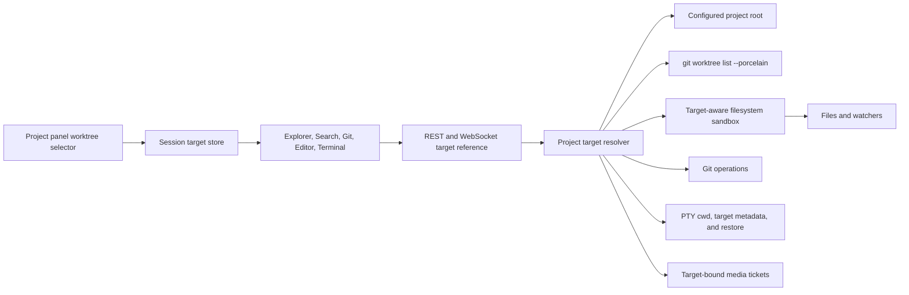

The resolver is authoritative. For a root target it returns the canonical
configured path. For a worktree target it canonicalizes the request and accepts
it only if a fresh Git snapshot reports that path as a registered worktree of the
configured repository, then rechecks that the projected target directory is
live and usable. An existing arbitrary sibling directory, a worktree belonging
to a different repository, and a missing/prunable worktree are not valid targets
for new operations. Discovery uses a short-lived bounded cache for UI listing;
add, remove, prune, explicit refresh, and project-configuration reload
invalidate the relevant discovery entry. A failed discovery leaves existing UI
rows visible with a stale-data warning and offers retry.

Target matching uses one platform-aware identity. Windows lexical paths
normalize `.`/`..`, use `/`, remove extended drive/UNC aliases, and compare
case-insensitively; POSIX paths retain case and treat backslashes as ordinary
filename bytes. The identity powers containment and relative projection even
when a worktree has disappeared, while live-target authorization still
requires canonical directories inside a freshly listed Git worktree.

App-initiated removal re-fetches discovery immediately before checking
exact-target ownership, refuses dirty editor tabs or live terminal sessions,
and only reconciles the target store after Git confirms success. Git's
dirty/untracked guard remains authoritative and is never bypassed by this UI
check. When a registered target disappears externally, the selector keeps its
row as unavailable, records the path in the target store, and routes
subsequent new operations to the configured root. Existing editor tabs are
retained and live terminal sessions with matching immutable `worktreePath`
metadata are marked orphaned. Legacy sessions without that marker fall back to
project/cwd containment.

`ProjectSandbox` evolves from one root per project to validation by project and
resolved target root. This changes the set of approved roots, not the traversal
rules: canonical containment, symlink, write, upload, and encrypted-write checks
remain in force. File watcher subscription keys and media tickets include target
identity so concurrent roots cannot overwrite or authorize one another.
Ordinary shared-state locks are not held while invoking Git or awaiting
filesystem work. The workspace lifecycle guard is the deliberate exception: it
spans fresh target validation, PTY creation, restore, respawn, and worktree
removal so those ownership decisions cannot race.

Frontend caches use `(project, targetKey, ...)`. Editor tab keys use
`(project, targetKey, path)` and persisted legacy tabs migrate to the configured
root. Terminal command/profile IDs use a stable opaque target discriminator;
canonical paths remain structured state rather than being embedded verbatim
into display IDs. Current `terminal:create` requests carry an optional
`worktreePath`; the server validates and canonicalizes the registered target,
constrains cwd to that target, and persists the target marker with the session
for reconnect, restore, and removal ownership checks. Legacy sessions without
the marker use project/cwd metadata for orphan detection. The Git panel's
existing nested-repo `root` remains a separate axis after the project target;
it is not reused as the worktree selector.

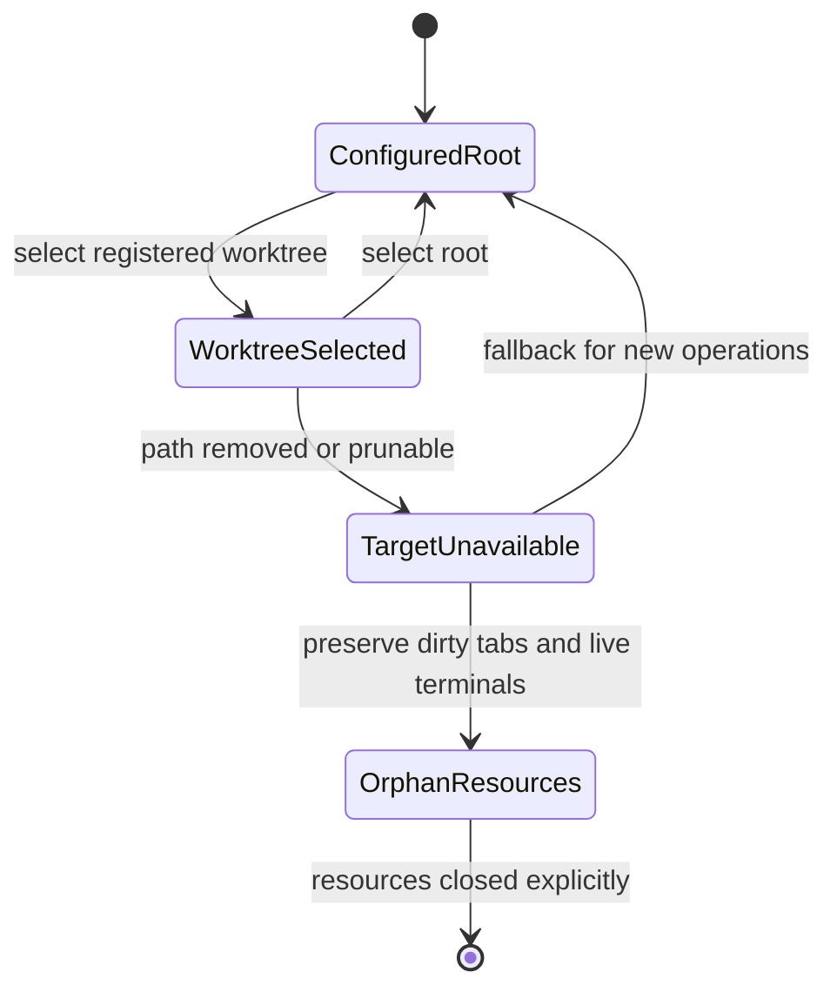

Removing a worktree through DamHopper is blocked while it has dirty editor tabs
or live terminals; Git's own dirty-worktree protection remains the final disk
safety check. If the selected worktree disappears externally or becomes
unavailable during discovery, the session store records the unavailable target,
falls back to the configured root for new operations, and exposes a notice.
Dirty tabs retain their target identity with an unavailable warning, while
existing terminal processes remain at their original cwd until the user closes
them. It never silently discards editor data or moves a running process.

The selected target is propagated with each root-sensitive REST and WebSocket
request rather than inferred from global UI state. File, search, Git, editor,
terminal, watcher, and media paths resolve through the same project/target
contract; workspace-scoped operations that do not support a worktree reject an
unexpected `worktreePath`. Target-aware cache keys prevent results from one
worktree replacing another, and legacy requests without `worktreePath` continue
to address the configured project root. Target-scoped terminal create failures
and respawn validation failures reconcile the exact target through the terminal
target-unavailable event when fresh validation confirms target loss. Ordinary
PTY and cwd failures remain local errors. This preserves the session's
immutable target identity while routing subsequent new operations to the
configured root.

### shared/

Dependency-free runtime helpers shared by browser packages.

- `logger.ts` centralizes `configureLogger`, `getLoggerConfig`, `resolveLogLevel`, and `logger.debug/info/warn/error`
- Phase 01 adds `addLoggerSink()` fanout. The primary sink stays in place, and extra sinks are isolated so one sink failure cannot break the app path
- Sensitive metadata is redacted recursively before sink delivery by default
- Web bootstrap reads the desired log level from Vite env and falls back to `debug` in development or `warn` in production

### xterm agent notifications (Phase 2)

Pure frontend notification pipeline in `packages/ui/src/lib/`:

- `agent-command-recognizer.ts` identifies tracked agent commands from terminal input
- `agent-activity-tracker.ts` turns submitted command, output, user input, and enhanced exit events into activity state changes
- `terminal-notification-signal-parser.ts` converts BEL and OSC 9/777/99 terminal signals into normalized notification events
- `terminal-notifications.ts` keeps a bounded, memory-only notification history and transient toast IDs in Zustand
- `terminal-notification-sound.ts` reuses one Web Audio context to synthesize the built-in `default`, `soft`, `two-tone`, and `urgent` in-app chimes at the persisted volume. `default` preserves the existing single-chime behavior for compatible configurations; sound has no effect on native browser popups and requires no audio assets or dependencies. Unavailable or blocked audio is a silent no-op.
- `browser-notification-service.ts` applies permission, rate-limit, and delivery guards before creating `Notification` objects. Web builds use the browser API; native Tauri v2 builds use the compatible shim supplied by `tauri-plugin-notification`
- `TerminalNotificationCenter` and `TerminalNotificationToastViewport` render the shared in-app bell/feed and top-right live alerts

On terminal attach or reconnect, notification delivery is marked replay-active before
the retained buffer is written and remains suppressed until xterm invokes that write's
completion callback. Live chunks queue during that interval, so historical OSC 9
signals cannot alert while an identical signal received after replay completion can.

Runtime delivery is UI-driven, while its preferences use the server-backed global UI-config persistence path. The shared service uses the standard `Notification` contract: web builds use browser notifications, while native Tauri v2 registers `tauri-plugin-notification`, whose injected shim routes permission and delivery through the native plugin. The native default capability grants only permission-state, permission-request, and notify commands. Native OS popups do not expose the browser event object used by the shared click binding, so in-app toast/history remain the interactive paths. On Windows, native popup delivery requires an installed/bundled app identity and is not a reliable end-to-end check in `tauri dev`. The API uses camelCase and global TOML uses snake_case: the master `terminalCodexNotificationsEnabled` / `terminal_codex_notifications_enabled` defaults to off, while toast, browser-popup, and sound preferences default to on, volume defaults to `100`, and the sound pattern defaults to `"default"`. Valid patterns are `"default"`, `"soft"`, `"two-tone"`, and `"urgent"`; invalid values are rejected during config deserialization. The master is the OSC 9 capture gate and the only setting that synchronizes Codex TUI configuration. While it is on, history is always recorded; toast, browser-popup, and chime delivery have independent child gates. Child delivery and sound preference updates do not modify `~/.codex/config.toml`. It is covered by unit tests around parsing, recognition, tracking, notification gating, callback-gated replay suppression, restart suppression, and cleanup behavior, plus a Chromium regression test that verifies queued live chunks resume only after retained replay completes.

Phase 03 adds the delivery controls to the shared UI package:

- `TerminalAgentNotificationSettings` exposes the master, **In-app toast**, and **Browser popup** switches; `TerminalNotificationSoundControls` exposes the Sound switch, fixed Sound style selector, Volume slider, and user-activated **Play sound** button
- `AgentCommandPatternEditor` lets users add literal aliases such as `CODEXNSB` or custom regex matches without editing config files by hand
- browser permission state is read from the runtime `Notification` API and is never persisted into server config; only the explicit request button can request it, while preview plays Web Audio only. In native Tauri v2, that runtime API is provided by the notification plugin shim
- diagnostics for unsupported/default/denied/rate-limited/factory-error paths are emitted as frontend `custom` events under scope `terminal-agent-notifications`
- the Codex notification setting gates event capture and child controls, but does not reset saved child choices; toast off still retains bell/feed history, and the Sound switch/style/volume gate only the best-effort chime. Browser popup delivery additionally requires runtime native permission, so browser permission denial or lack of support does not affect the in-app bell/feed
- in-app history is session-memory only, capped at 50 records; at most three toast alerts are shown and each expires after six seconds

Notification scope remains xterm-only. DamHopper does not watch external terminals, OS process tables, or implement a separate native notification daemon for this feature.

### inline terminal suggestions

Automatic suggestions and history capture remain fail-closed until the server verifies
a shell lifecycle for the current PTY incarnation. On Unix, the server supports launch-only
local interactive zsh, fish, and Bash adapters; every other command or shell remains unsupported.
Terminal and outgoing PTY bytes are passive: the feature
never infers command boundaries from Enter, output silence, replayed scrollback, or
arbitrary input. Command history is browser-local and users can clear it or disable
future persistence from Settings.

Supported adapters emit OSC 633-compatible `A`/`B`/`E`/`C`/`D` markers carrying a
fresh, per-incarnation nonce. `ShellLifecycle` is a bounded (8 KiB) streaming parser:
it accepts BEL or ST terminators and validates marker order, nonce, and the base64url
command payload in `E`. Bash uses normalized `BASH_COMMAND` text for simple commands
and emits no submission marker for ambiguous syntax. The nonce exists only in the child
environment and lifecycle observer; it is never persisted or sent to clients. Valid private markers are stripped
from live output and scrollback, while malformed, invalid, or oversized markers remain
visible verbatim and reset trust.

The server broadcasts only typed `terminal:lifecycle` events (`editing`, `submitted`
with the exact command, `opaque`, or `unverified`) and an opaque generation number.
It resets lifecycle trust on a terminal attach/replay, invalid marker or transition,
alternate-buffer entry, and a new PTY incarnation. No lifecycle event establishes
trust for unsupported shells.

Phase 02 storage hardening now includes deterministic exclusive staging-file replacement race
validation, canonical decoded SHA-256 fingerprint validation, and forced-process crash/restart
replacement recovery with idempotent purge. Phase 03+ delivery and release evidence remains
pending; Linux, macOS, iOS, and Windows-agent/platform support remain deferred. These proofs do
not claim v1 release readiness or that all safeguards above are complete.

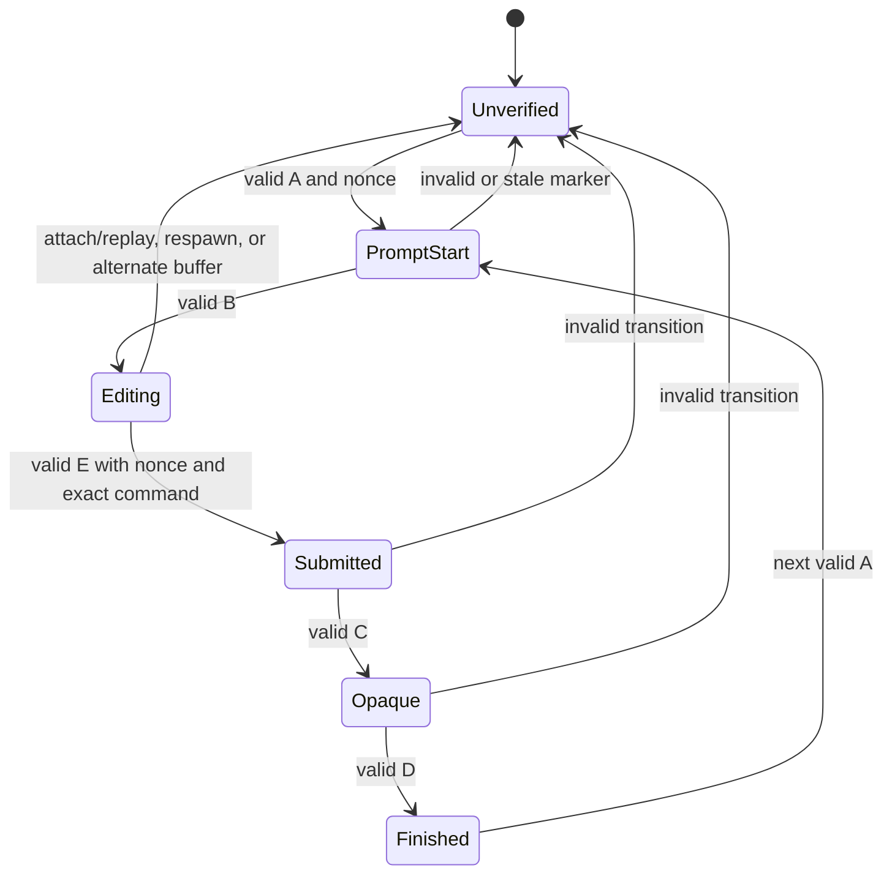

The security boundary is that only `Editing` may query or show a passive suggestion. `E` supplies
the exact submitted command; `C` closes editing before command output or password/REPL/
TUI input. Browser-local history commits only from a current-generation, server-validated
`submitted` lifecycle event carrying that exact `E` command. Outgoing PTY bytes, Enter,
terminal silence, and replayed scrollback never establish a history boundary.
The Bash adapter preserves scalar and array `PROMPT_COMMAND` hooks and disables itself when
an existing `DEBUG` trap would make command capture ambiguous. Bash commands containing
compound, multiline, substitution, or redirection syntax also fail closed rather than
submitting an approximation. Nonce validation limits accidental or child-process marker spoofing; it is not isolation
against malicious same-user code, so invalid sequences always reset to `Unverified`.

Phase 03 implements a per-session, client-only suggestion controller with immutable
snapshots and monotonic prompt epochs and input revisions. Each lifecycle, input, output,
replay, or composition transition synchronously invalidates outstanding searches. A result
can enter a `ghost` snapshot only when its session, epoch, revision, exact raw input, verified
editing lifecycle, and byte-exact true-prefix relation still match. Phase 04 renders only the
remaining suffix of that snapshot; it never redraws or replaces the typed prefix.

The controller accepts only one printable grapheme as an append while a verified prompt is
clean. Control sequences, Enter, cursor edits, completion, multi-grapheme/paste input, IME
composition, terminal output, reconnect/replay, and buffer ambiguity fail closed to `opaque`
or `unverified`. The terminal adapter remains passive except for three explicit desktop
shortcuts: `Alt+Right` accepts the full remaining verified suffix, `Alt+Shift+Right` accepts
its next token, and `Ctrl+Alt+H` opens the explicit history workflow when enabled. Acceptance
atomically clears the ghost before writing the suffix once through the normal PTY path; it never
sends Ctrl+U, the existing prefix, or Enter. Every other xterm key and input byte—including Tab,
Enter, Escape, Ctrl+R, paste, and TUI input—continues unchanged. Coarse-pointer and
native-keyboard-suppressed surfaces disable automatic ghost and history-shortcut behavior.
Fuzzy/non-prefix results remain for an explicitly focused accessible list rather than passive
completion.

History v3 is browser-local under `dam-hopper:command-history` as
`{ version: 3, entries }`. Each entry retains exact raw command text, a stable
v3 ID salted with `profileId` when supplied, last-used timestamp, total use
count, current project, and a per-project usage map. Its NFKC-lowercased
`searchText` and Unicode word tokens are derived search fields only; they never
reconstruct or alter the raw command. Profile-aware callers pass their owner to
search and do not merge another profile's qualified entries. Unqualified
compatibility records remain eligible only where the caller deliberately uses
the compatibility path. Legacy or unversioned records are discarded rather
than rewritten. Disabled or inaccessible local storage fails closed, and the
Settings controls can stop future writes or clear stored history.

The server preserves ordering at the prompt boundary: visible PTY output is emitted before its
pending `editing` lifecycle snapshot. A marker-only chunk cannot flush `editing`; it waits for
visible prompt output (or a previously established visible boundary). This prevents the client
from treating an unseen prompt marker as a usable editing surface.

Cursor placement is isolated behind one fail-closed geometry adapter. It measures the
xterm textarea relative to the current terminal host and has one validated screen-grid fallback.
It recomputes once per animation frame on cursor/output/resize/scroll/zoom/font changes; the
terminal host attachment invalidates it after reparenting. Detached hosts, alternate buffers,
scrollback, invalid rectangles, and out-of-bounds measurements hide the ghost rather than guess.
The visual suffix is `aria-hidden`, unfocusable, pointer-inert, single-line, and clipped/faded at
the available terminal width. Proposed xterm decoration APIs are not a default dependency;
adopting them requires a renderer/reflow spike and pinned compatibility.

The explicit history path is a focus-managed dialog, never a passive preselected menu. It searches
browser-local entries and exposes full command text with Copy and Use actions. Use writes only a
single-line command to the current PTY without Enter; a multi-line entry stays visible but is
copy-only. The dialog and ghost consume only immutable controller snapshots and do not record
history, alter lifecycle trust, or add terminal protocol messages.

History stores exact raw commands separately from normalized search fields, remains
local-only, and provides clear/disable controls. Desktop is the first support boundary;
mobile direct-write paths remain explicitly unsupported until all input routes share the
same controller.

### Codex OTel usage analytics

Usage is a Codex-only observability feature. Codex `response.completed` log records exported over
OTLP are the sole write source. PTY creation, input, output, shell integration, command lifecycle,
and restart paths perform no usage work and carry no usage correlation identifiers.

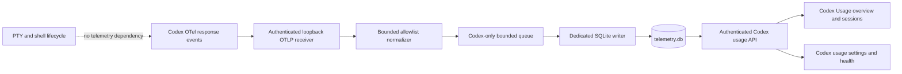

The receiver binds to loopback only, requires the generated bearer secret, decodes only bounded
allowlisted fields, and queues normalized `CodexUsageEvent` values directly. The Codex usage
runtime owns queue admission, batching, retention, deletion, and shutdown. There is no generic
`TelemetrySink`, PTY capture snapshot, command classifier, terminal correlation registry, marker
injection, or output redactor in this dataflow. Collector or storage failure cannot affect terminal
latency or behavior.

Collector health preserves the aggregate `dropped` count and adds five fixed-cardinality,
in-memory reason counters: missing source identity, invalid timestamp, paused admission, full
queue, and unavailable worker. Normalization and enqueue outcomes increment exactly one reason
counter alongside the aggregate; the counters never include source versions, models, identifiers,
paths, errors, or payload content, and reset on process restart. The missing-identity field is
retained for health API compatibility and remains zero when the bounded fallback is active.
Queue-full and worker-unavailable outcomes retain retryable `503` responses, while normalization
and paused records retain their existing `202` behavior.

Codex CLI 0.146.1 emits token fields in `response.completed`, but its OTLP records provide no safe
per-event trace/span or provider event ID. When trace/span are absent, Usage derives a
domain-separated HMAC fallback from bounded decoded fields: source version and timestamp,
conversation/model identifiers, bounded token components, duration, and counter semantic. Raw
content, receipt time, conversation ID alone, and fabricated random IDs are never fallback keys.
Valid trace/span identity takes precedence over the fallback.
The fallback is stable for replay but can dedupe identical same-millisecond decoded events; this is
an explicit compatibility tradeoff, and those events remain `unverified`. Invalid timestamps still
fail closed. This is an ingestion-admission decision only: it makes no Codex event or SQLite schema
change.

Development invariant: remove the Usage middle layer from every PTY production path, including
constructor parameters, session options, restart/restore handoff, reader-loop state, environment
mutation, admission locks, and no-op abstractions. Do not retain a disabled Usage hook “for later.”
Codex usage may depend on the independent OTLP runtime; PTY production modules must not import or
call it. A negative production dependency scan and an enabled-versus-disabled PTY
latency/throughput comparison gate this refactor so future Usage work cannot silently reintroduce
terminal overhead.

The target store contains `codex_sessions`, `codex_usage_events`, `codex_daily_rollups`, and
`telemetry_health`. It retains keyed dedupe/session identifiers, bounded model/source/status fields,
response count and duration, nullable token components, and explicit quality only. The database is a
fresh v1 Codex-only store; it has no legacy-data migration or import. During development, startup
checks `user_version` and the complete allowlisted object definitions. If the configured telemetry
file is legacy, malformed, or otherwise not this target schema, the store performs a bounded,
transactional reset of that telemetry file's user tables/views/triggers/indexes and recreates the
fresh schema. A current schema is reopened without resetting its data.

The protected API exposes Codex totals, time/model buckets, bounded session summaries, receiver and
storage health, retention, and deletion controls. Shell, terminal, command, project, category,
agent, capture-quality, terminal-correlation, and inferred-lineage filters or fields do not exist in
the target contracts. The Usage page shows Codex token/response/session/duration trends and model
breakdowns. Settings contains one “Codex usage telemetry” setup surface. Neither UI surface mentions
terminal analytics; cost stays omitted until authoritative versioned pricing exists.

For an intentional clean reset, stop DamHopper and remove the effective
`server.telemetry.db_path` file plus its `-wal` and `-shm` sidecars. The default is
`~/.config/dam-hopper/telemetry.db`. The separate `sessions.db` must not be removed.
Runtime initialization also rejects configurations that resolve telemetry and session persistence to
the same database file.

#### Development reset boundary

Legacy combined telemetry data is intentionally unsupported during development. On startup,
`TelemetryStore` checks SQLite `user_version` and the object list/schema definitions; any non-v1 or
non-Codex database is cleared and recreated from the fresh schema, with no migration or data import.
The reset is scoped to the configured telemetry database and uses a single transaction; current
Codex v1 data survives a normal reopen. For a manual reset, stop DamHopper and remove
`telemetry.db` plus its `-wal` and `-shm` sidecars; `sessions.db` is unrelated and must remain intact.

#### Flat Codex session summaries

OTel remains authoritative for input, cached-input, output, and reasoning token components. The
runtime stores one privacy-safe flat summary per Codex session and never infers parent/child edges
from event order, model names, titles, or text. Direct reads from Codex SQLite or rollout files are
forbidden in production.

Idempotent upserts preserve summaries before detail purge. `delta` counters add; `cumulative`
counters accept only newer non-regressing observations, rejecting stale, conflicting, or regressing
updates as summary conflicts.

The protected API exposes cursor-bounded `GET /api/usage/sessions` and
`GET /api/usage/sessions/{id}` routes. List pages are capped at 100 rows (default 25) across a
maximum five-year range; cursors are authenticated and bound to the range and model filter. Each
session contains only a derived ID, timestamps, optional model data, bounded token components, and
bounded model summaries. Detail returns the same flat projection. Active sessions preserve a null
end timestamp while cursor ordering uses their start timestamp as the effective sort key. Terminal,
project, shell, capture-quality, category, agent, correlation, lineage, and raw-content fields are
not part of the contract.

Model identifiers are generalized rather than tied to a fixed model-name allowlist. They are
bounded to 1–64 safe ASCII characters, must start and end alphanumeric, and may contain `.`, `_`,
`-`, `/`, or `:`; URL-like values, repeated separators, and content-bearing forms are rejected
before storage or filtering.

Codex app-server metadata is intentionally outside this usage contract. OTel aggregate usage remains
the sole source for persisted Codex session summaries until a future, privacy-safe metadata
projection is separately specified.

Key invariants:

- Shell lifecycle validation remains the only command boundary.
- Telemetry persistence stays off the PTY hot path.
- Raw commands and AI content never cross the persistence boundary.
- Availability and paused state are reported explicitly; missing token components remain null.
- Codex telemetry adds no MCP call or model-token consumption.
- Metrics stay descriptive; no productivity or employee scoring.
- Session detail remains one compact Codex summary row bounded by detail retention; no permanent
  turn/event transcript.

Notification selection also stays frontend-only. Native notification clicks
publish a typed browser event keyed by the stable PTY `sessionId`;
`WorkspacePage` consumes it because that page owns workspace mode, compact
surface selection, terminal selection, and xterm focus orchestration. A click
preserves the current IDE/Terminal mode: desktop IDE mode opens its Terminal
bottom tool, while compact mode reveals the Terminal surface without toggling
the mode. Displayed
notification context uses `Project · Bash #N`, with the ordinal read from the
current 1-based open-terminal order; the original sanitized body keeps its own
payload allowance below that context line. Project names and terminal ordinals
are display only and are never used as navigation identity. Navigation requires
a mounted target that is explicitly alive, or a mounted and registered xterm
only when liveness is unknown. Explicitly dead, unmounted, and stale session
clicks no-op without changing server state, the WebSocket protocol, or persisted
terminal layout. Compact coarse-pointer layouts with the mobile custom keyboard
enabled still reveal and refit the exact session but suppress forced native
xterm focus so selection does not unexpectedly open the browser keyboard.

### frontend diagnostics (Phase 01)

The browser host now initializes a diagnostics client before React render. This creates a local-only ring buffer for client-side troubleshooting and keeps the capture path active from app startup onward.

**Host init flow:**

1. `apps/web/src/main.tsx` calls `initializeClientDiagnostics()` before `createRoot(...).render(...)`
2. `WsTransport` status changes are fed into the diagnostics client
3. `RouteDiagnostics` in `packages/ui/src/embed/dam-hopper-app.tsx` records route changes
4. `ErrorBoundary` records React render failures
5. Window `error` and `unhandledrejection` events are captured

**Stored signals:**

- shared logger entries via logger sink fanout
- browser runtime errors
- unhandled promise rejections
- React error boundary failures
- route changes
- WebSocket transport status changes

**Storage model:**

- persisted in `localStorage` under `damhopper_diagnostics_frontend_v1`
- bounded ring buffer, trimmed by time and entry count
- storage budget is capped at a small fixed size; oldest entries are dropped first when the cap is hit
- diagnostics stay best-effort if browser storage is blocked or full

Phase 01 is client-side only. It does not add a backend export endpoint yet.

### backend diagnostics store + export (Phases 02-04)

The server now keeps a local-only diagnostics store for backend events and exposes a protected export endpoint for debugging. Request/response payloads use camelCase on the wire.

**Storage model:**

- JSONL file under the config dir: `~/.config/dam-hopper/diagnostics/backend-log.jsonl`
- file mode is `0600` on Unix
- retention window is 60 minutes
- compaction keeps the newest in-window events and drops older ones
- storage is local only; there is no remote upload path

**Privacy model:**

- event message text and fields are redacted before persist
- redaction is best effort, not a hard privacy boundary
- export also returns the already-redacted backend events

**Export API:**

- `POST /api/diagnostics/export`
- protected by auth like other backend routes
- invoked by Settings > Maintenance > Export Diagnostics and terminal-title context menus in the UI
- workspace terminal exports use the shared terminal-panel time window and pass only the right-clicked session ID as `terminalIds`
- request accepts `frontend` and also the legacy `frontendSnapshot` alias
- response schema version is `1`
- top-level export sections:
  - `scope`
  - `manifest`
  - `frontend`
  - `backend`
  - `terminals`
  - `system`

**Scope fields:**

- `windowMinutes`
- `includeTerminalOutput`
- `terminalTailBytes`
- `terminalIds`
- UI defaults: 60-minute window, terminal tails included, `terminalTailBytes=65536`

**Manifest fields:**

- `backendEventCount`
- `terminalSessionCount`
- `retentionMinutes`
- `storage` = `localConfigJsonl`
- `droppedPersistEvents`
- `persistErrorCount`

**Terminal tails:**

- `terminals.sessions` includes detailed session snapshots
- `terminals.tails` includes capped per-session scrollback tails when `includeTerminalOutput=true`
- `terminalTailBytes` controls how much tail data is returned per session
- exported files use `dam-hopper-diagnostics-{timestamp}.json`
- terminal tails may still contain sensitive local/dev output even after best-effort redaction; exported bundles should be reviewed before sharing

### Cooperative browser debug preview

The browser host exposes a global Browser tool for controlled development
applications. V1 does not inspect arbitrary public pages. Supported preview
URLs may use an HTTP loopback origin or the origin of a `Ready` tunnel URL
returned by the connected server's `TunnelSessionManager`; paths, query
strings, and hashes remain inside that approved origin boundary.

The DamHopper Browser Debug extension injects a framework-neutral, dev-only
content script into the cross-origin iframe. The target application does not
install anything. The extension owns element highlighting, DOM/accessibility
extraction, path synchronization, and bounded console previews. Parent and extension communicate through a
versioned `postMessage` protocol with WindowProxy/source checks, a per-load
nonce, exact target/parent-origin checks, request IDs, schema validation, and
bounded payloads. Loopback parent origins are allowed for local development;
deployed parent origins are compiled into the extension from
`VITE_DAM_HOPPER_EXTENSION_PARENT_ORIGINS`. The target route must still permit
iframe embedding through its browser policy; DamHopper does not bypass
`X-Frame-Options` or restrictive CSP.

The native desktop controller enforces the approved origin boundary before
navigation and across redirects. The web iframe fallback can validate bridge
messages but cannot inspect a cross-origin iframe's final URL after an
external redirect. Such a redirect may remain visually rendered without
trusted bridge access or page inspection and is not a supported preview.

The web build packages the extension as
`/browser-debug-extension/dam-hopper-browser-debug.zip`. When the Browser
tool cannot complete the bridge handshake, it offers this download and directs
the client to extract it and use Chromium's `chrome://extensions` Developer
mode / Load unpacked flow. The target application remains unmodified; a normal
website cannot silently install a browser extension.

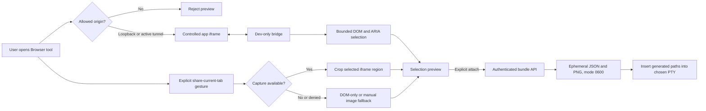

**Client state and UI rules:**

- `WorkspacePage` registers Browser beside existing tool definitions for IDE,
  terminal, and compact layouts without creating another PTY lifecycle.
- Native and web hosts expose `Responsive` and `Custom` Browser Debug viewport
  controls. Custom width and height are whole CSS-pixel values bounded to
  160–4096; the top-bar `+` probe and symmetric stepper buttons change both
  dimensions by 16px. Keyboard shortcuts are intentionally not part of this
  feature. The state is browser-local and platform-scoped. These controls do
  not resize the main window; main-window resizing is a separate native shell
  concern.
- A custom viewport stage may overflow and scroll. The native adapter and
  fallback iframe share a host path that remeasures the viewport and stage,
  preserves the complete requested frame for native bounds and clips only the
  visible intersection for the fallback iframe; stage scroll and resize
  changes trigger remeasurement.
- One `BrowserDebugKeepAliveHost` owns the iframe for the lifetime of
  `WorkspacePage`. The host keeps the iframe in one fixed overlay and moves
  that overlay off-screen when no Browser viewport is active; viewport
  geometry is recalculated on shell, resize, and compact-surface changes. Tool
  close, IDE/terminal switching, and compact surface changes do not recreate
  the iframe or its browsing context. Leaving Workspace, changing server
  profile, or changing the preview URL disposes it and invalidates the bridge
  nonce.
- Preview metadata is browser-local. Captured `MediaStream` objects are never
  persisted; closing the visible Browser panel stops all capture tracks for
  privacy even though the iframe stays alive in its off-screen overlay.
- `getDisplayMedia()` is invoked only from a user gesture. Current-tab and
  browser-surface options are hints, not silent permission or proof of the
  selected surface. Capture failure degrades to semantic metadata plus manual
  image upload.
- Page text renders only as React text. Input values, password/file controls,
  cookies, storage, auth data, event attributes, hidden surrounding DOM, and
  unbounded HTML are excluded.
- Captured content and artifact paths are excluded from frontend diagnostics.

**Artifact and terminal handoff rules:**

- `BrowserDebugArtifactManager` owns a server-instance temporary directory and
  an in-memory metadata map. Bundle files are random, mode `0600`, size-capped,
  TTL-bound, and removed on explicit discard, expiry sweep, and server shutdown.
- The protected browser-debug API accepts one bounded structured selection and
  optional cropped PNG. It never accepts a client-provided filesystem path.
- The create response includes the server-generated JSON path; an optional PNG
  path appears only after the PNG upload commits. The selected PTY must still
  be mounted/live and is addressed by stable `sessionId`.
- Terminal insertion contains generated paths and an untrusted-data warning,
  not raw page content. Strip CR/LF, C0/C1, ESC/CSI/OSC/DCS sequences; never
  append Enter or auto-submit.
- Browser-debug JSON/PNG data never enters diagnostic JSONL, diagnostic export,
  terminal replay, project roots, or the persistence database.

**Failure invariants:**

- iframe navigation invalidates the nonce and selection;
- a stopped/replaced tunnel immediately removes its origin from the allowlist;
- stale, dead, or unmounted terminal targets are safe no-ops;
- capture denial never blocks DOM-only inspection;
- disconnect/reconnect does not extend bundle TTL or expose bundles to a
  different server profile.

### apps/native

Tauri v2 native client that reuses the same `packages/ui` runtime as the web
host. It is a remote client only: it does not embed the Rust server as a
sidecar, does not rewrite PTY behavior in native code, and keeps Tauri
permissions to `core:default` plus the scoped `browser-debug` permission
granted to the `browser-debug-main` capability on the main window.

**Frontend host:**

- `apps/native/src/main.tsx` mirrors the web host's explicit bootstrap: it
  performs fresh browser-resource reset and profile migration, creates an
  ordinary `QueryClient`, mounts native SSH/Browser Debug providers, and renders
  `DamHopperApp` once. Keyed connection startup remains in `packages/ui`.
- `apps/native/vite.config.ts` uses Tauri's fixed dev port `1420`, strict port mode, `TAURI_DEV_HOST` HMR support on port `1421`, and ignores `src-tauri` in Vite file watching.
- The shell is not gated by a `ServerProfileGuard` or `IdleTransport`. Supported
  `autoConnect` profiles start independently after the shell mounts; an
  unsupported non-Windows remote remains editable and receives no auto-login or
  connection traffic.

**Tauri shell:**

- `apps/native/src-tauri` contains the default Tauri builder, the main window config, and the checked-in Android Studio project under `src-tauri/gen/android`.
- No filesystem, shell, opener, HTTP, or sidecar plugin permissions are granted in Phase 03. The native CSP allows local/profile HTTP and WebSocket connections but keeps default script execution to self.
- Native desktop dev uses `http://localhost:1420`. Android dev uses `tauri android dev --host`, which sets `TAURI_DEV_HOST` so the Vite dev server and HMR bind to the LAN-reachable address for an emulator or physical device. Packaged desktop webview requests can present `tauri://localhost`, `http://tauri.localhost`, or `https://tauri.localhost` depending on platform/webview. Windows native desktop may use separate-origin profiles through the existing browser transport when the backend has an exact `DAM_HOPPER_CORS_ORIGINS` entry; Android, iOS, and unsupported native hosts remain same-origin by policy. Separate web frontends also require an exact backend `DAM_HOPPER_CORS_ORIGINS` entry.

**Shared internal app layout zoom:**

- `packages/ui` owns the host-independent `AppZoomProvider` and `useAppZoom` contract. `DamHopperApp` wraps its complete shared tree, so web and native hosts use the same behavior without host bootstrap or Tauri wiring.
- `TopNav` exposes decrement/increment controls for the discrete `50%` through `120%` levels in `10%` steps. The validated level is best-effort persisted in local storage under `dam-hopper:app-zoom:v1` and defaults to `100%`.
- The provider applies CSS `zoom` to `document.documentElement`, which includes normal app content and body-mounted portals. It changes internal presentation scale only; it does not change the OS/native window or the Browser Debug viewport model. The native Browser Debug child mirrors this factor with WebView page zoom while using rendered DOM coordinates for its bounds, so selected target CSS dimensions remain stable.

**Native browser-debug controller (Phase 03):**

- `apps/native/src-tauri/src/browser_debug/` owns one stable-label `browser-debug` child WebView, its serialized lifecycle, geometry, visibility, navigation generation, nonce/request state, and main-window-only commands.
- Custom viewport geometry is supplied by the shared UI through the existing
  host lifecycle contract; it does not resize the Tauri main window. Web uses
  the iframe adapter, while desktop native uses the child WebView adapter.
- Native desktop target navigation is parsed and restricted to HTTP loopback or
  explicitly supplied HTTPS tunnel origins. Credentials, unsafe schemes, popups,
  downloads, external redirects, and Windows WebView2 permission requests fail
  closed. The web iframe fallback can reject untrusted bridge messages but
  cannot observe a cross-origin external redirect; the redirected page may
  remain visible without trusted control or inspection.
- The existing built browser bridge is embedded by `build.rs` and injected at document start. The native relay accepts only bounded, schema-validated events matching the child label, committed origin, generation, nonce, and issued request ID.
- Child cookies, cache, and page storage use a profile-scoped hashed directory under application data. Clearing a profile destroys the active child before removing only that profile’s directory. Linux has a WebKitGTK child/relay implementation but remains runtime-unverified until a real engine verification pass; macOS remains deferred.

### persistence/ (Phase 04)

SQLite-backed session persistence infrastructure for live resume and server-restart relaunch.

Persistence is always enabled when the configured SQLite database can be opened. It does not preserve exact shell/process memory across DamHopper server or host restart.

**Schema (001_initial.sql):**

| Table           | Purpose                                                                                                                                      |
| --------------- | -------------------------------------------------------------------------------------------------------------------------------------------- |
| sessions        | Session metadata: id, project, command, cwd, session_type, restart_policy, restart_max_retries, env_json, cols, rows, created_at, updated_at |
| session_buffers | Scrollback buffers: session_id, data (BLOB), total_written, updated_at                                                                       |
| persisted_ports | Stdout-detected safe port candidates: session_id, port, project, updated_at                                                                  |

Indexes on `project` and `updated_at` for efficient queries.

**SessionStore API:**

- `open(path) → Result<Self>` — Creates/opens database, runs migrations, sets 0o600 permissions (Unix)
- `save_session(meta, env, cols, rows, restart_max_retries) → Result` — INSERT OR REPLACE into sessions
- `save_buffer(id, data, total_written) → Result` — Persist scrollback buffer
- `load_sessions() → Result<Vec<PersistedSession>>` — Load all saved sessions from database
- `load_buffer(id) → Result<Option<(Vec<u8>, u64)>>` — Load buffer data + byte count for session
- `delete_buffer_before(cutoff_ms) → Result` — TTL-based cleanup of expired buffers
- `delete_session_buffer(id) → Result` — Remove buffer for specific session

**Thread Safety:** Arc<Mutex<Connection>> — safe for concurrent access across async runtime.

**Session Storage Format:**

```rust
pub struct PersistedSession {
    pub meta: SessionMeta,        // id, project, command, cwd, session_type, restart_policy
    pub env: HashMap<String, String>,  // Stored as JSON blob in database
    pub cols: u16,                // Terminal width
    pub rows: u16,                // Terminal height
}
```

**Data Integrity:**

- RestartPolicy and SessionType enums stored as lowercase strings in database
- Environment variables serialized to JSON for portability
- created_at / updated_at in milliseconds (Unix epoch)
- total_written counter tracks bytes for buffer offset tracking (Phase 02)

### Workflow (Phases 01–03: service, REST, and lifecycle correlation)

`server/src/lib.rs` exports the workflow domain. Phase 01 added the relational
model and repository; Phase 02 added `WorkflowService` and the protected Axum
REST boundary; Phase 03 connects authoritative PTY lifecycle observations to
existing terminal resource links. Workflow state remains separate from
terminal WebSocket messages: public workflow writes use `/api/workflow/*`,
while internal observations use a bounded PTY-to-worker channel.

`SessionStore::open()` enables SQLite foreign keys and applies migrations
001–009 before applying migration 010 when the workflow workspace table is not
present. Migration 010 uses `CREATE TABLE IF NOT EXISTS` for an additive
schema. Existing terminal-session tables and data remain untouched. Workflow
entities therefore share the configured `sessions.db` file and its Unix
`0o600` permission boundary.

**Migration 010 tables:**

| Table                     | Stored contract                                                                                                                                                                                                                                                                         |
| ------------------------- | --------------------------------------------------------------------------------------------------------------------------------------------------------------------------------------------------------------------------------------------------------------------------------------- |
| `workflow_workspaces`     | Text `id` (generated UUID), unique caller-resolved config `locator`, display `name`, and create/update millisecond timestamps.                                                                                                                                                          |
| `workflow_items`          | Workspace/project/optional worktree scope, optional parent, `kind` (`plan`, `phase`, `task`), title/summary, status, ordering, source, lifecycle timestamps, and optional completion/archive timestamps. Workspace deletion cascades.                                                   |
| `workflow_sessions`       | Workspace/project/optional worktree scope, optional item link, lifecycle status (`running`, `ended`, `abandoned`), start/end timestamps, source, and create/update timestamps. Workspace deletion cascades; deleting an item sets `item_id` to `NULL`.                                  |
| `workflow_resource_links` | Session correlation for `terminal` or `agent` resources, external/incarnation identity, optional harness/run metadata, observed state, suggested end time, first/last seen, source, and timestamps. `(session_id, resource_type, external_id)` is unique and session deletion cascades. |
| `workflow_notes`          | Workspace-scoped text attached to an item, a session, or both. `deleted_at` implements soft deletion; a check constraint requires at least one target. Item/session/workspace deletion cascades.                                                                                        |
| `workflow_events`         | Append-only activity records with event type/source, optional project/worktree/item/session scope, occurred/recorded times, optional JSON payload, and optional expiry. Event item/session identifiers are metadata rather than foreign keys so history can outlive entity cleanup.     |

Indexes cover workspace/project/status queries, item parent traversal,
session/item lookup, resource external identity, note targets/deletion, and
event keyset/expiry scans. Enum values persist as lowercase `snake_case`
strings, while API-facing structs use `camelCase` serde fields.
`WorkflowWorkspace::locator` is skipped during serialization because it is a
canonical filesystem locator, not client data.

**Domain invariants:**

- `ItemKind`: `Plan`, `Phase`, `Task`; a Plan is root-only, a Phase requires a
  same-project/target Plan parent, and a Task may be standalone or child of a
  Plan/Phase. Task parents, cycles, cross-workspace/project/target parents, and
  hierarchy depth over three levels are rejected.
- `ItemStatus`: `Backlog`, `Next`, `InProgress`, `Blocked`, `Done`, `Canceled`.
  Open-state transitions, completion/cancellation, and reopen-to-`InProgress`
  are validated explicitly.
- `SessionStatus`: `Running`, `Ended`, `Abandoned`; only `Running` is active.
  Manual session end time must not precede start time.
- `ResourceLinkType`: `Terminal`, `Agent`. `ResourceObservedState` is
  `Attached`, `Exited`, `Stale`, `Detached`, `Crashed`, or `Unknown`.
- `WorkflowSource`: `Manual`, `Terminal`, `Git`, `Agent`, or `System`.
  `WorkflowEventType` is a closed set of item, session, resource, note, and
  workspace activity classifications.
- Titles are trimmed and capped at 200 characters; note bodies at 8 KiB;
  external IDs at 200 characters; harness labels at 64 characters; run IDs at
  128 characters; event JSON payloads at 4 KiB.

Enum implementations provide stable `as_str()`, `Display`, and case-insensitive
`FromStr` conversions. Request parsing rejects unknown values and SQL `CHECK`
constraints provide a second write boundary. Invalid legacy enum values fall
back to domain defaults during reads instead of aborting an overview.

**WorkflowService boundary:**

`server/src/workflow/service.rs` owns the current-profile/workspace boundary
between handlers and the synchronous store. It holds `WorkflowStore`, the
configuration handle, `WorkspaceTargetResolver`, the shared workspace guard,
and `PtySessionManager`. It captures the current config locator/name/projects
before database work, lazily resolves the workflow workspace, validates
project/worktree targets, and dispatches startup terminal-link reconciliation.
Omitted `worktreePath` means the configured root; explicit paths must be
absolute and currently registered by Git.

`WorkflowStore` calls are dispatched through `tokio::task::spawn_blocking`.
This keeps SQLite mutex/transaction work off the async executor and avoids
holding configuration or target locks across database calls. `AppState` keeps
an optional `Arc<WorkflowService>`; `main.rs` builds it from the existing
`SessionStore::connection()` and never opens a second workflow database. A
missing workflow service returns `503 workflow_store_unavailable` only for
workflow routes, leaving PTY and IDE APIs operational.

**Protected REST surface:**

| Route                                                                                                             | Responsibility                                                                                         |
| ----------------------------------------------------------------------------------------------------------------- | ------------------------------------------------------------------------------------------------------ |
| `GET /api/workflow/overview`                                                                                      | Bounded workspace, project, Plan/Phase/Task tree, notes, active sessions, progress, and recent events. |
| `GET /api/workflow/events`                                                                                        | Descending `(recorded_at, id)` keyset history with opaque cursor.                                      |
| `POST /api/workflow/items`; `PATCH/DELETE /api/workflow/items/{id}`                                               | Plan-first item mutations; PATCH/DELETE require `updatedAt` CAS.                                       |
| `POST /api/workflow/sessions`; `POST /api/workflow/sessions/{id}/end`; `POST /api/workflow/sessions/{id}/abandon` | Manual session lifecycle with explicit RFC3339 work times.                                             |
| `POST/DELETE /api/workflow/sessions/{id}/links`                                                                   | Terminal/agent resource link and CAS unlink.                                                           |
| `POST /api/workflow/notes`; `DELETE /api/workflow/notes/{id}`                                                     | Durable note creation and CAS soft deletion.                                                           |
| `DELETE /api/workflow/history`                                                                                    | Explicit permanent purge of old events and soft-deleted notes.                                         |

The route group inherits the existing auth middleware and applies a focused
32 KiB request limit. Request DTOs deny unknown fields and use camelCase.
Mutation responses are `{ resource, replayed, eventId }`; retries with the
same UUID request ID return the current resource with `replayed: true`.
DELETE responses are typed tombstones. Workflow errors map to sanitized stable
codes: 400 for invalid/domain-limit requests, 404 for missing scoped entities,
409 for CAS, target, and transition conflicts, 413 when the route body cap is
exceeded before handler execution, and 503 for unavailable workflow storage.

Overview reads are bounded to 100 projects, 500 items, and 100 running
sessions, with a `truncated` flag. Item progress contains factual tracked and
completed Task counts only when descendant Tasks exist. Event history defaults
to 50 rows and caps callers at 100; keyset order is
`(recorded_at DESC, id DESC)`.

Mutating repository wrappers lock the shared connection, open a transaction,
run the focused `_tx` helper, append an optional event in that transaction,
and commit only after validation and entity mutation succeed. Any error rolls
back both entity and event. Resource links upsert by natural identity;
observation processing updates only link health, incarnation, last-seen, and
optional suggested end time. It never infers or mutates manual session
status/timestamps. Notes soft-delete before physical purge, while item
deletion cascades descendants.

`WorkflowStoreError` distinguishes SQLite, model-validation, not-found,
duplicate-request, optimistic-conflict, and hierarchy failures so API adapters
do not match error strings. Workflow API integration coverage is in
`server/tests/workflow_api.rs`; domain/store coverage remains in
`server/src/workflow/tests.rs`. See [Workflow API reference](./workflow-api.md)
for request/response fields and examples.

**Terminal lifecycle correlation (Phase 03):**

`PtySessionManager` receives a clone-cheap `WorkflowObservationRecorder`.
Construction defaults to `NoopWorkflowObservationRecorder`; production wiring
installs `BoundedObservationRecorder` after the shared workflow store exists.
PTY reader and restart-supervisor paths call only non-blocking `try_send` into a
`sync_channel(256)`. The dedicated observation worker is the only component
that opens workflow SQLite transactions. A full queue increments a bounded
drop counter and logs; worker/storage errors are logged. Neither condition
blocks PTY input, output, restart, or removal paths.

The closed `WorkflowObservation` payload permits only terminal session ID,
concrete incarnation, configured project, validated worktree target, server
observation time, exit code, restart count/delay, and action. It excludes
command lines, arguments, CWD, environment, prompts, terminal output, and
arbitrary adapter JSON. Create/final-exit/removal observations preserve ordered
delivery; restart observations are incarnation-aware and replay-safe.

Terminal link state is distinct from manual workflow-session lifecycle:

| Link state | Transition source                                                                                       |
| ---------- | ------------------------------------------------------------------------------------------------------- |
| `Attached` | Successful PTY create/restart or live startup reconciliation.                                           |
| `Stale`    | Exit observed with an automatic restart pending.                                                        |
| `Exited`   | Final exit observed with code `0`.                                                                      |
| `Crashed`  | Final exit observed with non-zero or unavailable code.                                                  |
| `Detached` | Explicit PTY removal or active (`attached`/`stale`) link missing or dead during startup reconciliation. |

An incoming observation with an older incarnation is ignored. Equal replay
observations produce no duplicate event because their deterministic event ID
already exists; a newer incarnation may update the link. Final exit and
removal can set `suggested_end_time` for user review but never set
`workflow_sessions.ended_at`, change `status`, or abandon a manual session.
This also applies to direct Plan attachments; no Phase or Task is synthesized.

Startup ordering is restore first, reconcile second. After
`restore_sessions_with_state` returns, `main.rs` gathers the live
`(sessionId, incarnation)` identities from `PtySessionManager::list()` and
calls `WorkflowService::reconcile_terminal_links()`. Live links become
`Attached` with the current incarnation; missing/dead links transition to
`Detached` only when their persisted state is `Attached` or `Stale`.
Already-final `Exited`/`Crashed` links remain unchanged. A clean restart with
identical live identities causes no needless update or duplicate observation
event.

Agent resources are manual in this MVP. The protected link API accepts a
bounded `harnessLabel` (64 characters) and `runId` (128 characters), validates
the session target, and stores no process or prompt data. No automatic
harness producer, command inspection, lifecycle enum, or generic observation
endpoint is shipped.

Startup runs workflow retention purge once and then every 24 hours. Purge
removes expired events and old soft-deleted notes in batches of 500. API event
constructors currently assign the 90-day default expiry directly; the
`workflow_event_retention_days` setting is validated/exposed but custom event
expiry is not yet wired into those constructors. The deleted-note retention
setting is consumed by automatic purge.

### Workflow Client Types, Transport, and Query State (Phase 04)

The shared UI package adds a client-side boundary over the protected workflow
REST API. It keeps wire DTOs, pure domain semantics, transport mapping, and
React Query state in separate modules; the server remains authoritative for
validation, workspace scope, timestamps, and mutation replay.

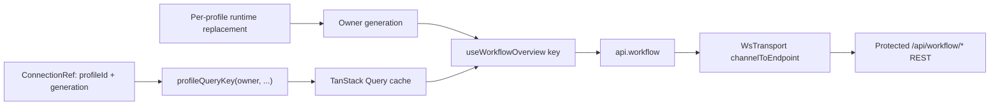

`workflow-dto-types.ts` mirrors camelCase response/request shapes and uses
closed unions for item kind/status, session status, resource type/observed
state, provenance, and event type. Optional fields retain server distinctions
such as omitted versus `null` timestamps or targets. `workflow-domain-helpers.ts`
contains pure Plan-first parent validation, status/attention predicates,
factual tracked-Task progress, timestamp/interval checks, elapsed formatting,
and deterministic item ordering. `workflow-types.ts` re-exports both modules.

`client.ts` exposes a thin `api.workflow` facade for overview, event pages,
item CRUD, session start/end/abandon, resource link/unlink, note create/delete,
and history purge. Each method delegates a typed response through the active
`Transport`; it does not know whether the host is web, native, or idle.

`WsTransport` maps 13 stable workflow channel names to protected REST methods.
It URL-encodes item/session/note identifiers and event cursors, removes path
identifiers from JSON bodies, preserves request timestamps, sends profile-bound
auth through the normal `invoke` path, and converts non-2xx responses to
`ApiRequestError`. Workflow calls use REST; the same class's persistent
WebSocket remains the terminal and push-event channel.

Profile-qualified query keys use the owner/generation builders in
`packages/ui/src/api/query-client.ts`; the host `QueryClient` does not install a
profile-dependent global hash. `useWorkflowOverview` includes the owning
profile generation in its key, so equal workflow keys from different profiles
cannot collide. Replacing one profile runtime advances only that owner's
generation; an old response can settle only its old owner key. Events use the
same owner-qualified root with normalized cursor/limit values.

Overview/events hooks preserve prior observer data while refetching, use no
polling interval, and support explicit `enabled` control. Mutation wrappers
invalidate `['workflow']` only after success; failures leave cached authority
and typed errors intact. Workflow server state is memory-only. Component-local
selection/filter/draft/focus/elapsed-clock state does not enter URL search
params, localStorage, terminal registries, or Zustand stores.

See [Workflow Client State](./workflow-client-state.md) for the DTO field
catalog, operation table, hook list, and Phase 04 verification. The server
contract remains in [Workflow API](./workflow-api.md).

### Workflow Context Surface (UI Phase 05)

The shared React package adds a responsive workflow context surface above the
Phase 04 query boundary. `WorkflowContextSurface` requests one target-scoped
overview, derives display state with pure selectors, and renders the same
workflow information through an ambient ribbon plus either a desktop deck or a
mobile sheet. Browser and native hosts reuse these components; neither host
owns a second workflow store.

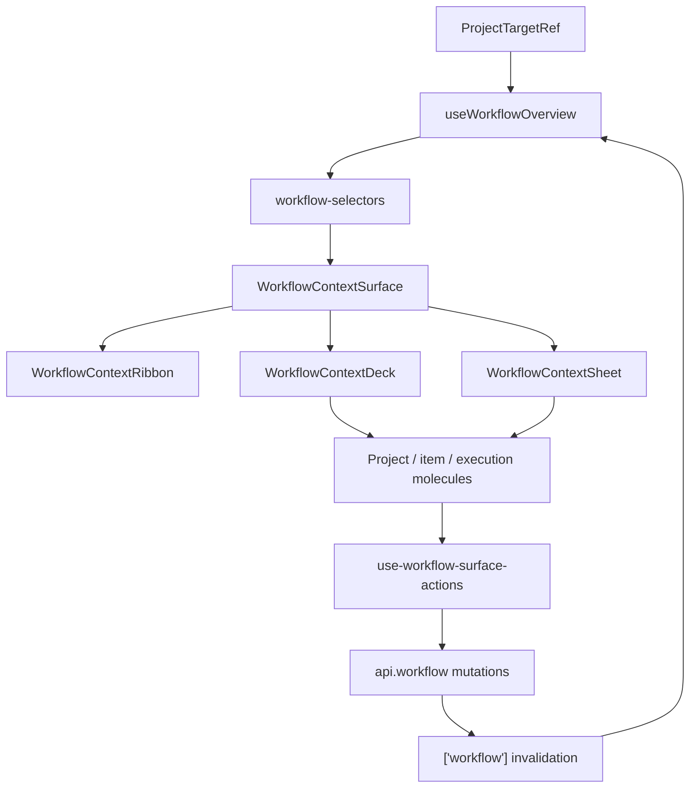

The selector boundary keeps target behavior deterministic: project must match,
and an explicit `worktreePath` must match exactly. Active selection considers
running sessions on a root Plan or standalone Task and its descendants before
falling back to status priority and newest update time. Item trees flatten in
pre-order for lookup, while progress labels expose only factual tracked and
completed Task counts. The backend overview remains authoritative and bounded;
the UI does not infer missing child items.

**Component responsibilities:**

| Component                                       | Architectural role                                                                                                                                            |
| ----------------------------------------------- | ------------------------------------------------------------------------------------------------------------------------------------------------------------- |
| `WorkflowContextRibbon`                         | `h-9` ambient `region`; target label, active item, status, elapsed duration, latest note/progress, loading/error/retry, and polite live text.                 |
| `WorkflowContextDeck`                           | Open-only non-modal desktop `region`; `320px` minimum, `360px` base, `440px` maximum; two columns at `md`, and `220px / flexible / 300px` panes at `lg`.      |
| `WorkflowContextSheet`                          | Bottom Dialog for compact layouts; Projects, Plans & Work, and Execution segments; safe-area padding; current heights `35dvh` collapsed and `90dvh` expanded. |
| `WorkflowProjectList`                           | Exact target selection plus plan, task, and running-session counts.                                                                                           |
| `WorkflowItemList` / `WorkflowItemRow`          | Plan-rooted recursive tree, standalone Tasks, selection, status presentation, active-session marker, and note/progress copy.                                  |
| `WorkflowSelectedItemBar`                       | Selected-item status/session/child actions, note drafting, ordered note display/deletion, item deletion, and edit entry point.                                |
| `WorkflowSelectedItemEditForm`                  | Local title/summary drafts, normalization, keyboard shortcuts, and Save/Cancel presentation.                                                                  |
| `WorkflowSelectedItemNotesList`                 | Bounded independently scrollable note detail with semantic timestamps and note-scoped deletion.                                                               |
| `WorkflowQuickCapture`                          | Required title with Plan default; optional Phase/Task parent, summary, status, and immediate-session request.                                                 |
| `WorkflowExecutionList` / `WorkflowSessionCard` | Explicit start/end timestamps, Now actions, elapsed duration, abandon, observed links, and manual Agent Harness/Agent Run metadata.                           |

The surface owns only presentation state: open state, selected target/item,
quick-capture drafts, mobile segment, and a single one-second elapsed timer
while a running session is reported and the document is visible. React Query
owns the overview and mutation state. No workflow presentation state is
persisted in URL parameters, `localStorage`, terminal registries, or Zustand.

`workflow-focus.ts` accepts `Mod+Shift+KeyW` only when the event and active
element are not native editable controls, contenteditable, Monaco, xterm,
dialogs, or explicitly suppressed/native-input surfaces. The desktop deck
closes on Escape without a focus trap; the mobile sheet uses Dialog focus
semantics. The focus helper restores a connected element defensively.

`use-workflow-surface-actions.ts` maps UI actions to typed workflow mutations,
generates a UUID `requestId` per request, preserves the selected target, and
uses current ISO timestamps for status/session writes. Item edits pass the
selected item's current `updatedAt`; note deletion passes the note's current
`updatedAt`. Observed resource `suggestedEndTime` values only prefill a draft
after an explicit user action; observation never changes manual workflow-session
status or timestamps. Creating an item with immediate start creates the
follow-up session with the current time.

The focused Phase 05 report records 62/62 targeted UI/workflow tests, with
1,493/1,493 full UI tests and 907/907 Rust tests (two ignored). Those tests do
not qualify browser geometry, safe-area/touch behavior, focus continuity, or
real host integration. Resource-attention fields from `selectAttentionSummary`
remain false/zero; selected-item note and edit controls are now rendered by
`WorkflowSelectedItemBar` and its focused molecules.

### WorkspacePage and shell integration (UI Phase 06)

`WorkspacePage` is the frontend composition boundary for workflow-to-workspace
navigation. It builds one memoized `workflowToolbarActions` node containing
`WorkflowContextSurface`, then passes it through the existing `toolbarActions`
slot on `IdeShell`, `TerminalWorkspaceShell`, and `MobileWorkspaceShell`.
Desktop shells render a 40px companion row above their existing content;
`MobileWorkspaceShell` renders the action in its safe-area-aware inline row.
The workflow surface is not a route, activity-bar tool, mobile surface, TopNav
item, or second terminal lifecycle.

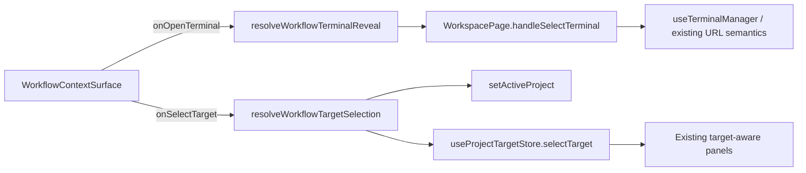

`workflow-workspace-integration.ts` is pure integration policy.
`deriveWorkflowTerminalCandidates` merges stable IDs from `sessionMap` and
`mountedSessions`, retains project/worktree/alive/incarnation observations, and
marks unavailable targets without carrying command, CWD, or terminal output.
`resolveWorkflowTerminalReveal` fails closed for blank, profile-mismatched, or
unknown sessions, returns a compact Terminal-surface request only when needed,
and leaves actual selection to `handleSelectTerminal`.
`resolveWorkflowTargetSelection` requires a configured project and available
worktree before the existing workspace and target stores are updated.

`onOpenTerminal` is drilled from `WorkflowContextSurface` through
`WorkflowContextDeck` / `WorkflowContextSheet`, `WorkflowExecutionList`, and
`WorkflowSessionCard`; `onSelectTarget` flows through the surface, deck/sheet,
and `WorkflowProjectList`. The card invokes terminal reveal only on an explicit
linked-terminal click.
Terminal observations and suggested end times remain read-only; manual workflow
session mutations still require explicit user input.

The `WorkflowContextSurface` instance is keyed by `activeProfileId`. A profile
switch therefore resets only workflow presentation (open state, selection,
mobile segment, quick-capture drafts, and elapsed clock) while leaving terminal
buffers, editor state, mounted sessions, and Browser keep-alive outside the key
boundary. No new URL/search parameter or duplicate project/target store is
introduced.

Phase 06 verification: targeted UI tests 62/62, full UI suite 1,515/1,515,
relevant Chromium smoke 8/8, Rust tests 907/907 executed (2 ignored), and UI
TypeScript compilation passed. Full browser geometry/touch/safe-area/focus and
host-integration qualification remain Phase 07 work.

### Persist Worker (Phase 05)

**Purpose**: Async worker thread that batches terminal session buffers and persists them to SQLite while bounding PTY snapshot memory use.

**Architecture:**

- **Dedicated thread**: `persist-worker` (std::thread, not tokio)
- **Snapshot delivery**: PTY readers use non-blocking `try_send()` for periodic buffer snapshots; a full queue drops only that best-effort update
- **Lifecycle delivery**: create, exit, removal, and shutdown commands use ordered `send()` calls; final buffer persistence falls back to the store if the worker is disconnected
- **Bounded channel**: sync_channel(256) prevents unbounded memory growth
- **Batching**: HashMap deduplication (only latest buffer per session written)
- **Throttling**: 16KB snapshots (prevents 256MB/sec → 16MB/sec memory churn reduction)

**Worker Commands (PersistCmd enum):**

| Command          | Source            | Trigger             | Behavior                                 |
| ---------------- | ----------------- | ------------------- | ---------------------------------------- |
| `BufferUpdate`   | PTY reader        | Every 16KB output   | Batches per session, overwrites previous |
| `SessionCreated` | PtySessionManager | On spawn            | Records metadata to SQLite               |
| `SessionExited`  | PTY reader        | On EOF              | Immediate flush (no 5s wait)             |
| `SessionRemoved` | PtySessionManager | On kill             | Deletes from database                    |
| `Shutdown`       | main.rs           | After readers drain | Final flush and exit                     |

**Main Loop** (`PersistWorker::run()`):

1. `recv_timeout(1s)` with periodic 5s flush timer
2. On command: batch into HashMap, update database
3. On timeout: flush all pending buffers to SQLite
4. On channel disconnect: call `flush_all()` and exit

**Graceful Shutdown:**

1. Server receives SIGTERM
2. PTY manager snapshots live buffers, stops producers, and waits for readers
3. main.rs sends `PersistCmd::Shutdown`
4. Worker flushes its pending buffers and exits
5. main.rs joins the worker thread

**Performance Characteristics:**

| Metric             | Value                  | Improvement                 |
| ------------------ | ---------------------- | --------------------------- |
| Snapshot frequency | ~6/sec (16KB throttle) | 94% reduction vs every-read |
| Memory churn       | 16MB/sec               | 16× reduction vs 256MB/sec  |
| Worker CPU         | <1%                    | Minimal overhead            |
| Non-blocking sends | 100%                   | PTY never waits on DB       |

**Integration Points:**

1. **PtySessionManager** — holds `Option<SyncSender<PersistCmd>>`
   - `create()` sends SessionCreated
   - `kill()` sends SessionRemoved
   - Reader thread sends throttled, best-effort BufferUpdate snapshots
   - Reader thread sends a final buffer snapshot and SessionExited before it exits

2. **main.rs** — manages worker lifecycle
   - Spawns worker thread on startup (if enabled)
   - Holds persist_tx and explicitly sends Shutdown after reader drain
   - Joins the worker after its final flush before process exit

3. **SessionStore** — shared via Arc<Mutex>
   - Worker calls save_session, save_buffer, delete_session
   - Periodic PTY snapshots do not block on persistence; lifecycle transitions may wait for bounded queue capacity

**Use Cases:**

- Server restart recovery: restore active sessions + their scrollback on reboot
- Long-running tasks: preserve build/run output across server updates
- Debug experience: buffer history available immediately without re-running commands

### fs/ (Phase 01+: IDE File Explorer + Editor)

**error.rs** — `FsError` enum (Unavailable, NotFound, PermissionDenied, TooLarge, Conflict).

- `Conflict` variant (Phase 04): raised when write rejected due to mtime mismatch.

**sandbox.rs** — `ProjectSandbox` validates paths against per-configured project roots.

- HashMap<project_name, canonical_root> initialized at startup + workspace switch
- Cheap clone; canonicalization done at init time
- Never held across `.await`
- Planned worktree targets extend validation to an authorized
  `(project_name, canonical_target_root)` pair without allowing arbitrary paths

**ops.rs** — Filesystem operations:

- `list_dir()` — directory contents with metadata
- `read_file()` — text/binary detection, range reads (max 100MB, Phase 04: capped at 10MB per REST call, unlimited via WS)
- `stat()` — file metadata (kind, size, mtime, mime, isBinary)
- `detect_binary()` — heuristic detection
- `atomic_write_with_check()` (Phase 04) — mtime-guarded atomic write via tempfile + rename
- `search()` (Phase 07) — .gitignore-aware text search using `ignore` crate; returns file + match context; results capped at 1000

**Phase 2 delayed-write hardening (Unix/Linux):** The WebSocket write protocol and
chunked uploads keep their temporary file in the target filesystem, verify the
declared byte count, and revalidate the authorized project/worktree target at
commit. On Unix/Linux, the final commit is target-relative: parent directories
are opened with no-symlink-following flags, the target root identity captured at
begin is checked again, the expected file mtime is checked with the opened
directory, and the temporary file is atomically renamed through that directory
handle. This prevents a delayed commit from resolving a replaced path tree
against a different filesystem object while the operation was in flight.

The accepted scope for this phase is Unix/Linux handle-anchored,
target-relative commits. Windows retains a path-based fallback: it rechecks the
target-root identity and expected mtime before persisting the temporary file,
but cannot provide the same handle-anchored rename guarantee. That Windows race
window is known and explicitly out of scope for Phase 2; it must not be
described as equivalent to the Unix/Linux guarantee.

**mod.rs** — `FsSubsystem` (Arc<Mutex<Inner>>):

- Lazy init: ProjectSandbox stored as Option (Unavailable if init failed)
- Seeded/reinitialized from config projects on startup and workspace switch
- Cheap clone pattern

### Explorer HTML preview (Phases 01–03)

HTML preview is a shared-UI concern; it does not add a server route, static file
origin, or alternate filesystem authority. `EditorTabs` checks `isHtmlFile` and
lazy-loads `HtmlHost` before the generic Monaco fallback. `HtmlHost` preserves
normal editor callbacks and view state while selecting one of three layouts:

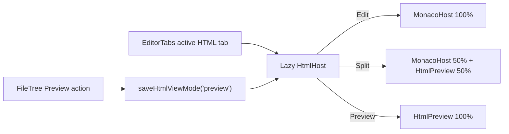

`HtmlPreview` sends the latest editor buffer to one iframe after a 200 ms
debounce and exposes a reload action. The iframe sandbox is exactly
`sandbox="allow-scripts allow-modals allow-forms allow-popups allow-pointer-lock"`;
`allow-same-origin` is intentionally absent, so workspace markup runs with an
opaque `null` origin and cannot read parent cookies or storage. The transform
injects only an in-memory `localStorage`/`sessionStorage` fallback and an
in-frame `window.alert()` modal for this sandbox environment.

`html-view-mode-persistence.ts` stores `"edit" | "split" | "preview"` under
`dam-hopper:html-view-mode:v1`, defaults to `"edit"` on invalid/unavailable
storage, and emits `dam-hopper:html-view-mode-changed` so mounted tabs update
without a remount. `FileTree` offers the `Eye`/`Preview` action only for live
HTML files below 5 MiB; the action sets preview mode then opens the existing tab.
Directories, language-scan rows, non-HTML files, and oversized files do not enter
this path. Relative multi-file asset resolution and backend static serving remain
out of scope.

### Explorer video playback and download (Unified workbench Phase 07)

Phase 07 delivers the authenticated, purpose-bound media-ticket boundary for
the unified profile workbench. Each issue, revoke, and media-session logout
request carries a required UUIDv4 `mediaClientId`. The server namespaces the
HTTP-compatible `HttpOnly; SameSite=Lax; Path=/api/fs` cookie as
`damhopper-media-session-<canonical-uuidv4>` without `Secure`; auth cookies
remain `HttpOnly; SameSite=Strict`.

The browser-host `VideoPreview` integration uses one direct native element,
credentialed `HEAD` before source exposure, `crossOrigin="use-credentials"`,
and a separate capability for playback or download. Media issue responses
declare `authorizationMode: "session-cookie-v2"`. The client does not expose
the HttpOnly cookie to JavaScript, does not read media into a Blob/object URL,
and keeps exact-origin ticket-only fallback separate from same-origin cookie
authorization. The old fixed v1 cookie name is ignored; duplicate selected
cookies fail closed. Cleartext HTTP can still intercept credentials, ticket
URLs, actions, and media bytes. Other browser engines and packaged
Tauri/WebView behavior remain unqualified.
Browser routing recognizes only the final, case-insensitive extensions `mp4`,
`m4v`, `webm`, `ogv`, `ogg`, and `mov` (an extension/MIME hint, not codec proof);
diff tabs retain their dedicated viewer.

The shipped server-side sequence is:

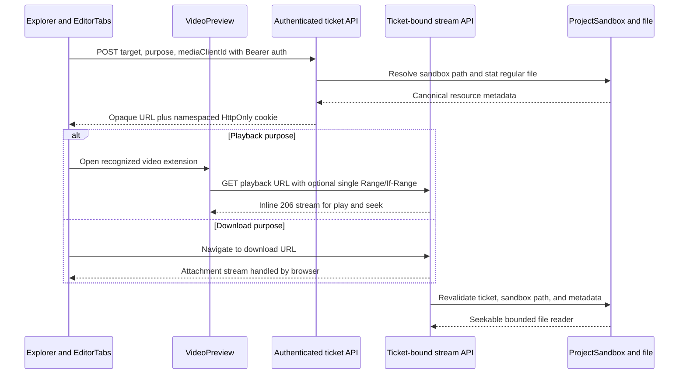

`POST /api/fs/video/tickets` stays behind normal authentication. It accepts a
configured project, optional worktree path, closed `playback | download`
purpose, and required UUIDv4 `mediaClientId`. It resolves through the existing
`ProjectSandbox`, verifies a regular video candidate, and returns an opaque
ticket plus `authorizationMode: "session-cookie-v2"`. `DELETE
/api/fs/video/tickets` accepts the ticket and `mediaClientId` and revokes only a
matching actor/client binding. The in-memory store prunes expired entries and
binds each ticket to one resource, immutable purpose, issuance metadata,
actor, client namespace, session digest, and incarnation. Tickets are never
persisted into editor state, browser storage, diagnostics, or logs.

Ticket idle expiry is 15 minutes; media-session idle expiry is 30 minutes; both
have an eight-hour absolute expiry. Stream authorization derives the exact
cookie name from the stored ticket binding:
`damhopper-media-session-<canonical-uuidv4>`. A duplicate selected cookie fails
closed. A missing cookie is accepted only for the exact configured origin's
ticket-only fallback; absent/untrusted origins and foreign namespaces return
indistinguishable `404` responses. Idle TTL refreshes only after a fully
validated stream response or ticket issuance, never past the absolute deadline.
`DELETE /api/fs/media-session` accepts `{ "mediaClientId": "..." }`, requires
Bearer authentication, and clears/revokes only that actor/client namespace.
Ticket-specific image/video DELETEs likewise require Bearer authentication and
the matching client ID.
Workspace reinitialization and configuration changes revoke all tickets and
advance the generation, preventing issuance across a changed context. Session and
ticket state is process-local; multi-instance deployments require sticky routing
to the issuing process until a shared store exists. Restart revokes all media state.

During profile credential replacement, logout, removal, and stale preview
teardown, the browser invokes a captured `RemoteCleanupHandle` with a
five-second bound. The handle retains the original owner, endpoint,
credentials, ticket, and `mediaClientId`; it cannot be retargeted by a profile
switch. An unreachable server falls back to bounded server-side expiry. If
remote revocation succeeds but local token persistence/removal fails, the
remote session remains revoked intentionally; a retained/restored login must
issue fresh media before streaming.

`GET|HEAD /api/fs/video/stream/{ticket}` is authorized by the bound ticket and
the cookie namespace selected from its stored `mediaClientId`, not by a
long-lived credential or caller-selected namespace in the URL. A duplicate
selected cookie fails closed. Every request revalidates the sandbox path and
file identity (size, mtime, and platform identity) before opening the file;
drift revokes the ticket and returns `410 Gone`. Exact-origin requests may use
ticket-only fallback; absent or untrusted origins cannot. `GET` supports no
range (`200`) or exactly one checked byte range (`206`, exact
`Content-Length` and `Content-Range`). Unsatisfiable, malformed, or
multi-range requests return `416` with `Content-Range: bytes */size`.
`HEAD` returns representation metadata without reading the body and ignores
range selection. `If-Range` is honored only when its single ETag or HTTP-date
validator matches; otherwise the request safely falls back to full `200`.

Responses set `Accept-Ranges: bytes`, the detected media `Content-Type`, `ETag`,
`Last-Modified`, and `Cache-Control: private, no-store`. Disposition comes only
from the stored purpose: `inline` for playback or a sanitized RFC 5987 `attachment`
filename for download. The client cannot upgrade a playback ticket into a download
ticket. Bodies use an async reader bounded to 128 KiB with Hyper backpressure;
client disconnect drops the body and file without a detached producer, and no
filesystem or ticket-store lock is held while streaming.

The backend emits credentialed CORS and preflight headers only for exact
configured origins. Browser media playback requires an authenticated ticket;
the ticket remains bound to the issuing actor and client namespace and is
revoked with that pair. Cleartext interception or modification remains a
deployment risk.

The browser host routes recognized video extensions to `VideoPreview` before
generic binary or large-text tiering. The player captures its profile
generation and `mediaClientId`, requests a fresh playback ticket on mount, and
uses one native `<video controls preload="metadata" playsInline>` element
with `crossOrigin="use-credentials"`. Teardown pauses, removes `src`, calls
`load()` to cancel the native request, and then invokes the captured cleanup
handle. Download actions request a separate download ticket and activate a
temporary anchor so browser download handling consumes the stream directly
without `fetch().blob()`; the ticket is not revoked immediately after the
click because the browser owns that download lifecycle. Playback and download
can run concurrently and expire or revoke independently. Extension and MIME
are routing hints only; codec failure becomes an actionable unsupported-media
state. Other browser engines and packaged Tauri/WebView behavior remain
unqualified.

Key invariants:

- Workspace sandbox and authentication checks happen before any file bytes leave.
- Browser URLs never contain the profile JWT, username, absolute path, or raw file content.
- Memory remains proportional to stream chunk size and active streams, never file size.
- One ticket selects one resource and one purpose; it cannot enumerate projects,
  change paths, or switch between inline and attachment behavior.
- Playback never depends on download completion; each action owns a separate ticket
  and response stream over the same validated file.
- File replacement or metadata drift invalidates the prior ticket/range sequence.
- Unsupported containers/codecs fail visibly; media never falls back to Bearer URLs
  or a 1–3 GB Blob read.

### Explorer native image preview (Unified workbench Phase 07)

Image preview uses the same bounded, namespaced media-ticket core as video
while keeping a separate public adapter and contract. The server exposes
`POST|DELETE /api/fs/image/tickets` and
`GET|HEAD /api/fs/image/stream/{ticket}`. Image issue/revoke bodies include the
required `mediaClientId`; issuance accepts only final, case-insensitive `png`,
`jpg`, `jpeg`, `gif`, and `webp` extensions and always binds the capability to
the fixed `preview` purpose. SVG, AVIF, BMP, TIFF, dotfiles, directories,
symlink components, FIFOs, and traversal paths remain outside the preview
surface.

The browser flow is owner and cookie-namespace bound:

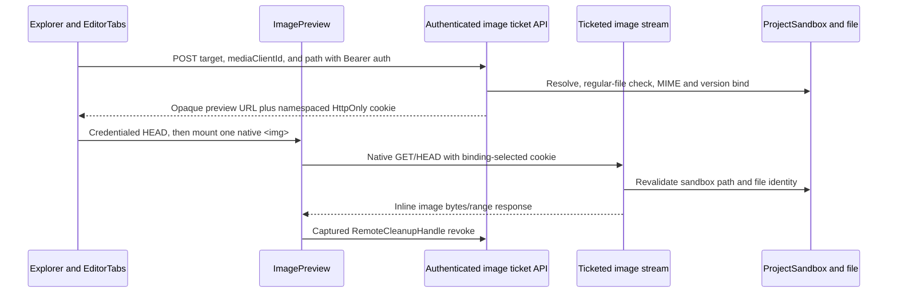

`ImagePreview` assigns the opaque URL directly to one native `` and
relies on browser decoding. It never calls `fsRead`, buffers a response,
creates a `Blob`, creates an object URL, uses a canvas transform, or exposes a
download action. Loading, ready, generic error, retry, stale-generation,
profile-change, and unmount cleanup are explicit lifecycle states; cleanup
removes `src` before invoking the captured handle. The `alt` contract is
`Image preview: {fileName}`.

The editor assigns an `image` tier before binary/large classification, including
large or binary-hinted allowlisted images. Open, hydration, save, force-overwrite,
reload, and Git reconciliation paths treat image tabs as preview-only and never
materialize bytes. Diff tabs retain their dedicated viewer and video routing
continues to take precedence. The shared store keeps idle/absolute expiry,
generation invalidation, stale-file `410`, range/HEAD,
revalidation and private no-store response invariants used by video.

### git/

Git operations and repository discovery helpers.

**types.rs** — shared API types for git surfaces.

- `VcsRoot` — root descriptor returned by `/api/git/{project}/roots`
- `VcsRootKind` — `Primary`, `Submodule`, or `NestedRepo`
- `VcsRootMappingState` — `Mapped`, `Unmapped`, `Missing`, or `Uninitialized`
- `SubmoduleGitlinkInfo` — gitlink path, object id, optional module name, optional URL

**vcs_roots.rs** — discovery and resolution helpers.

- `discover_vcs_roots(project_path)` scans the primary repo, gitlinks, `.gitmodules`, and nested repos.
- `resolve_vcs_root(project_path, root_id)` validates root ids, blocks traversal, and returns the canonical path for a usable VCS root.
- `resolve_git_request_root(project_path, requested_root)` and `resolve_git_path_root(...)` normalize root-scoped API requests so branch, diff, staging, and history actions stay inside one VCS root.
- `staged_vcs_root_ids(project_path)` reports which discovered roots currently have staged changes.
- Primary root accumulates warnings when `.gitmodules` is invalid or gitlink state is inconsistent.

Root discovery treats `.gitmodules` as optional metadata. The index gitlink is
the source of truth for submodule rows, and a child `.git` marker promotes that
path to an actionable VCS root. This keeps parent gitlink state separate from
child repository file state: parent diffs can show `modules/child` as a
submodule entry while root-scoped child diffs show `README.md`, `src/*`, and
other child-local paths.

### Web Frontend Shared File Decorations

**Location:** `packages/ui/src/lib/`

- `file-decoration.ts` is the single lookup table for file icons, badge text, display language, and Monaco language.
- Lookup order: exact filename > extension > MIME fallback > neutral default.
- `file-decoration-icon.tsx` is a thin rendering wrapper around the shared registry.
- `mime-to-language.ts` remains as a compatibility wrapper for MIME-only callers.
- Shared consumers include the file tree, editor tabs, search headers, and path labels, so file identity stays consistent across the IDE.

**Design notes:**

- Exact-name matches cover dotfiles and toolchain files like `.env`, `.gitignore`, `Dockerfile`, `Makefile`, and lockfiles.
- Registry returns safe defaults for unknown files, no throw path.
- UI components should consume the shared helpers instead of re-implementing filename parsing.

### Explorer language filter (Phase 02 shipped)

The Explorer language filter uses a user-triggered, project-root scan rather than
recursively expanding the lazy filesystem tree. An authenticated one-shot endpoint
resolves the selected project through the existing filesystem sandbox, walks regular
files with the shared `ignore::WalkBuilder` policy, and returns bounded project-relative
metadata for Rust, combined JavaScript/TypeScript, and Java files.

- The scan honors Git ignore sources, includes hidden paths so the existing
  `explorerShowHidden` preference can control presentation, excludes symlinks, does
  not follow directory links, and returns normalized relative paths only.
- Results are capped and expose `truncated`; they are stored only in the typed TanStack
  Query project cache `['explorer-language-scan', project]`, whose metadata includes the
  result, generation, stale flag, and last completed scan timestamp. `Scan`/`Rescan` is
  always explicit. Filesystem events increment the project generation and mark the cached
  result stale without triggering a background scan. A response finishing after such an
  event remains usable but stale; a failed rescan preserves the prior result. Workspace
  changes remove all language-scan cache entries.
- The selected `All | Rust | JS/TS | Java` filter is a global UI preference persisted
  through the existing global-config/settings path. Scan results, stale state, and
  expanded scan-tree folders are not persisted.
- The Explorer consumes the cache to build a complete, sorted, navigation-only
  synthetic hierarchy for the selected language. `All` remains the live lazy
  filesystem tree; synthetic rows are not mutation targets, so create, rename,
  delete, upload, and related filesystem actions are disabled while filtered.
- The header presents explicit `Scan`/`Rescan` controls and reports last-scan,
  stale, in-progress, truncation, error, and empty-result states. Committed
  results carry a monotonic `resultVersion` (including same-generation rescans)
  so rendering follows the latest committed snapshot rather than an obsolete
  tree projection.
- Reveal/selection requests switch a filtered view to `All` when necessary, then
  wait for the live tree's committed render after each lazy-child load before
  opening ancestors and focusing the target. Completion is recorded only after
  successful reveal, and a request nonce permits a later retry.

The first version is extension-based and limited to `.rs`, `.js`, `.jsx`, `.ts`,
`.tsx`, and `.java`. It does not provide parser/LSP semantics, symbols/references,
automatic rescans, persistent indexes, streaming progress, or caller-configurable
language families.

### Semantic code navigation (planned)

Semantic navigation is an editor capability separate from the Explorer language
filter. Monaco exposes Go to Definition, Go to Implementation, Find References,
modifier-click, and keyboard/context-menu actions through registered language
providers. A typed client adapter sends project-relative document and navigation
messages over a dedicated authenticated WebSocket. The backend translates those
messages to standard LSP JSON-RPC over stdio for an allowlisted language server.
V1 targets `rust-analyzer`, `typescript-language-server`, and Eclipse JDT LS; the
registry stays generic so later languages add descriptors rather than UI forks.

DamHopper does not embed a VS Code workbench or general extension host for this
feature. VS Code language extensions ultimately use the same language-server
processes, while an extension host would add incompatible contribution APIs,
Node/browser runtime assumptions, marketplace installation, and a broader code
execution boundary. A real extension host remains a separate future product
decision, not a prerequisite for semantic navigation.

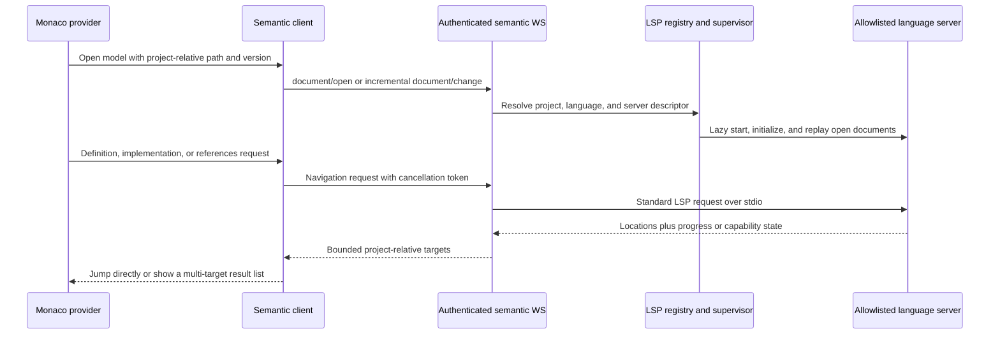

The supervisor reuses one process per authenticated client, configured project,
and server descriptor. Opening the first supported Monaco model may prewarm that
server, but no workspace-wide language scan or server fan-out occurs. Interactive
requests have bounded queues and deadlines; superseded requests propagate
`$/cancelRequest`, and late responses are discarded by document/request version.
After an inactivity grace period, warm processes become LRU eviction candidates
even if tabs remain open. A later request restarts the process and replays current
open document snapshots. Per-client and global process limits prevent a workspace
with many languages from starting every server at once.

The browser never selects an executable, arguments, root URI, or absolute path.
Server descriptors are built in or loaded only from trusted global configuration;
commands are spawned without a shell and with a sanitized environment. Every
incoming project/path is resolved through `ProjectSandbox`. LSP `file://` URIs and
host paths stay behind the backend adapter, which returns only normalized
project-relative targets and bounded display metadata.

Key invariants:

- Semantic navigation starts on supported editor demand; Explorer scans and
  filesystem events never start a language server.
- One language-server failure degrades only that project/language and never blocks
  file editing, terminal I/O, saving, or other WebSocket traffic.
- Unsaved Monaco content is synchronized by version and is never persisted by the
  semantic transport; reconnect/restart replays only currently open documents.
- Warm navigation latency, cold-start/indexing time, queue wait, cancellation,
  process RSS/CPU, crashes, and evictions are measured without logging source text
  or absolute paths.
- Missing binaries and unsupported capabilities produce explicit setup/degraded
  states; the server never downloads or executes a project-supplied language tool.

### Multi-Server Profile Management (Phase 02)

Profile metadata and endpoint-bound credentials remain client-side, while
connections are keyed runtime state:

- `packages/ui/src/api/server-config.ts` defines `ServerProfile` with `id`,
  `name`, normalized `url`, `authType`, optional `username`, `createdAt`, and
  `autoConnect`.
- `ProfileAuthV2` stores `{version: 2, serverUrl, authType, token}` under
  `damhopper_profile_auth_v2_<profileId>`. Reads require a profile ID and
  reject URL/auth-type mismatches.
- `readServerProfiles()` distinguishes unavailable storage from an empty list.
  Legacy records without `autoConnect` migrate to `true`; explicit `false`
  survives.
- `connections.ts` owns `connectProfile`, `disconnectProfile`, and
  `removeProfileConnection`. Each snapshot has an owner
  `{ profileId, generation }`, intent, endpoint, status, and redacted error.
  Statuses are `disconnected`, `connecting`, `connected`, `login-required`,
  `offline`, and `unsupported`.

**Shared UI:**

- `ServerProfilesDialog.tsx` subscribes to profile and connection changes and
  exposes Connect, Disconnect, Login, Logout, Edit, Remove, and Auto-connect
  per row.
- `ServerSettingsDialog.tsx` edits one profile, revokes/clears old endpoint
  credentials during endpoint transitions, and embeds `WorkspaceSwitcher`
  under Server configuration.
- `ProjectSwitcher.tsx` aggregates successful per-profile project queries,
  groups them as `Profile → Project`, and uses JSON tuple keys.
- `TopNavConnectionButton.tsx` summarizes all runtimes; it does not select a
  singleton transport.
- `workspace.ts` persists qualified `selectedProject`; `workbench-selections.ts`
  keeps preferences, Settings, and Browser Debug profile IDs independent.
- `fresh-state-reset.ts` removes allowlisted legacy resource state once,
  preserves profiles/auth/native/server data, and rejects unqualified links.

**Host integration and persistence:**

- `DamHopperApp` mounts the shell before profile health settles and starts each
  supported auto-connect profile independently. Focus/navigation does not
  mutate connection intent.
- Web and native entrypoints each create one ordinary `QueryClient` and render
  once. Browser and Windows native hosts may use approved cross-origin
  profiles; non-Windows native hosts require exact same-origin profiles.
- `damhopper_server_profiles` stores profile metadata; the legacy
  `damhopper_active_profile_id` is compatibility/default endpoint input, not a
  runtime owner. Auth v2 records are per profile. Query and connection state
  remains memory-only and owner/generation-qualified.

### SSH Credential Persistence (Phase 02)

SSH passphrases are session-only by default. Save-for-later uses the host OS credential store on Linux, not app config or browser storage.

**Server behavior:**

- `SshCredStore` keeps the active key path plus passphrase in memory.
- In-memory passphrase bytes use `Zeroizing<Vec<u8>>` and are cleared on drop.
- `POST /api/ssh/keys/load` accepts `saveForLater`.
- `POST /api/ssh/keys/load` validates the key before any persistence attempt, so wrong passphrases never overwrite saved credentials.
- `saved=true` means a stored credential is available after the request, not necessarily that the current request created it.
- `GET /api/ssh/credentials` returns metadata only: `saved`, `keyPath`, `error`.
- `DELETE /api/ssh/credentials` forgets the saved entry and clears the current session credential if it matches.

**Persistence behavior:**

- Saved passphrases use `secret-tool` on Linux.
- Stored key scope is derived from workspace path + SSH key path + public-key fingerprint when available.
- No plaintext passphrase is written to app config, localStorage, or logs.
- API responses never include secret material, only status metadata.

**Trust boundary:**

- OS keyring gives encrypted-at-rest protection against disk disclosure.
- It does not protect against a compromised same-user process or DamHopper itself while running.
- If keyring support is unavailable, save-for-later falls back to session-only use with an error.
- The frontend retry hook performs only one automatic retry after a successful key load and does not keep a long-lived success cache, so later SSH auth failures can reopen the prompt instead of being masked by stale session state.

### SSH port-forwarding control (Phase 08; implemented 2026-09-17)

Phase 08 makes native SSH forwarding a concurrent, profile-qualified desktop
capability. The shared React UI talks to `SshForwardHost`; only
`apps/native` supplies a Tauri implementation. Rust in
`apps/native/src-tauri/src/ssh_forward` owns SSH protocol, loopback listeners,
profile/rule/trust persistence, credentials, scope lifecycle, event hints, and
shutdown. The Axum server has no forwarding CRUD route, forwarding manager, or
forwarding WebSocket authority.

SSH forwarding is Windows desktop-only. The browser and native mobile hosts
receive no forwarding host or insecure fallback. Native Browser Debug is a
separate child-WebView capability; it consumes the explicit Browser target
owner from Phase 05 and does not select an SSH scope.

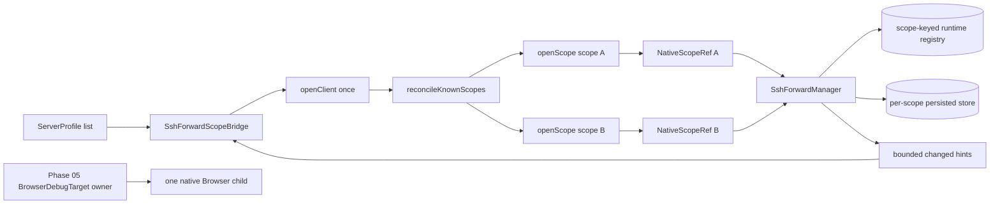

#### Scope lifecycle and identity

The shared and Rust contracts use these lifecycle values:

```typescript
interface NativeScopeRef {
  context: DesktopClientContext;
  scopeId: string;
  scopeGeneration: WireCounter;
  activationToken: WireCounter;
}

interface ScopeHandle {
  ref: NativeScopeRef;
  snapshot: SshForwardSnapshot;
}

openClient(knownScopes): Promise<{ context: DesktopClientContext }>;
openScope(scopeId): Promise<ScopeHandle>;
closeScope(scope: NativeScopeRef): Promise<void>;
reconcileKnownScopes(knownScopes): Promise<void>;
```

- `openClient` issues a new client epoch and is the only global reset boundary.
  It stops all scopes, workers, connections, listeners, runtimes, and live
  credentials; stale references and events fail context checks. It sweeps
  expired vault entries, then reconciles persisted scope metadata before
  returning the new context.
- `openScope` validates the global client context, loads one scope, acquires its
  activity lease, installs its persisted state, starts configured auto-start
  connections, and returns a `ScopeHandle`. A concurrent or repeated open of an
  active scope is serialized and returns the existing scope generation.
- `closeScope` validates the complete reference, removes the scope and token
  from live admission before teardown, then stops only that scope's workers and
  connections, clears live keys/passwords and host-key challenges, and releases
  its activity lease.
- `reconcileKnownScopes` validates only the global context and updates retention
  metadata. It does not open/close scopes, change scope generations, or advance
  the client epoch.
- `purgeScope` is an inactive retention operation. Profile deletion must first
  observe that the profile is absent and that known-scope storage is available.

All snapshot, profile, rule, connection, credential, and trust operations carry
the `NativeScopeRef`. Its `DesktopClientContext` binds `desktopInstanceId`,
`managerSessionId`, and `clientEpoch`; the reference also binds `scopeId`,
`scopeGeneration`, and `activationToken`. Rust and TypeScript parse canonical
unsigned decimal strings numerically. Lexical comparison is prohibited; checked
overflow returns `COUNTER_EXHAUSTED`.

#### Concurrent runtime model

`SshForwardManager` owns `HashMap<scopeId, ActiveScope>`. The native
`ConnectionRegistry` uses `(scopeId, connectionProfileId)` keys and stores
forwarding children beneath each connection. Equal imported connection/rule IDs
in different server profiles therefore remain independent.

Scope-local teardown follows one order:

1. remove scope and activation token from live admission;
2. abort scope-prefixed worker handles;
3. cancel and disconnect registry entries for that scope;
4. force-close remaining children;
5. clear scope-keyed loaded keys and passwords; and
6. clear scope-keyed host-key challenges.

The registry enforces global limits of 16 live connections and 64 enabled rules;
the manager admits no more than four concurrent handshakes; each connection has
64 channel permits. Loopback ports are exclusive across active scopes, so a
collision fails closed instead of creating ambiguous listeners. Network loss
enters reconnect handling without closing the scope. Explicit Disconnect,
scope close, profile removal, and application shutdown close live resources.

Connection and forwarding-rule generations protect delayed workers. Revisions
protect persisted collection updates. Every async result is checked against
scope, connection/rule identity, generation, and cancellation before it can
publish state. A stale worker cannot mutate a replacement connection or a
sibling scope.

`openClient` records latest intent before its serialized command gate, performs
true epoch teardown, and rejects delayed work from the previous epoch. Native
shutdown uses the same manager/resource coordinator under a five-second grace
period; forced cleanup is last-resort fallback.

#### Persistence, credentials, and trust

The Windows store is below Tauri `app_config_dir`:

```text
ssh-forward/
├── desktop-instance.toml
├── scopes/<sha256(scope UUID)>/
│   ├── profiles.toml
│   ├── known-hosts.toml
│   └── scope-meta.toml
└── ssh-forward.lock
```

Profile/rule/trust revisions persist. Client epochs, activation tokens, scope
and connection generations, runtime snapshots, workers, sockets, and live
credentials are memory-only. Contained no-follow handles, atomic replacement,
protected locks, and permission-preserving files apply to every store read and
write. The scope activity lease prevents purge while the scope is active or
staged.

Known-scope input is either `{ status: "available", ids: string[] }` (maximum
256 UUIDv4 IDs) or `{ status: "unavailable" }`. Unavailable storage is not an
empty list: it does not age orphan metadata, create retention state, or permit
purge. An absent known scope is quarantined for 30 continuous days before
retention eligibility.

Host trust is endpoint-first. An unknown endpoint creates one bounded challenge;
approval must echo the exact algorithm and fingerprint. Changed keys or
algorithms require stopped-app trust repair followed by explicit approval and a
new Start. Credential snapshots expose status/expiry metadata only. Loaded keys
and passwords are cleared at scope close, epoch reset, and shutdown; an
unexpired Windows Credential Manager entry may remain for later explicit use.

Fixed endpoint policy is intentionally narrow: SSH and remote target hosts are
validated safe values, bind and target addresses are `127.0.0.1`, and ports are
integers in `1..=65535`. Passphrases, private keys, passwords, vault targets,
workspace paths, raw options, and source error chains never cross snapshots,
events, diagnostics, or logs.

#### Tauri command and capability boundary

`apps/native/src-tauri/src/ssh_forward/commands.rs` exposes exactly the command
names in `command_names.in.rs` and `permissions/ssh-forward.toml`:

| Lifecycle / snapshot | Connection / rules | Credentials / trust | Retention |
| --- | --- | --- | --- |
| `ssh_forward_open_client` | `ssh_forward_create_connection` | `ssh_forward_list_keys` | `ssh_forward_purge_scope` |
| `ssh_forward_open_scope` | `ssh_forward_update_connection` | `ssh_forward_load_key` |  |
| `ssh_forward_close_scope` | `ssh_forward_delete_connection` | `ssh_forward_load_password` |  |
| `ssh_forward_reconcile_known_scopes` | `ssh_forward_create_rule` | `ssh_forward_forget_credential` |  |
| `ssh_forward_snapshot` | `ssh_forward_update_rule` | `ssh_forward_approve_host` |  |
|  | `ssh_forward_delete_rule` |  |  |
|  | `ssh_forward_connect` |  |  |
|  | `ssh_forward_disconnect` |  |  |
|  | `ssh_forward_set_rule_enabled` |  |  |

The `ssh-forward-main` capability grants these commands only to the `main`
window on Windows. Every handler repeats the main-window label check, so the
`browser-debug` child and any secondary webview cannot call SSH forwarding.
Android, iOS, and ordinary browser hosts receive no command surface.

`activateScope` is not a shipping command. A similarly named Rust helper is
test-only compatibility setup and must not be reintroduced as a production
active-scope selector. The frontend has no global active native scope.

Events use one `ssh-forward:changed` hint containing desktop/manager/client
identity, activation token, scope identity, revisions, and optional
connection/rule generation. Hints request a scoped snapshot; they are never
patch authority. Mismatched identity or non-increasing numeric revisions are
dropped.

#### React host and profile lifecycle

`apps/native/src/native-ssh-forward-host.ts` installs the Tauri listener once,
calls `openClient` once per adapter initialization, stores
`Map<scopeId, ScopeHandle>`, serializes mutations per scope, and validates
every result against exact DTO keys, UUIDs, timestamps, counters, ports,
identity, scope, and generation. A new client context clears all local scope
state. `createNativeSshForwardHost` returns a host only for enabled Windows
desktop support.

`SshForwardScopeBridge` derives known native scope IDs from the profile list,
calls `reconcileKnownScopes` when that list changes, and purges deleted profile
scopes only after an available list confirms deletion. `useSshForward` accepts
an explicit `NativeScopeRef` (or a scope ID that the host opens) and sends the
scope reference with every operation. Profile Connect/Disconnect/Remove
events can open, close, or purge the matching scope; project focus, route
changes, Settings focus, and SSH-page focus do not change scope ownership.

#### Browser target owner integration

Phase 05's `BrowserDebugTarget` is:

```typescript
{
  owner: ConnectionRef;
  url: string;
  origin: string;
  source: "loopback" | "tunnel";
  tunnelId?: string;
  revision: number;
}
```

`NativeBrowserDebugHost.setTarget` receives the complete target. It creates one
labeled `browser-debug` child and binds relay acceptance to the target owner,
profile/session identity, committed origin, navigation generation, nonce,
request ID, schema, and message bounds. Navigation invalidates selection/picker
state. Replacing or clearing the target destroys only that child. Project or
terminal focus does not infer a target owner, and native Browser Debug never
derives its target from the most recently opened SSH scope. Native relay v1
supports picker/navigation only; console forwarding remains disabled.

#### Platform and qualification

| Surface | Windows | Linux | macOS / mobile |
| --- | --- | --- | --- |
| Native SSH forwarding | Registered; release-gated | No host or Tauri command | No host or Tauri command |
| Native Browser child | WebView2 v1 gate | Implemented; runtime-unverified | macOS deferred; mobile iframe |
| Web Browser | iframe/extension policy | iframe/extension policy | iframe/extension policy |

Linux focused evidence for Phase 08 is 135/135: shared 15/15, native 48/48,
UI 25/25, and Cargo 47/47. This does not exercise Windows-gated manager and
runtime code, DPAPI, WebView2, or live disposable SSH endpoints. S13 remains
the Windows gate for two concurrent scopes, equal IDs, global port/limit
enforcement, scoped close/failure cleanup, epoch teardown, stale/permission
negatives, and Browser target/relay behavior. See the
[Phase 08 guide](./phase-08-native-scope-concurrency.md), [status
report](../plans/reports/project-manager-260917-2043-phase-08-status-update.md),
and [post-fix review](../plans/reports/code-review-260917-2014-phase-08-native-scope-concurrency.md).

### pty/ (Phase 02: Activity evidence ✅ / Phase 04: Restart Engine ✅ / Phase 07: Idempotency ✅ / Phase 03: Workflow correlation ✅)

Manages portable terminal sessions with automatic restart capabilities and idempotent creation.

**manager.rs** — `PtySessionManager` (Arc<Mutex<Inner>>):

- Map<id, LiveSession> for active sessions
- Map<id, DeadSession> tombstones (60s TTL; auto-evicted by cleanup task)
- Set<id, String> killed tracks manually terminated sessions (used to prevent supervisor respawn race)
- PTY child env is rebuilt from a safe baseline allowlist, then `TERM` and the resolved session env snapshot are applied before spawn
- Initial creation and automatic respawn use one command-construction path. Unix shell selection, cwd, and arguments remain unchanged.
- On Windows, an untargeted terminal with omitted cwd uses an existing user home, then the server current directory; it never uses `/tmp`. Empty or `bash` shell-selector requests launch interactive `cmd.exe` without Unix flags. Other command strings use `cmd.exe /C <command>`.
- Shell integration is Unix-only. Windows `cmd.exe` sessions remain lifecycle-unverified and never receive Bash, zsh, or fish adapter arguments or nonce environment state.
- `create()` fully idempotent: removes dead tombstone, inserts into killed set pre-spawn, removes post-spawn (TOCTOU guard)
- `kill()` marks session dead + adds to killed set, retains 60s tombstone for reconnect
- `remove()` immediately evicts session + adds to killed set (no restart on user kill)
- `spawn_cleanup_task()` runs every 30s: prunes expired tombstones AND orphaned killed set entries (prevents unbounded memory growth)
- Bounded respawn channel (256 slots) prevents DoS
- A clone-cheap `WorkflowObservationRecorder` receives create, pending-restart,
  restarted, final-exit, and removal facts through non-blocking `try_send` to
  the separate workflow observation worker. It carries no command, CWD, env, or
  output data and never opens SQLite from PTY reader/supervisor paths.

**activity.rs** — Phase 02 private PTY activity seam:

- `ProcessIdentity` pairs child PID with Linux `/proc/<pid>/stat`
  `start_ticks` to reject PID reuse; `RootQualification` preserves qualified,
  uncertain, and unavailable probe results without blocking terminal use.
- `PtyActivitySnapshot` captures content-free fleet/input state, bounded live
  root records, cloned per-incarnation raw-read counters, and explicit
  incompleteness reasons. `PtyActivityWatcher` is a private coalescing
  invalidation receiver; it is not a public event stream.
- `parse_proc_stat` safely handles parenthesized command names and is the
  shared identity parser for the next process-discovery phase.

`manager.rs` initializes root identity and a zeroed `Arc<AtomicU64>` counter
for every create, restored session, and respawn. The reader increments the
counter once per successful nonempty raw chunk before parser/buffer/event work.
`PtySessionManager::write` gates nonempty input on handoff/manager/session
state, records the manager-wide input revision/time before writer dispatch, and
rolls the evidence back on writer failure. See
[PTY Activity Observation](./pty-activity-observation.md) for the full
admission order and watcher/fleet-watcher boundary.

**api/terminal.rs** — terminal creation env resolution:

- Loads project `env_file` into a per-session env map without mutating the server process env
- Request `env` values override `env_file` values
- Missing `env_file` logs a warning and continues
- Malformed `env_file` returns a clear terminal creation error

**session.rs** — Session state management:

- `SessionMeta` — public status (id, alive, exit_code, restart_count)
- `LiveSession` — owns master PTY + writer, reader thread reference
- `DeadSession` — tombstone with exit code, restart decision, backoff delay
- `RespawnOpts` — cloneable subset of PtyCreateOpts for respawn

**Restart Engine (Phase 04):**

**Supervisor Pattern** — decouples blocking I/O from async restart logic:

1. Reader thread (std::thread) reads PTY output blocking
2. On EOF: infer exit code → decide restart → send RespawnCmd
3. Supervisor task (tokio) receives cmd, waits backoff, calls create()
4. New session inherits same ID (no frontend navigation needed)

**Decision Matrix:**
| Policy | Exit=0 | Exit≠0 | Killed |
|--------|--------|--------|---------|
| Never | ✗ | ✗ | ✗ |
| OnFailure\* | ✗ | ✓ | ✗ |
| Always | ✓ | ✓ | ✗ |

\*OnFailure currently acts like Always due to portable-pty API limitation

**Exponential Backoff:**

- 1s, 2s, 4s, 8s, 16s, 30s (max)
- Cap at `MAX_RESTART_DELAY_MS` (30s)
- Resets to 1s on clean exit (exit_code == 0)

**Exit Code Inference** (Limitation):

- portable-pty API only signals EOF (no waitpid equivalent)
- Inferred as: process in live map → exit 0; not found → exit -1
- Cannot distinguish exit 0 from exit 1 (architectural limitation)
- Upstream issue filed: requires std::process wrapper as future work

**Known Issues (Phase 04 Review):** Both fixed before merge:

1. Bounded channel prevents unbounded respawn queue growth (DoS vector) — ✓ Fixed
2. Exit code always 0 for natural exits (OnFailure policy broken) — ✓ Fixed

**Phase 07 Improvements:**

- Killed set prevents double-spawn on concurrent create (50-100ms lock contention reduction)
- Idempotent create eliminates client need for alive status filtering
- Cleanup task prevents killed set from accumulating orphaned entries (was potential memory leak)

**Killed Set Lifecycle (Phase 07 Idempotency Mechanism):**

Prevents supervisor from restarting a session during the kill window and enables full idempotency on create:

1. **User kill**: Session moved to killed set immediately (before reader sees EOF)
2. **Reader exit**: Checks killed set — if present, skips restart decision
3. **Supervisor restart**: Checks killed set — if present, skips delayed respawn
4. **Cleanup task**: Every 30s, removes orphaned IDs (not in live or dead maps)

Example race sequence (create during backoff):

- T0: Process exits, reader sends RespawnCmd with 1s backoff
- T200ms: User calls `terminal:create` with same ID
- T200ms: Create inserts ID into killed set (cancels pending respawn)
- T200ms: Create spawns fresh process, reacquires lock, removes ID from killed set
- T1.2s: Supervisor wakes up, checks killed set — not there anymore but session exists with different PID, skips restart
- Result: Single shell, no race condition

**Buffer Offset Tracking (Phase 01 - F-08 + Phase 02 Protocol Extension):**

Enables efficient delta replay for WebSocket reconnections. ScrollbackBuffer tracks monotonic byte counter and provides differential read API.

**buffer.rs** — `ScrollbackBuffer` enhancements:

- `total_written: u64` — monotonic counter tracking all bytes ever written (survives eviction)
- `current_offset() → u64` — returns total bytes written, used for client checkpoint
- `read_replay(Option<u64>) → BufferReplay` — returns data, current offset, `reset`, and `truncated`
- Ring buffer algorithm unchanged; offset tracking has zero performance cost

**Delta Replay Logic**:

1. Client requests bytes from stored offset
2. Server calculates buffer start offset: `total_written - buffer.len()`
3. If requested offset within buffer: return delta (new bytes since offset)
4. If requested offset too old (evicted): return full buffer with `reset=true`, `truncated=true`
5. If requested offset = current: return empty slice (no new data)

**Phase 02: Protocol Messages**

New WebSocket protocol messages enable explicit buffer attachment:

**manager.rs** — `PtySessionManager` enhancements:

- `get_buffer_with_offset(id: &str, from_offset: Option<u64>) → Result<TerminalBufferReplay, AppError>` — returns utf8-lossy data, current offset, reset, and truncated
- Error handling: returns `SessionNotFound` if session not in live map
- Integration with existing session lifecycle: returned data respects current buffer state

**ws.rs** — WebSocket handler:

- `ClientMsg::TermAttach { id, from_offset }` — client requests buffer replay
- Handler calls `get_buffer_with_offset()` → sends `ServerMsg::TermBuffer`
- Error behavior: session not found → logs warning and sends no response; the client confirms absence with `terminal:listDetailed` before creating a replacement
- Response `ServerMsg::TermBuffer { id, data, offset, reset, truncated }` — contains delta or full buffer plus client replay instructions

**Use Case (Phase 02+)**: On WebSocket reconnect, client sends `terminal:attach` with last stored offset instead of requesting full buffer, reducing data transfer by ~90% in typical scenarios.

**Error Handling:**

- Silent failure (no response) on session-not-found requires guarded client recovery: a timeout probes `terminal:listDetailed`; alive sessions retry with capped exponential backoff, while missing/dead sessions are created once before reattach
- No error response required; client uses timeout as a trigger to verify session state, not as proof of session death
- Server logs warning for diagnostics

**Buffer States:**

- Empty buffer (no writes yet) → offset = 0, data = ""
- Old offset (evicted from ring buffer) → fallback to full buffer with `truncated=true`
- Current offset → data = "" (no new content)
- Mid-range offset → data = delta (new bytes since offset)

**Tests (Phase 02)**: 4 Unix integration tests + 2 Windows unit tests (6/6 passing)

- `get_buffer_with_offset_returns_full_buffer_when_no_offset` — returns full buffer when from_offset=None
- `get_buffer_with_offset_returns_delta_when_offset_provided` — returns delta between two offsets
- `get_buffer_with_offset_returns_full_buffer_when_offset_too_old` — fallback to full buffer when offset evicted
- `get_buffer_with_offset_returns_error_for_nonexistent_session` — error handling for dead sessions
- Unit test (manager.rs): `get_buffer_with_offset_session_not_found`
- Unit test (manager.rs): `get_buffer_with_offset_with_some_offset_session_not_found`

**Tests (Phase 04-07):**

- 8 decision matrix rows (all 8/8 passing)
- 5 base integration tests (Phase 04, all passing)
- 1 race condition test: `create_during_backoff_cancels_pending_restart` (Phase 07, validates idempotency)
- Covers: session create/list, write/buffer, resize, kill, remove, respawn, concurrent create race

### Windows server test harness and platform gates (Phase 02, 2026-09-20)

Phase 02 keeps production behavior portable by adapting only tests to the
host. The API unit harness and shared integration helpers select fixed
platform commands: Windows PTYs run `cmd.exe`/bounded loopback `ping`, while
Unix retains `printf`, `cat`, and `sleep`. PTY assertions normalize CRLF to LF
only at comparison boundaries; persisted/API values and security assertions are
not rewritten.

Source map for the delivered harness boundary:

| Area | Files |
| --- | --- |
| API command/output assertions | `server/src/api/tests.rs` |
| Shared integration commands and cwd | `server/tests/common/mod.rs` |
| Git fixture policy and Windows diff rewrite | `server/src/git/tests.rs`, `server/src/git/diff.rs` |
| System metrics/alerts | `server/src/system/tests.rs`, `server/src/system/alerts.rs`, `server/src/system/monitor.rs` |
| Integration consumers | `server/tests/browser_debug_artifacts.rs`, `server/tests/idle_suspend.rs`, `server/tests/idle_suspend_phase07.rs`, `server/tests/workflow_api.rs`, `server/tests/project_worktree_lifecycle.rs` |


| Boundary | Windows rule | Linux/non-Windows rule |
| --- | --- | --- |
| API and integration PTYs | Use `cmd.exe` expansion (`%NAME%`, `%CD%`), existing temp cwd, bounded hold command, and explicit cleanup | Keep Unix shell commands and existing temp-resource cleanup |
| Git fixtures | Configure each repository/clone locally with `core.autocrlf=false`, `core.eol=lf`; clone from an existing temp parent | Same local config; no global/user config dependency |
| Target metadata | Compare `target_path_identity`/canonical paths, not raw separator or drive-case strings | Preserve platform-native identity contract |
| Host-specific tests | Do not probe Linux kernel paths | `/dev`, sysfs, procfs/netlink, and systemd assertions run only on Linux |

The shared helpers live in `server/src/api/tests.rs` and
`server/tests/common/mod.rs`; `browser_debug_artifacts`, `idle_suspend`,
`idle_suspend_phase07`, `workflow_api`, and project-worktree integration tests
consume them rather than duplicating shell strings. Linux-only idle-suspend
diagnostics remain crate-gated, while explicit unsupported host-metrics tests
continue to run on non-Linux targets.

The Git diff boundary has one Windows-specific lifetime requirement:
`discard_hunk` drops the libgit2 `Patch` and `Diff` before rewriting the
working file. This prevents `ERROR_SHARING_VIOLATION` from an open libgit2
handle and does not change the discard API or hunk semantics.

Serial Windows MSVC evidence passed **978 tests, 0 failed, 3 ignored**; focused
API/Git/system filters passed **160/160**, **90/90**, and **36/36**. The review
approved the implementation at **9.5/10** with no critical issues. The three
ignored cases are expected Linux or pinned-binary gates and are not counted as
Windows runtime proof. See the
[Phase 02 plan](../plans/260920-1312-windows-server-build-and-verify/phase-02-test-harness-and-platform-gating.md),
[test report](../plans/reports/tester-260920-1707-phase02-windows-test-harness.md),
and [code review](../plans/reports/code-review-260920-1710-phase02-test-harness-and-platform-gating.md).

### port_forward/ (Phase 03: Port Detection ⧖)

Automatic detection and tracking of ports opened by running processes in PTY sessions.

**manager.rs** — `PortForwardManager` (Arc<RwLock<HashMap<u16, DetectedPort>>>):

- In-memory registry tracking up to 100 detected ports (prevents unbounded memory growth)
- Port states: `Provisional` (from stdout regex), `Listening` (confirmed via /proc/net/tcp), `Closed` (detected lost)
- `report_stdout_hit()` — PTY scanner fires on regex match, inserts Provisional entry, broadcasts `port:discovered`
- `confirm_listen()` — /proc poller upgrades Provisional → Listening, re-broadcasts `port:discovered` with state update
- `report_lost()` — cleanup on close detection, broadcasts `port:lost`
- Non-blocking design: write lock released before broadcasting (I/O)

**detector.rs** — Port detection logic:

- `strip_ansi()` — removes ANSI CSI (`\x1b[...m`) and OSC (`\x1b]...\x07`) sequences from stdout
- `PORT_REGEXES` (lazy via `once_cell`) — 7-pattern bank: listening on, localhost:port, http://localhost:port, etc.
- `port_is_safe()` — safety filter: blocks system ports (<1024) + danger list (22, 25, 110, 143, 3306, 5432, 6379, 27017)
- `scan_chunk()` — called per PTY output chunk, ANSI-stripped, regex applied, returns first safe port match

**session.rs** — Port state and metadata:

- `DetectedPort` — port number, owning PTY `session_id` and `incarnation`, detection source (stdout_regex or proc_net), project, state
- `PortState` enum — Provisional, Listening, Closed

**mod.rs** — Poller integration:

- Linux-only /proc/net/tcp poller (2s interval via `procfs` crate)
- Confirms provisional ports by checking /proc state, detects lost ports (no longer in /proc)
- Cross-references session IDs to label port origin (which project/session discovered it)

**Integration:**

- PtySessionManager reader thread calls `detector::scan_chunk()` for each stdout chunk
- PortForwardManager methods called from detector + poller
- EventSink broadcasts port events to all connected WebSocket clients

**Limitations:**

- Linux-only poller (Windows/macOS no /proc/net/tcp, fallback: stdout-only detection)
- Poller 2s latency before state confirmation
- Port 0 (ephemeral) not tracked (not useful for proxying)

### crypto/ (Phase Stealth-01: OPAQUE PAKE)

Server-side OPAQUE password-authenticated key exchange for the encrypt-in-transit upload feature.

**mod.rs** — Re-exports `DamHopperOpaqueSuite`, `OpaqueRegistrations`, `load_or_create_server_setup`, `validate_identifier`.

**opaque.rs** — Core OPAQUE logic:

- `DamHopperOpaqueSuite` — `CipherSuite` impl: Ristretto255 group, TripleDH key exchange, Identity KSF (no key stretching). Matches `@serenity-kit/opaque` client defaults.
- `OpaqueRegistrations` — `Arc<RwLock<HashMap<String, ServerRegistration<...>>>>` type alias; in-memory only (ephemeral — lost on server restart, which is intentional for the encrypt-in-transit model).
- `load_or_create_server_setup()` — loads `ServerSetup` from `~/.config/dam-hopper/opaque-server-setup` or generates a new one with 0o600 permissions (Unix).
- `handle_register_start(setup, identifier, request_bytes) → Vec<u8>` — returns serialized `RegistrationResponse`.
- `handle_register_finish(upload_bytes) → ServerRegistration` — deserializes `RegistrationUpload`; caller stores in `OpaqueRegistrations`.
- `handle_login_start(setup, identifier, registration, request_bytes) → (ServerLogin, Vec<u8>)` — returns intermediate login state + serialized `CredentialResponse`; caller stores state in per-connection HashMap.
- `handle_login_finish(login_state, finalization_bytes) → Zeroizing<Vec<u8>>` — completes handshake; derives 32-byte AES key via `HKDF-SHA256(session_key, label="dam-hopper-aes-256-gcm-v1")`; wrapped in `Zeroizing` (zeroed on drop).
- `validate_identifier(id) → bool` — alphanumeric + `-` + `_`, max 128 chars.

**Key security properties:**

- Passphrase never crosses the wire (OPAQUE zero-knowledge property)
- All group operations run in `tokio::task::spawn_blocking`
- Per-connection caps: 16 in-flight `ServerLogin` states, 16 active AES session keys
- `ServerSetup` private key never logged or exposed

### git/

Git operations use `git2` for repository inspection plus remote transport
operations (`fetch`, `pull`, `push`). Real `git` CLI porcelain remains for
history/worktree flows where porcelain semantics matter, and for the
`pull --ff-only` fallback when libgit2 fetch succeeds but merge application
should defer to Git itself. CLI calls are built with
`Command::new("git").args(...)`; request data is never interpolated through a
shell.

**repository.rs** — Shared git2 repository operations for status, branch reads,
fetch, pull, push, log, and branch actions.

**Shared remote credential callbacks** — Fetch, pull, and push now share the
same libgit2 `RemoteCallbacks` credential priority:

1. loaded `SshCredStore` key + passphrase from `POST /api/ssh/keys/load`
2. SSH agent
3. Git credential helper
4. default credentials

Push uses `Remote::push(...)` with pack/upload progress callbacks and
`push_update_reference` rejection handling. The backend intentionally pushes
only the checked-out branch to its configured upstream; missing
`branch.<name>.remote` or `branch.<name>.merge` returns a clear server error
instead of emulating broader `git push` inference modes.

**Git push credential flow (Phase 01)** — Push is now a first-class root-aware
operation in the UI and the backend. `ProjectInfoPanel`, `WorkspaceGitPanel`,
and `GitPage` forward the selected VCS root through the existing push payload,
and the server resolves that root before running the shared libgit2 push path.
Successful pushes invalidate the broader Git cache set so branches, git log,
project status, diffs, conflicts, file tree, and project list refresh together
after the retry completes.

**Git push and SSH retry follow-up (Phase 03)** — The web Git page now uses the
same root-aware push path for single-project views, the SSH passphrase retry
dialog can optionally save credentials for later, and retry status text is
shared across the frontend instead of being duplicated per caller. The retry
dialog loads credentials into the shared backend callback stack; it does not
depend on CLI `ssh_askpass` helpers or TTY prompt shims. The explicit
force-push action only changes the push refspec mode; it does not relax the
drop/undo protections for pushed or shared history.

**Worktree-aware Git addressing (Phase 04 complete)** — Git addressing is
`(project, selected target, nested root)`, with the server validating the
selected target before discovering its nested roots. REST/WebSocket Git and
status operations, including bulk Fetch/Pull, carry `worktreePath`; worktree
management remains anchored to the configured project root. Frontend Git query
and cache identities, plus mutation invalidation, include `targetKey`, and
stage/unstage status refresh is target-scoped. Regression coverage verifies
target validation, propagation, cache isolation, and status refresh behavior.
Editor/diff isolation is complete, and terminal command/profile identity now
uses stable opaque target discriminators while session metadata retains the
canonical target path.

**commit_file_ops.rs** — IntelliJ-compatible history actions:

- `drop_commit()` — local unpushed commit removal; uses hard reset for `HEAD`
  and `rebase --onto` for non-HEAD commits with descendants.
- `drop_commit_files()` — removes selected file changes from an unpushed commit
  while preserving the rest of the commit.
- `revert_commit()` — creates an inverse commit for safe shared-history changes.
- `revert_commit_files()` — applies inverse selected-file changes to the
  worktree without rewriting history.

History rewrite preflights check dirty worktree state, root commits,
reachability, upstream pushed/shared status, detached HEAD, and active
merge/rebase/cherry-pick operations. Safe operations like revert stay available
for shared history, while blocked or conflicted rewrite operations return
`GitActionResult` with `blockedReason`, `recovery`, and `recommendation` so the
web UI can show recoverable state instead of generic errors.

**types.rs** — Shared data types:

- `DiffFileEntry` — file status, staged flag, additions/deletions, optional root/submodule metadata
- `FileDiffContent` — hunks, original+modified content, language detection, binary flag
- `HunkInfo` — hunk position + header for unified diff display
- `ConflictFile` — 3-way merge content (ancestor, ours, theirs)

**diff.rs** (Phase 01) — Diff and conflict operations:

- `get_diff_files()` — list changed files (staged + unstaged)
- `get_file_diff()` — hunked diff for single file
- `append_submodule_status_entries()` — surfaces dirty submodule gitlinks from parent repo status
- `stage_files()` — stage paths for commit
- `unstage_files()` — unstage paths
- `discard_file()` — restore file from HEAD
- `discard_hunk()` — revert single hunk (destructive)
- `get_conflicts()` — list merge-conflicted files with 3-way content
- `resolve_conflict()` — write resolved content, mark resolved

### agent_store/

Distributes `.claude/` and `.gemini/` items across projects while keeping
canonical store paths server-local.

**importer.rs** — Canonicalizes local/repository sources, rejects literal
`..` components and symlink escapes, and refuses overwrite conflicts.

**distributor.rs** — Ship/unship/absorb operations resolve category-specific
paths, compare symlink targets canonically when possible, and fall back to
lexical comparison for broken links. Windows selects directory or file
symlink creation as appropriate.

### api/

HTTP request handlers + WebSocket upgrade.

**router.rs** — Route definitions (ide_explorer routes are feature-gated).

**fs.rs** — File explorer handlers:

- `GET /api/fs/list` — directory contents with metadata
- `GET /api/fs/read` — file text/binary content
- `GET /api/fs/stat` — file metadata
- `GET /api/fs/search` (Phase 07) — global file content search, .gitignore-aware, results capped at 1000

**git_diff.rs** (Phase 01) — Git diff/staging/conflict handlers:

- `GET /api/git/:project/diff?root=ID` — list changed files for a VCS root
- `GET /api/git/:project/diff?root=*` — read-only aggregate local changes grouped by VCS root metadata
- `GET /api/git/:project/diff/file?path=REL&root=ID` — file diff with hunks inside one root
- `POST /api/git/:project/stage` — stage files, root-aware
- `POST /api/git/:project/unstage` — unstage files, root-aware
- `POST /api/git/:project/discard` — discard file changes, root-aware
- `POST /api/git/:project/discard-hunk` — discard single hunk, root-aware
- `GET /api/git/:project/conflicts?root=ID` — list merge conflicts for one root
- `POST /api/git/:project/resolve` — resolve merge conflict, root-aware
- `POST /api/git/:project/commit` — create commit, supports `amend` and root scoping

**git.rs** — Git history and branch action handlers:

- `GET /api/git/:project/branches?root=ID` — list local and remote branches for one root
- `GET /api/git/:project/roots` — discover primary, submodule, and nested repo roots
- `POST /api/git/:project/branches` — create branch, optional checkout, root-aware
- `POST /api/git/:project/branches/checkout` — checkout branch with `normal`, `stash`, or `force`, root-aware
- `POST /api/git/:project/branches/update` — update a branch from its remote tracking branch, root-aware
- `POST /api/git/:project/cherry-pick` — cherry-pick a commit
- `POST /api/git/:project/reset` — reset current branch with `soft`, `mixed`, `hard`, or `keep`
- `POST /api/git/:project/undo-last-commit` — safe local commit recovery; blocks pushed/shared history and recommends revert for published commits
- `POST /api/git/:project/commit/:hash/drop` — drop an unpushed commit by default; pushed/shared commits are blocked
- `POST /api/git/:project/commit/:hash/drop-files` — drop selected changes from an unpushed commit by default; pushed/shared commits are blocked
- `POST /api/git/:project/commit/:hash/revert` — revert a commit with an inverse commit
- `POST /api/git/:project/commit/:hash/revert-files` — apply inverse selected-file changes to the worktree
- `POST /api/git/push` — root-aware single-repo push; body carries `{ project, root?, force? }`

**port_forward.rs** (Phase 03) — Port detection handler:

- `GET /api/ports` — returns all detected ports: `{ "ports": [{ port, session_id, incarnation, project, state }, ...] }`; `incarnation` identifies the concrete PTY instance that owns the detection
- On non-Linux or when manager absent: returns empty ports array
- Protected endpoint (requires auth token)

**error.rs** — Maps AppError to HTTP status codes.

**ws_protocol.rs** — WS message envelopes. Phase Stealth-01 additions:

- `ClientMsg`: `AuthRegisterStart`, `AuthRegisterFinish` (with `overwrite: bool`), `AuthLoginStart`, `AuthLoginFinish`, `FsPutBegin`, `FsPutChunk`, `FsPutCommit`, `FsPutSave`
- `ServerMsg`: `AuthRegisterStartResponse`, `AuthRegisterFinishResponse`, `AuthLoginStartResponse`, `AuthLoginFinishResponse`, `FsPutBeginOk`, `FsPutChunkAck`, `FsPutResult`, `FsPutSaveResult`

All `auth:*` and `fs:put_*` kind names are intentionally neutral (no `stealth:` prefix) to avoid IDS fingerprinting.

### state.rs

`AppState` holds:

- Workspace config (Arc<RwLock>)
- PTY manager (cheap clone pattern)
- FS subsystem (cheap clone pattern)
- Auth token (Arc<String>)
- Feature flags (captured at startup)
- `opaque_server_setup: Arc<ServerSetup<DamHopperOpaqueSuite>>` — long-term OPAQUE server keypair, loaded from disk at startup (Phase Stealth-01)
- `opaque_registrations: OpaqueRegistrations` — in-memory OPAQUE credential store, shared across all WS connections (Phase Stealth-01)

### main.rs

Server bootstrap:

- Config loading
- PTY manager init
- FS subsystem init
- `load_or_create_server_setup()` — OPAQUE server keypair (Phase Stealth-01)
- `AppState` construction
- Router registration (ide_explorer routes conditional)
- Port binding + graceful shutdown

## SYSTEMD SERVICE: guarded Linux workflow and bounded host acceptance

This section records design invariants, the repository unit asset, and the
operator-run Linux reset/build workflow. The service process never runs as root;
the core administrator acceptance run passed on 2026-08-21, including the
protected-route, active-PTY/SIGTERM, and bounded journal checks. Only the
optional external MongoDB smoke remains unrun. The workflow is not an
unattended installer and never embeds credentials or performs non-interactive
elevation.

### Phase 03 repository verification (2026-08-19)

Non-privileged repository checks pass for the unit invariants, isolated systemd
syntax verification, changed-file scope, whitespace, credential-pattern, and
secret-filename scans. The direct checkout verifier reports the expected missing
`/opt/dam-hopper/bin/dam-hopper-server`; the staged verifier uses only a temporary
placeholder executable and does not represent an installed service.

Repository validation remains separate from administrator acceptance. The
2026-08-20 read-only host revalidation was superseded by a 2026-08-21 guarded
run: the legacy staged install and active pre-wildcard unit ran as `loidinh`, exposed
only `127.0.0.1:4801`, served `GET /api/health` and the legacy SPA, rejected unauthenticated
`GET /api/usage/health`, accepted an authenticated protected-route request,
passed restart with a new PID, exercised active-PTY/SIGTERM cleanup, passed
bounded journal lifecycle/redaction checks, and rolled back without removing
user runtime state. Only the optional MongoDB smoke was not run.

That acceptance record predates the wildcard-bind change below; it does not
prove Tailscale reachability or firewall/ACL isolation for the current unit.

- An administrator owns and manages the system unit at
  `/etc/systemd/system/dam-hopper.service`, but the service process always runs
  directly as `User=loidinh`; it must never start as root or retain privileges.
- Runtime identity and paths are explicit: `HOME=/home/loidinh`,
  `XDG_CONFIG_HOME=/home/loidinh/.config`,
  `--config /home/loidinh/.config/dam-hopper/dam-hopper.toml`,
  binary `/opt/dam-hopper/bin/dam-hopper-server`, and working directory
  `/home/loidinh`. The current repository asset and administrator handoff are
  in `deploy/systemd/dam-hopper.service` and `docs/linux-systemd.md`; the
  operator workflow builds and installs only the server binary and unit.
- The service bind is `0.0.0.0:4801` for Tailscale access. The wildcard bind
  must be restricted by the host firewall and Tailscale ACLs. Authentication stays enabled:
  the unit sets `RUST_ENV=production`, contains neither `--no-auth` nor
  `DAM_HOPPER_NO_AUTH`, and fails closed if a home `.env` attempts to enable no-auth.
- The unit uses `Restart=on-failure`, sends normal `SIGTERM`, and the server
  snapshots buffers, marks PTYs killed, terminates their process groups, then
  relies on systemd's bounded stop timeout for final cgroup cleanup. A per-disposal
  generation fence prevents queued/in-flight automatic PTY respawns and in-flight
  PTY creates from publishing after disposal; a persistence gate identity-checks
  periodic/final reader snapshots against replacement sessions, and terminal server
  shutdown joins readers before sending persistence shutdown; creates that begin
  after shutdown starts are rejected.
- stdout/stderr go to journald; no separate log-file or PID-file lifecycle is
  introduced.
- Feasibility smoke and UI development proxy work use port `4801` plus isolated
  config, token, session SQLite, and telemetry SQLite paths. The existing
  nohup service on `4800` remains outside this deployment and must not be
  touched by repository validation. The two launch methods must never
  concurrently open or reuse the live service databases.
- The server never invokes sudo or performs installation. The explicit operator
  scripts may invoke exact sudo commands for stop/disable, ownership checks,
  install, enable/start, and rollback after an interactive administrator
  authentication; they must abort if elevation is unavailable, never embed a
  privileged helper or password, and never run the service as root.
- The reset command first verifies process, listener, database, symlink, and
  marker identity. Its normal cleanup retains ambiguous or unverified residue
  for guarded inspection. The quick-verification purge is a separate confirmed operation limited to local
  DamHopper state; project repositories, unrelated Docker containers, and
  external MongoDB data remain outside its target set.
- The production runner requires the focused systemd-service backend test/release
  build, unit policy, and systemd syntax gates before installation; browser UI and
  native/Tauri packaging are outside this gate.
  After systemd reports active, start waits up to 10 seconds for the configured
  listener and fails closed if `ss` errors or emits diagnostics. The build records
  the canonical verified staging path in a private mode-600 runtime file, and
  automatic install fails closed for missing, malformed, stale, or ambiguous
  records. The staged-tree credential scan reads byte streams, so binary
  artifacts are covered as well as text files. A caller-selected dotenv file may
  be copied verbatim to the
  user-owned `/home/loidinh/.config/dam-hopper/server.env` with mode `0600` for
  quick verification only; it is never copied into `/opt`, unit text, or
  manifests. The unit loads a generated `server-safety.env` second so its
  production environment, no-auth=false, and HOME/XDG assignments override the
  broad quick-check file. Explicit CLI host/port remain authoritative.
  Start revalidates both files and installed hashes but does not rebuild.
- First install refuses existing exact unit/binary targets and parent
  `/opt/dam-hopper`/`bin` symlinks, creates a unique verified server-only staging
  directory, and records a root-owned nonce/hash manifest before staged
  moves. Its fail-closed cleanup removes only paths still matching that manifest
  and retains the marker when verification/cleanup is incomplete; the installed
  `bin` directory is traversable by `loidinh`. Rollback verifies the manifest,
  re-checks systemd inactive/MainPID/4801 ownership after stopping, rejects
  symlinks, and removes only manifest-backed assets. An upgrade or pre-existing
  target requires an administrator backup/restore plan.
- A format-2 stage inventory is exact: `bin/dam-hopper-server`,
  `dam-hopper.service`, `manifest`, and `nonce`. The manifest contains only
  `format`, `nonce`, `binary_sha256`, and `unit_sha256`; browser assets and web
  inventory are deliberately absent. Reset/rollback may still recognize the
  older format-1 web-bearing marker solely to clean up a legacy installation.
- The systemd package does not contain a browser build. Separate browser hosts
  must use an exact backend CORS origin and connect to the authenticated API and
  WebSocket endpoints on `4801`.
- Rollback stops/disables the unit and reloads systemd. Restoring the prior launch
  method is optional and remains a separate administrator decision after confirming
  a single process owns the port and live SQLite files.

## Host resource monitoring (current delivery; generic remediation deferred)

The generic host-resource delivery boundary is monitoring-only. Phase 03
implements one shared cached monitor, the compatible legacy metrics projection,
versioned read-only snapshot and alert APIs, and bounded alert events. Phase 06
implements the in-app diagnosis UI and integrates the separate existing
idle-suspend status/manual force-suspend action. That action remains governed
by the idle-suspend actor, origin, fleet, and revision contract; it does not
enable generic host mutation. Phase 07 packages, validates, and rolls out only
these observation surfaces and must not enable, package, exercise, or claim
support for generic host mutation.

The top-nav host-resource popover presents the cached snapshot, bounded mixed
alert history, and diagnostic evidence, with no generic resource-remediation
controls. It may also display the separate authenticated idle-suspend status
and existing manual force-suspend action; that action remains governed by the
idle-suspend actor/origin/fleet/revision contract. The legacy memory `alert`
remains stable; the snapshot's additive `currentAlerts` array carries
concurrent active thermal/disk incidents. A valid
`host:alertChanged` event updates only its matching cached incident and
invalidates the read-only queries; recovery (`resolvedAt`, including zero)
removes only that incident. The browser rejects malformed or unexpected nested
evidence before changing cache state. An explicit empty `currentAlerts` array
clears resource presentation, while a missing field is retained for
old-server compatibility rather than interpreted as recovery. REST projections
remain authoritative after reconnect, missed events, or profile changes. Deep
Linux reads degrade per signal, while `GET /api/system/metrics` remains the
compatibility fallback and rollback seam.

Re-authentication, mutation lifecycle/audit, local privileged IPC, enrollment,
and fixed host operations are one future remediation backlog. Existing
server-side lifecycle scaffolding, where present, is outside the current
delivery and has no privileged executor. It must remain incapable of host
mutation. The deferred threat model below is retained for a future design gate;
it is not a dependency of Phase 07.

### Data flow and trust boundary

```
Linux procfs / PSI / cgroup v2
  -> HostResourceMonitor (read-only, bounded, cached)
  -> snapshot (`alert` + additive `currentAlerts`), mixed alert history,
     and `host:alertChanged`
  -> validated browser cache + diagnostics UI
```

`HostResourceMonitor` has no dependency on `HostActionService`, helper IPC, or
action configuration. Alert collection and delivery can only publish bounded,
sanitized state. The resource lifecycle emits one event per changed target, so
concurrent disk and thermal incidents remain independent and recovery is
per-target. Current and legacy payloads share the existing event channel; the
client's strict discriminator/evidence validation preserves old payload support
without trusting malformed additive data. The existing `GET /api/system/metrics`
remains a compatible basic-metrics endpoint; new resource APIs are versioned
siblings. Phase 03 moves it to the shared monitor's cached projection without
changing its response shape.

### Multi-profile host-resource hook (Phase 01)

`useMultiHostResources(options?: { enabled?: boolean })` is the fleet
read-model boundary for the host-resource popover. It returns
`{ configuredProfileCount, entries, summary }`. `configuredProfileCount`
includes every configured profile; `entries` and `summary` cover only the
watched profiles. Each entry carries its `ServerProfile`, captured
`ConnectionRef { profileId, generation }`, connection status, watch reason,
snapshot, status presentation, unread count, and query loading/error/stale
flags. `enabled` controls new snapshot queries without changing the configured
profile count or watch membership.

**Watch scope is `connected || autoConnect`.** A connected profile is watched
whether or not it has startup auto-connect enabled. A disconnected profile is
watched only when `ServerProfile.autoConnect` is true, so the UI can show the
pending/offline host without issuing a request. Manual, disconnected profiles
are omitted. The derived `watchReason` is one of `connected`,
`auto-connect`, or `connected-and-auto-connect`; it is not an error state.

The hook uses an owner-isolated `useQueries` architecture. It creates one query
spec per watched profile with
`profileQueryKey(owner, "system", "resource-snapshot")` and calls the bound
client from that same owner. Only `enabled && connected` queries run, and
connected queries refresh every 15 seconds. A disconnected auto-connect entry
has no query request but may still expose a cached snapshot as last-known
state. Query failures stay on their profile entry; one unavailable host cannot
hide healthy peers or fail a fleet-wide request. Snapshot alerts are recorded
in the per-profile presentation store only after the query result passes the
owner check.

Every asynchronous snapshot is generation-fenced. After the bound client
resolves, `isCurrentConnection(owner)` must still be true; otherwise the query
throws `ConnectionOwnerError` and cannot publish the old generation's data.
The generation is also part of the query key, so replacement creates an
isolated cache lineage. Alert recording repeats the current-owner check, while
each entry retains the owner generation that produced its query state.
Disconnects, endpoint replacement, and reconnects therefore cannot route a late
response into a newer owner.

`resolveHostResourceFleetSummary(entries)` is a pure deterministic reduction
over the ordered entries; it does not merge host metric values or deduplicate
endpoints. It counts watched, connected, attention (`rank > 0`), unavailable
(disconnected, query error, or unavailable status), and unread entries. Fleet
presentation precedence is fixed: empty, critical, warning, advisory,
unavailable, sampling, stale, healthy, then monitoring. Critical/warning/
advisory use the highest entry rank; availability and sampling/staleness are
reported only when no active severity outranks them. Unread count is the sum
of per-profile unread counts, and offline auto-connect profiles contribute
unavailable state without fabricated incidents.

The focused contracts are covered by
`packages/ui/src/hooks/use-multi-host-resources.test.tsx` and
`packages/ui/src/lib/host-resource-state.test.ts`: watch filtering, partial
query failure isolation, generation fencing, alert partitioning, empty-fleet
precedence, and deterministic counts.

### Multi-profile host-resource fleet deck (Phase 02)

The Phase 02 deck is a presentational layer over the Phase 01 fleet read model:

```
useMultiHostResources
  -> MultiHostResourceEntry[]
  -> HostResourceFleetDeck
       -> HostResourceFleetCard
       -> onInspect(profileId)
```

`HostResourceFleetDeck` receives `entries`, an optional `selectedProfileId`,
and `onInspect(profileId)`. It preserves configured entry order, renders a
labelled section and semantic list, and exposes an explicit empty state when
no connected or auto-connect profiles are watched. It owns no query, store,
connection, polling, sorting, aggregation, or mutation behavior.

Each `HostResourceFleetCard` renders one profile as an article. It shows the
profile name/endpoint, connection and watch state, status icon/label, unread
count, known host identity, and sample age, plus finite deep-snapshot memory
and battery facts when available. Connected cards wrap the content in one
full-width inspection button with a 44px minimum target and pass only the
profile ID to the parent. Non-connected cards are non-interactive and explain
that live inspection requires a connection; cached values are qualified as
**Last known**. Endpoint, profile, hostname, and OS strings remain text with
overflow-safe wrapping.

`formatSampleAge` is a React-free display formatter used by fleet cards. It
omits missing, non-finite, negative, and zero timestamps and rounds valid ages
to `s`, `m`, `h`, or `d`. It has no timer or sampling authority. Card status
remains per profile; the deck never averages, sums, or compares host metrics.
Component contracts are covered by `HostResourceFleetCard.test.tsx` and
`HostResourceFleetDeck.test.tsx`.

### Host-resource glance panel (current UI)

The top-nav popover keeps the same monitoring-only boundary and existing query
ownership. In single-profile mode it combines the cached deep snapshot with
cached compatibility metrics. In Fleet mode the deck uses the fleet read model
until a connected profile is inspected; that drilldown then combines the
selected profile's snapshot with its isolated compatibility metrics. The
visible drilldown may poll compatibility metrics only at its existing tier; it
must not start another host sampler or add a telemetry endpoint.

The visible body uses two tiers:

- the glance tier appears first and keeps a stable order: memory used, CPU,
  pinned storage, every reported temperature sensor, then battery/power;
- percentage-capable values show a numeric value beside a bounded meter. Memory
  uses `usedBytes / totalBytes`, not available memory. Battery adds charging
  state and instantaneous watts when reported;
- temperature rows keep the same compact meter-like layout but report Celsius.
  They must not fabricate a percentage until the telemetry contract provides a
  meaningful per-sensor range or threshold;
- one disclosure contains memory diagnosis, pressure, cache/slab/swap, storage
  inventory, process/cgroup scope, alert evidence, and incident history. The
  active status remains visible outside the disclosure.

Storage pinning is presentation preference only. Global UI config stores one
optional mount point as `hostResourcePinnedMount` on the API and
`host_resource_pinned_mount` in TOML. Non-null values are 1–4096 UTF-8 bytes;
`null` clears the pin. The browser resolves it against the current
`HostMetrics.disks` list and never sends it into monitoring, alert
classification, or telemetry. A missing mount stays visibly missing until the
user changes or clears the pin; it must not silently bind to a different
filesystem. With no saved pin, the compatibility `HostMetrics.disk` value is
the default. The pinned mount percentage is the primary storage value and the
compatibility disk percentage is supporting `(overall …)` context; this label
is not an aggregate sum across potentially overlapping mounts.

The component dataflow is:

```
HostResourceMonitor cache
  -> resource snapshot + compatibility metrics
  -> TanStack Query cache
  -> glance metric projection + diagnostic detail projection
Global UiConfig
  -> optional pinned mount
  -> current-disk resolver
  -> glance storage row only
```

Key invariants:

- missing, unsupported, and stale values never render as zero;
- a preference update cannot change sampling, alerts, or host state;
- the selected mount and the compatibility/overall value remain distinct;
- meter labels, numbers, warning text, and disclosure controls remain
  keyboard- and screen-reader-operable; color is never the only state cue.

The release image is built explicitly for `linux/amd64` and uses pinned base
image digests. Phase 07 evidence measures clean shutdown only for a server with
no active tunnel sessions; active tunnel disposal has a separate three-second
child-process grace period. The full release command set includes Rust
format/check/tests, UI unit/type/browser tests, lint, web/server builds, and the
Docker build. The release owner approved Phase 07 completion with the
still-unobserved Windows CI result, canary-host profiling, staged
monitor/in-app-alert canary, and rollback rehearsal deferred as post-release
work. Those checks remain unexecuted and are not passed evidence.

### Snapshot boundaries

`HostResourceSnapshotV1` is serialized in camelCase and reports explicit
availability for each deep section. Collection is read-only and uses startup-owned
`/proc`, `/sys`, and cgroup roots; callers cannot provide alternate roots. Every
text read is bounded by the actual stream at 256 KiB, and oversize, invalid UTF-8,
permission, parse, and race failures degrade the relevant section instead of
failing the snapshot.

Linux deep metrics include memory PSI (`some`/`full`) and discovered unified cgroup
v2 membership. Cgroup records report current usage, max/high limits (including
unlimited markers), file cache, memory events, and cgroup PSI. Mount and
membership validation runs before cgroup reads; unsupported or invalid layouts
remain explicitly degraded.

Linux battery telemetry is read from the startup-owned `/sys/class/power_supply`
tree and remains part of the same cached snapshot. Only entries classified as
`Battery` contribute. Direct `energy_now` and `power_now` micro-units become Wh
and W respectively; charge, current, and voltage are never combined to infer a
missing measurement. Multiple batteries contribute a value only when every
classified battery supplies the same direct attribute, so partial totals are not
reported. Capacity uses the direct percentage for one battery and the ratio of
complete summed `energy_now`/`energy_full` pairs for multiple batteries. Missing
optional values serialize as `null`; the top-level `battery` field is additive
and optional for clients interoperating with older servers. The serialized
`battery` v1 object contains `count`, `capacityPercent`, `status`,
`remainingEnergyWh`, `instantaneousPowerW`, and `availability`; status is one of
`charging`,
`discharging`, `full`, `notCharging`, `unknown`, or `mixed`. An unrecognized or
malformed raw status is treated as malformed and does not become a fabricated
status value. Malformed, denied, unsupported, and stale reads retain explicit
availability (and stale cached values where applicable). Non-Linux platforms
report battery availability as `unsupported`.

Process inventory is bounded to 4,096 scanned PIDs, 20 returned processes, and PSS
reads for the top 5 by RSS, with a 100 ms deadline. The response includes scan,
truncation, deadline, skipped, and issue counters for permission denied, invalid
UTF-8, malformed, and disappeared process files. Process strings are capped at
256 bytes.

Cache attribution is descriptive rather than additive accounting. Labels identify
system-file cache, cgroup-file cache, process-file RSS, mount-file mappings, or
unattributed shared cache; clients must not sum overlapping labels. Each carries
optional bytes, confidence, and collection method.

### Deferred remediation design: fixed v1 contract

This subsection and the remaining remediation subsections are backlog design,
not current behavior or Phase 07 scope. Re-activation requires a new
architecture/security gate and explicit product sign-off. Until then no
privileged component is packaged or enrolled, and no mutation capability may be
advertised as available.

The deferred lifecycle must fail closed: approvals are consumed once;
lifecycle outcomes are recorded in bounded local audit storage; and unavailable
audit or execution state cannot be reported as success. It must perform no OS
password, sudo/polkit/PTY escalation, generic command execution, or automatic
remediation.

- The only client-selectable value is a typed, allowlisted intent. The client
  cannot supply a command, shell, executable path, signal number, process
  group, raw PID, cache mode, or writable kernel path.
- An approval binds the authenticated actor, canonical action digest, immutable
  target identity, nonce, issued-at time, expiry, and single-use state. The
  canonical target includes host PID namespace inode, mount namespace inode,
  user namespace inode, boot ID, PID, process start ticks, UID, cgroup, and
  bounded command identity where the action type needs a process target.
- IPC is a versioned `AF_UNIX SOCK_SEQPACKET` enum protocol with one 8 KiB
  request frame per connection. It uses close-on-exec descriptors, rejects
  truncated/multiple frames and `SCM_RIGHTS`, and accepts no client-supplied
  file descriptor. The helper enforces an issued-at window, request-ID
  deduplication, fixed action-specific rate limits, and structured errors that
  contain no credentials, approval material, raw command lines, or environment
  values.
- Process termination prefers a pidfd. A permitted fallback re-reads host
  namespace inodes, boot ID, UID, start ticks, cgroup, and bounded command
  identity immediately before a fixed `SIGTERM`. It never acts on PID 1 or a
  process group; `SIGKILL` is a different, separately approved action.
- The cache action is globally scoped and therefore exceptional: it always
  calls `sync` first, then writes only the fixed value `3` to `drop_caches`.
  It has a global warning, cooldown, before/after samples, helper-side policy,
  and no client-selected cache value. It is not mount or workspace cleanup.
- Actions are unavailable with `--no-auth`, without MongoDB-backed re-auth,
  on non-Linux hosts, in Docker/nohup installs, or whenever enrollment, IPC,
  policy, or target revalidation is unavailable.

### Deferred remediation design: helper enrollment proof

Enrollment requires a feature probe for both `SO_PEERPIDFD` and
`SO_PASSPIDFD`; an unavailable or failing probe makes actions unavailable. The
helper accepts a local IPC request only after all of the following checks
succeed:

1. It obtains the connected peer's pidfd atomically with `SO_PEERPIDFD` and
   checks `SO_PEERCRED` against the configured enrolled server effective UID.
   It does not call `pidfd_open()` on the numeric credential PID.
2. It reads the expected unit's active `MainPID` from the local system manager
   and compares it with the still-pinned peer pidfd identity. Sharing a unit
   cgroup is insufficient: PTY, shell, and other descendant processes are
   rejected.
3. It enables `SO_PASSPIDFD` and requires the kernel-provided `SCM_PIDFD` on
   the single request frame. That per-request pidfd must again identify the
   enrolled service `MainPID`; this rejects a socket inherited across `fork` or
   `exec`. `SCM_RIGHTS`, missing ancillary data, extra ancillary records, and
   a second request frame are denied.
4. The client creates its socket with `SOCK_CLOEXEC`; the helper accepts with
   `accept4(..., SOCK_CLOEXEC)`, closes the connection after one receipt, and
   never passes that descriptor to another process.
5. The pinned per-request pidfd verifies the expected cgroup and executable
   device/inode against the root-owned enrolled server identity.
6. The helper executable, socket, unit, and policy identity have the expected
   root ownership and non-writable modes.
7. The request is a supported versioned action and satisfies the fixed v1
   contract above.

Failure at any point is an `unavailable` or `denied` result and causes no
signal or kernel write. Same-user means the enrolled server's effective UID,
not the browser account name. A remote browser is never a polkit agent and its
password is never accepted or transported.

### Deferred remediation design: host-namespace target proof

The enrolled helper must run in the host PID, mount, and user namespaces. It
opens and revalidates the target using its own host `/proc`, never a client
provided proc root or namespace path. At approval and immediately before the
fixed action, it compares the target's host PID/mount/user namespace inode
identities, boot ID, PID, start ticks, UID, cgroup, and bounded command
identity with the canonical target. It rejects absent, changed, non-host, or
unreadable namespace evidence. This denies ambiguous nested-systemd and
container targets rather than attempting a best-effort signal.

### Deferred remediation threat model: abuse-case matrix

| Asset or entry point        | Abuse                                        | Required control                                                                                          | Residual risk and test                                                                                        |
| --------------------------- | -------------------------------------------- | --------------------------------------------------------------------------------------------------------- | ------------------------------------------------------------------------------------------------------------- |
| Browser JWT or cookie       | Stolen token or CSRF creates an action       | Protected route, fresh re-auth, Origin/Content-Type checks for cookie requests, one-shot bound approval   | A valid in-session actor can approve an allowed action; reject expired, reused, and mismatched approvals      |
| Browser intent body         | Command, signal, PID-only, or path injection | Canonical typed action and server-resolved immutable target                                               | Future action enum defects remain possible; property-test rejected unknown fields                             |
| Stale UI target             | PID reuse or changed cgroup/namespace        | Bind host namespace inodes, boot ID/start ticks/UID/cgroup/identity and re-read immediately before action | Process can exit between checks; return failed receipt without retrying another PID                           |
| Approval or IPC frame       | Replay, oversized input, spoofed request     | Nonce and request-ID single use, 8 KiB cap, freshness window, helper dedupe                               | Bounded in-memory/durable dedupe retention; test replay and over-limit frames                                 |
| Server process              | Compromise invokes helper                    | Helper peer proof, fixed enum, target checks, cooldown, local audit                                       | An enrolled server compromise can request an allowed action; security owner must accept this v1 residual risk |
| Same-UID local process      | Connects directly to helper                  | `SO_PEERCRED` PID equals systemd `MainPID`, pinned pidfd/executable/cgroup, root-owned socket/policy      | System-manager proof may be unsupported; unsupported layouts remain read-only                                 |
| Namespace or cgroup view    | Targets another host/container process       | Helper validates host PID/mount/user namespace inodes, boot ID, and target cgroup/UID; no PID-only action | Namespace layouts can be ambiguous; deny if identity proof is incomplete                                      |
| Global cache drop           | Availability or I/O denial of service        | Fixed `sync` + `3`, explicit warning, cooldown, rate limit, audit                                         | The action is inherently global; use only in operator-approved enrollment                                     |
| Helper or audit files       | Tampering or suppression                     | Root-owned binary/socket/policy; append-only bounded local audit where supported                          | Local root can tamper; include verification status in support checks                                          |
| Monitor, alerts, or WS      | Automatic remediation or evidence leakage    | Negative dependency boundary, sanitized bounded events, REST snapshot authoritative                       | Broadcast loss is expected; test monitor cannot import action modules                                         |
| Partial failure or shutdown | Half-completed action or unsafe retry        | Owned queue, cancellation, receipt state, no automatic retry                                              | Syscalls are not reversible; record outcome and require a new approval                                        |

### Deferred remediation evidence: Phase 01 host feasibility

The development host was checked read-only on 2026-08-08. It runs Fedora 44
with Linux 7.1.5, systemd 259 as PID 1, unified cgroup v2 mounted at
`/sys/fs/cgroup`, readable `/proc/meminfo` and memory PSI, and SELinux in
enforcing mode. The current Codex process is an unprivileged user-session
cgroup. No DamHopper systemd unit, helper binary, Unix socket, or root-owned
policy exists on this host.

This confirms only that the deferred systemd/cgroup/peer-credential design is
feasible on that host; it does not prove enrollment or authorize implementation.
Any future remediation phase must validate the actual installed unit, binary,
socket, ownership, and peer identity before it reports capability. Current
delivery remains monitoring-only.

### Deferred remediation sign-off before privileged implementation

- A security owner must accept the residual risk of a compromised enrolled
  server requesting only the helper's fixed action set.
- The support matrix must define the minimum kernel, distro, systemd, and pidfd
  fallback policy. Unknown or unsupported layouts remain monitoring-only.
- The operator must explicitly accept the retention target for the local action
  audit and whether the global cache action is permitted at all.

No privileged helper, auto-remediation, sudo/PTY escalation, generic command
execution, or development bypass may enter a delivery phase before these
decisions are recorded and the architecture gate is reopened.

## Data Flow: File List Request

```
GET /api/fs/list?project=web&path=src
         ↓
    resolve() handler
         ↓
    AppState.project_path("web")
    → finds project in config
    → returns absolute path
         ↓
    ProjectSandbox.validate("web", proposed_path)
    → checks path stays within project root
    → returns canonical path
         ↓
    ops::list_dir()
    → tokio::fs::read_dir()
    → collects DirEntry (name, kind, size, mtime, isSymlink)
         ↓
    JSON response: { entries: [...] }
```

## Data Flow: File Search Request (Phase 07)

```
GET /api/fs/search?project=web&q=pattern[&case=true&max=50]
         ↓
    search() handler (fs.rs)
         ↓
    ProjectSandbox.validate(project, search_root)
         ↓
    spawn_blocking: walk_dir via ignore crate (respects .gitignore)
    → filter by path + file type
    → regex-escaped plain text search
    → collect matches (file, line, column, context)
         ↓
    cap results at max (default 200, hardcap 1000)
         ↓
    JSON response: { results: [{ file: "...", matches: [...] }] }
```

## Frontend Components (Phase 06+)

Frontend now uses a split host/package layout: `apps/web` is the thin Vite browser host, `apps/native` is the implemented Tauri v2 remote client, and `packages/ui` contains the shared React UI. The hosts own DOM mount plus transport/query bootstrapping; the shared package owns components, hooks, stores, styles, assets, and tests.

### Component Architecture

**TerminalPanel** (`packages/ui/src/components/organisms/TerminalPanel.tsx`)

- Renders single terminal session using xterm.js
- Subscribes to Transport events: `onTerminalExit`, `onProcessRestarted`, `onTransportStatus`
- Owns a session-local xterm search controller backed by the official search addon
- Routes Ctrl/Cmd+F from the active pane to that controller; the browser default is suppressed and the keystroke stays client-only, so it never enters PTY input. Ctrl/Cmd+Shift+F remains the file-search shortcut.
- Applies the shared persisted terminal font size to its live xterm instance, invalidates terminal geometry, and schedules the existing fit path; xterm's resize event remains the only PTY dimension writer.
- Consumes editable page-global font shortcuts before browser or terminal input. The defaults use physical keys `Ctrl+Alt+Shift+Equal` (the `+` key) and `Ctrl+Alt+Minus`; the xterm handler prevents a matching shortcut from reaching the PTY twice.
- Stores the base xterm key handler so temporary `PaneContainer` routing can be removed without disabling terminal shortcuts, including split-to-runtime transitions
- Closes find state for inactive, detached, or reparented terminals so stale queries and decorations do not survive host changes
- Writes ANSI banners for lifecycle events:
  - Exit: Green (code=0), Red (code≠0, no restart), Yellow (willRestart)
  - Restart: Yellow `[Process restarted (#N)]`
  - Reconnect: Dim `[Reconnecting…]` / `[Reconnected]`
- Reconnects through one in-flight `terminal:attach`; a timeout verifies session liveness, then retries with capped exponential backoff or creates one confirmed-dead replacement

### Browser-local terminal output activity

Runtime terminal rows derive recent-output activity from the existing terminal
rendering path; there is no server, SSE, or WebSocket protocol change. The data
flow is:

```
/ws terminal:output { kind, id, data }
  -> WsTransport listener dispatch keyed by terminal session id
  -> TerminalPanel attach/replay gate
  -> writeLiveData(data) and xterm write
  -> memory-only per-session browser-local activity snapshot store
  -> TerminalRuntimeNavigatorItem for the same session id
```

`writeLiveData` marks a non-empty chunk only when it passes the replay gate for
xterm writing. Historical `terminal:buffer` replay does not count. Live chunks
queued during replay count only after replay completes and each chunk flows
through `writeLiveData`. Every mounted `TerminalPanel`, including hidden panels
retained by `TerminalKeepAliveHost`, independently updates its session entry.

The store publishes only per-session activity snapshots containing derived
recent/quiet state and stream readiness needed for the gray state; its internal
bookkeeping also retains the latest observed-output timestamp and timer/
subscription state. It never stores, persists, logs, or forwards output content. The
recent-output window is fixed at 3,000 ms in v1. A first chunk transitions the
session to recent output and schedules an expiry check. Later chunks update the
timestamp without notifying React or recreating the timer. Each expiry callback
compares the current time with the latest timestamp and either schedules the
remaining duration or publishes one quiet transition. This timestamp check is
required because background-tab timers may run late.

Runtime row state precedence is fixed:

1. `alive === false`: stopped (red or muted stopped treatment).
2. Transport disconnected, attaching, or replaying: stream unavailable (gray).
3. Live output observed within 3,000 ms: receiving output (green).
4. Otherwise: quiet/no recent output observed (yellow).

Attach/replay start, transport disconnect or replacement, terminal exit, and
panel cleanup clear recent activity and reset stream readiness so stale green
cannot survive a lifecycle boundary. Each mounted panel owns its registration;
owner-checked callbacks make late output or readiness updates from a prior
disconnect, exit, attach reset, replacement, or disposed panel no-ops. A confirmed
in-place `process:restarted` event, or a liveness-confirmed `terminal:changed`
recovery probe, reopens the live gate for the replacement reader without replaying
the retained buffer or counting the synthetic restart banner; fresh post-replay or
post-restart output may activate the row again. Store subscribers are notified only
when the externally visible activity/stream state changes, not for every PTY chunk.
Per-terminal labels and tooltips distinguish receiving, quiet, unavailable, and
stopped; the aggregated project item exposes receiving versus no recent terminal
output. Color is never the only cue.

Key invariants:

- Session ID is the isolation key; output from terminal A cannot affect terminal B.
- Activity means browser-observed live output accepted by xterm, not process work,
  command execution, health, server-authoritative idleness, or delivery proof.
- Replay and synthetic lifecycle banners never create recent-output activity.
- Hidden kept-alive mounted terminals participate; unmounted/disposed panels do not.
- Activity state is memory-only, bounded by mounted session lifecycle, and content-free.
- The feature adds no SSE endpoint, server timer, persistence, or protocol field.

### Unified terminal status for UI indicators

The UI keeps process liveness, observed output activity, and shell lifecycle as
separate state machines. The Traditional project item and per-terminal activity
rows share the same output-status calculation; the project item aggregates that
status across its terminal tabs:

| Surface                      | Green condition                 | Non-green condition                                                   | Authoritative source               |
| ---------------------------- | ------------------------------- | --------------------------------------------------------------------- | ---------------------------------- |
| Traditional project item     | At least one tab is `receiving` | Every tab is `quiet`, `unavailable`, or `stopped`                     | Shared browser-local output status |
| Per-terminal tab/runtime row | That terminal is `receiving`    | `quiet`, `unavailable`, or `stopped`                                  | Shared browser-local output status |
| Process liveness             | `SessionInfo.alive === true`    | Backend PTY exited, was killed, or lost its target                    | `terminal:listDetailed`            |
| Shell lifecycle              | Verified `editing` event        | Validated lifecycle transition, replay reset, restart, or termination | `terminal:lifecycle`               |

The shared output status precedence is:

1. `alive === false` → `stopped`.
2. Stream unavailable or replaying → `unavailable`.
3. Non-empty live output observed within 3,000 ms → `receiving`.
4. Otherwise → `quiet`.

The project indicator is green only when at least one tab resolves to
`receiving`. This is a UI-only aggregation. Quiet or unavailable output does
not mutate `SessionInfo.alive`; an idle but healthy shell remains alive, and a
verified `editing` lifecycle remains editing while no output arrives.

```text
/ws terminal:output
  -> browser-local activity store
  -> shared terminal output status
  -> per-terminal indicator
  -> Traditional project aggregate (any receiving tab)

terminal:listDetailed
  -> SessionInfo.alive
  -> stopped precedence in the shared status

terminal:lifecycle
  -> shell suggestion/lifecycle controller
```

**TerminalTreeView** (`packages/ui/src/components/organisms/TerminalTreeView.tsx`)

- Sidebar tree displaying projects + commands + sessions
- Renders `StatusDot` component (NEW: Phase 6) for each session
- Status dots reflect session lifecycle via `getSessionStatus()` helper
- Color mapping:
  - 🟢 Green: alive
  - 🟡 Yellow: restarting (willRestart=true, within backoff)
  - 🔴 Red: crashed (exit≠0, no restart)
  - ⚪ Gray: exited cleanly (exit=0)
- Expandable profile nodes show instance children + alive count badge

### Terminal selection and active-project synchronization

`TerminalTreeView` remains presentational: row clicks flow through
`WorkspacePage` into `useTerminalManager`. The terminal manager resolves the
selected session's project with `findSessionMeta`. When the persisted global UI
preference `terminalAutoSwitchProjectEnabled` is enabled, the resolved project
is non-empty, and the session is project-owned rather than a `free:` session,
`handleSelectTerminal` and already-open terminal-tab selection update
`useWorkspaceStore`'s `activeProject` before the terminal or project panel
renders. Free terminals are excluded even when incidental
metadata contains a project; unknown sessions, including sessions with
unrecognized ID prefixes, and unowned terminals without a non-blank project
continue to open normally without changing the active project. The preference is part of `UiConfig` and uses the existing
`globalConfig:get` / `globalConfig:updateUi` persistence path, so the behavior
is shared across workspace sessions without changing project configuration or
terminal APIs. The preference defaults to `true` so terminal selection follows
the requested project context immediately; users can opt out from Settings >
Appearance.

**DashboardPage** (`packages/ui/src/components/pages/DashboardPage.tsx`)

- Main view: all sessions with metadata (uptime, exit code)
- **SessionRow** renders:
  - Status dot (via `getSessionStatus`)
  - Restart badge `↻ N` (when `restartCount > 0`, yellow background)
  - Uptime and command
- Queries invalidated on `process:restarted` event → auto-refresh

### Session Lifecycle Helpers (Phase 06)

**session-status.ts** (`packages/ui/src/lib/session-status.ts`)

- `getSessionStatus(sess: SessionInfo): "alive" | "restarting" | "crashed" | "exited"` — determines UI status
- `getStatusDotColor(status): string` — maps status to Tailwind class
- `getStatusGlowClass(status): string` — optional glow effect for active states
- Centralized logic prevents UI inconsistencies across components

**session-status.test.ts**

- Unit tests for all status transitions
- Color mapping validation
- Edge cases (null exit code, missing fields)

### Transport Events (Phase 06)

**WebSocket Transport** (`packages/ui/src/api/ws-transport.ts`)

- New event listeners (Phase 5 contract):
  - `onTerminalExit(id, callback)` — trigger exit banner, call onExit
  - `onProcessRestarted(id, callback)` — trigger restart banner, invalidate queries
  - `onTransportStatus(callback)` — listen to WS connection status changes

### SessionInfo Type Extensions

```ts
export interface SessionInfo {
  id: string;
  /** Opaque concrete PTY identity used to reject stale push events. */
  incarnation?: number;
  project?: string;
  command: string;
  cwd: string;
  /** Server-validated canonical worktree target, when target-scoped. */
  worktreePath?: string;
  type: "build" | "run" | "custom" | "shell" | "terminal" | "free" | "unknown";
  alive: boolean;
  /** True when the session's original target is unavailable for respawn. */
  targetUnavailable?: boolean;
  exitCode?: number | null;
  startedAt: number;
  // Phase 3 restart policy fields
  restartPolicy?: "never" | "on-failure" | "always";
  restartCount?: number;
  lastExitAt?: number;
  // Phase 5 exit event fields
  willRestart?: boolean; // Indicates if process will auto-restart
  restartInMs?: number; // Milliseconds until restart attempt
}
```

### Data Flow: Terminal Lifecycle

```
User launches terminal
  ↓
terminal:create (optional worktreePath) → backend validates target and creates PTY
  ↓
WorkflowObservation::TerminalCreated (ID, incarnation, target, server time)
  └→ non-blocking try_send → sync_channel(256) → SQLite worker → link=Attached
  ↓
Frontend stores SessionInfo (alive=true); TerminalPanel mounts and streams output
  ↓
Process exits
  ├→ terminal:exit (willRestart flag) → TerminalPanel writes exit banner
  └→ WorkflowObservation::TerminalExitPendingRestart or TerminalFinalExit
      └→ worker → link=Stale, Exited, or Crashed (manual session unchanged)
  ↓
If willRestart=true, supervisor creates a new incarnation
  ├→ process:restarted → TerminalPanel writes restart banner
  └→ WorkflowObservation::TerminalRestarted → worker → link=Attached
  ↓
xterm resumes streaming under the same public session ID
```

On server restart, `restore_sessions_with_state` runs before workflow
reconciliation. `main.rs` collects live `(sessionId, incarnation)` identities
from `PtySessionManager::list()` and calls
`WorkflowService::reconcile_terminal_links()`. Live links return to
`Attached`; active links missing from the restored set become `Detached`, while
already-final `Exited`/`Crashed` links remain unchanged. This path updates only
link observation fields and leaves manual workflow-session status and
timestamps unchanged.

**FileTree.tsx (react-arborist)**

- `onMove` callback enabled for drag-and-drop
- Drop on directory → move file/folder into directory
- Drop on file → move into file's parent directory
- All moves validated through server `ops.move()` sandbox

### Context-menu placement invariant

The shared Radix foundation lives in `packages/ui/src/components/ui/ContextMenu.tsx`. Consumers use `ContextMenu.Root` with `ContextMenu.Trigger` (always `asChild`) and body-only `ContextMenu.Portal`; `ContextMenu.Content` also self-portals as a guard when a consumer omits the explicit portal. Radix owns pointer anchoring, collision handling, focus, keyboard navigation, and dismissal. The wrapper adds an 8px collision padding, shared layering/max-space styles, one-open coordination, and capture-level scroll close.

This portal boundary is required because floating terminal panels use `backdrop-filter` and `overflow-hidden`; fixed descendants below those panels can otherwise receive a panel-relative containing block and be clipped. Menu-specific components own only action content and trigger state; they must not reimplement viewport clamps, guessed dimensions, portal targets, or document-level dismissal listeners. `DamHopperApp` prevents the native browser context menu at document capture for every unmarked event path, without stopping propagation. Enabled shared `ContextMenu.Trigger` elements are marked and left to Radix, which prevents the default and opens the menu; disabled triggers remain unmarked and are globally suppressed. Thus unconfigured and disabled right-clicks show nothing while enabled configured menus retain their normal event path. All seven consumers now use the shared Radix surface. Custom trigger components forward Radix refs and DOM props; branch menus lift their Root beside Radix Select so Select dismisses before the menu opens, while lifted diagnostics retain a local native trigger for pointer anchoring.

The Explorer tree keeps the Arborist row itself as the direct `asChild` trigger. Opening or dismissing its menu must not update `FileTree` state, since that can recreate virtualized rows during Radix's opening lifecycle. Tree menu callbacks instead close over the originating row's `FsArborNode`; only a selected action may update dialog, upload, operation-error, or other parent state. This preserves pointer and keyboard invocation, the composed Arborist drag ref, and exact action targeting.

Touch long-press contract: Explorer rows and editor tabs use the existing shared Radix `ContextMenu.Trigger` as the single owner of non-mouse long-press behavior. Radix's built-in 700 ms touch/pen timer, movement/cancel cleanup, native `contextmenu` fallback, anchor placement, focus, and dismissal remain authoritative; no second global gesture timer or dependency is introduced. Nested Git-status and tab-close controls are not menu triggers: they use local touch/pen pointer guards and non-mouse context-menu suppression so their own actions remain reachable without opening the parent row/tab menu. The app marker must remain on the real `asChild` DOM target so document-level native-menu suppression does not block configured triggers. Long-press support is scoped to existing Explorer and editor-tab menus. Monaco text and preview surfaces remain outside this contract until an app context-menu action model exists; mapping a hold to tab actions is prohibited. The shipped UI/test change has no backend, API, database, authentication, configuration, or deployment impact.

Test boundary: JSDOM wrapper and consumer tests verify the shared contract, portal/body mounting, trigger compatibility, scroll close, and disabled-item wiring. Chromium browser tests use synthetic pointer sequences in headless Chromium for app-level timing, portal geometry, focus/navigation, cancellation, nested-control protection, and held row/tab targeting; they are not physical Android Chrome or iOS Safari certification. Native long-press callouts and browser event ordering still require real-device follow-up. Phase 03 is the verification boundary for the wrapper and consumer migration; Phase 04 keeps the browser geometry/focus regression coverage. Monaco text long-press is a documented non-goal until its menu contract is designed.

**Phase 02 migration notes:** the consumer rollout kept the shared Radix foundation as the single menu primitive, forwarded trigger refs through the wrapper layers, isolated the branch `Select` control from the generic context-menu trigger path, and lifted the diagnostics trigger into its own dedicated consumer wiring. A local branch option prevents only right-button Select handling, then hands the pointer-up event to the lifted branch-menu presenter; the native `contextmenu` event remains the fallback, and `ContextMenu`/`Shift+F10` use the same opener. This closes Select before the single menu mounts, so a branch is never checked out by opening its action menu. Escape and outside dismissal clear the lifted state and return focus to the Select trigger when practical; Delete preserves the checked-out-branch guard and transfers focus to the confirmation dialog. The intent is to standardize trigger ownership without expanding the menu API surface or coupling unrelated selectors to the context-menu shell.

## Concurrency Model

**Tokio async:** All I/O non-blocking.

**Mutexes:**

- AppState.workspace_dir, config, global_config: RwLock<T>
- PtySessionManager.inner: Mutex<Map<...>>
- FsSubsystem.inner: Mutex<Option<Sandbox>>
- SshCredStore: Mutex<...>

**Broadcast channels:** PTY output fan-out to multiple WebSocket clients.

- Private PTY activity invalidation uses a coalescing `watch` revision for
  accepted input and create/respawn boundaries; `PtyFleetWatcher` remains the
  authoritative source for all lifecycle counts, generations, handoff, and
  disposal transitions. Consumers capture a fresh private activity snapshot
  after wakeup rather than treating either watcher as an event log.

**Important:** Never hold FsSubsystem, PtySessionManager locks across `.await` — clone fields out first.

## Authentication & Security

**Bearer token:**

- Hex UUID stored in `~/.config/dam-hopper/server-token`
- Validated via `subtle::constant_time_compare()`
- All routes protected via middleware

**Filesystem sandbox:**

- Projects cannot traverse above their root
- Symbolic links are allowed but validated
- Binary file detection prevents accidental text parsing

**Browser origin:** The backend is same-origin by default. Separate browser
frontends require exact `DAM_HOPPER_CORS_ORIGINS` entries; wildcard CORS is forbidden.
Authenticated HTTP binds, including non-loopback binds, are supported. Media ticket
issuance requires authentication and stream URLs are short-lived capabilities
bound to the actor and `mediaClientId`, with namespaced cookies, expiry,
revocation, and file revalidation preserved. HTTP exposes Bearer/auth credentials,
ticket URLs, API actions, and media bytes to interception or
modification; use HTTPS or a trusted encrypted network when needed.

## Feature Gating: IDE Explorer

Routes `/api/fs/*` (list, read, stat) only registered when:

- OR env: `DAM_HOPPER_IDE=1`

If disabled, requests return 404.

FsSubsystem still initializes (needed for future phases), but routes are gated at router level.

## Error Handling Strategy

Each module defines error enum:

- `FsError` — sandbox/ops errors
- `AppError` — top-level (Fs, Git, NotFound, etc.)
- `ApiError` — HTTP mapping

API layer (handlers) catch AppError → HTTP status:

- 400 Bad Request (validation)
- 404 Not Found
- 503 Service Unavailable (feature disabled)

## Phase Progression

**Phase 01 (Complete):**

- File explorer foundation—sandbox, list/read/stat REST endpoints.
- Git diff/staging/conflict API—8 endpoints for change management. `DiffFileEntry`, `FileDiffContent`, `HunkInfo`, `ConflictFile` types. `git::diff` module with hunked diff parsing, hunk-level discard, 3-way merge visualization.

**Phase 02 (Complete):** Watcher subsystem via inotify/notify; WebSocket subscription protocol `{kind:}` envelope (hard cut from legacy `{type:}`); fs:subscribe_tree/fs:unsubscribe_tree/fs:event channels; health endpoint with feature flags.

**Phase 03 (Complete):** Web IDE shell—react-resizable-panels layout (file tree | editor | terminal); react-arborist tree component; TanStack Query + useFsSubscription hook for live tree sync; applyFsDelta merges server events into client cache; feature flag `ide_explorer` gates routes and sidebar link; /ide lazy route with fallback placeholder.

**Phase 03 (Complete):** IntelliJ-compatible Git actions—shared safe-vs-rewrite history menu, undo-last-commit endpoint, revert-selected-changes vs drop-selected-changes split, and pushed/shared history protections that steer users toward revert.
**Phase 04 (Complete):** Verification and docs for real Git semantics—tests cover active-operation blocking, recovery metadata, pushed-history rewrite guards, and UI refresh behavior after history mutations.
**Phase 01 (Complete):** Root-aware Git push and SSH retry flow—ProjectInfoPanel selects the active VCS root, push requests forward the selected root for child repos, retry results are normalized before auth detection, and successful pushes invalidate the broader Git cache set.

**Phase 04 (Complete):** Monaco editor with tab mgmt + save. WS write protocol (fs:write_begin → fs:write_chunk\* → fs:write_commit). File tiering (normal <1MB, degraded 1-5MB, large ≥5MB, binary). Conflict detection via mtime. Ctrl+S save, MonacoHost, EditorTabs, LargeFileViewer, BinaryPreview, ConflictDialog components.

**Phase 05 (Complete):** CRUD + WS-chunked upload + streaming download.

**Phase 06 (Complete):** Unified workspace—merge IdePage + TerminalsPage into single WorkspacePage. Tabbed left sidebar (Files/Terminals), multi-terminal bottom panel with TerminalTabBar + MultiTerminalDisplay. Terminal state extracted to `useTerminalManager` hook. Single `/workspace` route; `/terminals` and `/ide` redirect. Feature flag `ide_explorer` controls editor/file-tree visibility within page (not route access).

**Phase 07 (Complete):** IDE explorer enhancements:

- **Markdown split-view preview:** `MarkdownHost` + `MarkdownPreview` components in packages/ui/src/components/organisms/. EditorTabs routes .md/.mdx files to MarkdownHost. Toggle modes: Edit | Split | Preview-only.
- Markdown view mode is one browser-local presentation preference shared by all
  Markdown files across projects and workspaces in the app origin. It is stored
  as a single versioned localStorage value; files without a valid value use
  Split. Storage failures and invalid values are non-fatal; this preference
  never changes server, workspace, project-file, API, or database state.
- **HTML split-view preview:** `HtmlHost` + `HtmlPreview` components in packages/ui/src/components/organisms/. EditorTabs routes .html/.htm/.xhtml files to `HtmlHost`. Toggle modes: Edit | Split | Preview-only with a sandboxed iframe (`sandbox="allow-scripts allow-modals"` omitting `allow-same-origin`). View mode preference persists to localStorage under `dam-hopper:html-view-mode:v1` (default `"edit"`).
- **Drag-and-drop file move:** FileTree.tsx DnD via react-arborist's built-in `onMove`. Drop on dir → move into dir. Drop on file → move to file's parent. Calls existing `ops.move()` with server-side sandbox validation.
- **Backend search API:** `GET /api/fs/search?project=X&q=QUERY[&case=bool&max=N]` in server/src/api/fs.rs. Uses `ignore` crate v0.4 for .gitignore-aware directory walking. Plain text search (regex-escaped server-side). Results capped at 1000, default 200.
- **Persistent explorer tree expansion:** `packages/ui/src/stores/explorer-tree.ts` (`useExplorerTreeStore`) persists directory open/close states in `localStorage` under `dam-hopper:explorer-tree-state` keyed by target scope (`${project}::${targetKey}`). `FileTree` uses this state for `initialOpenState`, cascading child hydration on remount, error-safe directory pruning, and rename/move/delete tree synchronization.
- **Persistent editor view state:** Monaco editor `viewState` (cursor position, column, scroll offsets, and code folds) is persisted in `dam-hopper:editor-state` via `packages/ui/src/stores/editor.ts`. `MonacoHost` captures view state before switching active tabs and on unmount with race-safe tab attribution, preserving view state across tab switching and app reloads.
- **Frontend search panel:** New "SEARCH" tab in SidebarTabSwitcher. SearchPanel component with debounced input (useDeferredValue), results grouped by file with match highlighting. `useFileSearch` hook in packages/ui/src/hooks/. Ctrl+Shift+F keyboard shortcut to focus search. Gated behind ide_explorer feature flag.

**Phase 08 (Complete):** IDE Tool Windows Refactoring.
Refactored `IdeShell.tsx` into a flexible, extensible "Tool Window" system.

- **ActivityBar:** A thin vertical strip for switching between tool windows (Explorer, Terminals, Search).
- **ToolPanel:** A generic container for active tool content with resizable handles and a consistent header.
- **ToolWindowDef:** Standardized interface for defining tools (id, label, icon, content).
- **Persistence:** Active tool IDs are persisted in `localStorage`.
- **Extensibility:** Enables easy addition of new side panels without modifying `IdeShell` layout logic.
- **Terminal floating-panel layering:** In terminal mode, Files and tool overlays use a shared base `z-index` of `20`; activating one raises it to `25`. Global Browser/debug overlays remain above this layer.
- **Bottom panel maximize toggle:** The bottom tool panel header exposes an IntelliJ-style maximize/restore button (session-only state, not persisted). Maximizing hides the top area (explorer/editor/right panels via `display:none`) and stretches the bottom panel to fill the workspace body; activity bars stay visible. Closing the maximized bottom tool resets the state. Implemented as sibling-only CSS class flips so the terminal keep-alive element is never remounted (no PTY duplication); layout decisions live in the pure `resolveBottomPanelLayout` helper. Maximizing also unselects active top tools on both sides; reselecting a top tool from the activity bar (or a reveal-active-file request) restores the normal layout. State transitions live in the pure `resolveMaximizeToggle` / `resolveTopToolToggle` helpers.

**Native Browser Debug (Windows v1; Linux implementation pending runtime verification):** The Tauri host keeps the existing Browser tool contract and selects a host adapter at the edge. Windows creates a labeled child WebView, injects the shared bridge at document start, and relays only bounded, versioned events through the native controller. Linux uses the equivalent WebKitGTK message hook. Navigation is restricted to loopback or server-reported HTTPS tunnel origins; popups, downloads, and permissions are denied by the Windows WebView2 policy hooks. Linux has no runtime-verified equivalent permission policy yet. The child uses per-server profile storage and is destroyed on target/profile changes and main window shutdown. Linux remains explicitly unverified at runtime; setting
`VITE_DAM_HOPPER_NATIVE_BROWSER_DEBUG=0` selects the existing web iframe host.

See the maintained platform gate and rollback procedure in
[Native Browser Debug Support](./native-browser-debug-support.md). Deployment
ownership is intentionally separate: Docker serves `/opt/dam-hopper/web` with
the server on 4800, systemd runs backend-only on 4801, and legacy nohup is
loopback-only on 4800.
