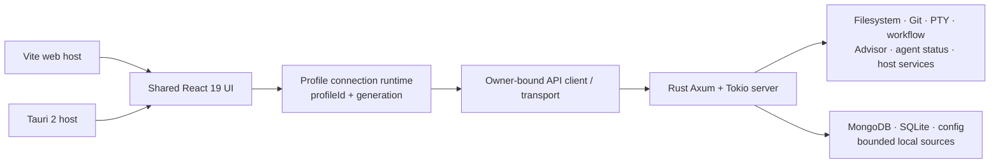

# System Architecture

**Status:** Current architecture overview, updated 2026-10-04. Detailed subsystem contracts are linked below; source code is authoritative.

## Runtime overview

DamHopper is a monorepo with a Rust server and two hosts for shared React UI. The server owns remote project/workspace configuration, filesystem operations, Git, PTYs, authentication, workflow data, host resources, and privileged helper coordination. The browser and desktop app own only their local profile connection state and UI presentation.


```mermaid
flowchart LR
  Web["Vite web host"] --> UI["Shared React 19 UI"]
  Native["Tauri 2 host"] --> UI
  UI --> Profiles["Profile connection runtime<br/>profileId + generation"]
  Profiles --> Client["Owner-bound API client / transport"]
  Client --> Server["Rust Axum + Tokio server"]
  Server --> Domains["Filesystem · Git · PTY · workflow<br/>Advisor · agent status · host services"]
  Server --> Store["MongoDB · SQLite · config<br/>bounded local sources"]
```

### Code boundaries

- `server/src/api/` registers protected HTTP, REST-backed client operations, and authenticated WebSocket routes. `server/src/state.rs` contains shared application state.
- `server/src/` domains include `auth`, `config`, `crypto`, `fs`, `git`, `pty`, `workflow`, `advisor`, `agent_status`, `agent_store`, `telemetry`, `idle_suspend`, `linux_release`, `port_forward`, and `tunnel`.
- `packages/ui/src/` owns the shared React application, owner-bound API clients, transports, query keys, stores, and feature components.
- `apps/web/` is the Vite browser host; `apps/native/` is the Tauri 2 desktop host. `packages/shared/` contains shared utilities; `packages/browser-bridge/` contains browser-debug runtime protocol v1.
- The former DamHopper plugin platform, runner, SDK, plugin APIs, and plugin iframe bridge are retired. Native Advisor is not a plugin host.

## Multi-profile ownership model

A browser-side `profileId` selects one saved server endpoint/identity. A monotonically replaced connection `generation` identifies the current runtime for that profile. UI work captures both before issuing requests.

```text
profile selection -> capture { profileId, generation }
  -> owner-bound ApiClient + transport
  -> profile/generation-qualified queries and event subscriptions
  -> server request on that connection
  -> recheck captured owner before publishing response or cleanup
```

- Each profile has its own connection runtime, authentication state, and transport. Failure or reconnect of one profile does not block another.
- Projects, PTYs, filesystem data, workflow state, and server configuration remain authoritative on their owning server. Equal names or IDs across servers are not globally equivalent.
- Query identity, callbacks, subscriptions, cancellation, and cleanup are owner-qualified. A stale response or event cannot update a replacement generation.
- Project target, Settings target, preference source, and Browser target are independent selectors. Missing/unavailable qualified targets fail closed; there is no first-connected or ambient fallback.
- Web and native hosts each create one ordinary QueryClient. Isolation comes from qualified keys and captured transports, not a separate QueryClient per profile.

See [multi-server profiles](./user-guide-multi-server-profiles.md) and the [phase guides](./phase-03-files-editor-search-git.md).

## Backend state and service composition

`AppState` is cloned through Axum state extraction and holds shared subsystem services, config, storage, and synchronization points. Advisor-specific state includes `advisor_service: Arc<crate::advisor::AdvisorService>` and `advisor_settings_lock: Arc<tokio::sync::Mutex<()>>`; settings updates are serialized separately from history/policy domain operations.

Keep API handlers responsible for request decoding, auth/role checks, and response mapping. Domain services enforce their own bounds and business invariants. Do not hold synchronous locks across `.await`; asynchronous process and filesystem work must not block PTY hot paths or server state locks. Persisted updates use validated revisions and atomic replacement where their contract requires it.

## Native Advisor

The Advisor is a native server domain in `server/src/advisor/` with Axum routes in `server/src/api/advisor.rs` and a direct React subtree in `packages/ui/src/advisor/`. It has no plugin runner, iframe, MessagePort bridge, or nested React root.

- Per-server setting `[server.advisor].enabled` defaults to `false`.
- Status/settings operations are available to administrators. Data routes require a normal authenticated session and current administrator role; `--no-auth` is explicitly denied.
- History is read from the server process `$HOME/.evcrate/advisor-history`; the final history root must be a real directory, not a symlink. Account routing policy is `$HOME/.evcrate/advisor-routing.json`.
- Routing changes compare a strict SHA-256 revision and use an atomic same-directory owner-only replacement. Updates preserve unrelated valid policy fields and reject credential-like fields.
- Discovery, scans, request sizes, and comparison work are bounded. Model discovery uses normalized fallback catalogs when the corresponding local harness cannot provide usable results.
- UI requests use an owner-bound client, abortable operations, and profile/generation-isolated state.

See the [Native Advisor architecture and API contract](./architecture/native-advisor.md) and [Advisor configuration](./configuration/advisor.md).

## Agent Status

`AgentStatusRuntime` correlates terminal ID with PTY incarnation and stores current semantic state in process memory. It does not replace PTY process state, workflow lifecycle, or task outcome.

- Managed OMP uses a private loopback WebSocket collector, with 5-second heartbeats and a 15-second lease. The collector is not the public API or tunnel discovery surface.
- Codex and Claude hook reports enter through a protected Unix domain socket. Peer credentials are checked before accepting reports.
- Reporter epochs and terminal incarnations fence stale callbacks. Hook reports and snapshots do not carry prompts or transcript text.
- Silence, disconnect, a normal turn end, or an unknown outcome does not prove success. Unknown remains an explicit state.

See [Agent Status architecture](./architecture/agent-status.md).

## Git safety model

Git operations use porcelain semantics for worktree/index state. Normal push remains fast-forward-only. A commit-message edit or squash operates on raw object plumbing without modifying working tree files or index entries:
- **Compare-and-swap ref updates**: First captures branch and HEAD, checks candidate rewrites against that snapshot, and updates refs via compare-and-swap. Squash requires a unique contiguous oldest-first parent chain reaching the captured tip and preserving the final tree. Signature loss requires explicit consent when applicable.
- **Active vs. inactive branch safety**:
  - Active branch updates lock `HEAD` then the branch ref (`refs/heads/<branch>`), checking worktree invariants.
  - Inactive branch rewrites lock only the target branch ref (`refs/heads/<branch>`), atomically verifying `HEAD` did not transition to the target branch during mutation. Active checkout, index, staged, unstaged, and untracked files remain completely untouched.
  - Operations fail closed with `checked-out-branch` if the target is checked out in another linked worktree, and with `active-operation` if a rebase, merge, or cherry-pick is ongoing.
- **UI surface parity and accessibility**:
  - Both the compact Workspace Git Panel and standalone Git Page permit commit-message editing and squashing when viewing any local branch (`isViewingLocalBranch`), active or inactive.
  - Checkout-sensitive operations (`reset`, `drop`, `undoLastCommit`) remain strictly guarded by `isViewingActiveBranch`.
  - The branch banner communicates current context: `Viewing {branchLabel}. Cherry-pick and revert apply to checked-out branch {activeBranch}.`
  - Ineligible views (remote branches, detached `HEAD`) provide accessible disabled explanations via `aria-describedby` linking to a unique `useId()` description ID in `GitLogTree` context menus.
- **Leased publication**: Local rewrite and publication are strictly decoupled. Publication uses an exact-OID CAS lease tied to the target branch (`PublishSnapshot`) and expected remote OID; stale remote state aborts the push with `stale-remote`. The lease is invariant to subsequent checkout state changes.

Search filters full commit messages before pagination without mutating refs. See [Git history architecture](./architecture/git-history-search.md) and the [Git API reference](./api-reference.md#git-operations).
## Cognito Mode

Cognito is an ephemeral in-app overlay controlled by the Cognito state store and configurable shortcut. The app installs a capture-phase input guard and places app content behind an inert/hidden boundary while the mask is active. Activation is not persisted as active state; only supported preference fields persist.

Current CSS in `packages/ui/src/index.css` sets Heavy Blur to `blur(16px) saturate(180%)` with `rgba(148, 163, 184, 0.12)` when backdrop-filter is supported. Unsupported engines and reduced-transparency preferences use opaque black; Black Screen is solid black. This is a visual screen mask, not authentication, content redaction, or an OS-wide screenshot/recording boundary. The checked-in CSS is authoritative where historical changelog text differs.

## Authentication, privacy, and capability boundaries

- Normal server requests use validated session authentication and role checks. Production MFA keys and cookies are server-configured; see [authentication API](./authentication-api.md) and [server configuration](./configuration/server-configuration.md).
- Credentialed browser requests use explicit allowed origins. `--no-auth` is a development bypass only; bind it to `127.0.0.1`, never to a network interface. Native Advisor remains forbidden in that mode.
- Filesystem and media operations validate resolved targets and bound data. Opaque media tickets bind actor, client namespace, target, file identity/version, kind, purpose, and incarnation; cleanup stays with the original owner.
- Encrypted uploads use OPAQUE PAKE exchange and chunked AES-256-GCM over the WebSocket transport. One captured profile/generation transport owns authentication and final write; no plaintext or alternate-owner fallback is allowed.
- The shared logger redacts sensitive metadata. Agent status carries lifecycle facts only, never conversation content.

## Idle suspend and deployment

Linux idle suspend is coordinated by the server and an enrolled Unix-socket helper with systemd integration. The server applies bounded policy and preflight; helper peer verification, deduplication, audit ordering, RTC checks, and fixed execution keep side effects fail-closed. Quiet is not proof of agent completion. See [idle-suspend security](./terminal-idle-suspend-security.md) and [PTY activity observation](./pty-activity-observation.md).

`deploy/release/` provides release packaging, installers, and service templates. Release manager/systemd operations have separate Linux and Windows documentation. Host-resource SSE implementation is documented, but target-host, deployed-proxy, live-browser, and soak qualification remain open; it is not a release qualification claim. See [SSE architecture](./architecture/host-resource-sse.md).

## Qualification boundary
Automated unit and integration tests establish only their exercised contracts. Live browser behavior, particular agent versions, Linux deployment behavior, Windows native scopes, and deployed proxies are separately qualified. See the [project roadmap](./project-roadmap.md) and [testing guide](./testing.md) for current open gates.
