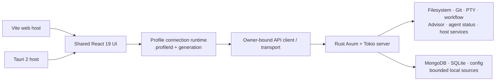

# System Architecture

**Status:** Current architecture overview, updated 2026-10-05. Detailed subsystem contracts are linked below; source code is authoritative.

## Runtime Overview

DamHopper is a monorepo with an Axum/Tokio Rust server and two hosts for shared React UI. The server owns remote project/workspace configuration, filesystem operations, Git, PTYs, authentication, workflow data, host resources, and privileged helper coordination. The browser and desktop app own only their local profile connection state and UI presentation.


```mermaid
flowchart LR
  Web["Vite web host"] --> UI["Shared React 19 UI"]
  Native["Tauri 2 host"] --> UI
  UI --> Profiles["Profile connection runtime<br/>profileId + generation"]
  Profiles --> Client["Owner-bound API client / transport"]
  Client --> Server["Rust Axum + Tokio server"]
  Server --> Domains["Filesystem · Git · PTY · workflow<br/>Advisor · agent status · host services"]
  Server --> Store["MongoDB · SQLite · config<br/>bounded local sources"]
```

### Code Boundaries

- `server/src/api/` registers protected HTTP, REST-backed client operations, and authenticated WebSocket routes. `server/src/state.rs` contains shared application state.
- `server/src/` domains include `auth`, `config`, `crypto`, `fs`, `git`, `pty`, `workflow`, `advisor`, `agent_status`, `agent_store`, `telemetry`, `idle_suspend`, `linux_release`, `port_forward`, and `tunnel`.
- `packages/ui/src/` owns the shared React application, owner-bound API clients, transports, query keys, stores, and feature components (canonical entry `packages/ui/src/embed/dam-hopper-app.tsx`).
- `apps/web/` is the Vite browser host; `apps/native/` is the Tauri 2 desktop host. `packages/shared/` contains shared utilities; `packages/browser-bridge/` contains browser-debug runtime protocol v1.
- The former DamHopper plugin platform, runner, SDK, plugin APIs, and plugin iframe bridge are retired. Native Advisor is an in-process native domain, not a plugin host.

### Port & Network Topology

| Runtime Environment | API Port | Web Port | Bind Address | Authority & Invariants |
| --- | --- | --- | --- | --- |
| **Standalone Server** (`dam-hopper-server`) | `4800` | N/A (combined if `--web-dir`) | `0.0.0.0` | `server/src/main.rs:44,48` default. |
| **Production Systemd Managed** | `4801` | `4802` (`dam-hopper-web`) | `0.0.0.0` | `deploy/systemd/dam-hopper-api.service`, `dam-hopper-web.service`. |
| **Development Mode** | `4803` | `5173` (Vite) | `0.0.0.0` / loopback | `apps/web/vite.config.ts` proxy to `127.0.0.1:4803`. |

*Security Warning:* When starting the server with `--no-auth` during local development, operators should explicitly bind to loopback (`--host 127.0.0.1`) to prevent exposing unauthenticated control surfaces to the local network.

### UI Surfaces and Settings Topology

The shared React 19 UI partitions workbench surfaces into IDE mode (`IdeShell`), terminal workspace mode (`TerminalWorkspaceShell`), Git management (`GitPage`), and server settings (`SettingsPage`). On the Settings page, persistent uncollapsed server selectors govern the active target server and workbench preferences source, while all individual configuration sections (`SettingsSectionAccordion`) default to a collapsed state (`defaultOpen = false`), reducing cognitive load and mount overhead across appearance, shortcuts, idle suspend, native advisor, maintenance, and import/export panels.

The ambient ribbon and floating surface (`WorkflowContextRibbon`, `WorkflowContextDeck`, `WorkflowContextSheet`) provide responsive task tracking across all shell viewports without persisting ephemeral UI state.

## Multi-Profile Ownership Model

A browser-side `profileId` selects one saved server endpoint/identity. A monotonically replaced connection `generation` identifies the current runtime for that profile. UI work captures both before issuing requests.

```text
profile selection -> capture { profileId, generation }
  -> owner-bound ApiClient + transport
  -> profile/generation-qualified queries and event subscriptions
  -> server request on that connection
  -> recheck captured owner before publishing response or cleanup
```

- Each profile has its own connection runtime, authentication state, and transport. Failure or reconnect of one profile does not block another.
- Projects, PTYs, filesystem data, workflow state, and server configuration remain authoritative on their owning server. Equal names or IDs across servers are not globally equivalent.
- Query identity, callbacks, subscriptions, cancellation, and cleanup are owner-qualified via tuple keys (`[profileId, project]`, `[profileId, generation]`). A stale response or event cannot update a replacement generation.
- Project target, Settings target, preference source, and Browser target are independent selectors. Missing/unavailable qualified targets fail closed; there is no first-connected or ambient fallback.
- In Fleet mode, the top navigation host popover renders a multi-server deck (`HostResourceFleetDeck`), allowing operators to monitor disparate daemon endpoints simultaneously.

See [Multi-Server Profiles User Guide](./user-guide-multi-server-profiles.md) and [Workbench Files, Editor, Search, and Git Architecture](./architecture/workbench-files-editor-and-git.md).

## Backend State and Service Composition

`AppState` is cloned through Axum state extraction and holds shared subsystem services, config, storage, and synchronization points. Advisor-specific state includes `advisor_service: Arc<crate::advisor::AdvisorService>` and `advisor_settings_lock: Arc<tokio::sync::Mutex<()>>`; settings updates are serialized separately from history/policy domain operations.

Session metadata, port bindings, and terminal buffer snapshots are persisted locally in SQLite (`~/.config/dam-hopper/sessions.db`) via the background `PersistWorker`.

Keep API handlers responsible for request decoding, auth/role checks, and response mapping. Domain services enforce their own bounds and business invariants. Do not hold synchronous locks across `.await`; asynchronous process and filesystem work must not block PTY hot paths or server state locks. Persisted updates use validated revisions and atomic replacement where their contract requires it.

### Tunnel Isolation and Port Forwarding

Ephemeral Cloudflared quick tunnels (`server/src/tunnel/`) isolate subprocesses from host and user configurations by passing `--config ""` and `--no-autoupdate`. Forwarded dev-server requests rewrite the Host header (`--http-host-header localhost`) to prevent DNS rebinding rejections on modern dev servers (such as Vite 6 `server.allowedHosts`). The tunnel lifecycle enforces a **single-authority supervisor exit pattern**: `child.wait()` in the supervisor task is the sole authority for emitting `Exited` or `Failed` notifications, guarded by atomic state flags (`terminal_reached`) to eliminate race conditions with the stderr URL-discovery reader task. Discovered ports are validated against danger port deny-lists (`[22, 25, 110, 143, 3306, 5432, 6379, 27017]`) and ports < 1024.

## Native Desktop & Platform Boundaries

- **Windows Desktop:** Supports native local SSH port forwarding (`cfg(windows)`) via `apps/native/src-tauri/src/ssh_forward/` using `russh`, DPAPI credential storage, elliptic-curve host trust, and 20 specialized Tauri IPC commands. Allows connecting to remote HTTP/HTTPS profile URLs.
- **Linux Desktop & Web:** Native SSH port forwarding is unsupported (`cfg(windows)` gated). Non-Windows native desktop enforces exact same-origin server profile URLs for security isolation.
- **Host Remediation Actions:** The `HostActionService` scaffolding exists in `server/src/host_actions/` (`/api/system/actions/v1/*`), but `HostActionService::new()` uses `UnavailableExecutor`, and capabilities currently report `available: false` (reasons include `noAuth`, `reauthUnavailable`, or `helperNotEnrolled`).

## Workflow Tracking Engine

The `WorkflowService` manages hierarchical plans, phases, tasks (max depth 3), workflow sessions, notes, and activity event streams backed by SQLite (`010_workflow_tracking.sql`).
- Non-blocking PTY observation receives terminal lifecycle transitions via bounded `sync_channel(256)` without capturing terminal I/O.
- Event records in the database use a hardcoded 90-day retention (`DEFAULT_EVENT_RETENTION_DAYS = 90`) at insertion time, while deleted-note retention is configurable through `server.workflow_deleted_note_retention_days`, defaulting to 7 days.
- Optimistic concurrency control uses `updatedAt` CAS timestamps on item and note mutations.

See [Workflow API Specification](./workflow-api.md).

### Project Plans Dashboard (Implemented)

**Implemented and qualified 2026-10-07.** See the
[frozen contracts](../plans/261006-1653-project-plans-dashboard/contracts.md) and
[implementation plan](../plans/261006-1653-project-plans-dashboard/plan.md).

- Extends current Plan surface with folder-first selection, then one selected plan's Overview,
  Timeline, and read-only documents; preserves separate SQLite manual tracking.
- Resolves configured project / registered worktree on server; browses immediate
  folders under fixed `plans/`, reading plan/progress only after explicit selection.
- `plan.md` supplies metadata and the complete declared phase inventory, including
  valid short GFM rows. Presence of `progress.md` opts into its current report;
  unreadable progress retains historical evidence but makes current phase
  completion unknown. Conflicting/duplicate phase identity claims cannot complete
  another phase. Explicit Current status columns take precedence over Status.
- Progress is an administrative report, not verified completion or permission to
  execute. The dashboard never calls controllers, runs agents, or updates files.
- Selected Timeline uses explicit planned/actual ranges, creation milestones, or
  Undated state. No mtime/effort duration inference, cross-plan Board, or bulk status load.
- Scopes requests, queries, document links, and watcher cleanup to the captured
  profile, connection generation, and project/worktree target.
- Reuses native Rust API / auth / filesystem boundaries and shared React rendering;
  no database import, Node sidecar, iframe, or second terminal lifecycle.
- Strict bounded `plan-document` reads use rooted descriptors/native Windows
  handles, reject linked ancestors, and validate file identity, modification/change
  timestamps, named entries, and pinned ancestors before publishing a snapshot.
  Atomic replacement during a read reports changed without an automatic retry.
- Folder responses retain a whole sorted prefix under the 2 MiB JSON limit using
  bounded linear size accounting, not repeated full-response trimming.
- Owner-bound `watchOnly` subscriptions cover existing navigation ancestors and
  selected document parents, not all children. Registration/rebinding is serialized;
  coverage is live only after installation and a fresh authoritative read.
  Missing directories are covered through their existing parents; requirements
  beyond the 33-watch cap remain explicitly degraded. Reconcile retries missing
  watches rather than clearing the warning optimistically.
  Shared server watchers use pinned directory identities and exact generation
  leases; a retained Explorer subscription cannot force plans onto an old-inode
  watcher or release a replacement generation.
- Reuses Markdown / GFM / Mermaid; local images show notices, no media integration.
  Local document paths are URI-decoded once before containment checks; document
  Retry requests the failed path again.
- Linux runtime exercised. Windows strict source/tests cross-compiled in an
  isolated harness; full cross-target build requires native MSVC tools. Windows
  runtime remains explicitly unqualified until tested on Windows.
## Telemetry & OTLP Analytics

<a id="codex-otel-usage-analytics"></a>
DamHopper server includes an internal loopback OTLP collector (`server/src/telemetry/`) receiving protobuf metrics and execution traces:
- **Identifier Obfuscation:** Uses HMAC-SHA256 (`~/.config/dam-hopper/telemetry-hmac-key`, regular file, mode `0600`, opened with `O_NOFOLLOW`).
- **Strict Privacy Invariants:** Forbidden fields (`command`, `argv`, `cwd`, `environment`, `pty_output`, `prompt`, `response`, `tool_arguments`, `tool_output`) are dropped during normalization.
- **Storage:** Persisted locally in SQLite (`~/.config/dam-hopper/telemetry.db`) with daily retention rollups.

## Native Advisor

The Advisor is a native server domain in `server/src/advisor/` with Axum routes in `server/src/api/advisor.rs` and a direct React subtree in `packages/ui/src/advisor/`. It has no plugin runner, iframe, MessagePort bridge, or nested React root.

- Per-server setting `[server.advisor].enabled` defaults to `false`.
- Status/settings operations are available to administrators. Data routes require a normal authenticated session and current administrator role; `--no-auth` is explicitly denied (`NoAuthForbidden`).
- History is read from the server process `$HOME/.evcrate/advisor-history`; the final history root must be a real directory, not a symlink. Account routing policy is `$HOME/.evcrate/advisor-routing.json`.
- Routing changes compare a strict SHA-256 revision and use an atomic same-directory owner-only replacement. Updates preserve unrelated valid policy fields and reject credential-like fields.
- Discovery, scans, request sizes, and comparison work are bounded. Model discovery uses normalized fallback catalogs when the corresponding local harness cannot provide usable results.
- UI requests use an owner-bound client, abortable operations, and profile/generation-isolated state.

See [Native Advisor Architecture](./architecture/native-advisor.md) and [Advisor Configuration](./configuration/advisor.md).

## Agent Status

`AgentStatusRuntime` correlates terminal ID with PTY incarnation and stores current semantic state in process memory. It does not replace PTY process state, workflow lifecycle, or task outcome.

- Managed OMP uses a private loopback WebSocket collector, with 5-second heartbeats and a 15-second lease. The collector is not the public API or tunnel discovery surface.
- Codex and Claude hook reports enter through a protected Unix domain socket. Peer credentials (`SO_PEERCRED`) and PTY shell ancestry are verified before accepting reports.
- Reporter epochs and terminal incarnations fence stale callbacks. Hook reports and snapshots do not carry prompts, tool arguments, or transcript text.
- Silence, disconnect, a normal turn end, or an unknown outcome does not prove success. Unknown remains an explicit state.

See [Agent Status Architecture](./architecture/agent-status.md).

## Git Safety Model

Git operations use porcelain semantics for worktree/index state. Normal push remains fast-forward-only. A commit-message edit or squash operates on raw object plumbing without modifying working tree files or index entries:
- **Compare-and-swap ref updates**: First captures branch and HEAD, checks candidate rewrites against that snapshot, and updates refs via compare-and-swap. Squash requires a unique contiguous oldest-first parent chain reaching the captured tip and preserving the final tree. Signature loss requires explicit consent when applicable.
- **Active vs. inactive branch safety**:
  - Active branch updates lock `HEAD` then the branch ref (`refs/heads/<branch>`), checking worktree invariants.
  - Inactive branch rewrites lock only the target branch ref (`refs/heads/<branch>`), atomically verifying `HEAD` did not transition to the target branch during mutation. Active checkout, index, staged, unstaged, and untracked files remain completely untouched.
  - Operations fail closed with `checked-out-branch` if the target is checked out in another linked worktree, and with `active-operation` if a rebase, merge, or cherry-pick is ongoing.
- **UI surface parity and accessibility**:
  - Both the compact Workspace Git Panel and standalone Git Page permit commit-message editing and squashing when viewing any local branch (`isViewingLocalBranch`), active or inactive.
  - Checkout-sensitive operations (`reset`, `drop`, `undoLastCommit`) remain strictly guarded by `isViewingActiveBranch`.
  - The branch banner communicates current context: `Viewing {branchLabel}. Cherry-pick and revert apply to checked-out branch {activeBranch}.`
  - Ineligible views (remote branches, detached `HEAD`) provide accessible disabled explanations via `aria-describedby` linking to a unique `useId()` description ID in `GitLogTree` context menus.
- **Leased publication**: Local rewrite and publication are strictly decoupled. Publication uses an exact-OID CAS lease tied to the target branch (`PublishSnapshot`) and expected remote OID; stale remote state aborts the push with `stale-remote`. The lease is invariant to subsequent checkout state changes.

Search filters full commit messages before pagination without mutating refs. See [Git History Architecture](./architecture/git-history-search.md) and [Git API Reference](./api/git.md).

## Cognito Privacy Mode

<a id="cognito-mode"></a>
Cognito is an ephemeral in-app overlay controlled by the Cognito state store and configurable shortcut (`Mod+Alt+KeyB`). The app installs a window input guard using event capture to intercept 38 pointer, keyboard, clipboard, wheel, and drag events, and places app content behind an `inert` and `aria-hidden="true"` boundary while the mask is active. Activation is memory-only; only supported presentation style preferences persist.

Current CSS in `packages/ui/src/index.css` sets Heavy Blur to `blur(16px) saturate(180%)` with `rgba(148, 163, 184, 0.12)` when backdrop-filter is supported. Unsupported engines and reduced-transparency preferences use opaque black; Black Screen is solid black. This is an in-browser visual screen mask, not an operating system-wide screenshot boundary.

## Authentication, Privacy, and Capability Boundaries

- Normal server requests use validated session authentication and role checks across MongoDB or SQLite lite mode backends. Production MFA keys and cookies are server-configured; see [Authentication API](./api/authentication.md), [Authentication State & Cryptography](./architecture/authentication-state-and-cryptography.md), and [Server Environment & Authentication](./configuration/server-environment-auth.md).
- Credentialed browser requests use explicit allowed origins. `--no-auth` is a development bypass only; bind it to `127.0.0.1`, never to an untrusted public network interface. Native Advisor remains forbidden in that mode.
- Filesystem and media operations validate resolved targets and bound data. Opaque media tickets bind actor, client namespace, target, file identity/version, kind, purpose, and incarnation; cleanup stays with the original owner.
- Encrypted uploads use OPAQUE PAKE exchange and chunked AES-256-GCM over the WebSocket transport. One captured profile/generation transport owns authentication and final write; no plaintext or alternate-owner fallback is allowed.
- The shared logger redacts sensitive metadata. Agent status carries lifecycle facts only, never conversation content.

## Idle Suspend and Deployment

<a id="server-authoritative-terminal-idle-suspend-architecture"></a>
Linux terminal idle suspend is coordinated by the server and an enrolled Unix-socket helper (`dam-hopper-idle-suspend-helper`) with systemd integration. The server applies bounded policy (`empty-fleet` or `agent-activity`) and sysfs RTC wakealarm preflight; helper peer verification, deduplication, audit ordering, and fixed execution keep side effects fail-closed. Quiet period and wake interval are clamped between 60 and 86,400 seconds. Quiet is not proof of agent completion. See [Terminal Idle-Suspend Security](./terminal-idle-suspend-security.md) and [PTY Activity Observation](./pty-activity-observation.md).

`deploy/release/` provides release packaging, installers, and service templates. Host-resource SSE streams deep Linux metrics under capped subscriber leases (max 32 global, 4 per subject). See [Host-Resource SSE Architecture](./architecture/host-resource-sse.md).

## Qualification Boundary

Automated unit and integration tests establish only their exercised contracts. Live browser behavior, particular agent versions, Linux deployment behavior, Windows native scopes, and deployed proxies are separately qualified. See [Project Roadmap](./project-roadmap.md) and [Testing Guide](./testing.md) for current open gates.
