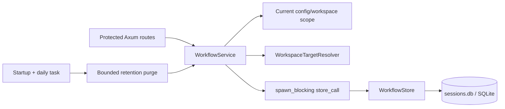

# Workflow Service and REST API

Phase 02 is complete (2026-09-02). This document describes the protected
workflow service boundary and the `/api/workflow/*` REST contract. The API is
server-side workflow tracking; it does not start terminals, run agents, or
infer session completion from a resource observation.

## Scope and authorization

All workflow routes are merged into the existing protected Axum router. They
use the same authentication policy as other protected `/api/*` routes (the
configured bearer/cookie transport); an unauthenticated request receives
`401`. The development `--no-auth` mode can bypass this policy only on a safe
local development deployment.

The workflow route group has a `32 KiB` request-body limit. JSON request and
response fields use `camelCase`; request DTOs reject unknown fields. Resource,
item, session, note, and event IDs supplied by clients are UUID strings.
Timestamps are RFC3339 values with an explicit timezone, serialized with
millisecond precision (for example, `2026-09-02T10:00:00.000Z`).

### Scope and target resolution

Every request is scoped to the workspace currently loaded by the authenticated
server profile. The service derives the workflow workspace from the current
configuration locator and lazily creates its database identity. A request
cannot address an entity in another workflow workspace.

A `target` is a structured object:

```json
{ "project": "api", "worktreePath": "/absolute/path/to/registered/worktree" }
```

Omit `worktreePath` for the configured project root. An explicit path must be
absolute and present in Git's current registered-worktree snapshot; the server
never trusts a supplied path as an authorization decision. Unknown projects
are `workflow_not_found`; unregistered or unavailable worktrees are
`workflow_target_unavailable`.

## Service and persistence architecture



`WorkflowService` (`server/src/workflow/service.rs`) owns the boundary between
HTTP handlers and the synchronous repository. It contains the shared
`WorkflowStore`, configuration and target resolver handles, the workspace
coordination guard, and the PTY manager used to validate live terminal links.
It copies configuration/project data before database work, resolves targets
asynchronously, and runs blocking repository calls through
`tokio::task::spawn_blocking`.

`AppState.workflow` is optional. Startup constructs `WorkflowStore` from the
existing `SessionStore::connection()` and attaches one `Arc<WorkflowService>`;
it does not open a second database. If the workflow store is unavailable,
workflow requests return `503 workflow_store_unavailable`, while terminal,
filesystem, and other IDE APIs remain available. Startup runs a purge once,
then repeats it every 24 hours; each purge works in batches of 500 and yields
between batches.

The additive migration `010_workflow_tracking.sql` creates the six workflow
tables in the existing `sessions.db`. Repository mutations lock the shared
SQLite connection, validate and mutate inside one transaction, append an
optional activity event in that same transaction, and commit only if all steps
succeed. Errors roll back both the domain mutation and its event.

## Common response and errors

Every item, session, link, or note mutation returns:

```json
{
  "resource": { "...": "resource-specific DTO" },
  "replayed": false,
  "eventId": "request-uuid"
}
```

A retry with the same `requestId` returns the current resource with
`replayed: true`. A request ID reused for a different mutation conflicts. A
DELETE returns a typed tombstone instead of a boolean:

```json
{
  "resource": {
    "resourceType": "item",
    "id": "item-uuid",
    "deletedAt": "2026-09-02T10:05:00.000Z",
    "parentId": null
  },
  "replayed": false,
  "eventId": "request-uuid"
}
```

Workflow errors use a stable body with a sanitized message and code:

```json
{ "error": "Workflow request conflicts with current state", "code": "workflow_conflict" }
```

| HTTP | Codes | Meaning |
| ---: | --- | --- |
| 400 | `workflow_invalid_request`, `workflow_limit_exceeded` | Malformed UUID/timestamp, unknown enum, invalid hierarchy, or domain field limits |
| 404 | `workflow_not_found` | Entity or configured project is not in the current workspace |
| 409 | `workflow_conflict`, `workflow_invalid_transition`, `workflow_target_unavailable` | CAS/replay conflict, illegal lifecycle transition, or unusable target |
| 413 | *(router response; no workflow code guaranteed)* | Request exceeds the workflow route's 32 KiB body cap before the handler |
| 503 | `workflow_store_unavailable` | Workflow SQLite/service is unavailable; unrelated APIs are not gated |

## Endpoint overview

| Method | Route | Purpose |
| --- | --- | --- |
| GET | `/api/workflow/overview` | One bounded current-workspace context response |
| GET | `/api/workflow/events` | Descending keyset-paged activity history |
| POST | `/api/workflow/items` | Create a Plan, Phase, or Task |
| PATCH | `/api/workflow/items/{id}` | CAS update an item |
| DELETE | `/api/workflow/items/{id}` | CAS delete an item and descendants |
| POST | `/api/workflow/sessions` | Start a manual running session |
| POST | `/api/workflow/sessions/{id}/end` | End a running session with an explicit time |
| POST | `/api/workflow/sessions/{id}/abandon` | Abandon a running session |
| POST | `/api/workflow/sessions/{id}/links` | Link a terminal or agent resource |
| DELETE | `/api/workflow/sessions/{id}/links` | CAS unlink a terminal or agent resource |
| POST | `/api/workflow/notes` | Add a durable item/session note |
| DELETE | `/api/workflow/notes/{id}` | CAS soft-delete a note |
| DELETE | `/api/workflow/history` | Permanently purge old events and soft-deleted notes |

There is no standalone item GET/list route in Phase 02. Item reads are
returned by mutation responses and by the overview; the scoped repository also
has internal get/list methods for service use.

## Workspace overview

### `GET /api/workflow/overview`

Creates or resolves the current workflow workspace and returns one bounded
context response. The response shape is:

```json
{
  "workspace": { "id": "workspace-uuid", "name": "my-workspace" },
  "serverTime": "2026-09-02T10:00:00.000Z",
  "projects": [],
  "plans": [],
  "standaloneTasks": [],
  "runningSessions": [],
  "recentEvents": [],
  "truncated": false
}
```

- `workspace` exposes the generated ID and display name; the canonical config
  locator is never serialized.
- `projects` contains target/project summaries (`project`, `target`,
  `planCount`, `taskCount`, `runningSessionCount`, `lastActivityAt`), ordered by
  recent activity.
- `plans` contains Plan-rooted `ItemOverviewNode` trees. Each node includes
  `item`, optional factual `progress`, non-deleted item `notes`, running
  `activeSessions`, and recursively ordered `children`.
- `standaloneTasks` contains Task nodes without a parent.
- `runningSessions` contains all active (`running`) sessions, including
  sessions without an item.
- `recentEvents` contains the latest 20 event projections.
- `progress` is present only when descendant Tasks exist and reports
  `totalTrackedTasks` and `completedTrackedTasks`; it is not a percentage and
  does not claim that tracked Tasks represent all Plan work.
- Hard caps are 100 projects, 500 items, and 100 running sessions. `truncated`
  is true when project or item results exceed the bounded response.

## Activity history

### `GET /api/workflow/events?cursor=&limit=`

Returns events for the current workspace in `(recordedAt DESC, id DESC)` order.
`limit` defaults to `50` and must be between `1` and `100`. The optional
`cursor` is opaque URL-safe base64 without padding; it encodes the last
`recordedAt` millisecond value and event UUID. Pass the returned
`nextCursor` unchanged to request the next page:

```json
{
  "events": [
    {
      "id": "event-uuid",
      "eventType": "item_created",
      "source": "manual",
      "target": { "project": "api", "worktreePath": null },
      "itemId": "item-uuid",
      "sessionId": null,
      "occurredAt": "2026-09-02T10:00:00.000Z",
      "recordedAt": "2026-09-02T10:00:00.000Z"
    }
  ],
  "nextCursor": null
}
```

The public event DTO intentionally excludes raw `payloadJson` and internal
expiry metadata. Empty or tampered cursors, and out-of-range limits, return
`400 workflow_invalid_request` or `400 workflow_limit_exceeded` respectively.

## Item CRUD

Items use the Plan-first hierarchy:

| Kind | Parent |
| --- | --- |
| `plan` | None; root only |
| `phase` | A same-project/target `plan` (required) |
| `task` | None, or a same-project/target `plan`/`phase` |

Task cannot parent Task. Parent references must be in the current workspace,
share the target project/worktree, contain no cycle, and stay within the
three-level `Plan -> Phase -> Task` depth.

### `POST /api/workflow/items`

Request:

```json
{
  "requestId": "request-uuid",
  "target": { "project": "api" },
  "parentId": "phase-uuid",
  "kind": "task",
  "title": "Add workflow API",
  "summary": "Expose protected REST routes",
  "status": "backlog",
  "sortOrder": 0
}
```

`parentId`, `summary`, `status`, and `sortOrder` are optional; status defaults
to `backlog` and sort order to `0`. Titles are trimmed, non-empty, and capped
at 200 characters. The mutation records `item_created` and returns an
`ItemDto` with `id`, `target`, `parentId`, `kind`, `title`, `summary`, `status`,
`sortOrder`, `source`, `createdAt`, `updatedAt`, and `completedAt`.

### `PATCH /api/workflow/items/{id}`

Request:

```json
{
  "requestId": "request-uuid",
  "updatedAt": "2026-09-02T10:00:00.000Z",
  "title": "Add and document workflow API",
  "summary": null,
  "status": "in_progress",
  "sortOrder": 1,
  "target": { "project": "api", "worktreePath": "/repo/worktree" }
}
```

`updatedAt` is required and must equal the current resource timestamp. A stale
value returns `409 workflow_conflict`; the mutation does not write an event.
Omitted fields retain their current values; `summary: null` clears the
summary. A supplied target is resolved and ownership-checked before the CAS write.
Item transitions are explicit: `backlog <-> next`; `backlog` or `next` to
`in_progress`/`canceled`; `in_progress` to `blocked`/`done`/`canceled`/
`backlog`/`next`; `blocked` to `in_progress`/`canceled`; and `done` or
`canceled` back to `in_progress`. Self-transitions are valid no-ops. Invalid
transitions return `409 workflow_invalid_transition`. The mutation records
`item_updated` and returns the updated `ItemDto`.

### `DELETE /api/workflow/items/{id}`

Request:

```json
{ "requestId": "request-uuid", "updatedAt": "2026-09-02T10:00:00.000Z" }
```

The timestamp is an optimistic-concurrency guard. A successful delete records
`item_deleted`, returns an item tombstone, and deletes descendants through the
self-referencing foreign-key cascade. Retrying the same request ID returns the
tombstone with `replayed: true`.

## Session management

### `POST /api/workflow/sessions`

Starts a manual session in `running` state. The request requires an explicit
work time; the server preserves the submitted instant rather than replacing it
with receipt time:

```json
{
  "requestId": "request-uuid",
  "target": { "project": "api" },
  "itemId": "task-uuid",
  "startedAt": "2026-09-02T10:00:00.000Z"
}
```

`itemId` is optional, but when present the item must share the same project
and target. The response contains a `SessionDto` with `id`, `target`, `itemId`,
`status`, `startedAt`, `endedAt`, `source`, `createdAt`, and `updatedAt`, and
records `session_started`.

### `POST /api/workflow/sessions/{id}/end`

Request:

```json
{
  "requestId": "request-uuid",
  "endedAt": "2026-09-02T11:00:00.000Z"
}
```

`endedAt` is required and must be no earlier than `startedAt`. Only the
running-to-ended transition is accepted; invalid lifecycle transitions return
`409 workflow_invalid_transition`. The server preserves the supplied end
instant and records `session_ended`.

### `POST /api/workflow/sessions/{id}/abandon`

Request:

```json
{ "requestId": "request-uuid" }
```

Abandon is explicit and records `session_abandoned`. It does not fabricate an
`endedAt` value. Running sessions may transition to `abandoned`; ended and
abandoned sessions are terminal except for an idempotent self-transition.

### Resource links

#### `POST /api/workflow/sessions/{id}/links`

Links one external resource to a session. The natural identity is
`(sessionId, resourceType, externalId)` and an existing identity is upserted.

```json
{
  "requestId": "request-uuid",
  "resourceType": "agent",
  "externalId": "agent-runner-1",
  "harnessLabel": "harness-v1",
  "runId": "run-xyz-999"
}
```

`resourceType` is `terminal` or `agent`; `externalId` is required and capped
at 200 characters. Terminal links may include an `incarnation`, but cannot
include `harnessLabel` or `runId`; the referenced PTY must currently exist and
match the session project/worktree. Agent links cannot include `incarnation`
and may include a harness label (64-character cap) and run ID (128-character
cap). New links start with `observedState: attached` and record
`resource_linked`.

The response `LinkDto` includes `id`, `sessionId`, `resourceType`,
`externalId`, optional `incarnation`, `harnessLabel`, `runId`,
`observedState`, `suggestedEndTime`, `firstSeenAt`, `lastSeenAt`, `linkSource`,
`createdAt`, and `updatedAt`.

#### `DELETE /api/workflow/sessions/{id}/links`

Request:

```json
{
  "requestId": "request-uuid",
  "updatedAt": "2026-09-02T10:00:00.000Z",
  "resourceType": "agent",
  "externalId": "agent-runner-1"
}
```

The path identifies the session; `resourceType` and `externalId` identify the
link. `updatedAt` is the link CAS value. A successful unlink records
`resource_unlinked` and returns a link tombstone. Phase 02 has no public
resource-observation ingestion route; observation updates remain a repository
capability for later lifecycle integration and cannot change session status or
manual timestamps.

## Notes

### `POST /api/workflow/notes`

A note must target an existing current-workspace item, session, or both:

```json
{
  "requestId": "request-uuid",
  "itemId": "task-uuid",
  "sessionId": "session-uuid",
  "body": "Debugging performance regression"
}
```

At least one target is required. The body must contain non-whitespace content
and is capped at 8 KiB. The response is a `NoteDto` (`id`, `itemId`,
`sessionId`, `body`, `source`, `createdAt`, `updatedAt`, `deletedAt`) and the
mutation records `note_added`. Retrying the same request ID returns the
matching note with `replayed: true`.

### `DELETE /api/workflow/notes/{id}`

Request:

```json
{ "requestId": "request-uuid", "updatedAt": "2026-09-02T10:00:00.000Z" }
```

The note timestamp is a required CAS value. Successful deletion records
`note_deleted`, sets `deletedAt`, and returns a note tombstone. The row remains
soft-deleted until retention purge; overview results exclude it.

## History purge and retention

### `DELETE /api/workflow/history?before=...`

`before` is required either as the query parameter or as `before` in an
optional JSON body. The body value takes precedence. It must be a timezone-
qualified RFC3339 timestamp:

```bash
curl -X DELETE \
  -H "Authorization: Bearer $TOKEN" \
  'http://localhost:4800/api/workflow/history?before=2026-01-01T00:00:00.000Z'
```

The response is not a mutation envelope:

```json
{ "eventsDeleted": 120, "notesDeleted": 4 }
```

Each bounded transaction permanently deletes events with `recordedAt` strictly
before `before` and notes that are already soft-deleted with `deletedAt`
strictly before `before`. The handler loops until all batches are drained.
`requestId` is accepted by the request DTO for forward compatibility but is
not used to replay a purge.

Automatic retention runs at startup and every 24 hours. Expired events and
soft-deleted notes are removed in batches of 500. The default event expiry is
90 days and the default deleted-note grace period is 7 days. Current items,
sessions, and non-deleted notes are never age-deleted.

## Validation and implementation evidence

The Phase 02 integration target is `server/tests/workflow_api.rs`. Its eight
cases cover auth enforcement, empty and nested overview responses, Plan-first
hierarchy, replay and item CAS, session lifecycle, resource links, note CAS,
invalid transitions, limits, unknown projects, keyset pagination, and history
purge. The domain/store tests remain in `server/src/workflow/tests.rs`.

Primary Phase 02 backend files:

- `server/src/workflow/service.rs` — current-workspace scope, target resolution,
  blocking store calls, and retention orchestration.
- `server/src/api/workflow/mod.rs` — overview/events handlers and module wiring.
- `server/src/api/workflow/dto.rs` — strict request and response DTOs.
- `server/src/api/workflow/cursor.rs` — opaque event cursor encoding/decoding.
- `server/src/api/workflow/mapping.rs` — timestamp, target, and model mapping.
- `server/src/api/workflow/item.rs` — item create/patch/delete handlers.
- `server/src/api/workflow/session.rs` — session lifecycle and link handlers.
- `server/src/api/workflow/note.rs` — note create/soft-delete handlers.
- `server/src/api/workflow/purge.rs` — explicit history purge handler.
- `server/tests/workflow_api.rs` — protected HTTP integration coverage.

Supporting wiring is in `server/src/api/router.rs`, `server/src/state.rs`,
`server/src/main.rs`, `server/src/api/error.rs`, `server/src/error.rs`, and
`server/src/config/schema.rs`.

## Boundaries and follow-up

Phase 02 intentionally keeps workflow writes out of the terminal WebSocket.
It does not expose the registry locator, raw commands, CWD, environment,
terminal output, or arbitrary adapter payloads. It also does not yet connect
PTY exit/restart facts or agent observations to automatic workflow updates;
those are planned integration work for later phases.

See [System Architecture](./system-architecture.md#workflow-phase-02-service-and-rest-api),
[Codebase Summary](./codebase-summary.md#workflow-tracking-service-and-rest-api-phase-02),
and [Project Overview & PDR](./project-overview-pdr.md#pr-012-workflow-service-and-rest-api-phase-02)
for the design and requirement records.

### Known implementation note

The API event constructors currently assign the 90-day default expiry
 directly. `server.workflow_event_retention_days` is validated and exposed in
configuration, but custom event-retention values are not yet wired into those
constructors. The deleted-note retention setting is consumed by the automatic
purge. Keep this distinction in mind when changing retention configuration.
