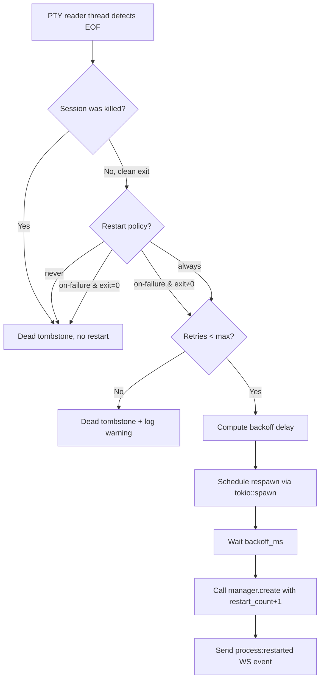

# F-01: Process Lifecycle Management — Feasibility & Plan

> Date: 2026-04-15
> Feature: F-01 from [2026-04-15-feature-backlog.md](file:///home/loidinh/ws/sharing/dam-hopper/plans/report/2026-04-15-feature-backlog.md#L47-L73)
> Verdict: **✅ FEASIBLE — LOW complexity (2–3 days)**

---

## 1. Feasibility Assessment

### 1.1 What F-01 Requires

| Capability | Description |
|---|---|
| `process:status` API | Enumerate running PTY sessions with PID, CPU, memory, uptime |
| Exit code tracking | Record exit code + timestamp when PTY exits |
| Auto-restart policy | `restart = "on-failure"` / `"always"` / `"never"` in TOML |
| Restart backoff | Exponential backoff, max 30s, prevents crash loops |
| WS push event | `process:exited { id, code, willRestart, restartIn }` |
| UI status dots | Green/yellow/red on project cards in dashboard |

### 1.2 Codebase Readiness (What Already Exists)

| Component | File | Status | Gap |
|---|---|---|---|
| PTY session map | [manager.rs](file:///home/loidinh/ws/sharing/dam-hopper/server/src/pty/manager.rs) | ✅ `Inner.live` + `Inner.dead` HashMaps | No PID/CPU/mem tracking |
| Exit code capture | [manager.rs](file:///home/loidinh/ws/sharing/dam-hopper/server/src/pty/manager.rs#L310-L338) | ✅ `harvest_exit_code()` → `DeadSession.meta.exit_code` | Already works; code=0 for clean, -1 for killed |
| `terminal:exit` WS event | [event_sink.rs](file:///home/loidinh/ws/sharing/dam-hopper/server/src/pty/event_sink.rs#L61-L66) | ✅ `send_terminal_exit(id, exit_code)` | Missing `willRestart` and `restartIn` fields |
| `terminal:changed` event | [event_sink.rs](file:///home/loidinh/ws/sharing/dam-hopper/server/src/pty/event_sink.rs#L69-L71) | ✅ Fires on create/kill/exit | Sufficient for UI refresh trigger |
| Session metadata | [session.rs](file:///home/loidinh/ws/sharing/dam-hopper/server/src/pty/session.rs#L46-L57) | ✅ `SessionMeta` has `id`, `project`, `alive`, `exit_code`, `started_at` | Missing: `restart_count`, `last_exit_at` |
| Project config schema | [schema.rs](file:///home/loidinh/ws/sharing/dam-hopper/server/src/config/schema.rs#L140-L186) | ✅ `ProjectConfig` / `ProjectConfigRaw` | Missing `restart`, `restart_max_retries`, `health_check_url` |
| Broadcast infra | [event_sink.rs](file:///home/loidinh/ws/sharing/dam-hopper/server/src/pty/event_sink.rs#L32-L76) | ✅ `BroadcastEventSink` → WS fan-out | `.broadcast()` method already generic |
| Dashboard UI | [DashboardPage.tsx](file:///home/loidinh/ws/sharing/dam-hopper/packages/web/src/components/pages/DashboardPage.tsx) | ✅ Session list with kill button | Missing status dots on project cards |
| Frontend types | [client.ts](file:///home/loidinh/ws/sharing/dam-hopper/packages/web/src/api/client.ts#L5-L14) | ✅ `SessionInfo` interface | Missing `restartPolicy`, `restartCount` |

### 1.3 Key Finding: PID/CPU/Memory

> [!WARNING]
> `portable-pty` (v0.8) does not expose the child PID through its public API. CPU + memory per process requires `/proc/<pid>/stat` on Linux or platform-specific calls.

**Options:**
1. **Fork portable-pty** – intrusive, maintenance burden → ❌
2. **Infer PID from session ID mapping** – unreliable → ❌  
3. **Skip PID/CPU/mem in v1, add `uptime` only** – pragmatic → ✅ **Recommended**

Since `SessionMeta.started_at` (epoch ms) already exists, uptime is trivially derived. CPU/memory can be a v2 follow-up using `sysinfo` crate if needed.

### 1.4 Verdict

| Aspect | Assessment |
|---|---|
| Server-side changes | Small — mostly additive (new fields, new respawn logic in reader thread) |
| Config changes | Trivial — 3 new optional fields in `ProjectConfigRaw` |
| Frontend changes | Small — status dots + enhanced session info display |
| Test impact | Easy — unit tests for backoff, integration test for exit → restart cycle |
| Risk | LOW — isolated to PTY module; no cross-cutting concerns |
| Effort | **2–3 days** (aligned with backlog estimate) |

---

## 2. Implementation Plan

### Phase 1: TOML Config Extension (0.5 day)

**Files:** [schema.rs](file:///home/loidinh/ws/sharing/dam-hopper/server/src/config/schema.rs), [parser.rs](file:///home/loidinh/ws/sharing/dam-hopper/server/src/config/parser.rs)

**Tasks:**

1. Add `RestartPolicy` enum to `schema.rs`:
   ```rust
   #[derive(Debug, Clone, PartialEq, Eq, Serialize, Deserialize, Default)]
   #[serde(rename_all = "kebab-case")]
   pub enum RestartPolicy {
       #[default]
       Never,
       OnFailure,
       Always,
   }
   ```

2. Add fields to `ProjectConfigRaw`:
   ```rust
   pub restart: Option<RestartPolicy>,          // default: Never
   pub restart_max_retries: Option<u32>,         // default: 5
   pub health_check_url: Option<String>,         // v2 — parse only, don't use yet
   ```

3. Mirror in `ProjectConfig` (resolved):
   ```rust
   pub restart: RestartPolicy,
   pub restart_max_retries: u32,
   pub health_check_url: Option<String>,
   ```

4. Update parser to propagate with defaults (`Never`, `5`, `None`)

5. Update frontend type `ProjectConfig` in [client.ts](file:///home/loidinh/ws/sharing/dam-hopper/packages/web/src/api/client.ts#L127-L136):
   ```typescript
   restart?: "never" | "on-failure" | "always";
   restartMaxRetries?: number;
   healthCheckUrl?: string;
   ```

6. **Tests:** Add config parsing test with `restart = "on-failure"` in TOML

---

### Phase 2: Enhanced Exit Tracking (0.5 day)

**Files:** [session.rs](file:///home/loidinh/ws/sharing/dam-hopper/server/src/pty/session.rs), [manager.rs](file:///home/loidinh/ws/sharing/dam-hopper/server/src/pty/manager.rs)

**Tasks:**

1. Extend `SessionMeta`:
   ```rust
   pub restart_count: u32,
   pub last_exit_at: Option<u64>,    // epoch ms
   pub restart_policy: RestartPolicy, // from config at spawn time
   ```

2. Extend `DeadSession`:
   ```rust
   pub exit_code: i32,          // already via meta.exit_code
   pub will_restart: bool,
   pub restart_in_ms: Option<u64>,
   ```

3. Update [PtyCreateOpts](file:///home/loidinh/ws/sharing/dam-hopper/server/src/pty/manager.rs#L23-L31) to accept restart policy:
   ```rust
   pub restart_policy: RestartPolicy,
   pub restart_max_retries: u32,
   ```

4. Update `SessionMeta::new()` to accept and store these values

---

### Phase 3: Auto-Restart Engine (1 day) ⭐ Core

**File:** [manager.rs](file:///home/loidinh/ws/sharing/dam-hopper/server/src/pty/manager.rs)

**Design:**



**Tasks:**

1. Add restart-aware logic to `reader_thread()`:
   - After `harvest_exit_code()`, check restart policy
   - If should restart: compute backoff, schedule respawn
   - If not: normal dead-session tombstone

2. Implement exponential backoff:
   ```rust
   fn restart_delay_ms(restart_count: u32) -> u64 {
       // 1s, 2s, 4s, 8s, 16s, 30s (capped)
       std::cmp::min(1000 * 2u64.pow(restart_count), 30_000)
   }
   ```

3. Add `was_killed` flag to distinguish manual kill (no restart) vs crash (may restart):
   - `kill()` and `remove()` set a flag in `Inner` before removing from `live`
   - Reader thread checks this flag

4. Respawn mechanism:
   - Reader thread can't call `manager.create()` directly (needs original `PtyCreateOpts`)
   - **Solution:** Store `PtyCreateOpts` (minus reader/writer) in `LiveSession` so reader thread can reconstruct spawn args
   - Use `tokio::spawn` + `tokio::time::sleep` for delayed restart

5. **Tests:**
   - Unit: `restart_delay_ms()` backoff values
   - Unit: should-restart decision matrix (policy × exit-code × retry-count)
   - Integration: spawn → crash → verify auto-restart (using `NoopEventSink`)

---

### Phase 4: WS Event Enhancement (0.5 day)

**Files:** [event_sink.rs](file:///home/loidinh/ws/sharing/dam-hopper/server/src/pty/event_sink.rs), [ws_protocol.rs](file:///home/loidinh/ws/sharing/dam-hopper/server/src/api/ws_protocol.rs)

**Tasks:**

1. Enhance `terminal:exit` event payload:
   ```json
   {
     "kind": "terminal:exit",
     "id": "run:api",
     "exitCode": 1,
     "willRestart": true,
     "restartIn": 2000,
     "restartCount": 2
   }
   ```

2. Add new `process:restarted` event:
   ```json
   {
     "kind": "process:restarted",
     "id": "run:api",
     "restartCount": 3,
     "previousExitCode": 1
   }
   ```

3. Update `EventSink` trait:
   ```rust
   fn send_terminal_exit_enhanced(
       &self, id: &str, exit_code: Option<i32>,
       will_restart: bool, restart_in_ms: Option<u64>, restart_count: u32,
   );
   fn send_process_restarted(&self, id: &str, restart_count: u32, prev_exit: i32);
   ```

4. Update `NoopEventSink` + `BroadcastEventSink` impls

---

### Phase 5: Frontend (0.5 day)

**Files:** [DashboardPage.tsx](file:///home/loidinh/ws/sharing/dam-hopper/packages/web/src/components/pages/DashboardPage.tsx), [client.ts](file:///home/loidinh/ws/sharing/dam-hopper/packages/web/src/api/client.ts), [TerminalTreeView.tsx](file:///home/loidinh/ws/sharing/dam-hopper/packages/web/src/components/organisms/TerminalTreeView.tsx)

**Tasks:**

1. Update `SessionInfo` type:
   ```typescript
   export interface SessionInfo {
     // ... existing fields ...
     restartPolicy?: "never" | "on-failure" | "always";
     restartCount?: number;
     lastExitAt?: number;
     willRestart?: boolean;
     restartInMs?: number;
   }
   ```

2. Add status dots to `SessionRow` in Dashboard:
   - 🟢 Green: alive, running normally
   - 🟡 Yellow: restarting (willRestart=true, waiting for backoff)
   - 🔴 Red: dead, not restarting (exit_code ≠ 0, retries exhausted or policy=never)
   - ⚪ Grey: dead, clean exit (exit_code=0, policy=never)

3. Handle `process:restarted` WS event → invalidate terminal session queries

4. Show restart count badge on session rows: `↻ 3` next to uptime

---

## 3. Risk Analysis

| Risk | Probability | Impact | Mitigation |
|---|---|---|---|
| Reader thread race on restart | Medium | Session ID collision during restart | Reuse same ID; `create()` already calls `kill_internal()` first |
| Crash loop flooding logs | Low | Log spam if process keeps crashing | Exponential backoff + max retries + log at warn level |
| `portable-pty` doesn't expose child PID | Confirmed | Can't report PID/CPU/mem | Skip in v1; document as v2 enhancement |
| Config hot-reload changes restart policy | Low | Running session uses stale policy | Policy is captured at spawn time; acceptable for v1 |
| Reader thread spawns tokio future | Low | Thread-pool mixing | Safe — `tokio::spawn` is thread-safe; reader thread only posts to tokio runtime |

---

## 4. File Change Summary

| File | Change Type | Lines Est. |
|---|---|---|
| `server/src/config/schema.rs` | Add `RestartPolicy` enum + 3 fields | +30 |
| `server/src/config/parser.rs` | Propagate new fields with defaults | +10 |
| `server/src/pty/session.rs` | Extend `SessionMeta` + `DeadSession` | +15 |
| `server/src/pty/manager.rs` | Restart logic in reader thread + backoff | +80 |
| `server/src/pty/event_sink.rs` | Enhanced exit event + restarted event | +30 |
| `server/src/pty/tests.rs` | Backoff + restart decision tests | +60 |
| `server/src/api/terminal.rs` | Pass restart policy through create | +5 |
| `packages/web/src/api/client.ts` | Update types | +10 |
| `packages/web/src/components/pages/DashboardPage.tsx` | Status dots, restart badge | +30 |
| **Total** | | **~270 lines** |

---

## 5. Unresolved Questions

1. **Default restart policy:** Should it be `"never"` (safe, opt-in) or `"on-failure"` (convenient)? **Recommendation:** `"never"` — explicit is better.

2. **Same session ID on restart?** Reusing the same ID (e.g. `run:api`) simplifies the frontend (no session ID churn). The existing `create()` already kills any prior session with the same ID. **Recommendation:** Reuse same ID.

3. **Health check (v2):** The TOML field `health_check_url` should be parsed now but not acted on. Health check polling is a separate concern (HTTP request → mark healthy/unhealthy) best deferred to F-06 (Dashboard) where it has UI to display.

4. **Restart counter persistence:** Should `restart_count` reset when the process exits cleanly (code=0) after being restarted? **Recommendation:** Yes — a clean exit resets the counter (proves the issue was transient).
