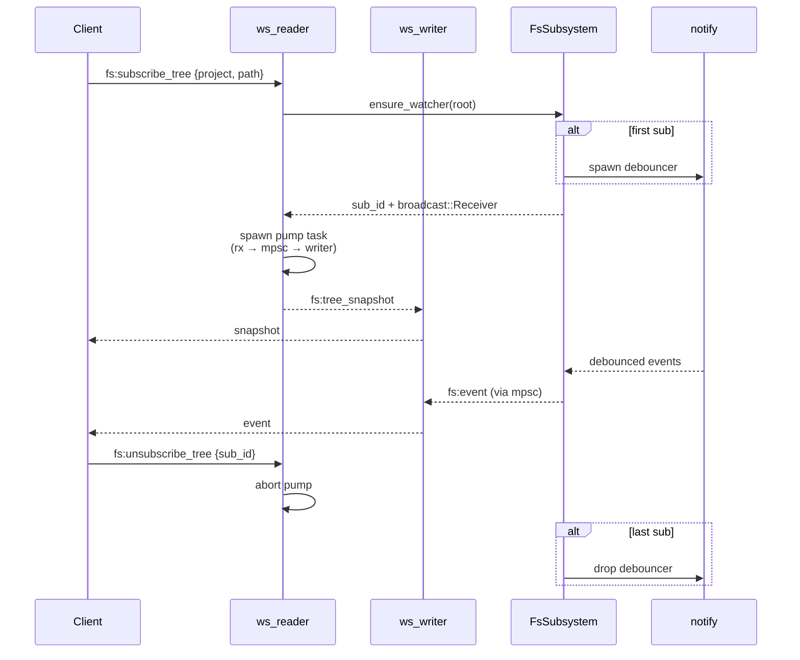

# Phase 02 — Watcher + WS subscription protocol

## Context links

- Parent: [plan.md](./plan.md)
- Prev: [phase-01-server-fs-foundation.md](./phase-01-server-fs-foundation.md)
- Researcher: `research/researcher-01-server-fs.md` §1, §5, §6
- Scout: `scout/scout-01-codebase.md` §3 (api/ws.rs)

## Overview

Date: 2026-04-07. Add `notify-debouncer-full` watcher (single shared per workspace root, refcounted), `FsWatcherManager`, extend `FsSubsystem` with subscribe/unsubscribe. Refactor `api/ws.rs` from single-loop to writer-task + reader-task pattern with per-conn bounded `mpsc(512)`. Extend WS envelope with `fs:*` kinds. Drop-on-overflow for fs subs. inotify limit probe at startup.

Priority: P2. Implementation: done (2026-04-08). Review: done (2026-04-08).

## Key Insights

- Debouncer callback runs on a **std thread**, not tokio. Bridge via `mpsc::unbounded_channel` then re-broadcast in tokio task (mirrors PTY broadcaster).
- One recursive watcher per workspace root, NOT per project. Server-side filter per-subscription by path prefix.
- `ws.rs` refactor is the riskiest part — preserve PTY behavior. Port PTY paths into the new pattern with NO logic change first; add fs handlers second.
- WS envelope changes from `{type, ...}` to `{id?, channel, kind, payload}`. **Hard cut — no shim.** Server and web flip atomically in the same PR (validated 2026-04-08). Any external WS consumers must update.
- Fan-in pattern: each subscription pump task holds an `mpsc::Sender` clone; the writer task owns the `SplitSink` exclusively.
- Drop-on-overflow for fs: `try_send` Full → close conn with code 1009. PTY keeps drop-oldest.
- inotify limit probe: read `/proc/sys/fs/inotify/max_user_watches` at startup. Warn if < 65536.

## Requirements

**Functional**
- WS messages: `fs:subscribe_tree`, `fs:unsubscribe_tree`, `fs:tree_snapshot`, `fs:event` (push), `fs:read`, `fs:file_chunk` (placeholder, full impl Phase 04).
- First subscriber to a workspace root spawns watcher; last unsub aborts watcher.
- Snapshot returned synchronously after subscribe ack; subsequent events streamed.
- All fs events filtered server-side by `params.path` prefix.
- ws.rs uses writer-task + reader-task pattern; PTY routes preserved.

**Non-functional**
- bounded mpsc cap = 512 per connection (configurable).
- Snapshot generation must not block ws reader (spawn in task).
- Watcher debounce: 150 ms.
- Test: e2e via `tokio_tungstenite` client subscribing → file create → event received.

## Architecture



## Related code files

**Add**
- `server/src/fs/watcher.rs` — `FsWatcherManager`, `spawn_watcher`
- `server/src/fs/event.rs` — normalized `FsEvent { kind, path, mtime }`
- `server/src/api/ws_protocol.rs` — envelope types, kinds enum
- `server/tests/ws_fs_subscribe.rs` — e2e test

**Modify**
- `server/Cargo.toml` — `notify = "7"`, `notify-debouncer-full = "0.4"`
- `server/src/fs/mod.rs` — `Inner` gains `watcher_mgr: FsWatcherManager`; subs map
- `server/src/api/ws.rs` — full refactor: split read/write, add dispatch arms
- `server/src/api/mod.rs` — `pub mod ws_protocol;`
- `server/src/lib.rs` — startup inotify probe + warn log
- `server/src/state.rs` — no change (FsSubsystem already there)

## Implementation Steps

1. **Cargo deps** — `notify = "7"`, `notify-debouncer-full = "0.4"`.
2. **FsEvent normalization** — `server/src/fs/event.rs`:
   ```rust
   #[derive(Clone, Serialize)] pub enum FsEventKind { Created, Modified, Removed, Renamed }
   #[derive(Clone, Serialize)] pub struct FsEvent { pub kind: FsEventKind, pub path: PathBuf, pub from: Option<PathBuf> }
   pub fn normalize(res: DebounceEventResult) -> Vec<FsEvent>;
   ```
3. **Watcher** — `server/src/fs/watcher.rs`:
   ```rust
   pub struct FsWatcherManager { inner: Arc<Mutex<HashMap<PathBuf, WatcherHandle>>> }
   struct WatcherHandle { tx: broadcast::Sender<FsEvent>, refcount: usize, _join: std::thread::JoinHandle<()> }
   impl FsWatcherManager {
     pub fn subscribe(&self, root: &Path) -> broadcast::Receiver<FsEvent>;
     pub fn release(&self, root: &Path);
   }
   ```
   `subscribe`: lock, get-or-spawn handle, refcount++, return `tx.subscribe()`. `release`: refcount--, drop on zero (parks std thread → drop debouncer → thread exits).
4. **FsSubsystem subs map** — extend `Inner` with `subs: HashMap<u64, SubInfo>`, `next_sub_id: u64`. Methods `subscribe_tree(project, path) -> (sub_id, snapshot, Receiver<FsEvent>)` and `unsubscribe_tree(sub_id)`.
5. **WS protocol types** — `server/src/api/ws_protocol.rs`:
   ```rust
   #[derive(Deserialize)] #[serde(tag="kind")]
   pub enum ClientMsg {
     #[serde(rename="terminal:write")] TermWrite{id:String, data:String},
     #[serde(rename="terminal:resize")] TermResize{id:String, cols:u16, rows:u16},
     #[serde(rename="fs:subscribe_tree")] FsSubTree{req_id:u64, project:String, path:String},
     #[serde(rename="fs:unsubscribe_tree")] FsUnsubTree{sub_id:u64},
     #[serde(rename="fs:read")] FsRead{req_id:u64, project:String, path:String, offset:Option<u64>, len:Option<u64>},
   }
   #[derive(Serialize)] #[serde(tag="kind")]
   pub enum ServerMsg {
     #[serde(rename="fs:tree_snapshot")] TreeSnapshot{req_id:u64, sub_id:u64, nodes:Vec<TreeNode>},
     #[serde(rename="fs:event")] FsEvent{sub_id:u64, event:FsEventDto},
     #[serde(rename="fs:read_result")] FsReadResult{req_id:u64, ok:bool, mime:Option<String>, binary:bool},
     // file_chunk is binary frame, not JSON
     // ...terminal variants
   }
   ```
6. **ws.rs refactor** — `server/src/api/ws.rs`:
   - Split `socket.split()` into `(ws_tx, ws_rx)`.
   - Spawn `writer_task`: owns `ws_tx`, drains `mpsc::Receiver<WireMsg>(512)`. WireMsg = `Text(String)|Binary(Vec<u8>)`.
   - `reader_task`: owns `ws_rx`, parses ClientMsg, dispatches:
     - terminal:* → existing `pty_manager` paths, send results via `out_tx.send().await`
     - fs:subscribe_tree → call `fs.subscribe_tree`, send snapshot, spawn pump task `loop { rx.recv().await → out_tx.try_send() }`. On `Full` → close conn 1009.
     - fs:unsubscribe_tree → abort pump JoinHandle stored in conn map
   - Per-conn state: `HashMap<sub_id, JoinHandle>` for pump tasks; cleanup on disconnect.
   - PTY broadcaster pump task identical pattern but uses `out_tx.send().await` (drop-oldest preserved at PTY broadcaster level, not at mpsc).
7. **Snapshot generation** — `FsSubsystem::tree_snapshot(abs_path, depth=1)` returns `Vec<TreeNode>`. Lazy: only top level by default; client requests deeper via separate `fs:list` (Phase 03).
8. **inotify probe** — `server/src/lib.rs` startup: read `/proc/sys/fs/inotify/max_user_watches`, log warn if `< 65536`. Skip on non-Linux.
9. **Tests** — `server/tests/ws_fs_subscribe.rs`:
   - spin server on ephemeral port
   - `tokio_tungstenite::connect_async`, send `fs:subscribe_tree`
   - assert snapshot received
   - create file in temp workspace, assert `fs:event` arrives within 1s
   - send unsubscribe, create another file, assert no event
10. **Atomic cutover coordination** — Phase 02 + Phase 03 envelope migration MUST land in same PR. Server parser accepts new envelope only; no legacy fallback. Pre-merge checklist: full PTY test suite green on new envelope, manual smoke of terminal + git + dashboard routes.

## Todo list

- [ ] Cargo deps notify + debouncer-full
- [ ] FsEvent + normalize
- [ ] FsWatcherManager refcounted
- [ ] FsSubsystem subs map + tree_snapshot
- [ ] ws_protocol.rs envelope types
- [ ] ws.rs writer_task + reader_task split
- [ ] Port PTY paths into new pattern (no logic change)
- [ ] fs:subscribe_tree dispatch + pump
- [ ] fs:unsubscribe_tree dispatch
- [ ] Drop-on-overflow for fs subs
- [ ] inotify probe at startup
- [ ] Integration test ws_fs_subscribe
- [ ] PTY tests still green

## Success Criteria

- All existing PTY tests pass after ws.rs refactor (NO regressions).
- New ws_fs_subscribe test passes.
- Subscribing to non-existent project → error ack.
- Watcher refcount: subscribe twice, unsub once → watcher still alive; unsub again → watcher dropped.
- Drop-on-overflow: fill mpsc, conn closes with 1009.

## Risk Assessment

| Risk | Likelihood | Impact | Mitigation |
|---|---|---|---|
| ws.rs refactor breaks PTY | H | H | port PTY first with no logic change; full PTY test suite must pass; atomic server+web PR (no shim safety net) |
| inotify ENOSPC on huge repo | M | H | startup probe + clear error; future PollWatcher fallback flag |
| Watcher race vs explicit ops (Phase 05) | M | M | client reconciles via setQueryData merge; refetch on drift |
| std-thread leaked on FsSubsystem drop | L | M | park + unpark on drop; wait_join with timeout |
| Snapshot blocks ws reader for large dir | M | M | spawn snapshot in tokio::task; depth=1 default |

## Security Considerations

- Subscribe path validated through sandbox (Phase 01 helper) before watcher attaches.
- Watcher events filtered server-side by sub path prefix — clients cannot spy on siblings.
- Drop-on-overflow prevents memory blowup from slow consumers.

## Next steps

Phase 03 builds the web shell consuming `fs:subscribe_tree` + `fs:tree_snapshot` + `fs:event` for read-only browsing.
