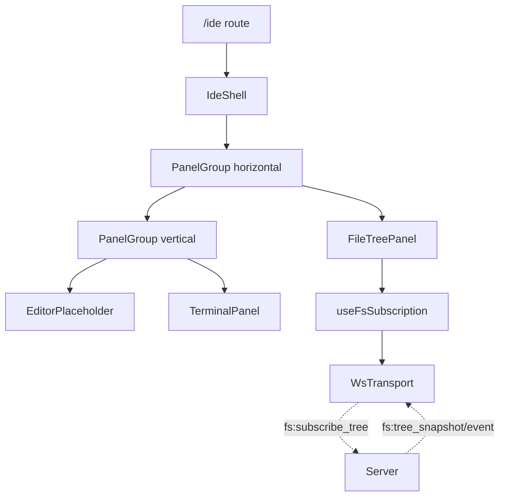

# Phase 03 — Web IDE shell + read-only tree

## Context links

- Parent: [plan.md](./plan.md)
- Prev: [phase-02-watcher-ws-protocol.md](./phase-02-watcher-ws-protocol.md)
- **Dependency**: [phase-06-atomic-design-refactor.md](./phase-06-atomic-design-refactor.md) — MUST merge first so new components land in clean atomic tiers
- Researcher: `research/researcher-02-web-editor.md` §2, §3, §4
- Scout: `scout/scout-01-codebase.md` §10–§14

## Overview

Date: 2026-04-07. New `IdeShell` top-level layout (NOT a refactor of `AppLayout`) at route `/ide`. Three-pane resizable via `react-resizable-panels`, file tree via `react-arborist`, terminal pane embeds existing `TerminalPanel`. Editor pane is a placeholder. `useFsSubscription` hook drives tree state. Behind feature flag (web reads `/api/health` features bitfield).

Priority: P2. Implementation: pending. Review: pending.

## Key Insights

- New shell, NOT refactor of `AppLayout` — keeps Dashboard/Settings/etc untouched. `/ide` route lazy-imports `IdeShell`.
- Tree state lives in TanStack Query cache (`["fs-tree", project, path]`); WS push events apply via `setQueryData(prev → applyDelta(prev, ev))`. No Zustand for tree.
- `react-arborist` lazy children: store children as `null` until expanded; `onToggle` calls `fs:list` (Phase 01 REST or new WS msg).
- WsTransport gains `fsSubscribeTree(project, path) → Promise<{sub_id, snapshot}>` and `fsUnsubscribeTree(sub_id)`. Promise correlated by `req_id`.
- Feature flag exposed via `GET /api/health` extension `{features: {ide_explorer: bool}}`. Web hides `/ide` route when off.
- `autoSaveId` on `PanelGroup` persists pane sizes to localStorage automatically.
- Components land in atomic tiers from day one — `IdeShell` is a template, `FileTree`/`EditorTabs` are organisms. See Phase 06 for refactor context.

## Requirements

**Functional**
- Route `/ide` with three panes: tree (left, default 18%), editor placeholder (top-right, 70%), terminal (bottom-right, 30%).
- Tree: project switcher header, root nodes from snapshot, lazy children, hidden-files toggle (`.dotfiles` filter).
- Live updates: file create/rename/delete reflected within ~200 ms.
- Pane sizes persisted across reloads.
- Right pane terminal embeds existing `TerminalPanel` reusing current PTY session.
- Feature flag off → no `/ide` link in sidebar; route returns 404.

**Non-functional**
- Initial JS chunk increase ≤ 50 KB (heavy stuff lazy in Phase 04).
- Tree handles 10k nodes without jank (react-arborist virtualization).
- Subscription cleanup on unmount: `fs:unsubscribe_tree` always sent.

## Architecture



## Related code files

**Add** (placed per atomic tiers — Phase 06)
- `packages/web/src/components/templates/IdeShell.tsx` — three-pane layout, slot-based template
- `packages/web/src/components/organisms/FileTree.tsx` — react-arborist wrapper, owns subscription state
- `packages/web/src/components/organisms/EditorPlaceholder.tsx` — empty state + open file list (Phase 04 replaces with `EditorTabs`)
- `packages/web/src/components/organisms/TerminalDock.tsx` — wraps existing `TerminalPanel`
- `packages/web/src/hooks/useFsSubscription.ts`
- `packages/web/src/hooks/useFeatureFlag.ts`
- `packages/web/src/pages/IdePage.tsx` — composes `IdeShell` + organisms; owns route state
- `packages/web/src/api/fs-types.ts`
- File icons: reuse `lucide-react` directly inside `FileTree` node renderer; do NOT add a `FileIcon` atom (YAGNI; revisit if icon logic grows).

**Modify**
- `packages/web/package.json` — add `react-resizable-panels`, `react-arborist`, `zustand`
- `packages/web/src/api/ws-transport.ts` — add `fsSubscribeTree`, `fsUnsubscribeTree`, `fs:event` channel; envelope migration
- `packages/web/src/api/client.ts` — fs types
- `packages/web/src/App.tsx` — `/ide` lazy route; conditional sidebar link
- `server/src/api/health.rs` (or wherever health lives) — return features

## Implementation Steps

1. **pnpm deps** — `pnpm -F @dev-hub/web add react-resizable-panels react-arborist zustand`.
2. **WsTransport envelope migration** — `packages/web/src/api/ws-transport.ts`:
   - Update outbound to send `{id?, channel, kind, payload}` form. **Hard cut — remove any legacy envelope code.**
   - Must land in same PR as Phase 02 server changes (atomic cutover).
   - Pre-merge smoke: terminal open/write/resize, git panel, dashboard all functional on new envelope.
   - Add `fsSubscribeTree(project, path): Promise<{sub_id, nodes}>` — generates `req_id`, stores resolver in pending map, sends `fs:subscribe_tree`, awaits `fs:tree_snapshot` with matching `req_id`.
   - Add `fsUnsubscribeTree(sub_id)` — fire-and-forget.
   - Add `onFsEvent(sub_id, cb)` registry keyed by sub_id.
3. **fs types** — `packages/web/src/api/fs-types.ts`: `TreeNode`, `FsEvent`, `FileStat`, etc., mirrored from server JSON.
4. **useFsSubscription hook** — `packages/web/src/hooks/useFsSubscription.ts`:
   ```ts
   export function useFsSubscription(project: string, path: string) {
     const qc = useQueryClient();
     const transport = getTransport();
     return useQuery({
       queryKey: ["fs-tree", project, path],
       queryFn: async () => {
         const { sub_id, nodes } = await transport.fsSubscribeTree(project, path);
         const off = transport.onFsEvent(sub_id, (ev) => {
           qc.setQueryData(["fs-tree", project, path], (prev) => applyFsDelta(prev, ev));
         });
         // store cleanup in queryClient meta or component effect
         return { sub_id, nodes, off };
       },
       staleTime: Infinity,
     });
   }
   ```
   Sub cleanup: separate `useEffect` returns `() => { off(); fsUnsubscribeTree(sub_id); }`.
5. **applyFsDelta** — pure function, splices node by parent path. On unknown parent → trigger refetch (drift recovery).
6. **FileTree.tsx** — react-arborist `<Tree data={nodes} onToggle={...} onActivate={onOpen}>`. Inline node renderer with icon (lucide), name, hidden-files filter.
7. **templates/IdeShell.tsx** — react-resizable-panels skeleton from researcher §2 with `autoSaveId="ide-main"` / `"ide-center"`. Pure layout; accepts tree/editor/terminal as children or named slots.
8. **organisms/TerminalDock.tsx** — embeds `TerminalPanel`, ensures one PTY session per IDE mount; reuses existing `getTransport()` pty methods.
9. **organisms/EditorPlaceholder.tsx** — empty state "Select a file" + open files list (placeholder, real Phase 04).
10. **IdePage + route** — `App.tsx` adds `<Route path="/ide" element={<Suspense fallback={<Spinner/>}><IdePage/></Suspense>}/>` with `lazy(() => import('./pages/IdePage'))`.
11. **Feature flag** — `useFeatureFlag('ide_explorer')` reads from `useQuery(['health'])` response. Sidebar IDE link conditional.
12. **Health endpoint** — extend server `health` handler to return `{features: {ide_explorer: bool}}`.
13. **Manual smoke test** — start server with flag on, navigate `/ide`, see tree, touch a file in workspace, see new node appear, resize panes, reload — sizes restored.

## Todo list

- [ ] Add deps
- [ ] WsTransport envelope migration + fs methods
- [ ] fs-types.ts
- [ ] useFsSubscription hook
- [ ] applyFsDelta + drift recovery
- [ ] FileTree (react-arborist)
- [ ] IdeShell (PanelGroup)
- [ ] TerminalDock
- [ ] EditorPlaceholder
- [ ] IdePage lazy route
- [ ] Feature flag in /api/health + useFeatureFlag
- [ ] Sidebar conditional link
- [ ] Manual smoke test

## Success Criteria

- `/ide` renders three panes when flag on; 404 when off.
- Tree shows workspace project files; expand lazy-loads children.
- Creating a file via `touch` reflects in tree within 200 ms.
- Pane sizes persist across reload.
- Hidden files toggle works.
- Existing routes (Dashboard, Terminals, Git, Settings) unchanged.

## Risk Assessment

| Risk | Likelihood | Impact | Mitigation |
|---|---|---|---|
| Bundle bloat from arborist+panels | L | L | both ~40 KB combined; acceptable |
| Sub leak on route unmount | M | M | `useEffect` cleanup + transport-side tracker |
| Drift on missed events | M | M | refetch full snapshot on unknown parent |
| Envelope migration breaks terminals | M | H | atomic server+web PR; mandatory PTY + terminal smoke test pre-merge; no shim safety net |

## Security Considerations

- Project name + path validated server-side via Phase 01 sandbox.
- Tree subscribes only show paths under project root.
- No client-side path manipulation trusted.

## Next steps

Phase 04 swaps `EditorPlaceholder` for Monaco with tabs, save, large-file tiering.
