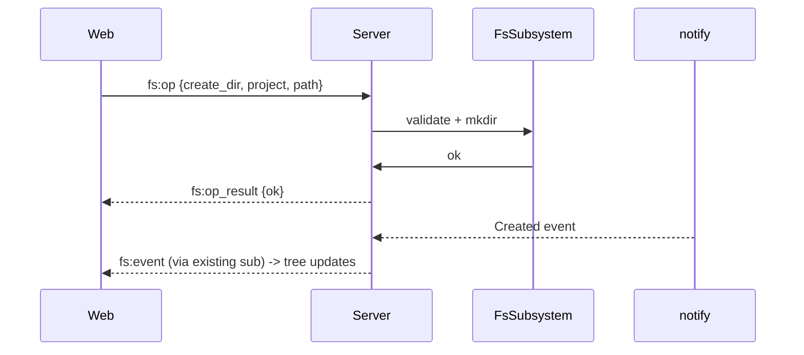

# Phase 05 — Mutating ops + upload/download

## Context links

- Parent: [plan.md](./plan.md)
- Prev: [phase-04-monaco-edit-save.md](./phase-04-monaco-edit-save.md)
- Researcher: `research/researcher-01-server-fs.md` §3, §6
- Scout: §6 (errors), §8 (sandbox)

## Overview

Date: 2026-04-07 (revised 2026-04-08). Add create/rename/delete/move ops, WS-chunked upload (`fs:upload_*` ack-per-seq backpressure), streaming download via REST. Server-side guardrails: refuse project root delete, refuse `.git/` writes unless override flag, audit log on every mutation. Integration tests per op.

Priority: P2. Implementation: pending. Review: pending.

## Key Insights

- Mutating ops use a single WS message kind `fs:op` with `op: 'create_file'|'create_dir'|'rename'|'delete'|'move'`. Result: `fs:op_result {req_id, ok, error?}`.
- **Upload via WS only** — `fs:upload_begin` / `fs:upload_chunk` (binary frame) / `fs:upload_commit`, mirroring `fs:write_*` from Phase 04 (validated 2026-04-08). No REST multipart path. Browser `UploadDropzone` hand-rolls `File.stream()` → 128KB reads → WS binary frames with ack-per-seq backpressure.
- Download via REST `GET /api/fs/download?project=&path=` with `Content-Disposition: attachment` — uses browser `<a>` tag, no JS streaming.
- Recursive delete: server walks via `tokio::fs::remove_dir_all`. Hard refuse on project root path. Hard refuse on `.git/` unless `force_git=true` in op payload.
- Zip-slip on upload: filename validated via sandbox before write. Reject any `upload_begin.filename` containing path separators or `..`; client provides target dir explicitly in payload.
- Audit log: structured tracing event `audit.fs` with `{user, op, project, path, success}`. Sink TBD (file rotation deferred).

## Requirements

**Functional**
- WS `fs:op` ops: `create_file`, `create_dir`, `rename`, `delete`, `move`.
- WS `fs:upload_begin` / `fs:upload_chunk` / `fs:upload_commit`, max 100 MB, ack-per-seq.
- REST `GET /api/fs/download?project=&path=` streaming.
- Web: tree context menu (right-click) → New File / New Folder / Rename / Delete / Download / Upload Here.
- Confirm dialog for delete (especially recursive).
- Refuse: project root delete, parent escape, `.git/` writes (unless force flag), zero-length filename.
- Audit log entry per mutation.

**Non-functional**
- Upload backpressure via per-seq ack prevents OOM on large files and slow disks.
- Download streams without buffering full file.
- Each op covered by integration test (WS client for upload).

## Architecture



## Related code files

**Add**
- `server/src/fs/mutate.rs` — `create_file`, `create_dir`, `rename`, `delete`, `move_path`
- `server/src/fs/upload.rs` — WS upload state (`UploadState { temp: NamedTempFile, bytes_written: u64, expected_len: u64, next_seq: u64 }`) keyed by `upload_id` in conn-local map
- `server/src/fs/audit.rs` — structured tracing macros
- `server/tests/fs_mutate.rs` — integration tests
- `server/tests/fs_upload.rs` — WS client test (`tokio_tungstenite`)
- `packages/web/src/components/organisms/TreeContextMenu.tsx` — popover + mutation actions
- `packages/web/src/components/organisms/UploadDropzone.tsx` — drag-drop wrapper, streams `File` via WS `fs:upload_*`
- `packages/web/src/components/organisms/FileUploadDialog.tsx` — modal upload (button-triggered fallback to dropzone)
- `packages/web/src/components/organisms/ConfirmDeleteDialog.tsx` — reuse `PassphraseDialog` form pattern
- `packages/web/src/hooks/useFsOps.ts` (NOT a component)
- `packages/web/src/hooks/useFsUpload.ts` (NOT a component) — progress state + WS chunk pump

**Modify**
- `server/src/fs/mod.rs` — re-export mutate + upload
- `server/src/api/ws.rs` — `fs:op` dispatch + `fs:upload_begin/chunk/commit` dispatch; per-conn uploads map
- `server/src/api/fs.rs` — `download` handler only (no upload REST)
- `server/src/api/router.rs` — register download route (no upload route)
- `packages/web/src/api/ws-transport.ts` — `fsOp(op, params)` + `fsUploadFile(project, dir, file, onProgress) → Promise<void>`
- `packages/web/src/components/organisms/FileTree.tsx` — wire context menu

## Implementation Steps

1. **mutate.rs** — five async fns, all take `&WorkspaceSandbox` + paths, validate, dispatch `tokio::fs`. `delete` uses `remove_dir_all` for dirs after refusal checks.
2. **Refusal checks** — helper `assert_safe_mutation(abs, project_root) -> Result<(), FsError>`:
   - reject if `abs == project_root`
   - reject if `abs.components()` contains `.git` unless caller passes `force_git=true`
   - reject if filename empty
3. **fs:op dispatch** — `api/ws.rs` adds `ClientMsg::FsOp{req_id, op, project, ...}` arm. Validates, calls mutate fn, emits `fs:op_result`. Watcher delivers the side effect via existing subscription.
4. **Audit hook** — `audit.rs`:
   ```rust
   #[macro_export]
   macro_rules! audit_fs { ($op:expr, $project:expr, $path:expr, $ok:expr) => { tracing::info!(target:"audit.fs", op=$op, project=$project, path=?$path, ok=$ok); }; }
   ```
   Called inside each mutate fn.
5. **WS upload dispatch** — `api/ws.rs` + `fs/upload.rs`:
   - `ClientMsg::FsUploadBegin { req_id, upload_id, project, dir, filename, len }` — validate filename (no `/`, `\`, `..`), join with `dir`, validate via sandbox, reject `len > 100 MB`, create `NamedTempFile::new_in(parent)`, insert `UploadState` into per-conn `HashMap<String, UploadState>`, ack `fs:upload_begin_ok { req_id, upload_id }`.
   - `ClientMsg::FsUploadChunk { upload_id, seq }` paired with following Binary frame (same write_id correlation pattern as Phase 04 `fs:write_chunk`). Reader task holds last-seen-upload_id so Binary frame pairs correctly. Validate `seq == state.next_seq`, append bytes, check running byte count ≤ declared `len` and ≤ 100 MB, `next_seq += 1`, ack `fs:upload_chunk_ack { upload_id, seq }`.
   - `ClientMsg::FsUploadCommit { req_id, upload_id }` — verify `bytes_written == expected_len`, optional `fsync`, `persist()` (atomic rename), audit log, drop state, ack `fs:upload_result { req_id, ok, new_mtime }`. On connection drop: temp files auto-cleaned by `NamedTempFile::Drop`.
6. **Download handler** — `api/fs.rs`:
   - validate path
   - `tokio::fs::File::open` → `tokio_util::io::ReaderStream` → `Body::from_stream`
   - set `Content-Disposition: attachment; filename=...`
   - set `Content-Type` from `infer` or `mime_guess`
7. **Router** — register `GET /api/fs/download` only (gated on feature flag). Upload is WS dispatch, not router.
8. **Integration tests** — `fs_mutate.rs`:
   - create_file → exists, audit fired
   - create_dir nested → exists
   - rename file → renamed, watcher event
   - delete file → gone
   - delete dir recursive → gone
   - delete project root → refused 403
   - delete `.git/HEAD` → refused 403; with force_git → allowed
   - move across dirs → renamed correctly
9. **Upload test** — `fs_upload.rs`: `tokio_tungstenite` client connects, sends `fs:upload_begin`, streams N chunks with ack-await per seq, sends `fs:upload_commit`, asserts file present + content match. Additional cases: zip-slip filename rejected at begin, len > 100MB rejected at begin, overrun (sum of chunks > declared len) rejected at chunk, out-of-order seq rejected, commit without matching bytes_written rejected, connection drop mid-upload → temp file cleaned.
10. **Web context menu** — `TreeContextMenu.tsx`: position-aware popover; calls `useFsOps().createFile/createDir/rename/delete/download`.
11. **useFsOps hook** — wraps `transport.fsOp` returning mutations; invalidates `["fs-tree", project, path]` (though watcher event also triggers, double invalidation is idempotent).
12. **UploadDropzone + useFsUpload** — drag-drop wrapper around tree pane; `useFsUpload` hook pumps `file.stream().getReader()` → 128KB slices → `transport.fsUploadFile`. Progress state derived from seq acks. `ws-transport.ts` `fsUploadFile`: sends `fs:upload_begin`, awaits ack, loops: send JSON header `fs:upload_chunk` + Binary frame, await per-seq ack (bounded in-flight window of 4 for throughput), send `fs:upload_commit`, await result. Errors abort + send no commit (server cleans temp on disconnect or timeout).
13. **Confirm dialog** — reuse PassphraseDialog pattern for delete confirm.
14. **Smoke test** — full CRUD via UI: create, rename, delete, upload via drag-drop, download via context menu.

## Todo list

- [ ] mutate.rs five ops
- [ ] assert_safe_mutation guardrails
- [ ] audit_fs macro
- [ ] fs:op WS dispatch
- [ ] fs:upload_begin/chunk/commit WS dispatch + per-conn state map
- [ ] download handler (streaming)
- [ ] Router: download only (no upload route)
- [ ] fs_mutate integration tests (8)
- [ ] fs_upload WS integration tests (happy + 5 error cases)
- [ ] Web TreeContextMenu
- [ ] useFsOps hook
- [ ] useFsUpload hook (stream → WS chunks, progress)
- [ ] ws-transport.fsUploadFile with in-flight ack window
- [ ] UploadDropzone
- [ ] Delete confirm dialog
- [ ] Manual full-CRUD smoke (upload 50MB file via drag-drop)

## Success Criteria

- All ops succeed end-to-end via UI.
- Zip-slip filename rejected at `fs:upload_begin`.
- Project root delete rejected.
- `.git/HEAD` write rejected without force flag.
- Audit log entries appear in stderr (tracing) for every mutation.
- Watcher delivers fs:event so tree auto-updates without manual refetch.
- Upload of 50 MB file succeeds without OOM.

## Risk Assessment

| Risk | Likelihood | Impact | Mitigation |
|---|---|---|---|
| Recursive delete wrong path | M | H | sandbox + project_root refusal + confirm dialog |
| Zip-slip via filename | M | H | reject `/` and `..` in multipart filename pre-join |
| Upload OOM | M | H | streaming + 100 MB cap + per-chunk append (no full buffer) |
| WS upload protocol complexity | M | M | mirrors Phase 04 `fs:write_*` exactly; shared binary-frame pairing code; in-flight ack window capped at 4 |
| Browser File.stream() support | L | M | all modern browsers support since 2020; fall back error if absent |
| Watcher race vs explicit op (event arrives before result) | M | L | client deduplicates by path; idempotent setQueryData |
| `.git` corruption | L | H | refuse by default; force flag for power users |
| Audit log floods stderr | M | L | structured target `audit.fs`; future file sink |

## Security Considerations

- Every mutation passes through sandbox + assert_safe_mutation.
- Filename in `fs:upload_begin` sanitized BEFORE join (no `/`, `\`, `..`).
- Audit log captures user (token id), op, path, success.
- Force-git flag must be opt-in per request, never sticky.
- Upload cap enforced as running byte count at chunk dispatch, not header trust. Overrun → abort + drop temp.
- Declared `len` checked at begin AND enforced at commit (`bytes_written == expected_len`).

## Next steps

Feature complete behind flag. Post-merge tasks (deferred): git tree decorations, server-side `.gitignore` filter, search/grep, fsync config knob, audit file sink, multi-cursor collab. Open questions in `plan.md` carry forward.
