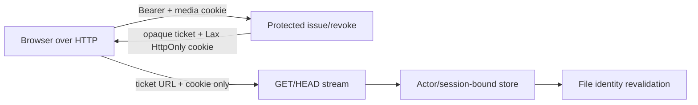

# Phase 01 — Preflight and Backend HTTP Contract

## Context links

- [Plan](./plan.md) · [Prior session-bound design](../260812-1747-session-bound-media-stream-authorization/plan.md)
- [Architecture](../../docs/system-architecture.md) · [Configuration](../../docs/configuration-guide.md) · [Standards](../../docs/code-standards.md)
- `server/src/main.rs` · `server/src/api/router.rs` · `server/src/api/auth.rs` · `server/src/fs/media_session.rs`

## Overview

- Date: 2026-08-13
- Description: freeze route/cookie/CORS preflight, remove transport-only startup guards, emit HTTP-compatible cookies.
- Priority: P1
- Implementation status: Pending
- Review status: Required; backend/security review before Phase 2

## Key Insights

- Security authority already lives in Bearer middleware + actor-bound ticket/session store; HTTPS checks only gate transport.
- `SameSite=None` without `Secure` is browser-invalid. Minimal global HTTP policy: media `SameSite=Lax`, no `Secure`/`Partitioned`; supports same-origin and schemefully same-site, not cross-site HTTP.
- `Partitioned` is tied to `Secure`; retaining it would create false support. Set and clear attributes must remain symmetric.
- Empty CORS must mean disabled CORS, not reflection. Same-origin HTTP needs no CORS headers.
- `AUTH_COOKIE` fallback also needs non-Secure transport to work over HTTP; UI still uses Bearer first, reducing reliance on it.

## Requirements

- Preserve protected route middleware for image/video issue, ticket revoke, and `DELETE /api/fs/media-session`; preserve stream routes outside Bearer middleware and require media cookie + ticket.
- Preserve random opaque token, digest-only server storage, actor/session binding, 30m idle/8h absolute TTL, all current global/per-actor/per-session capacities, prune-before-admit, final recheck/touch, revalidation, restart/workspace/logout revocation.
- Remove `trusted_tls_proxy` CLI/env and authenticated non-loopback guard. Keep `--no-auth` loopback safety unchanged.
- Parse optional comma-separated exact HTTP/HTTPS CORS origins. `None` or whitespace-only → empty allowlist; `*`, malformed, path/query/user-info/fragment, duplicate/canonical duplicate still fail. Default no-auth behavior no longer invents HTTPS localhost.
- Build router without `CorsLayer` when allowlist empty; configured list retains credentials, methods/headers, exposed Range headers, and `Vary: Origin`.
- Media cookie exact set/clear: `HttpOnly; SameSite=Lax; Path=/api/fs; Max-Age={28800|0}`; omit `Secure`, `Partitioned`, `Domain`.
- Auth cookie exact set/clear: `HttpOnly; SameSite=Strict; Path=/[; Max-Age=0]`; omit `Secure`, `Domain`. Centralize builder to prevent login/dev-login/logout drift.

## Architecture

- Alternatives rejected: dynamic Secure based on headers (proxy trust complexity/fixation risk), `SameSite=None` without Secure (browser rejection), wildcard CORS (credential theft), bearer stream (native elements cannot set it).

## Related code files

- Modify `server/src/main.rs` — remove TLS-proxy CLI/env and authenticated bind check; retain no-auth loopback validation/tests.
- Modify `server/src/api/router.rs` — optional exact HTTP/HTTPS allowlist; no CORS layer when absent; update parser/preflight tests.
- Modify `server/src/api/auth.rs` — shared non-Secure auth set/clear cookie builders; keep Bearer precedence.
- Modify `server/src/fs/media_session.rs` — Lax non-Secure/non-Partitioned media set/clear header.
- Modify `server/src/api/tests.rs` — auth/media cookie wire assertions and route-boundary integration.
- Verify only `server/src/api/fs_video.rs`, `fs_image.rs`, `media_session.rs`, `media_stream_response.rs`, `server/src/fs/media_ticket.rs` — no authorization/lifecycle semantic change unless a test exposes regression.
- Delete: none.

## Implementation Steps

1. **Preflight contract:** save `git status --short`; record unrelated files; run `cargo test --manifest-path server/Cargo.toml media_session`, `cargo test --manifest-path server/Cargo.toml cors`, and focused API media tests. Inventory route placement and exact pre-change cookies.
2. Remove CLI field/help/env use and simplify `validate_startup_bind(no_auth, host)`; tests prove authenticated wildcard/non-loopback binds pass while no-auth non-loopback still fails.
3. Refactor CORS parse to return empty vector when unset/blank. Permit canonical `http` and `https`; normalize case/default ports; reject all unsafe forms and canonical duplicates.
4. Apply `CorsLayer` conditionally. Test same-origin-style request works without configured CORS and has no ACAO; configured HTTP origin gets exact ACAO, credentials, `Vary`, HEAD/Range preflight; unlisted origin gets none.
5. Update media cookie builder and exact parser tests. Assert set/clear symmetry and forbidden attribute absence case-insensitively.
6. Add one auth-cookie builder used by dev and authenticated login plus logout. Assert Bearer extraction still precedes auth-cookie fallback.
7. Run route-boundary integration: Bearer issue/revoke/session-revoke succeeds as before; no Bearer fails `401`; stream succeeds with ticket+cookie and fails generically without cookie even if Bearer supplied.
8. Inspect diff only in named targets; do not stage, reset, format, or touch unrelated worktree files.

## Todo list

- [ ] Preflight baseline and side-effect inventory recorded
- [ ] TLS-proxy/startup HTTPS gate removed; no-auth safety retained
- [ ] Optional exact HTTP/HTTPS CORS implemented
- [ ] Media/auth cookie set-clear pairs HTTP-compatible
- [ ] Bearer/cookie route boundary proven unchanged
- [ ] Backend/security reviewer approves

## Success Criteria

- Authenticated server starts on any configured bind without TLS-proxy assertion; `--no-auth` remains loopback-only.
- Unconfigured CORS does not fail startup and does not emit cross-origin permission; configured HTTP preflight contract passes exactly.
- Cookie headers contain required attributes and omit `Secure`, `Partitioned`, `Domain`; session token still only appears in cookie headers.
- Exact commands: `cargo fmt --manifest-path server/Cargo.toml -- --check`; `cargo test --manifest-path server/Cargo.toml main::tests`; `cargo test --manifest-path server/Cargo.toml api::router::tests`; `cargo test --manifest-path server/Cargo.toml fs::media_session::tests`; `cargo test --manifest-path server/Cargo.toml api::tests::video`; `cargo test --manifest-path server/Cargo.toml api::tests::image`.

## Risk Assessment

- Optional CORS accidentally becoming permissive: empty list must skip layer, never use `Any`/mirror.
- Auth cookie interception: explicit accepted risk; Bearer remains primary. No attempt to infer transport from proxy headers.
- Cookie attribute regression: exact wire tests for every set/clear path.

## Security Considerations

- HTTP exposes credentials and bytes to on-path attackers. Change provides application authorization, not transport confidentiality/integrity.
- Keep `HttpOnly`, restrictive SameSite, host-only scope, narrow media path, no-store, opaque values, constant-time digest checks.
- Never authorize stream with Bearer, Origin, Referer, query, or ticket alone.

## Next steps

- Phase 2 removes frontend HTTPS refusal and enables HTTP revocation while consuming this unchanged authorization contract.

## Unresolved questions

- None.
