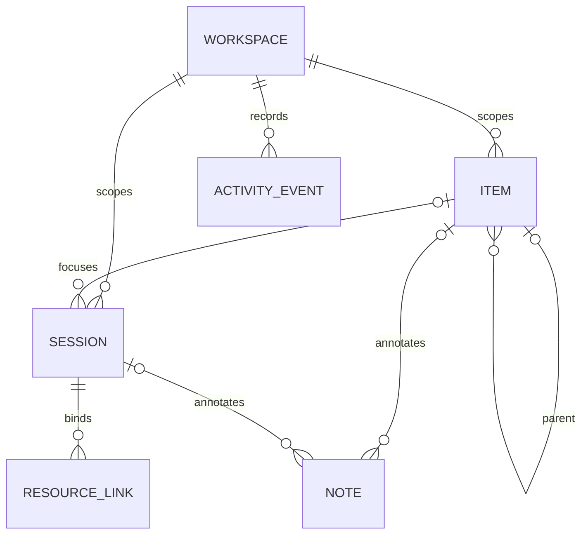

# Phase 01 — Domain and Relational Persistence

## Context Links
- [Plan](./plan.md)
- [Domain research](./research/researcher-01-workflow-tracking-domain.md)
- [System architecture: target identity](../../docs/system-architecture.md#project-worktree-targets-phase-07-target-lifecycle)
- [System architecture: persistence](../../docs/system-architecture.md#persistence-phase-04)
- [Code standards: persistence](../../docs/code-standards.md#persistence-patterns-phase-04-06)
- Depends on: none. Enables Phases 02–03.

## Overview
- **Date:** 2026-09-01
- **Description:** Establish durable snapshot-first workflow schema, invariants, provenance, migration, and repository operations in the existing SQLite file.
- **Priority:** P2
- **Implementation status:** Complete / DONE (2026-09-02)
- **Completed:** 2026-09-02
- **Review status:** Complete (9.2/10; [review report](../../reports/code-reviewer-260902-0012-phase-01-domain-and-relational-persistence.md))
- **Validation:** `cargo test` passed 888/888 executed tests (2 ignored), including all 14 workflow tests; see [test report](../../reports/tester-phase-01-260902-0010-domain-relational-persistence.md).

## Key Insights
- `SessionStore` already owns `server.session_db_path`, permissions, one mutex-protected connection, and ordered migrations. Reuse this database/connection; do not create another service or DB.
- Configured projects remain authoritative. Workflow rows reference `(workspace_id, project_name, worktree_path?)`; no duplicate project table or global active target.
- Snapshot tables answer current-state reads. A small event table explains changes; no replay/CQRS.
- Store canonical paths only in structured target columns. Never copy path, command, cwd, prompt, argv, environment, output, or file content into event payloads.
- Manual work timestamps are user-owned facts. Terminal/agent observations need separate resource-health fields and events so they cannot rewrite `started_at`, `ended_at`, or work-session status.

## Requirements
- Add stable UUIDs; UTC epoch milliseconds in storage and RFC3339/ISO at API boundary.
- Add `workflow_workspaces`: UUID, canonical registry locator stored server-side, created/updated. Resolve current config path to one row; never return locator.
- Add `workflow_items`: workspace, project, nullable worktree path, nullable parent, `plan|phase|task`, title, optional summary/next-action note, `backlog|next|in_progress|blocked|done|canceled`, sort order, provenance, timestamps.
- Enforce Plan-first optional organization: Plan has no parent; Phase must belong to a Plan; Task may belong to a Phase, directly to a Plan, or have no parent as a standalone Task. Parent and child must share workspace/project/target; reject cycles and depth above three.
- Add `workflow_sessions`: item optional and may reference a Plan, Phase, or Task; target identity; `running|ended|abandoned`; user-supplied `started_at`/nullable `ended_at`; manual provenance; created/updated timestamps. Only explicit user mutations change status or work timestamps.
- Add `workflow_resource_links`: session, `terminal|agent`, external ID, optional PTY incarnation, manual agent `harness_label` and opaque `run_id`, observed state, suggested end time, first/last seen, link source; unique by session/type/external ID.
- Add `workflow_notes`: attach directly to any Plan/Phase/Task or Session, bounded body, source, timestamps, soft-delete timestamp.
- Add `workflow_events`: unique request/event UUID, typed event, source, target IDs, occurred/recorded times, bounded allowlisted JSON, expiry. Observation events never transition a work session.
- Permit overlapping manual sessions, including direct Plan sessions and repeated sessions for one item; index running sessions for overview reads rather than enforcing one-running-session uniqueness.

## Architecture

- Put domain DTO/enums/transition validation in `server/src/workflow/model.rs`; SQLite mapping and transaction methods in `server/src/workflow/store.rs` using the shared `SessionStore` connection.
- One mutation transaction: validate current snapshot, update/insert snapshot, append event with the same request ID, commit. Duplicate request ID returns current affected snapshot without a second transition/event.
- Do not persist a manual completion percentage. Compute only factual descendant counts; a Plan/Phase without tracked Tasks has no progress value.
- Index overview path `(workspace_id, project_name, status, updated_at)` and event/history path `(workspace_id, recorded_at DESC, id)`; all lists require limits.

## Related Code Files
### Modify
- `server/src/lib.rs` — export workflow module.
- `server/src/persistence/mod.rs` — run migration 010 and expose the shared connection through narrow crate-private store operations.
### Create
- `server/src/workflow/mod.rs` — module exports and constants.
- `server/src/workflow/model.rs` — enums, DTO-domain records, transition rules.
- `server/src/workflow/store.rs` — transactional CRUD, overview/history reads, purge.
- `server/src/workflow/tests.rs` — domain/store tests against tempfile SQLite.
- `server/src/persistence/migrations/010_workflow_tracking.sql` — additive workflow tables, constraints, and indexes.
### Delete
- None.

## Implementation Steps
1. Define length/count constants: title 200 chars, note 8 KiB, external ID 200 chars, event payload 4 KiB, overview 100 projects/500 open items/100 running sessions, history page 100.
2. Define strict serde enums and transition functions. Item transitions: backlog/next → in_progress; in_progress → blocked/done/canceled; blocked → in_progress/canceled; done/canceled → in_progress. Session: explicit manual running → ended/abandoned only; observation mutations cannot call this transition.
3. Add migration 010 with foreign keys, CHECK constraints, indexes, and no destructive changes to terminal tables. Enforce parent-kind/scope/depth rules transactionally because SQLite CHECK constraints cannot validate another row.
4. Extend `SessionStore::open` to execute migration 010 idempotently after 009. Keep database creation mode `0600`.
5. Implement workspace lookup/create from current canonical `config_path`; API-visible workspace UUID never reveals locator.
6. Implement item, manual session, resource link, note, and event operations using transactions and parameterized SQL. Support direct Plan notes/sessions and keep manual timestamps separate from observed/suggested resource times.
7. Implement factual aggregate reads: direct/descendant tracked Task totals and completed counts, plus last activity/session/note. Return `null` progress when no tracked Tasks exist.
8. Implement keyset event pagination `(recorded_at,id)`, soft-delete note exclusion, and bounded purge by `expires_at`.
9. Test clean creation, reopen migration, existing 009 data preservation, every legal/illegal parent combination, direct Plan notes/sessions, standalone Tasks, overlapping sessions, null progress without Tasks, tracked Task counts, manual timestamp preservation, observation isolation, duplicate request IDs, rollback, pagination, and purge.

## Todo List
- [x] Manual work timestamps and observed resource times remain separate in schema and store operations.
- [x] Plan-first parent-kind/scope/depth constraints and optional direct Plan ownership are enforced.
- [x] Domain enums/invariants complete.
- [x] Migration 010 preserves existing terminal data.
- [x] Transactional store operations and idempotency complete.
- [x] Bounded overview/history/purge queries complete.
- [x] Tempfile SQLite tests cover migration and constraints.

## Success Criteria
- Reopening an existing sessions DB creates workflow tables without modifying terminal rows/buffers.
- Duplicate mutation request IDs produce one snapshot transition and one event.
- Invalid ownership, parent kind/scope/depth, status transition, timestamp ordering, payload, and limit fail before commit.
- Query plans use declared indexes for overview and event pagination; no unbounded scan is exposed.

## Risk Assessment
- **DB lock contention:** share the existing connection; keep transactions short; never perform Git/filesystem/async work under the DB mutex.
- **Ad-hoc migration drift:** test empty DB, 009 DB, and second reopen; migration is additive.
- **Project rename/history orphaning:** retain rows under old name as unavailable history; explicit reassignment is deferred, never silently rebind.
- **Oversized notes/events:** validate before transaction and cap response pages.

## Security Considerations
- The DB already contains sensitive PTY metadata; preserve `0600`. Never return canonical registry locator.
- Validate project and target separately in service layer before store mutation; SQL foreign keys alone are not authorization.
- Event payload is a tagged, allowlisted object—not caller-provided arbitrary JSON.
- Soft deletion supports undo; Phase 02 must provide permanent bounded purge.

## Next Steps
- Phase 02 wraps these operations with workspace/project/target validation and protected REST handlers.
- Phase 03 records terminal lifecycle observations through the same transaction boundary.

## Unresolved Questions
None.
