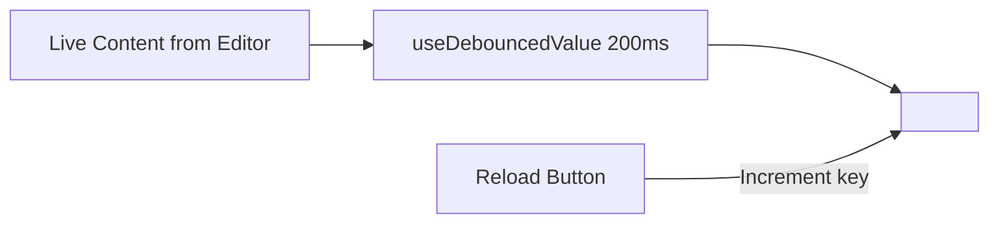

# Phase 01: HTML File Helper, Mode Persistence, and Sandboxed HtmlPreview

## Context links
- Parent Plan: [plan.md](./plan.md)
- Brainstorm Architecture Report: [brainstorm-260912-2238-explorer-html-preview.md](../../reports/brainstorm-260912-2238-explorer-html-preview.md)
- Markdown View Mode Persistence Reference: [markdown-view-mode-persistence.ts](file:///mnt/data/ws/sharing/dam-hopper/packages/ui/src/lib/markdown-view-mode-persistence.ts)
- Markdown Preview Reference: [MarkdownPreview.tsx](file:///mnt/data/ws/sharing/dam-hopper/packages/ui/src/components/organisms/MarkdownPreview.tsx)

## Overview
- **Date**: 2026-09-12
- **Description**: Implement `html-file.ts` detection utility, `html-view-mode-persistence.ts` local storage helper, and the core sandboxed `HtmlPreview.tsx` iframe component with debounced content rendering.
- **Priority**: P2
- **Implementation status**: Completed (2026-09-12 22:45)
- **Review status**: Completed

## Key Insights
- Dam Hopper's existing Markdown mode persistence uses a clean, storage-injectable helper (`loadMarkdownViewMode` / `saveMarkdownViewMode`) with fallback to `"split"`. We replicate this for HTML (`loadHtmlViewMode` / `saveHtmlViewMode`) with default `"edit"`.
- Live typing in Monaco fires rapid `onChange` events. Directly mutating `iframe.srcdoc` on every keystroke causes DOM thrashing and script re-execution. A 200ms debounce ensures smooth responsiveness.
- To guarantee zero privilege escalation from untrusted workspace code, the iframe must have `sandbox="allow-scripts allow-modals"` without `allow-same-origin`.

## Requirements
1. `isHtmlFile(fileName: string): boolean` matching `.html`, `.htm`, and `.xhtml` case-insensitively.
2. `HtmlMode` type (`"edit" | "split" | "preview"`), stored in localStorage under `dam-hopper:html-view-mode:v1` with fallback to `"edit"`.
3. `HtmlPreview` component:
   - Renders an `<iframe>` with `sandbox="allow-scripts allow-modals"`.
   - Uses debounced `srcdoc` (200ms).
   - Provides a reload button to force-remount the iframe if scripts crash or need re-run.
   - Clean UI styling matching Dam Hopper dark/light design system with light sandbox background for realistic webpage preview.

## Architecture

## Related code files
- Create: `packages/ui/src/lib/html-file.ts`
- Create: `packages/ui/src/lib/html-file.test.ts`
- Create: `packages/ui/src/lib/html-view-mode-persistence.ts`
- Create: `packages/ui/src/lib/html-view-mode-persistence.test.ts`
- Create: `packages/ui/src/components/organisms/HtmlPreview.tsx`
- Create: `packages/ui/src/components/organisms/HtmlPreview.test.tsx`

## Implementation Steps
1. Create `packages/ui/src/lib/html-file.ts`:
   - Define `isHtmlFile(name: string): boolean`.
   - Define `htmlMimeType(name: string): string | undefined`.
2. Create `packages/ui/src/lib/html-view-mode-persistence.ts`:
   - Define `HtmlMode = "edit" | "split" | "preview"`.
   - Implement `loadHtmlViewMode(storage?)` and `saveHtmlViewMode(mode, storage?)`.
3. Create `packages/ui/src/components/organisms/HtmlPreview.tsx`:
   - Accept props: `content: string`, `className?: string`.
   - Implement debounced content hook (200ms).
   - Add refresh action that increments an internal revision counter to reload the iframe cleanly.
   - Frame container with white background and border.
4. Add unit tests for `html-file`, `html-view-mode-persistence`, and `HtmlPreview`.

## Todo list
- [x] Create `html-file.ts` and test suite
- [x] Create `html-view-mode-persistence.ts` and test suite
- [x] Create `HtmlPreview.tsx` and test suite
- [x] Verify test suite passes with `pnpm --filter @dam-hopper/ui test`

## Success Criteria
- `isHtmlFile` identifies `.html`, `.htm`, `.xhtml` and rejects `.js`, `.md`, `.css`.
- Persistence correctly reads and writes `dam-hopper:html-view-mode:v1` and defaults to `"edit"` on missing or invalid input.
- `HtmlPreview` renders sandboxed iframe with provided HTML content and reloads on demand.

## Risk Assessment
- *Risk*: Malformed HTML causes rendering loop in browser.
  *Mitigation*: The sandboxed iframe isolates parser crashes from the host application.

## Security Considerations
- The iframe sandbox MUST NOT have `allow-same-origin`.
- Verify that scripts executed within the iframe receive an opaque origin (`"null"`) and have no access to `window.parent.localStorage` or document cookies.

## Completion notes
- Completed at: 2026-09-12 22:45
- Implemented `isHtmlFile` and `htmlMimeType` in `html-file.ts` with unit test suite (9 tests).
- Implemented `loadHtmlViewMode` and `saveHtmlViewMode` in `html-view-mode-persistence.ts` with unit test suite (10 tests).
- Implemented `HtmlPreview` component with sandboxed iframe (`sandbox="allow-scripts allow-modals"`), 200ms debounce, and reload button (3 tests).
- All 22 tests passing.

## Next steps
- Proceed to Phase 02 to integrate `HtmlHost` and configure routing in `EditorTabs.tsx`.
