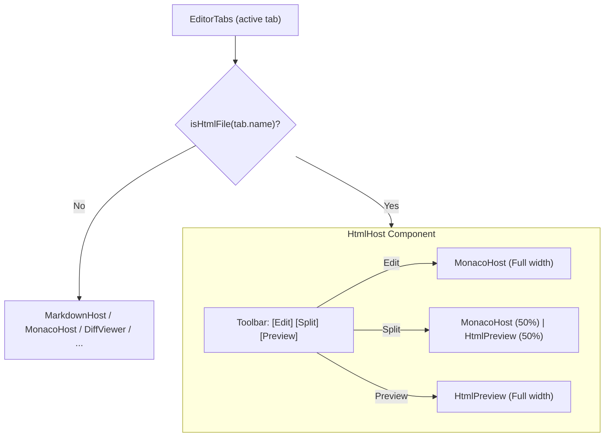

# Phase 02: HtmlHost Editor Component and EditorTabs Routing

## Context links
- Parent Plan: [plan.md](./plan.md)
- Phase 01: [phase-01-helpers-and-html-preview.md](./phase-01-helpers-and-html-preview.md)
- MarkdownHost Reference: [MarkdownHost.tsx](file:///mnt/data/ws/sharing/dam-hopper/packages/ui/src/components/organisms/MarkdownHost.tsx)
- EditorTabs Reference: [EditorTabs.tsx](file:///mnt/data/ws/sharing/dam-hopper/packages/ui/src/components/organisms/EditorTabs.tsx)

## Overview
- **Date**: 2026-09-12
- **Description**: Build `HtmlHost.tsx` containing the Edit | Split | Preview mode toggle, lazy MonacoHost editor integration, and `HtmlPreview` pane. Route HTML files from `EditorTabs.tsx` to `HtmlHost`.
- **Priority**: P2
- **Implementation status**: Pending
- **Review status**: Not reviewed

## Key Insights
- `EditorTabs.tsx` currently routes `/\.mdx?$/i.test(activeTab.name)` to a lazy-loaded `MarkdownHost`.
- Adding `isHtmlFile(activeTab.name)` with a lazy-loaded `HtmlHost` cleanly preserves bundle boundaries and does not bloat initial app load.
- `HtmlHost` should support an optional `initialMode` prop so that when opened via "Preview" from Explorer, it can activate `"preview"` mode immediately regardless of saved default.

## Requirements
1. `HtmlHost` component:
   - Accept standard editor props (`tabKey`, `path`, `content`, `tier`, `mime`, `viewState`, `readOnly`, `onChange`, `onSave`, `onViewStateChange`, `lineChanges`, `onGitIndicatorClick`, plus optional `initialMode?: HtmlMode`).
   - Render top mode toolbar with **Edit | Split | Preview** buttons.
   - Persist mode changes to localStorage via `saveHtmlViewMode`.
   - Layout:
     - `mode === "edit"`: 100% width Monaco editor.
     - `mode === "split"`: 50% Monaco editor (left) with border divider, 50% `HtmlPreview` (right).
     - `mode === "preview"`: 100% width `HtmlPreview`.
2. `EditorTabs.tsx` integration:
   - Lazy load `HtmlHost` with `lazy(() => import("@/components/organisms/HtmlHost.js"))`.
   - In active tab host renderer, branch on `isHtmlFile(activeTab.name)` before fallback MonacoHost.
   - Pass `activeTab` properties and any initial mode override.

## Architecture

## Related code files
- Create: `packages/ui/src/components/organisms/HtmlHost.tsx`
- Create: `packages/ui/src/components/organisms/HtmlHost.test.tsx`
- Modify: `packages/ui/src/components/organisms/EditorTabs.tsx`
- Modify: `packages/ui/src/stores/editor.ts` (if supporting `initialMode` in tab state)

## Implementation Steps
1. Create `packages/ui/src/components/organisms/HtmlHost.tsx`:
   - Initialize mode state with `initialMode ?? loadHtmlViewMode()`.
   - Render buttons for `MODES = [{ id: "edit", label: "Edit" }, { id: "split", label: "Split" }, { id: "preview", label: "Preview" }]`.
   - Render MonacoHost and HtmlPreview according to mode.
2. Update `packages/ui/src/components/organisms/EditorTabs.tsx`:
   - Add `const HtmlHost = lazy(...)`.
   - In the tab rendering switch, add case for `isHtmlFile(activeTab.name)`.
   - Provide Suspense boundary with editor loading fallback.
3. Write Vitest tests for `HtmlHost`:
   - Verify mode transitions between Edit, Split, and Preview.
   - Verify persistence hook is called on mode change.
   - Verify Monaco and HtmlPreview render according to mode.

## Todo list
- [ ] Implement `HtmlHost.tsx`
- [ ] Add `HtmlHost.test.tsx` unit tests
- [ ] Update `EditorTabs.tsx` to route HTML files to `HtmlHost`
- [ ] Verify editor switching between different file types

## Success Criteria
- Opening `sample.html` loads `HtmlHost`.
- Switching to Split mode shows both code and preview side by side.
- Switching to Preview mode shows only the rendered preview.
- Reloading or reopening retains the selected mode.

## Risk Assessment
- *Risk*: Monaco resize issues when toggling from Edit to Split.
  *Mitigation*: MonacoHost already handles container resize via `ResizeObserver`.

## Security Considerations
- Read-only state is propagated to `HtmlHost` and `MonacoHost` when target is unavailable.
- Sandboxed preview pane remains isolated in all modes.

## Next steps
- Proceed to Phase 03 for Explorer context menu integration and end-to-end test validation.
