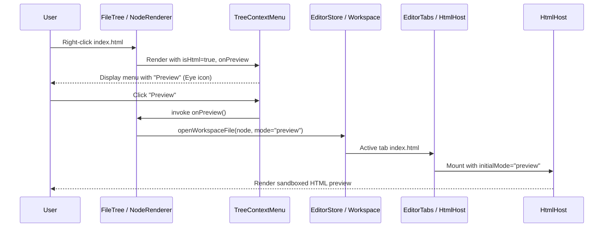

# Phase 03: Explorer Context Menu Integration and Test Coverage

## Context links
- Parent Plan: [plan.md](./plan.md)
- Phase 01: [phase-01-helpers-and-html-preview.md](./phase-01-helpers-and-html-preview.md)
- Phase 02: [phase-02-html-host-and-editor-tabs.md](./phase-02-html-host-and-editor-tabs.md)
- TreeContextMenu Reference: [TreeContextMenu.tsx](file:///mnt/data/ws/sharing/dam-hopper/packages/ui/src/components/organisms/TreeContextMenu.tsx)
- FileTree Reference: [FileTree.tsx](file:///mnt/data/ws/sharing/dam-hopper/packages/ui/src/components/organisms/FileTree.tsx)
- TreeContextMenu Tests: [TreeContextMenu.test.ts](file:///mnt/data/ws/sharing/dam-hopper/packages/ui/src/components/organisms/TreeContextMenu.test.ts)

## Overview
- **Date**: 2026-09-12
- **Description**: Add the "Preview" action to `TreeContextMenu` for HTML files in the Explorer panel, wire up the preview trigger in `FileTree.tsx` and `WorkspacePage.tsx`, and create comprehensive unit and browser test coverage.
- **Priority**: P2
- **Implementation status**: Pending
- **Review status**: Not reviewed

## Key Insights
- `getTreeContextMenuItems` in `TreeContextMenu.tsx` is a pure function covered by unit tests. Adding an `onPreview` callback and `isHtml` flag makes it easily testable without full DOM mounting.
- In `FileTree.tsx`, `onFileOpen` can accept an options parameter or a dedicated `onFilePreview` callback to instruct the editor to open the file directly in preview mode (`saveHtmlViewMode("preview")` or passing `initialMode: "preview"`).
- Chromium browser test coverage should verify that right-clicking an HTML file in the tree displays the "Preview" option and triggers the expected editor transition.

## Requirements
1. `TreeContextMenu.tsx`:
   - Extend `TreeContextMenuHandlers` with `onPreview?: () => void`.
   - Extend `BuildItemsArgs` with `isHtml?: boolean`.
   - In `getTreeContextMenuItems`, when `!isDir && isHtml && onPreview`, add:
     ```tsx
     {
       label: "Preview",
       icon: <Eye className="h-3.5 w-3.5" />,
       onClick: onPreview,
     }
     ```
     positioned near the top (e.g. right before or after the Copy Path actions, or at the start of file actions).
2. `FileTree.tsx`:
   - Determine if the node is an HTML file (`isHtmlFile(props.node.data.name)`).
   - If true, provide `onPreview={() => handlePreview(props.node.data)}`.
   - `handlePreview`: sets view mode to `"preview"` and opens the file via `onFileOpen(node)`.
3. Test Coverage:
   - Vitest tests in `TreeContextMenu.test.ts` checking that "Preview" appears for HTML files and is absent for non-HTML files / directories.
   - Vitest tests in `ContextMenuConsumers.test.tsx` verifying the preview callback invocation.
   - Browser regression test verifying Explorer tree interaction and context menu rendering.

## Architecture


## Related code files
- Modify: `packages/ui/src/components/organisms/TreeContextMenu.tsx`
- Modify: `packages/ui/src/components/organisms/TreeContextMenu.test.ts`
- Modify: `packages/ui/src/components/organisms/FileTree.tsx`
- Modify: `packages/ui/src/components/organisms/ContextMenuConsumers.test.tsx`
- Add/Modify: `packages/ui/browser-tests/file-tree-preview.browser.tsx` (or update existing consumer browser test)

## Implementation Steps
1. Update `packages/ui/src/components/organisms/TreeContextMenu.tsx`:
   - Add `Eye` from `lucide-react`.
   - Add `onPreview?: () => void` and `isHtml?: boolean`.
   - Insert "Preview" action in `getTreeContextMenuItems` when `!isDir && isHtml && onPreview`.
2. Update `packages/ui/src/components/organisms/FileTree.tsx`:
   - Import `isHtmlFile` from `@/lib/html-file.js`.
   - Add `handlePreviewFile(node: FsArborNode)`:
     - Saves `"preview"` to HTML view mode persistence (`saveHtmlViewMode("preview")`).
     - Triggers `onFileOpen(node)`.
   - Pass `isHtml={isHtmlFile(props.node.data.name)}` and `onPreview={() => handlePreviewFile(props.node.data)}` into `<TreeContextMenu>`.
3. Update `TreeContextMenu.test.ts`:
   - Test that "Preview" is present when `isHtml: true` and `onPreview` is provided.
   - Test that "Preview" is absent when `isHtml: false` or `isDir: true`.
4. Run validation:
   - `pnpm --filter @dam-hopper/ui test`
   - `pnpm lint`
   - `pnpm check`

## Todo list
- [ ] Add `onPreview` and `isHtml` to `TreeContextMenu`
- [ ] Wire `handlePreviewFile` in `FileTree.tsx`
- [ ] Add unit tests in `TreeContextMenu.test.ts`
- [ ] Verify test suite and browser tests pass
- [ ] Run full project validation (`pnpm check`)

## Success Criteria
- Right-clicking an `.html` file in the Explorer file tree renders the "Preview" menu item.
- Right-clicking a `.ts`, `.json`, or folder does NOT render the "Preview" menu item.
- Clicking "Preview" in Explorer opens the HTML file directly in Preview mode in EditorTabs.
- All unit and browser tests pass without regressions.

## Risk Assessment
- *Risk*: Context menu action ordering disruption.
  *Mitigation*: Place "Preview" prominently in the read-action cluster (e.g. above Rename/Delete) consistent with other file operations.

## Security Considerations
- Context menu handler only passes verified `node.id` through standard workspace opening pipeline.

## Next steps
- Once user approves this implementation plan, execute using `/cmd_code_auto` or implementation steps across Phases 1-3.
