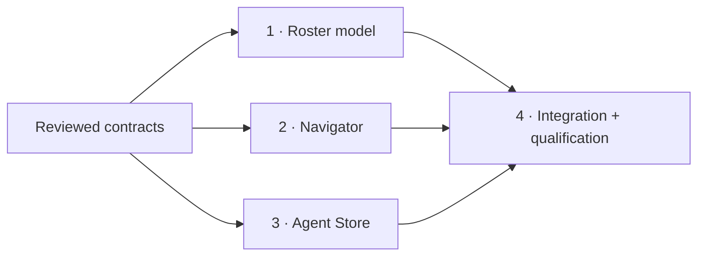

# Traditional terminal Projects + Agents
**Proposed; not implemented.** [Command overview](cmd-plan.md) · [Frozen interfaces](contracts.md) · [Code evidence](reports/01-codebase-analysis.md) · [Design/risk review](reports/03-design-risk-review.md).
Planning skill used; architecture-first proposed section already published by main. Fresh summary: scout skipped, no scout report. No advice controller initialized.

Implementation execution uses explicit advice mode. Current status and phase-scoped completion evidence: [progress overview](progress.md). Captured planning status below is not completion authority.
## Scope and acceptance
- Projects first: retain every terminal, Git context/counts/project tab semantics; visible second Agents section indexes observed OMP/Codex/Claude across open projects, excludes shells/unobserved inventory.
- Stable one-row-per-owner-qualified-incarnation roster; title/harness/project/profile/state/reason/source/availability. Metadata-only identity; readonly current-generation baseline; Unknown stays Unknown.
- Working/Idle/Needs attention distinct. Secondary **Done (turn ended)** only ready matching idle + explicit ended + no active turn/nonexpired evidence; NEVER task success, native Stop/silence-derived Done or unseen state.
- Exact existing tab/split-pane selection, preserved PTY/buffer/layout, compact dismissal/focus restoration, >=44px compact targets; no status sorting/focus churn.
- Agent Store settings link resolves explicit registered profile/reactive generation; unavailable retained, invalid/removed fails closed before query mount. No-owner asks profile choice; no global profile/policy mutation or automatic installation.
- Silent snapshots and roster independent of notifications; existing hooks/root bridge/backend/database/protocol unchanged. No scraping, adapters, launch/orchestration, audio, rollups or Herdr dependency.
## Phases
| Phase | Status / progress | Group | Effort | Detail |
|---|---|---|---|---|
| 1 Roster model | pending / 0% | A | 3h | [phase 1](phase-01-roster-model.md) |
| 2 Navigator components | pending / 0% | A | 4h | [phase 2](phase-02-navigator-components.md) |
| 3 Agent Store navigation | pending / 0% | A | 3h | [phase 3](phase-03-agent-store-navigation.md) |
| 4 Integration/qualification/docs | pending / 0% | B | 6h | [phase 4](phase-04-integration-qualification.md) |
## Dependencies and execution

| Phase needs completed phase | 1 | 2 | 3 | 4 |
|---|---|---|---|---|
| 1 | — | no | no | no |
| 2 | no | — | no | no |
| 3 | no | no | — | no |
| 4 | yes: model | yes: UI | yes: route | — |
1–3 author independently against contracts; type-only consumer imports do not require a shared setup phase. Connected runtime is NOT independent. No tests/build/lint/formatters during planning or slice authoring. Phase 4 alone integrates then runs one targeted verification pass and actual-app smoke; mocks cannot qualify harness runtime.
## Exclusive file ownership
Paths repo-relative. C = Create/proposed, M = Modify existing, D = Delete after review/approval. Each path exactly one owner; related-file lists match. 26 authorized implementation paths; planner artifacts are separate from implementation ownership.
| Owner | Action | Exact path |
|---|---|---|
| 1 | C | `packages/ui/src/lib/traditional-terminal-agents.ts` |
| 1 | C | `packages/ui/src/lib/traditional-terminal-agents.test.ts` |
| 2 | M | `packages/ui/src/components/organisms/TraditionalTerminalProjectsNavigator.tsx` |
| 2 | M | `packages/ui/src/components/organisms/TraditionalTerminalProjectsNavigator.test.tsx` |
| 2 | C | `packages/ui/src/components/molecules/traditional-terminal-agent-row.tsx` |
| 2 | C | `packages/ui/src/components/molecules/traditional-terminal-agent-row.test.tsx` |
| 2 (parent correction) | D | `packages/ui/src/filename-conventions.test.ts` |
| 3 | C | `packages/ui/src/lib/agent-store-navigation.ts` |
| 3 | C | `packages/ui/src/lib/agent-store-navigation.test.ts` |
| 3 | M | `packages/ui/src/components/pages/AgentStorePage.tsx` |
| 3 | M | `packages/ui/src/components/pages/AgentStorePage.test.tsx` |
| 3 (parent finalization) | M | `docs/architecture/agent-store-ports-and-browser.md` |
| 4 | M | `packages/ui/src/components/organisms/TraditionalTerminalProjectsDisplay.tsx` |
| 4 | M | `packages/ui/browser-tests/terminal-traditional-projects.browser.tsx` |
| 4 | M | `packages/ui/browser-tests/terminal-traditional-projects.browser-fixture.tsx` |
| 4 | C | `packages/ui/e2e/traditional-terminal-agents/traditional-terminal-agents.spec.ts` |
| 4 | C | `packages/ui/e2e/traditional-terminal-agents/evidence.json` |
| 4 | C | `packages/ui/e2e/traditional-terminal-agents/review.md` |
| 4 | C | `packages/ui/e2e/traditional-terminal-agents/screenshot.png` |
| 4 | C | `packages/ui/e2e/traditional-terminal-agents/compact.png` |
| 4 | C | `plans/261008-0233-traditional-terminal-agents-sidebar/reports/04-runtime-qualification.md` |
| 4 | M | `docs/system-architecture.md` |
| 4 | M | `docs/codebase-summary.md` |
| 4 | M | `docs/project-overview-pdr.md` |
| 4 | M | `docs/architecture/agent-status.md` |
| 4 | M | `docs/CHANGELOG.md` |
## Completion gate and risks
Phase 4 commands/behavior matrix in its detail; require actual web app full wide+compact captures, real supported harness work/ended/attention, expiry/reconnect, disabled notifications, duplicate IDs/profiles, split preservation and explicit invalid-profile denial. Record exact exercised OS/versions; no generic/native qualification claims.
Highest risks: group bare-ID fallback leaking owner context; optional incarnation; retained rows before reconnect baseline; stale click closure; Agent Store ambient query fallback; compact opener lacks Trigger restoration; limited native hooks mistaken for completion. Contracts address each. Runtime credentials/launchers are qualification prerequisites, not permission to fake events or silently reduce scope.
## Unresolved product questions
No product/design question unresolved after the interview below. Conservative Unknown/no-success/identity/privacy constraints remain mandatory. Implementation is pending; this planning request does not authorize code changes.
## Validation Summary
**Validated:** 2026-10-08. **Questions asked:** 3. [Interview record](reports/06-validation-interview.md).
**Confirmed Decisions:** Two visible sections, Projects first; Agents across all open projects; secondary `Done (turn ended)` hint with primary Idle and explicit evidence only.
**Action Items:** None; answers match frozen contracts. No phase revisions required. All implementation phases remain pending.
