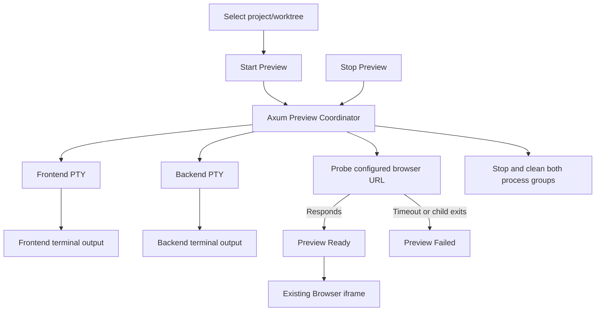

# Managed Project Preview Architecture Brainstorm

## Decision

Build an **Axum-owned grouped PTY preview coordinator**.

- MVP: browser, Dam Hopper server, frontend, backend on same host.
- Start one frontend PTY and one backend PTY from trusted project/service config.
- Reuse existing terminal output, replay, worktree targeting, environment resolution, and process cleanup.
- Probe one configured loopback browser URL before opening the existing Browser iframe.
- Keep preview processes server-owned across browser refresh/disconnect until explicit stop or server/workspace cleanup.
- V2: support browser and server on different machines through an isolated HTTPS preview origin.
- Do not adopt Live Server, Microsoft Live Preview, a vscode.dev web extension, or a Node sidecar as the runtime foundation.

## Problem

Dam Hopper is mainly used through `apps/web`. A managed project may need multiple long-lived commands, such as:

```text
pnpm dev
pnpm dev:server
```

The user needs one action that starts both, shows both output streams, verifies the frontend is accepting HTTP, and displays the rendered app. Current terminal and Browser features exist independently; no aggregate preview lifecycle connects them.

## Final artifact

### MVP behavior

A managed project/worktree exposes **Start Preview** and **Stop Preview**.

Start Preview:

1. Resolve selected registered project and worktree on the server.
2. Resolve named frontend/backend services from trusted configuration.
3. Create two separate Dam Hopper PTY sessions.
4. Correlate them under one opaque `previewId` and generation.
5. Show frontend and backend output through existing terminal/xterm infrastructure.
6. Validate and probe the configured loopback browser URL.
7. Mark preview ready only after HTTP responds while both required PTYs remain alive.
8. Navigate the existing Browser panel iframe to the verified URL.

Stop Preview:

1. Transition aggregate state to stopping.
2. Stop both PTY process groups through existing server lifecycle APIs.
3. Wait for cleanup/reaping.
4. Remove preview routing/state and report stopped.

### V2 behavior

For browser on machine B and Dam Hopper/processes on machine A:

- Publish each preview through a distinct HTTPS origin such as `https://<preview-id>.preview.example.com`.
- Route only to the coordinator-owned loopback frontend port.
- Proxy HTTP plus HMR/WebSocket traffic.
- Keep preview origin separate from Dam Hopper's authenticated application origin.
- Revoke route/auth when preview stops.

## User workflow



Terminal output does not produce the iframe URL. Configuration supplies the URL; the server probe verifies it.

## Requirements

### Functional

- One preview per `(project, resolved worktree target)`.
- Preview references named configured services instead of duplicating command strings.
- Separate frontend/backend PTY identities and logs.
- Aggregate states: `stopped`, `starting`, `probing`, `ready`, `failed`, `stopping`.
- Browser URL required in MVP.
- Browser URL limited to HTTP loopback for MVP: `localhost`, `127.0.0.0/8`, or `::1`.
- Start and stop idempotent.
- Generation guards prevent stale PTY/probe events affecting a replacement preview.
- Browser refresh or WebSocket reconnect does not stop server-owned processes.
- Pre-ready required-service failure stops its peer and surfaces the failing role.
- No automatic restart in MVP.
- External-open fallback when iframe embedding fails.

### Non-functional

- Reuse existing authenticated REST/WebSocket transport.
- Bounded output/replay only; do not persist additional raw logs by default.
- Browser cannot provide arbitrary command, cwd, environment, or destination URL.
- Preserve existing project/worktree and environment isolation rules.
- Do not proxy preview content under Dam Hopper's main origin.
- Respect target `X-Frame-Options` and CSP `frame-ancestors`.
- No native/Tauri dependency for MVP.

## Proposed configuration shape

Concept only; exact schema belongs to implementation planning.

```toml
[[projects.services]]
name = "web"
run_command = "pnpm dev"

[[projects.services]]
name = "server"
run_command = "pnpm dev:server"

[projects.preview]
frontend_service = "web"
backend_service = "server"
url = "http://127.0.0.1:5173"
```

At least one referenced service required. Service order must not imply role. Server resolves commands and target; client submits only project/worktree identity.

## Evaluated approaches

### 1. Group existing PTYs — selected

Add a small aggregate coordinator over `PtySessionManager`.

Pros:

- Reuses command execution, sanitized environment snapshots, worktree resolution, process groups, output buffers, WebSocket events, reconnect, and Terminal UI.
- Each process has independent environment; parent environment is copied, not shared mutable state.
- Browser disconnect does not orphan lifecycle ownership.
- Lowest new operational burden.
- Matches YAGNI/KISS/DRY.

Cons:

- Current PTY exit-code semantics are less precise than direct `tokio::process::Child` waits.
- Requires aggregate race handling and generation guards.
- Port/file/database collisions still need policy; process ownership alone does not isolate resources.

Decision: acceptable because MVP requires observable role failure, not exact portable exit codes. Restrict to one preview per project/worktree.

### 2. Node Live Server sidecar — rejected

VS Code Live Server runs an in-process Node static server, watches files, injects reload code, and opens a browser. It does not supervise arbitrary frontend/backend processes.

Pros:

- Mature static-file serving and reload UX.
- Useful model for start/stop, URL, port, and status presentation.

Cons:

- `pnpm dev` already runs Vite with transforms, module graph, source maps, and HMR.
- Cannot replace the Rust backend.
- A custom Node supervisor would need IPC auth/versioning, process-tree cleanup, log transport, readiness, and packaging.
- Does not solve port/file/database collisions.
- Duplicates existing Rust PTY infrastructure.

Decision: borrow UX concepts only. Optional static-file preview is a separate future feature.

### 3. Microsoft Live Preview / vscode.dev architecture — rejected

Live Preview runs a local static preview server in the desktop Node extension host and embeds it in VS Code. It is documented as most useful where a server does not already exist and is not intended for React/Angular-style apps.

Useful concepts:

- One server group per workspace/root.
- Explicit lifecycle state.
- Embedded versus external target.
- Bounded status/output channels.
- Strict origin/CSP/message validation.

Non-portable pieces:

- `WebviewPanel`, `vscode.Task`, `OutputChannel`, `asExternalUri`, extension activation, integrated browser, and VS Code remote APIs.
- vscode.dev web extensions run in a browser worker and cannot use Node `child_process` or execute local programs.

Decision: use concepts only. Dam Hopper still needs its Axum process owner.

### 4. New direct Tokio subprocess manager — deferred

Pros:

- Precise exit status and non-PTY pipes.
- Purpose-built aggregate ownership.

Cons:

- Duplicates environment, output, replay, cleanup, target resolution, transport, and UI machinery.
- Creates a second process convention beside established PTYs.

Decision: reconsider only if exact exit status, noninteractive I/O, or PTY behavior proves blocking.

## Comparison matrix

| Criterion | Grouped PTYs | Node Live Server sidecar | Microsoft Live Preview | Direct Tokio manager |
|---|---:|---:|---:|---:|
| Ordinary web fit | Excellent | Fair | Poor | Excellent |
| Runs frontend + backend | Yes | Custom work | No | Yes |
| Existing log reuse | Excellent | Poor | Poor | Poor |
| Existing lifecycle reuse | Excellent | Poor | Poor | Partial |
| MVP complexity | Medium | High | High | High |
| Vite/HMR compatibility | Native | Redundant/conflicting | Not target use | Native child server |
| Independent server crash survival | No | Possible | No | No |
| Recommendation | Build | Reject | Reject | Defer |

## Local HTTPS and loopback

The MVP assumes browser, Axum, and preview processes run on the same host. An iframe URL such as `http://127.0.0.1:5173` then reaches the correct process.

Loopback HTTP origins are defined as potentially trustworthy, so modern mixed-content rules generally permit them from an HTTPS parent. This is not universal embedding proof. Validation must cover:

- Supported browsers.
- Parent `frame-src` CSP.
- Target `X-Frame-Options` and `frame-ancestors`.
- Local-network browser policies.
- Vite HMR WebSocket behavior.

If browser and server are on different machines, browser `localhost` points to the browser machine. V2 therefore requires an HTTPS preview origin or tunnel.

## V2 isolated preview origin

Recommended shape:

```text
https://app.example.com
  iframe → https://<unguessable-id>.preview.example.com
                proxy → http://127.0.0.1:<owned-port> on machine A
```

Required controls:

- Wildcard DNS and TLS.
- Unique origin per preview to isolate cookies, storage, and service workers.
- Short-lived scoped authorization suitable for iframe navigation.
- Allowlisted coordinator-owned target; no caller-supplied host/port.
- HTTP and WebSocket/HMR forwarding.
- Correct redirects, cookies, compression, streaming, source maps, Host, and Origin behavior.
- Preview route revocation on stop.
- Rate/resource limits and audit-safe failures.
- Threat review before modifying target frame headers.

This gateway may be an isolated listener/module or external reverse proxy. It does not require a Node process supervisor. Sidecar reconsideration requires a concrete need: different privileges, independent Axum restart survival, remote execution agent, or stronger OS sandboxing.

## Existing Cloudflare tunnel boundary

Repository code and docs currently retain Browser support for exact origins of tunnels in `ready` state. This was verified by source inspection, not runtime exercise.

Future implementation must regression-test existing tunnel behavior before and after preview integration. Cloudflare remains an optional existing transport/fallback; V2 design targets a stable isolated preview origin rather than depending on random tunnel URLs.

## Likely touchpoints

### Backend

- `server/src/state.rs` — manager ownership.
- `server/src/api/router.rs` — protected preview lifecycle API.
- `server/src/api/terminal.rs` — target/environment resolution patterns.
- `server/src/pty/manager.rs`, `server/src/pty/session.rs` — grouped session lifecycle.
- `server/src/pty/event_sink.rs`, `server/src/api/ws.rs`, `server/src/api/ws_protocol.rs` — state/output events.
- `server/src/config/schema.rs`, `parser.rs`, `presets.rs` — preview/service references and URL validation.
- `server/src/port_forward/` — existing port/tunnel ownership hints; port detection is not HTTP readiness.
- `server/src/main.rs` — graceful preview disposal.

### Frontend

- `packages/ui/src/api/client.ts`, `transport.ts`, `ws-transport.ts` — lifecycle/status contract.
- `packages/ui/src/hooks/use-terminal-manager.ts` — reuse existing sessions.
- `packages/ui/src/hooks/use-browser-debug.ts` — navigation/status integration.
- `packages/ui/src/components/organisms/BrowserDebugKeepAliveHost.tsx` — stable iframe.
- `packages/ui/src/components/organisms/TerminalPanel.tsx` — separate outputs.
- `packages/ui/src/components/pages/WorkspacePage.tsx` — preview controls/layout.
- `packages/ui/src/stores/project-target.ts` — project/worktree identity.

### Documentation and verification

- `docs/system-architecture.md`
- `docs/project-overview-pdr.md`
- `docs/configuration-guide.md`
- `docs/api-reference.md`
- `docs/ws-protocol-guide.md`
- `docs/frontend-components.md`
- `docs/code-standards.md`
- `docs/project-roadmap.md`
- `docs/CHANGELOG.md`

Existing docs contain stale terminal route names and inconsistent output caps/exit semantics. Resolve relevant contracts during planning; do not broaden preview work into an unrelated full docs cleanup.

## Risks and mitigations

| Risk | Mitigation |
|---|---|
| One child starts and peer fails | Aggregate transaction; stop started peer and report role-specific failure. |
| Stale events mutate restarted preview | Opaque preview ID plus monotonic generation checks. |
| Port collision | One preview per project/worktree; fail visibly; dynamic allocation deferred. |
| Shared files/database collision | Document non-isolation; full container/sandbox scope deferred. |
| False readiness | Server-side bounded HTTP probe; logs/port detection are hints only. |
| SSRF through readiness URL | Trusted config plus strict loopback validation in MVP. |
| Browser cannot frame target | Surface reason where detectable; retain Open in new tab. |
| Browser refresh kills processes | Server owns lifecycle; reconnect/refetch state. |
| Child descendants survive | Reuse process-group cleanup; validate with real long-lived descendants. |
| Sensitive terminal output | Existing authenticated bounded transport; no extra persistence/telemetry. |
| V2 preview compromises app origin | Dedicated per-preview origin; never proxy under app origin. |
| Existing Cloudflare flow regresses | Baseline and post-change browser smoke checks. |

## Acceptance criteria

1. Start Preview creates at most one aggregate preview for a project/worktree.
2. Exactly the configured service commands run under server-resolved cwd/environment.
3. Frontend and backend outputs remain independently visible and reconnectable.
4. Browser cannot submit arbitrary command, cwd, environment, host, or port.
5. Ready is impossible until configured loopback URL answers a bounded server HTTP probe and required PTYs are alive.
6. Existing Browser iframe opens only the validated URL.
7. Start failure, readiness timeout, child exit, iframe refusal, and stop failure are visible and role-specific.
8. Refresh/disconnect preserves server-owned preview state.
9. Explicit stop, project/worktree invalidation, workspace change, and graceful server shutdown clean both process groups.
10. Stale generation events cannot affect a newer preview.
11. Vite HMR and backend API/WebSocket behavior work in the embedded MVP surface.
12. Existing manually entered Browser URL and ready Cloudflare tunnel paths do not regress.
13. No Node sidecar, VS Code runtime, Tauri host, reverse proxy, or new log subsystem is required for MVP.

## Success metrics

- One action reaches two live log streams plus rendered app.
- No orphan process after every defined stop/cleanup path.
- Deterministic ready/failed state within configured timeout.
- Browser refresh restores aggregate state and bounded output.
- Existing Browser direct URL/tunnel workflows remain usable.
- V2, when implemented, exposes preview only on isolated authorized origins with working HMR.

## Dependencies

- Existing PTY manager and authenticated transport.
- Existing Browser iframe host and loopback/tunnel origin validation.
- Explicit project service and preview URL configuration.
- For V2: DNS/TLS, reverse-proxy/gateway capability, iframe authorization design, and security review.

## Primary external references

- [VS Code Live Preview v0.4.20](https://github.com/microsoft/vscode-livepreview/tree/v0.4.20)
- [VS Code Live Server v5.7.10](https://github.com/ritwickdey/vscode-live-server/tree/5.7.10)
- [VS Code web extension limitations](https://code.visualstudio.com/api/extension-guides/web-extensions)
- [VS Code extension host architecture](https://code.visualstudio.com/api/advanced-topics/extension-host)
- [Secure Contexts loopback trust](https://w3c.github.io/webappsec-secure-contexts/#is-origin-trustworthy)
- [Mixed Content definition](https://w3c.github.io/webappsec-mixed-content/#terms)
- [Same-origin policy](https://developer.mozilla.org/en-US/docs/Web/Security/Same-origin_policy)
- [X-Frame-Options](https://developer.mozilla.org/en-US/docs/Web/HTTP/Reference/Headers/X-Frame-Options)
- [Tokio process lifecycle](https://docs.rs/tokio/latest/tokio/process/index.html)

## Next steps

1. Create a detailed implementation plan for MVP only.
2. Resolve exact preview config schema and existing-service reference rules.
3. Baseline runtime-test current Browser direct loopback and Cloudflare tunnel flows.
4. Define preview REST/WebSocket contracts and aggregate state machine.
5. Implement and verify MVP end to end with real Vite and Rust long-lived commands.
6. Treat V2 isolated-origin gateway as a separate architecture/security plan after MVP evidence.

## Unresolved questions

- Exact config syntax and whether backend service is optional.
- Supported MVP browsers and whether loopback iframe requires local-network permission in each.
- Accepted HTTP readiness statuses and timeout defaults.
- Post-ready policy when one service exits: stop peer immediately or expose degraded state first.
- Whether worktree/profile switch stops preview or leaves it running but detached.
- Cloudflare tunnel runtime status before implementation; source path exists, runtime evidence pending.
