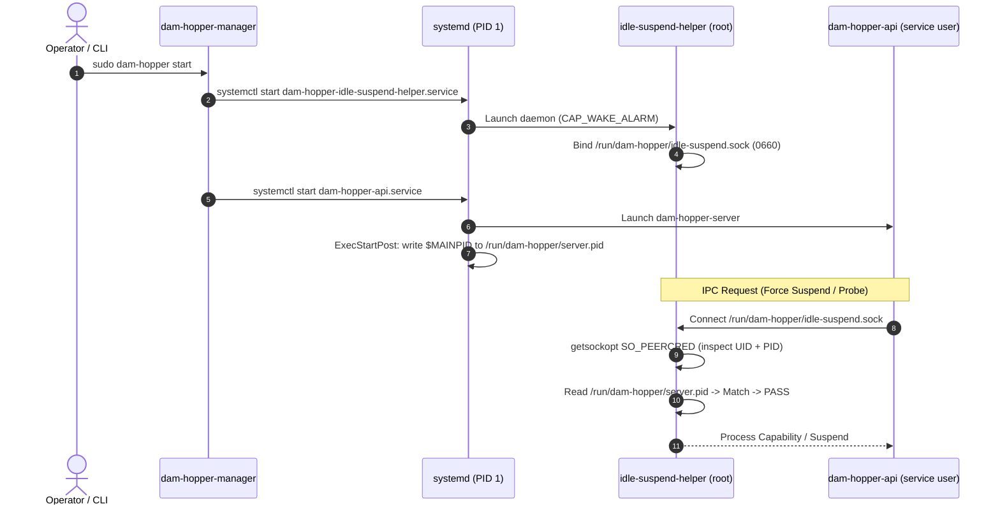

# Brainstorm Report: Production CLI Deployment Architecture for Idle Suspend Helper & Socket

- **Target**: Production setup and lifecycle management of `/run/dam-hopper/idle-suspend.sock` and `dam-hopper-idle-suspend-helper` via CLI.
- **Date**: 2026-09-09 18:36 Asia/Saigon
- **Role**: Solution Brainstormer
- **File**: `plans/reports/brainstorm-260909-1836-production-idle-suspend-cli-setup.md`
- **Status**: Consensus Reached (Integrated Release Manager Model)

---

## 1. Executive Summary & Core Decision

### Selected Model: Integrated Release Manager
Production deployment via CLI integrates `dam-hopper-idle-suspend-helper.service` directly into `dam-hopper-manager` (`dam-hopper` CLI):
- `sudo dam-hopper install`: Stages helper unit alongside API server unit for role `server`.
- `sudo dam-hopper start`: Starts helper daemon before API server.
- `sudo dam-hopper rollback` / `stop`: Stops helper daemon cleanly.
- Zero manual operator overhead; fully automated systemd supervision.

---

## 2. What is `SO_PEERCRED`?

### Mechanism & Security Guarantees
- **Definition**: A Linux socket option (`getsockopt(fd, SOL_SOCKET, SO_PEERCRED, &ucred, ...)`) on Unix Domain Sockets (`AF_UNIX`).
- **Kernel-Enforced**: Returns caller's `pid`, `uid`, and `gid` directly from Linux kernel `task_struct->cred`.
- **Anti-Spoofing**: The connecting client **cannot forge or spoof** these credentials.
- **DamHopper Usage**:
  - Implemented in `server/src/idle_suspend/peer_auth.rs` (`PeerCredentials::from_unix_stream`).
  - Helper checks:
    1. `cred.uid == expected_uid` (matches authorized service user).
    2. `cred.pid == expected_pid` (matches PID from `/run/dam-hopper/server.pid`).
  - Guarantees that only the authentic `dam-hopper-server` can trigger hardware RTC alarms or host suspend.

---

## 3. Production Architecture Specification



---

## 4. Implementation Touchpoints

1. **`deploy/systemd/dam-hopper-api.service.in`**:
   - Add PID file creation and cleanup:
     ```ini
     PIDFile=/run/dam-hopper/server.pid
     ExecStartPost=/usr/bin/sh -c 'echo $MAINPID > /run/dam-hopper/server.pid'
     ExecStopPost=/usr/bin/rm -f /run/dam-hopper/server.pid
     ```

2. **`deploy/systemd/dam-hopper-idle-suspend-helper.service.in`**:
   - Ensure socket group allows API service user access if `--service-user` configured:
     ```ini
     Group=@API_GROUP@
     ```

3. **`server/src/linux_release/stage_units.rs`**:
   - In `stage_candidate_units_inner`:
     When `role.includes_server()`, load, render, and stage `dam-hopper-idle-suspend-helper.service` into `/etc/systemd/system/`.

4. **`server/src/linux_release/activate.rs`**:
   - In `activate_candidate`:
     When `role.includes_server()`, invoke `systemctl_start("dam-hopper-idle-suspend-helper.service")` prior to starting `dam-hopper-api.service`.

5. **`server/src/linux_release/rollback.rs`**:
   - Stop `dam-hopper-idle-suspend-helper.service` during rollback and recovery.

---

## 5. Operator Workflow (Final Contract)

```bash
# 1. Install release for role 'server' or 'both'
bash dam-hopper-install.sh --version v0.3.0 --role server

# 2. Start services (automatically starts helper + API server)
sudo dam-hopper start

# 3. Verify status
dam-hopper status
```

---

## 6. Unresolved Questions
- None. Consensus reached on Integrated Release Manager model.
