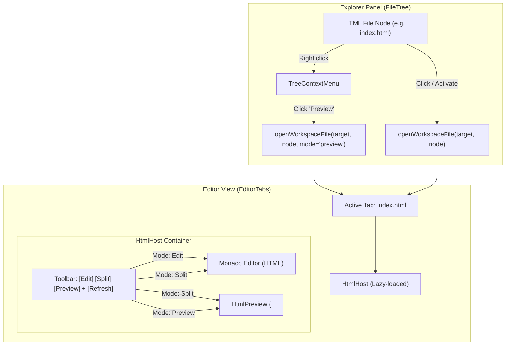

# Explorer HTML Preview Architecture Brainstorm

## Decision

Adopt an **in-editor sandboxed live preview workflow** paired with an **Explorer context menu shortcut**, mirroring Dam Hopper's existing Markdown preview architecture:

1. **Explorer Context Menu Integration**:
   - For `.html` and `.htm` files (and `.xhtml`), the file tree context menu (`TreeContextMenu`) provides a dedicated **Preview** action (with `Eye` icon).
   - Selecting **Preview** opens the HTML file in the editor and immediately activates the preview (or split) view mode.
   - Regular file activation (clicking or pressing Enter in Explorer) opens the HTML file in the editor, preserving user's default/persisted editing mode.

2. **Editor Host (`HtmlHost`) with Mode Toggle**:
   - Like `MarkdownHost`, HTML files in `EditorTabs` route to a lazy-loaded `HtmlHost`.
   - The top toolbar provides **Edit | Split | Preview** mode buttons.
   - In **Edit** mode: full Monaco editor with HTML language support.
   - In **Split** mode: Monaco editor on the left (50%), live rendered HTML preview on the right (50%).
   - In **Preview** mode: full-width rendered HTML preview.
   - Mode preference is persisted to `localStorage` (`dam-hopper:html-view-mode:v1`).

3. **Security & Sandbox Isolation**:
   - HTML preview executes inside an `<iframe>` configured with:
     ```html
     <iframe
       sandbox="allow-scripts allow-modals"
       srcdoc={debouncedContent}
       title="HTML Preview"
     />
     ```
   - **Crucial Security Boundary**: **NEVER** include `allow-same-origin`. Without `allow-same-origin`, the iframe executes in a unique (`null`) origin. It cannot read Dam Hopper's parent DOM, cookies, session tokens, or local storage, completely neutralizing XSS attacks from untrusted workspace code.
   - Scripts (`allow-scripts`) and popups/modals (`allow-modals`) are allowed in the sandbox for interactive HTML/JS prototypes.

4. **Performance & Live Updates**:
   - Render preview using `srcdoc` driven by the live editor buffer.
   - Debounce updates (200ms) to prevent iframe reload flicker during fast keystrokes.
   - Include a manual **Reload / Refresh** button in the preview header.

---

## Problem Statement

Dam Hopper users editing web projects, static pages, or email templates in the IDE cannot quickly visualize HTML output. Currently:
- HTML files only open in the raw Monaco code editor.
- The Explorer panel context menu offers no preview trigger for HTML files.
- Users must switch to external browser windows or set up dev servers even for simple, self-contained HTML files or component prototypes.

---

## Evaluated Approaches

### Approach A: Sandboxed Editor Host (`HtmlHost` with Edit/Split/Preview) + Context Menu Action (Recommended)
- **Mechanism**:
  - Add "Preview" to `TreeContextMenu` for HTML files.
  - Implement `HtmlHost` and `HtmlPreview` mirroring `MarkdownHost`.
  - Use debounced `srcdoc` in `<iframe sandbox="allow-scripts allow-modals">`.
- **Pros**:
  - Perfectly consistent with established UX (`MarkdownHost`).
  - Instant live feedback while typing in Split mode.
  - High security: `sandbox` without `allow-same-origin` guarantees credential isolation.
  - Zero backend changes required.
  - Handles unsaved/dirty buffer state.
- **Cons**:
  - Relative external resources (``, `<link href="./style.css">`) require explicit handling or inline assets for standalone rendering.

### Approach B: Dedicated Read-Only Preview Tab (Alternative)
- **Mechanism**:
  - Right-clicking HTML in Explorer opens a special tab type `tier: "html-preview"` separate from the editor tab.
- **Pros**:
  - Keeps editor tab strictly for editing; separate tab strictly for viewing.
- **Cons**:
  - Clutters tab bar with duplicate entries for the same file.
  - No synchronized side-by-side editing without complex multi-pane orchestration.
  - Inconsistent with Dam Hopper's `MarkdownHost` pattern.

### Approach C: External Browser / Backend Port Forward Serving (Alternative)
- **Mechanism**:
  - Backend serves static workspace files via an HTTP endpoint; preview opens in browser or `BrowserDebugPanel`.
- **Pros**:
  - Relative multi-file assets (`./style.css`, `./script.js`) resolve natively.
- **Cons**:
  - Heavyweight; requires backend routes, port management, and origin isolation headers.
  - Does not reflect unsaved in-memory edits.
  - Overkill for the immediate need of in-editor Explorer preview.

---

## Final Recommended Solution Architecture



---

## Key Touchpoints & Modules

1. **`packages/ui/src/lib/html-file.ts`** (New):
   - File extension matching (`.html`, `.htm`, `.xhtml`).
   - Mime helpers and preview eligibility check.

2. **`packages/ui/src/lib/html-view-mode-persistence.ts`** (New):
   - LocalStorage persistence for user preference (`edit` | `split` | `preview`).

3. **`packages/ui/src/components/organisms/HtmlPreview.tsx`** (New):
   - Sandboxed iframe container (`sandbox="allow-scripts allow-modals"`).
   - Debounced `srcdoc` rendering (200ms).
   - Toolbar with reload button and white/light background container.

4. **`packages/ui/src/components/organisms/HtmlHost.tsx`** (New):
   - Split / Edit / Preview container integrating `MonacoHost` and `HtmlPreview`.

5. **`packages/ui/src/components/organisms/TreeContextMenu.tsx`**:
   - Add `onPreview?: () => void;` to `TreeContextMenuHandlers`.
   - For HTML files, inject "Preview" action with `Eye` icon into context menu.

6. **`packages/ui/src/components/organisms/FileTree.tsx`**:
   - Detect HTML files in `NodeRenderer` / context menu handler.
   - Forward preview action via `onFilePreview` or `onFileOpen(node, { mode: 'preview' })`.

7. **`packages/ui/src/components/organisms/EditorTabs.tsx`**:
   - Route `isHtmlFile(activeTab.name)` to `HtmlHost` instead of default `MonacoHost`.

8. **`packages/ui/src/stores/editor.ts`**:
   - Optional `initialMode` or tab-level view mode state for preview triggers.

---

## Acceptance Criteria

1. **Explorer Context Menu**:
   - Right-clicking an `.html` or `.htm` file displays a "Preview" item with an eye icon.
   - Right-clicking non-HTML files does not display the HTML preview item.
   - Clicking "Preview" in context menu opens the file directly in preview/split mode.

2. **Editor Toolbar & Views**:
   - Opening an HTML file displays the **Edit | Split | Preview** toolbar.
   - "Edit" renders full Monaco editor.
   - "Split" renders 50/50 Monaco editor and live sandboxed iframe.
   - "Preview" renders full-width live sandboxed iframe.
   - Mode selection persists across sessions via `localStorage`.

3. **Live Sync & Editing**:
   - Typing HTML in Monaco updates the preview pane (debounced 200ms) without needing to save to disk.
   - Saving (`Ctrl+S` / `Cmd+S`) continues to persist the file via existing Dam Hopper file operations.

4. **Security Isolation**:
   - The iframe has `sandbox="allow-scripts allow-modals"`.
   - `allow-same-origin` is strictly absent.
   - Embedded scripts cannot access `window.parent`, parent cookies, localStorage, or send authenticated requests on behalf of the user.

---

## Risks & Mitigations

| Risk | Impact | Mitigation |
| :--- | :--- | :--- |
| **XSS via workspace HTML files** | High | Strict iframe sandboxing without `allow-same-origin`. The browser isolates script execution in an opaque null origin. |
| **Iframe flickering during typing** | Medium | Debounce `srcdoc` updates by 200ms; avoid remounting iframe when only content changes. |
| **Infinite loops in user JS (`while(true)`)** | Medium | The browser sandboxes the iframe thread; user can toggle back to Edit mode or refresh tab. |
| **Relative assets (``) broken** | Low | Document that MVP standalone iframe supports inline/CDN resources; local workspace asset resolution can be added in V2 via capability tickets. |
