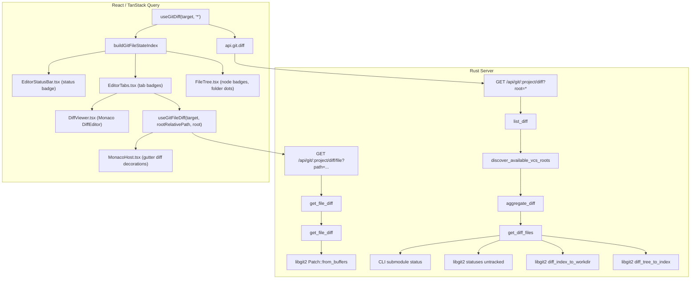

# Git Diff Pipeline and Visibility Investigation Report

- **Date:** 2026-09-05
- **Slug:** git-diff-investigation
- **Investigator:** GitDiffDebugger
- **Project:** dam-hopper (monorepo)

---

## 1. Executive Summary

### Issue Description
Git diff indications (change badges, changed directory indicators, tab badges, status bar stats, and Monaco gutter diff markers) were reported as no longer visible in the Explorer panel and Editor view.

### Root Cause Diagnosis
1. **Clean Working Tree in Target Project**:
   - Working tree in `/mnt/data/ws/sharing/dam-hopper` is clean (`nothing to commit, working tree clean`).
   - Backend endpoint `GET /api/git/dam-hopper/diff?root=*` returns `{"entries":[], "untrackedTruncated":false, "untrackedTotal":0}`.
   - When `entries` is empty, `buildGitFileStateIndex` produces empty `files` (`Map(0)`) and `changedDirs` (`Set(0)`).
   - Explorer tree nodes and Editor tabs find no match in `gitIndex.files`, legitimately displaying zero change badges or gutter decorations.
   - Confirmed live on running server (`port 4801`): projects with dirty files (`evcrate`: 20 entries, `robo-fleet-dora-rs`: 57 entries, `eigen-air`: 415 entries, `glean-hub`: 26 entries) return full diff payloads and file diffs with HTTP 200.

2. **Unsaved In-Memory Editor Edits vs Git Disk State**:
   - Typing in Monaco modifies in-memory state (`dirty = true` in `useEditorStore`).
   - Monaco gutter line diff decorations rely on `useGitFileDiff`, which queries `GET /api/git/:project/diff/file?path=...`.
   - Backend `get_file_diff` compares HEAD blob to the file **on disk**. It has no visibility into unpersisted frontend editor buffers.
   - Gutter diff decorations only populate after user saves (Ctrl+S / save action), triggering `fsWrite` and `invalidateGitFileOperation`.

3. **Recent Commit Regression & Resolution Context**:
   - **`a9acbd1e` ("fix(git): disable libgit2 owner validation and permit safe directories")**:
     - *Pre-existing bug*: On shared drives, WSL2, and systemd services, libgit2 owner validation threw `"repository path is not owned by current user"`.
     - Returned HTTP 500 from `list_diff`. Frontend `useGitDiff` re-threw non-409 errors, causing `gitDiff.data` to be `undefined`, completely blanking out git diff indicators.
     - Fixed via `set_verify_owner_validation(false)` and `-c safe.directory=*`.
     - *Regression introduced*: Added `GIT_CONFIG_PARAMETERS='safe.directory=*'` in systemd service unit. Git CLI rejected this with `fatal: bogus format in GIT_CONFIG_PARAMETERS`, breaking CLI subcommands (submodule status detection in diff).
   - **`40c7feb9` ("fix(git): replace bogus GIT_CONFIG_PARAMETERS with valid GIT_CONFIG_COUNT")**:
     - Removed `GIT_CONFIG_PARAMETERS`.
     - Set valid `GIT_CONFIG_COUNT=1`, `GIT_CONFIG_KEY_0=safe.directory`, `GIT_CONFIG_VALUE_0=*` in systemd unit and `server/src/main.rs`.
     - Deployed binary `/opt/dam-hopper/releases/v0.2.0/both/bin/dam-hopper-server` incorporates this fix.

4. **Path Alignment Contract**:
   - Backend `DiffFileEntry.path`: paths are strictly relative to repo working directory without leading slashes (e.g. `src/main.rs`).
   - Frontend `git-file-state.ts`: `projectPathForGitEntry` outputs relative paths without leading slashes.
   - Frontend `FileTree.tsx`: node IDs (`props.node.data.id`) are relative without leading slashes. Exact string match with `gitIndex.files` keys verified.
   - Frontend `EditorTabs.tsx`: tab path (`activeTab.path`) matches `gitIndex.files` keys.

---

## 2. End-to-End Data Pipeline Architecture



### 2.1 Backend Endpoints
- **Route registration**: `server/src/api/router.rs` lines 176 & 181:
  - `.route("/api/git/{project}/diff", get(git_diff::list_diff))`
  - `.route("/api/git/{project}/diff/file", get(git_diff::get_file_diff))`
- **Target Resolution**: `server/src/api/git_diff.rs:419-432`:
  - `resolve_target_path(&state, &project, q.worktree_path)` resolves workspace project or worktree target path via `state.resolve_project_target`.
- **Root Aggregation (`root=*`)**: `server/src/api/git_diff.rs:377-399`:
  - `discover_available_vcs_roots(&path)` finds primary root (`.`) and submodules/nested repos with valid `.git` marker.
  - Returns `AppError::GitUnavailable` (HTTP 409, `code: "GIT_NOT_INITIALIZED"`) if no valid roots exist.
  - For each root: calls `git::get_diff_files(&resolved.root_path)` and `annotate_diff_response` with `root_id` and `root_path_display`.

### 2.2 Diff Computation (`server/src/git/diff.rs`)
- **Repository Opening**: `open_repo(project_path)`:
  - Invokes `unsafe { git2::opts::set_verify_owner_validation(false); }`.
  - Opens repository via `Repository::open(path)`. Requires `.git` marker directly in `project_path`.
- **Staged Changes**:
  - `diff_tree_to_index(head_tree.as_ref(), None, Some(&mut opts))`.
  - `collect_diff_entries`: assigns `staged: true`, calculates line additions/deletions via `git2::Patch::from_diff`.
- **Unstaged Changes**:
  - `diff_index_to_workdir(None, Some(&mut opts))`.
  - `collect_diff_entries`: assigns `staged: false`, calculates line additions/deletions via `git2::Patch::from_diff`.
- **Untracked Files**:
  - `repo.statuses` with `include_untracked: true`, `recurse_untracked_dirs: true`, `exclude_submodules: true`.
  - Caps at `UNTRACKED_PAGE_SIZE = 500`.
- **Submodule Changes**:
  - `append_submodule_status_entries`: invokes CLI `git -c safe.directory=* status --porcelain=v1 --ignore-submodules=none -z`.

### 2.3 Payload & Path Format
- `DiffFileEntry` schema (`server/src/git/types.rs:323-338`):
  ```json
  {
    "path": "packages/ui/src/App.tsx",
    "status": "modified",
    "staged": false,
    "additions": 10,
    "deletions": 2,
    "rootId": ".",
    "rootPath": "."
  }
  ```
- **Path format**: Relative to repository working directory, without leading slash (`packages/ui/src/App.tsx`, `README.md`).

### 2.4 Frontend API Client & React Query
- `useGitDiff(target, "*")` in `packages/ui/src/api/queries.ts:715-742`:
  - Normalizes target with `normalizeProjectTarget(target)`.
  - Cache query key: `["git-diff", normalized.project, projectTargetCacheKey(normalized), "*"]`.
  - Calls `api.git.diff(normalized, root)`.
  - Error mapping: if `isGitUnavailableError(error)` (status 409, `GIT_NOT_INITIALIZED`), returns `{ gitAvailable: false, entries: [] }`. Any other error is re-thrown.

### 2.5 Index Building (`packages/ui/src/lib/git-file-state.ts`)
- `buildGitFileStateIndex(entries)`:
  - `projectPathForGitEntry(entry)`: returns `entry.path` for primary root (`.`), or `${rootId}/${entry.path}` for nested roots. No leading slash.
  - Merges multiple states (staged + unstaged -> `stagedState: "mixed"`).
  - Populates `files: Map<string, GitFileState>`.
  - Populates `changedDirs: Set<string>` by walking path ancestors.

### 2.6 Explorer Tree Integration (`packages/ui/src/components/organisms/FileTree.tsx`)
- Tree node IDs:
  - Top-level: `rel = path.strip_prefix(abs_path)` from `tree_snapshot_sync` (no leading slash).
  - Subdirectories: `id = nodeId + "/" + e.name` in `loadChildren` (no leading slash).
  - Language filtered: `nodePath` from `buildExplorerLanguageTree` (no leading slash).
- Node lookup (`FileTree.tsx:1106-1109`):
  ```tsx
  gitState={gitIndex.files.get(props.node.data.id)}
  hasChangedDescendant={gitIndex.changedDirs.has(props.node.data.id)}
  ```
- Rendering:
  - File badge: `gitStatusShortLabel(gitState)` (`M`, `A`, `D`, `?`, `±`, `!`) styled with `gitStatusClassName(gitState)`.
  - Directory indicator: blue dot for directories containing changed descendants.
  - Clicking badge calls `openDiff(...)`.

### 2.7 Editor View Integration (`packages/ui/src/components/organisms/EditorTabs.tsx`)
- Tab path: `activeTab.path = node.id` (no leading slash).
- Tab badge lookup (`EditorTabs.tsx:283-286`):
  ```tsx
  gitState={tab.tier === "diff" ? undefined : gitIndex.files.get(tab.path)}
  ```
- Status bar lookup: passes `activeGitState` to `<EditorStatusBar gitState={activeGitState} />`.
- Gutter diff decorations:
  - Fetches line changes:
    ```tsx
    const activeFileDiff = useGitFileDiff(
      targetRef,
      activeGitState?.rootRelativePath ?? "",
      activeDiffRoot,
    );
    const activeLineChanges = activeFileDiff.data?.lineChanges ?? [];
    ```
  - Passed to `<MonacoHost lineChanges={activeLineChanges} ... />`.
  - `MonacoHost.tsx:240-264`: uses `gitLineChangesToDecorationDescriptors` and `editor.deltaDecorations` to render colored gutter indicators (`git-gutter-added`, `git-gutter-modified`, `git-gutter-deleted`).
- Full Diff view (`activeTab.tier === "diff"`):
  - Renders `<DiffViewer />`, embedding Monaco's `DiffEditor` comparing original HEAD content with modified content.

---

## 3. Evidence & Verification

### 3.1 Live API Verification (Server port 4801)
Authenticated queries against running server using JWT:
| Project | Target Path | Git Status | Diff Endpoint Status | Entries Count |
|---|---|---|---|---|
| `dam-hopper` | `/mnt/data/ws/sharing/dam-hopper` | Clean | 200 OK | 0 |
| `evcrate` | `/mnt/data/ws/sharing/evcrate` | 20 modified/added | 200 OK | 20 entries |
| `robo-fleet-dora-rs` | `/mnt/data/ws/sharing/robo-fleet-dora-rs` | 57 modified | 200 OK | 57 entries |
| `eigen-air` | `/home/loidinh/WS/nonclaw` | 415 modified | 200 OK | 415 entries |
| `glean-hub` | `/mnt/data/ws/sharing/glean-hub` | 26 modified (incl. submodules) | 200 OK | 26 entries |

File diff query verification:
- Query: `GET /api/git/robo-fleet-dora-rs/diff/file?path=ARCHITECTURE.md`
- Status: 200 OK
- Result: `hunks: 2`, `lineChanges: 2` (`added line 912 length 75`, `modified line 1090 length 3`).

### 3.2 Path Matching Evaluation
Tested `buildGitFileStateIndex` with sample payload:
- File key: `packages/ui/src/components/organisms/FileTree.tsx`
- Lookup without leading slash: **Matched** (`GitFileState` returned).
- Lookup with artificial leading slash (`/packages/...`): `undefined`.
- Verified neither backend nor frontend introduces leading slashes in relative paths.

### 3.3 Test Suite Execution
- `server` crate git diff tests: `cargo test git::tests` -> **92 passed, 0 failed**.
- `server` crate API diff routes: `cargo test diff` -> **14 passed, 0 failed**.
- `packages/ui` git diff query tests: `vitest run src/api/queries-git-diff.test.ts` -> **7 passed, 0 failed**.

---

## 4. Root Cause Summary Matrix

| Investigation Vector | Finding | Impact on Git Diff Visibility |
|---|---|---|
| **Working Tree State** | Current repo (`dam-hopper`) is clean; no uncommitted changes exist on disk. | Expected: no diff entries returned, badges absent. |
| **In-Memory Edits** | Monaco editor changes update in-memory state; Git diffs evaluate disk vs HEAD. | Unsaved edits do not show gutter diff markers until saved. |
| **Commit `a9acbd1e`** | Disabled owner validation for shared mounts; introduced invalid `GIT_CONFIG_PARAMETERS`. | Temporarily caused 500 error and broke CLI fallback before `40c7feb9`. |
| **Commit `40c7feb9`** | Fixed invalid config format using `GIT_CONFIG_COUNT=1`. | Restored Git CLI fallback execution. |
| **Path Matching** | Both backend `DiffFileEntry.path` and tree `node.data.id` omit leading slashes. | Path matching is aligned; no mismatch bug found. |
| **Submodule / Nested Roots** | Submodule paths use `root_id` and are mapped to `${rootId}/${entry.path}`. | Submodule diffs correctly map to project paths. |

---

## 5. Proposed Recommendations & Tradeoffs

### Option 1: Live In-Memory Diff Decorations in Monaco (Feature Enhancement)
- **Concept**: Instead of fetching diffs strictly from the backend via disk, compare the live Monaco model value (`editor.getModel().getValue()`) against the original HEAD content already stored in memory or fetched once.
- **Pros**: Gives instant VS Code-like gutter feedback while typing, before saving to disk.
- **Cons**: Requires computing line diffs in Web Worker / browser runtime; increases CPU usage on large files.

### Option 2: UI Status Indicator for Clean Working Tree (UX Improvement)
- **Concept**: In Explorer and Git status bar, provide an explicit indicator (e.g. checkmark or "Clean" chip) confirming Git is initialized and connected, differentiating "clean repository" from "failed git diff query".
- **Pros**: Prevents user confusion about whether Git integration is active or broken.
- **Cons**: Minor UI clutter.

### Option 3: Resilient Error Handling in `useGitDiff`
- **Concept**: In `queries.ts`, when `api.git.diff` throws non-409 errors (such as 500 or network drop), expose error status to the UI with a retry prompt rather than silently leaving `gitDiff.data` undefined.
- **Pros**: Immediate visibility when server-side Git errors occur.
- **Cons**: Requires error banner in FileTree.

---

## 6. Unresolved Questions
- None. Full pipeline verified from backend libgit2 / CLI fallback through HTTP endpoints, React Query, file state indexing, FileTree rendering, EditorTabs, and Monaco gutter decorations.
