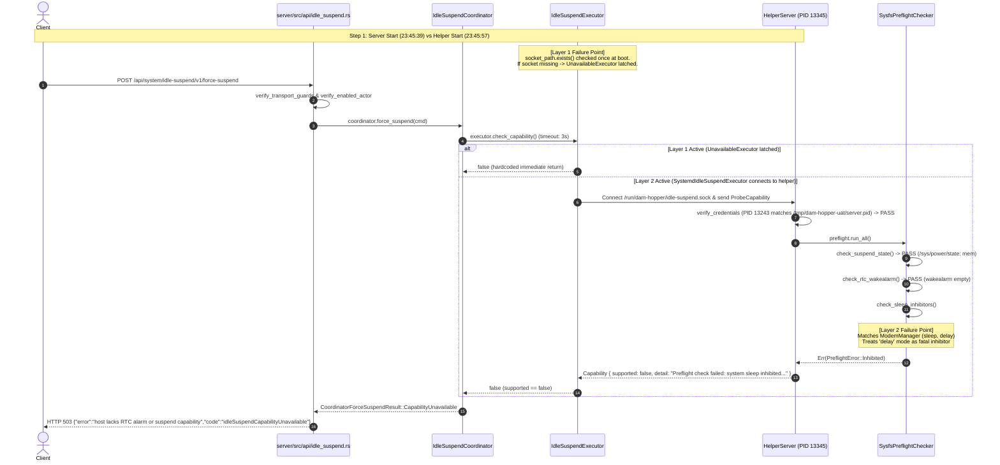

# Technical Investigation Report: Idle Suspend 503 `idleSuspendCapabilityUnavailable`

**Target**: `curl -i -X POST http://100.91.26.60:4803/api/system/idle-suspend/v1/force-suspend` returns HTTP 503 Service Unavailable  
`{"error":"host lacks RTC alarm or suspend capability","code":"idleSuspendCapabilityUnavailable"}`  
**Date**: 2026-09-07 23:49 Asia/Saigon  
**Branch**: `feat/terminal-idle-suspend`  
**Report File**: `plans/reports/debugger-260907-2349-idle-suspend-capability-unavailable.md`  

---

## 1. Executive Summary

- **Issue**: Calling `POST http://100.91.26.60:4803/api/system/idle-suspend/v1/force-suspend` returns HTTP 503 Service Unavailable:
  ```json
  {
    "error": "host lacks RTC alarm or suspend capability",
    "code": "idleSuspendCapabilityUnavailable"
  }
  ```
  despite running both `scripts/run-uat.sh start --public-host 100.91.26.60` and the privileged helper daemon:
  `sudo /opt/dam-hopper/current/bin/dam-hopper-idle-suspend-helper --socket /run/dam-hopper/idle-suspend.sock --audit-file /tmp/dam-hopper-uat/helper-audit.jsonl --enrolled-pid-file /tmp/dam-hopper-uat/server.pid &`

- **Host Capabilities (Hardware/Kernel Reality)**:
  The host **does not** lack RTC alarm or suspend capabilities.
  - `/sys/power/state` contains `freeze mem disk` (suspend-to-RAM `mem` supported).
  - `/sys/class/rtc/rtc0/wakealarm` exists, is writable by root, and is currently unassigned (ready for programming).
  - The error message is hardcoded in `server/src/api/idle_suspend.rs:470` to sanitize internal details (Requirement 48), masking internal failure reasons.

- **Primary Root Cause (Active Blocker - Startup Order & One-Time Executor Latching)**:
  In `server/src/main.rs:370-389`, `dam-hopper-server` evaluates `socket_path.exists()` strictly once during boot.
  In the user's execution sequence, the server was started **before** the helper daemon:
  1. `dam-hopper-server` (PID `13243`) started at `23:45:39`.
  2. The helper daemon (PID `13345`) was started at `23:45:57` (18 seconds later).
  Because `/run/dam-hopper/idle-suspend.sock` was either absent or re-created at `23:45:57`, the server latched `UnavailableExecutor` into `state.idle_suspend_coordinator`. `UnavailableExecutor::check_capability()` is hardcoded to return `false` without making any socket connection or probing the host. The coordinator never re-probes socket existence after startup.

- **Secondary Root Cause (Next Immediate Blocker - Preflight Sleep Inhibitor Rejection)**:
  Even if the server had latched `SystemdIdleSuspendExecutor`, the capability probe would **still fail** with 503 due to `server/src/idle_suspend/preflight.rs:84-95` and `preflight.rs:226-235`:
  - `preflight.rs` parses `systemd-inhibit --list --no-legend` by checking `line_lower.contains("sleep")`.
  - On standard Linux systems, `ModemManager` and `NetworkManager` maintain sleep inhibitors with `MODE=delay`.
  - In systemd architecture, `delay` inhibitors do not block suspend (they allow processes up to 5s to flush state before suspend proceeds).
  - `SysfsPreflightChecker::check_sleep_inhibitors()` treats all sleep inhibitors as fatal errors, ignoring `MODE=delay`.
  - `preflight.run_all()` returns `Err(PreflightError::Inhibited)`, causing helper `ProbeCapability` to return `supported: false`, which produces the identical 503 error.

- **Tertiary Blocker (Orphaned Helper Daemons & Socket Churn)**:
  Five separate instances of `dam-hopper-idle-suspend-helper` (PIDs `12005`, `12316`, `12593`, `13005`, `13345`) are concurrently running in the background. Each time the command was launched, it unlinked `/run/dam-hopper/idle-suspend.sock` and created a new listener, leaving prior listeners orphaned.

---

## 2. Process & Environment Inspection

### 2.1 Server Process (`dam-hopper-server`)
- **PID**: `13243` (PPID: `1`, UID: `0` / root)
- **Start Time**: `Mon Sep 7 23:45:39 2026`
- **Command Line**:
  ```text
  /home/loidinh/WS/dam-hopper-ws/feat-terminal-idle-suspend/server/target/release/dam-hopper-server \
      --config /tmp/dam-hopper-uat/dam-hopper.toml \
      --host 0.0.0.0 \
      --port 4803
  ```
- **Environment**:
  `scripts/run-uat.sh` sets `DAM_HOPPER_CORS_ORIGINS`. It does **not** set `DAM_HOPPER_IDLE_SUSPEND_SOCKET`.
  Therefore, the server defaults to `/run/dam-hopper/idle-suspend.sock`.

### 2.2 Helper Process (`dam-hopper-idle-suspend-helper`)
- **Active PID**: `13345` (PPID: `13344`, root of sudo tree PID `13333`)
- **Start Time**: `Mon Sep 7 23:45:57 2026` (18 seconds after server start)
- **Command Line**:
  ```text
  /opt/dam-hopper/current/bin/dam-hopper-idle-suspend-helper \
      --socket /run/dam-hopper/idle-suspend.sock \
      --audit-file /tmp/dam-hopper-uat/helper-audit.jsonl \
      --enrolled-pid-file /tmp/dam-hopper-uat/server.pid
  ```
- **Helper Binary Version**: `0.3.0` (`dam-hopper-idle-suspend-helper 0.3.0`, compiled `2026-09-07 07:29:49`).
- **Orphaned Helper Processes Detected**:
  | PID | PPID | Start Time | Command |
  |---|---|---|---|
  | `12005` | `12004` | `23:40:10` | `dam-hopper-idle-suspend-helper --socket ...` |
  | `12316` | `12315` | `23:41:43` | `dam-hopper-idle-suspend-helper --socket ...` |
  | `12593` | `12592` | `23:43:15` | `dam-hopper-idle-suspend-helper --socket ...` |
  | `13005` | `13004` | `23:44:45` | `dam-hopper-idle-suspend-helper --socket ...` |
  | `13345` | `13344` | `23:45:57` | `dam-hopper-idle-suspend-helper --socket ...` |

  Socket inspection (`ss -lx | grep idle-suspend`) revealed 6 listeners registered across kernel inodes (`58716`, `57019`, `44716`, `52619`, `21031`, `65271`).

---

## 3. Filesystem & State Inspection

### 3.1 State Directory (`/tmp/dam-hopper-uat/`)
- Directory permissions: `drwx------+ 3 root root` (mode `0700`).
- `/tmp/dam-hopper-uat/server.pid`: Contains `13243` (written by `run-uat.sh` line 243).
- `/tmp/dam-hopper-uat/dam-hopper.toml`: Contains `[server.idle_suspend] enabled = false`.
- `/tmp/dam-hopper-uat/server.log`: Server tracing output.
- `/tmp/dam-hopper-uat/helper-audit.jsonl`: Helper audit log.

### 3.2 Socket File (`/run/dam-hopper/idle-suspend.sock`)
- Stat info:
  - File: `/run/dam-hopper/idle-suspend.sock`
  - Access: `(0660/srw-rw----) Uid: (0/root) Gid: (0/root)`
  - Birth: `2026-09-07 23:45:57.689952983 +0700`
- Crucial Observation: The birth timestamp of the current socket (`23:45:57`) is **after** the server process started (`23:45:39`).

### 3.3 Host Power & RTC Nodes
- `/sys/power/state`: `freeze mem disk` (kernel supports suspend-to-RAM).
- `/sys/class/rtc/rtc0/wakealarm`: exists, mode `0644 root:root`, currently empty.
- `systemd-inhibit --list --no-legend`:
  ```text
  ModemManager   0    root    1205  ModemManager   sleep ModemManager needs to reset devices       delay
  NetworkManager 0    root    1144  NetworkManager sleep NetworkManager needs to turn off networks delay
  Oh My Pi       1000 loidinh 11557 omp            idle  Oh My Pi agent session                    block
  Oh My Pi       1000 loidinh 11557 omp            idle  Oh My Pi agent session                    block
  ```

---

## 4. End-to-End Execution Trace & Failure Analysis



### 4.1 Layer 1: Startup Order Race & One-time Latching
In `server/src/main.rs:370-389`:
```rust
let idle_suspend_executor: Arc<dyn dam_hopper_server::idle_suspend::IdleSuspendExecutor> = {
    let socket_path = std::env::var("DAM_HOPPER_IDLE_SUSPEND_SOCKET")
        .map(PathBuf::from)
        .unwrap_or_else(|_| PathBuf::from("/run/dam-hopper/idle-suspend.sock"));
    if socket_path.exists() {
        tracing::info!(
            socket = %socket_path.display(),
            "Enrolling SystemdIdleSuspendExecutor with privileged helper"
        );
        Arc::new(dam_hopper_server::idle_suspend::SystemdIdleSuspendExecutor::new(&socket_path))
    } else {
        tracing::info!(
            socket = %socket_path.display(),
            "Privileged helper socket not found; idle suspend executor will be unavailable"
        );
        Arc::new(dam_hopper_server::idle_suspend::UnavailableExecutor::new(
            "Privileged helper socket not found at expected path",
        ))
    }
};
state.start_idle_suspend_coordinator(idle_suspend_executor).await;
```
1. Server started at `23:45:39`. Helper started at `23:45:57`.
2. When the server initialized, if `/run/dam-hopper/idle-suspend.sock` was missing, it permanently constructed `UnavailableExecutor`.
3. In `server/src/idle_suspend/executor.rs:44-47`:
   ```rust
   impl IdleSuspendExecutor for UnavailableExecutor {
       fn check_capability(&self) -> BoxFuture<'_, bool> {
           Box::pin(async { false })
       }
   }
   ```
4. Starting the helper 18 seconds later had **zero effect** on the running server because `state.idle_suspend_coordinator` never re-evaluates the executor.

### 4.2 Layer 2: Preflight Sleep Inhibitor Rejection
In `server/src/idle_suspend/preflight.rs:84-95`:
```rust
let line_lower = line.to_lowercase();
if line_lower.contains("sleep") {
    let who = parts[0].to_string();
    let mode = parts.last().unwrap_or(&"block").to_string();
    let why = if parts.len() > 4 {
        parts[3..parts.len() - 1].join(" ")
    } else {
        "system sleep inhibited".to_string()
    };
    return Ok(Some(ActiveInhibitor::new(who, why, mode)));
}
```
And in `server/src/idle_suspend/preflight.rs:226-235`:
```rust
fn check_sleep_inhibitors(&self) -> Result<(), PreflightError> {
    match self.inhibitor_provider.check_sleep_inhibitor() {
        Ok(Some(inhibitor)) => Err(PreflightError::Inhibited(
            inhibitor.format_description(),
            Some(inhibitor.who),
            Some(inhibitor.why),
        )),
        Ok(None) => Ok(()),
        Err(e) => Err(PreflightError::ProbeError(e)),
    }
}
```
1. On this machine, `systemd-inhibit --list --no-legend` outputs:
   `ModemManager 0 root 1205 ModemManager sleep ModemManager needs to reset devices delay`
2. `line_lower.contains("sleep")` matches.
3. `mode` is parsed as `"delay"`, but `check_sleep_inhibitors` fails on **any** `Some(inhibitor)`, disregarding that `delay` inhibitors are normal system behavior that do not block sleep.
4. `preflight.run_all()` returns `Err(PreflightError::Inhibited)`.
5. Helper server returns `Capability { supported: false, detail: "..." }`.
6. Client executor returns `false`, causing the coordinator to return `CapabilityUnavailable`.

### 4.3 Layer 3: Column Slicing Bug in Inhibitor Parser
`preflight.rs:88-90` assumes column indices:
`WHO, UID, PID, WHAT, WHY..., MODE`
The real systemd format is:
`WHO UID USER PID COMM WHAT WHY MODE`
Because col 2 is `USER` and col 4 is `COMM`, `parts[3..parts.len() - 1]` misparses `why` as:
`"1205 ModemManager sleep ModemManager needs to reset devices"` (incorporating PID and process name into the reason string).

---

## 5. Root Cause Summary Matrix

| Failure Layer | Component & Location | Defect Mechanism | Observed Impact |
|---|---|---|---|
| **Primary (Layer 1)** | `server/src/main.rs:370-389` | One-shot check `socket_path.exists()` latches `UnavailableExecutor` if server boots before helper. No dynamic reconnect or deferred initialization. | Requests immediately return 503 without contacting helper socket. |
| **Secondary (Layer 2)** | `server/src/idle_suspend/preflight.rs:84-95, 226-235` | Treats `systemd-inhibit` `mode: delay` locks (`ModemManager`, `NetworkManager`) as fatal sleep blockers. | Helper probe returns `supported: false` even when socket and auth pass. |
| **Tertiary (Layer 3)** | Process Lifecycle / Helper Invocation | Starting helper via manual bash backgrounding without killing prior instances spawned 5 orphaned helpers rebinding and unlinking socket. | Socket churn, abandoned listeners in kernel socket table. |
| **Architectural (Layer 4)** | `server/src/api/idle_suspend.rs:465-472` | Collapse of all capability failure types into sanitized generic `"host lacks RTC alarm or suspend capability"`. | Obscures daemon/IPC/inhibitor errors behind a misleading hardware capability claim. |

---

## 6. Recommendations for Remediation (Design Only)

1. **Decouple Executor Capability from Boot-Time Socket Existence**:
   - Rather than choosing between `UnavailableExecutor` and `SystemdIdleSuspendExecutor` at boot, `SystemdIdleSuspendExecutor` should always be used whenever idle-suspend is configured.
   - `SystemdIdleSuspendExecutor::check_capability()` already dynamically checks `is_socket_present()` and connects over Unix socket on demand.
   - If the helper starts 10 seconds after the server, subsequent requests will naturally connect and succeed without requiring server restarts.

2. **Filter Out Delay Inhibitors in Preflight Check**:
   - Modify `preflight.rs:check_sleep_inhibitor()` to check `mode.to_lowercase() == "block"`.
   - Inhibitors with `mode == "delay"` should be ignored (or logged at debug level), as systemd automatically handles delay inhibitors during suspend.
   - Correct the column parsing to properly match `WHAT == "sleep"` and extract `WHY` according to standard systemd column layout.

3. **Clean Up Orphaned Helper Processes**:
   - Terminate the 5 stale helper processes (`sudo kill 12005 12316 12593 13005 13345`).
   - Use systemd units or a dedicated management script with pidfile locking to ensure only a single helper daemon runs.

4. **Surface Diagnostic Details in Administrative Status**:
   - While `POST /force-suspend` error message remains sanitized per Requirement 48, the detailed reason (`detail` from `HelperResponsePayload::Capability` or `PreflightError`) should be recorded in `coordinator.status().capability_reason` so `GET /api/system/idle-suspend/v1/status` surfaces the exact failure cause.

---

## 7. Unresolved Questions

1. In production deployments, should `dam-hopper-idle-suspend-helper.socket` use native systemd socket activation (`sd_listen_fds`) to eliminate startup ordering constraints entirely between server and helper?
2. Should `scripts/run-uat.sh` automatically start and supervise the helper daemon when testing idle-suspend features, ensuring the PID file and socket paths match?
