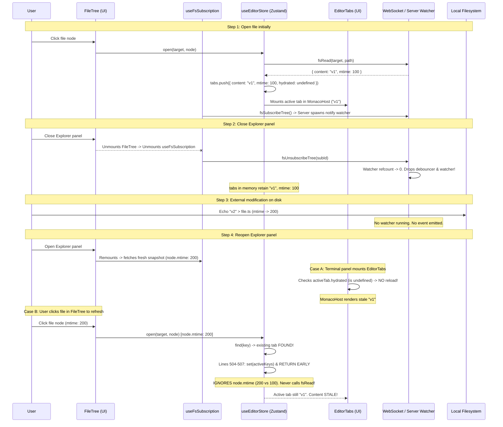

# Root Cause Analysis: Stale File Content in Explorer Panel After External Modification

**Report ID**: `debugger-260916-0505-explorer-file-stale-content`  
**Target Issue**: Opened file content does not update after closing Explorer panel, editing file externally on disk, and reopening Explorer panel.  
**Affected Subsystems**: `packages/ui/src/stores/editor.ts`, `packages/ui/src/components/organisms/EditorTabs.tsx`, `packages/ui/src/components/organisms/FileTree.tsx`, `packages/ui/src/components/organisms/TerminalFloatingFilePanel.tsx`, `packages/ui/src/components/templates/IdeShell.tsx`, `packages/ui/src/hooks/use-fs-subscription.ts`, `server/src/fs/watcher.rs`.

---

## 1. Executive Summary

### Issue Description & Business Impact
When user opens file in Explorer panel, closes Explorer panel, modifies file externally on disk (via terminal CLI, background script, AI agent, or external editor), then reopens Explorer panel, displayed file content remains stale. User sees old content without error or warning.
- **Risk**: Silent data loss / conflicting overwrite. If user edits stale buffer and saves, optimistic lock conflict triggers (`ConflictDialog`). If user does not edit, user works with obsolete file contents under false impression that buffer is current.

### Root Cause Identification
Failure caused by five compounding structural flaws:
1. **Short-circuit without freshness check in `editorStore.open`** (`packages/ui/src/stores/editor.ts:502-508`): When user clicks file in `FileTree`, `open()` checks if tab already exists in `get().tabs`. If found, it updates `activeKeys` and returns immediately. Ignores `node.mtime` from fresh server tree snapshot; never re-reads content.
2. **Tab persistence across UI unmount without mount-time hydration** (`packages/ui/src/components/organisms/EditorTabs.tsx:240-244` & `packages/ui/src/stores/editor.ts:1213-1216`): Global Zustand `useEditorStore` preserves open tabs in memory when `TerminalFloatingFilePanel` or `IdeShell` sidebar unmounts. On panel remount, `EditorTabs` checks `activeTab.hydrated && !activeTab.loading`. In-session tabs have `hydrated: undefined` (only set `true` during localStorage restore). `loadContent()` also explicitly aborts if `!tab.hydrated`. Result: no disk read triggered on remount.
3. **Watcher teardown on Explorer close** (`packages/ui/src/hooks/use-fs-subscription.ts:162-165` & `server/src/fs/mod.rs:228-232`): `useFsSubscription` lifecycle bound strictly to `FileTree` component. Closing panel unmounts `FileTree`, calling `t.fsUnsubscribeTree(subId)`. Server decrements watcher refcount to 0 and drops the `notify` watcher entirely. Server does not watch filesystem while panel closed.
4. **Complete disconnection between FS events and EditorStore** (`packages/ui/src/hooks/use-fs-subscription.ts:137-160`): Even while `FileTree` is mounted and watching, `onFsEvent` only updates TanStack Query `['fs-tree', ...]` cache and schedules git diff invalidation. Does not inform `useEditorStore`.
5. **No focus/visibility polling or invalidation** (`EditorTabs.tsx`, `MonacoHost.tsx`): Zero event listeners for `window.focus`, `visibilitychange`, or editor widget focus to verify open buffer freshness.

### Remediation Strategy & Priorities
- **P0 (Immediate / KISS)**: In `useEditorStore.open()`, compare `existing.mtime` against `node.mtime`. If changed, trigger `reloadTab()` (if clean) or mark `stale: true` (if dirty).
- **P1 (Mount / Focus freshness)**: In `EditorTabs.tsx`, check active tab `mtime` on mount and on `window.focus` / `visibilitychange`.
- **P2 (Global FS Event Bus)**: Connect workspace FS events to `reconcileGitMutationFiles` (or generalized `reconcileFileMutation`).
- **P3 (Server watcher scope)**: Watch files corresponding to open editor tabs independently of `FileTree` mount status.

---

## 2. Technical Analysis & Reproduction Sequence

### Reproduction Call-Chain & Component Lifecycles



### Detailed Code Walkthrough

#### Step A: Opening file via Explorer panel
1. **User interaction**: User clicks tree row in `FileTree.tsx:556-558`:
   ```ts
   // FileTree.tsx:556
   if (node.data.kind === "file") {
     onFileOpen?.(node.data);
   }
   ```
2. **Prop forwarding**: In `WorkspacePage.tsx:1092-1096`:
   ```ts
   // WorkspacePage.tsx:1092
   const handleFileOpen = useCallback((node: FsArborNode) => {
     if (projectName)
       void openWorkspaceFile(projectName, node, projectTarget?.target);
   }, [openWorkspaceFile, projectName, projectTarget]);
   ```
   `openWorkspaceFile` calls `openFile(requestTarget, node)` where `openFile = useEditorStore((s) => s.open)`.
3. **Tab creation & fetch**: `packages/ui/src/stores/editor.ts:495-565`:
   - Checks `existing = get().tabs.find((t) => t.key === key)`. Tab not found.
   - Creates placeholder tab:
     ```ts
     // editor.ts:513-530
     const placeholder: Tab = {
       key, project, target: targetRef, targetKey, targetAvailable: true,
       path: node.id, name: node.name, mtime: node.mtime, size: node.size,
       tier: optimisticTier, content: "", savedContent: "", dirty: false,
       loading: !isPreviewOnlyFile(optimisticTier, node.name), saving: false,
       conflicted: false,
       // NOTE: hydrated is NOT set here (evaluates to undefined)
     };
     ```
   - Dispatches `transport().fsRead(targetRef, node.id)`.
   - On response (`editor.ts:557-567`), tab populated with `content: decoded`, `savedContent: decoded`, `mtime: result.mtime`, `loading: false`.
4. **Editor display**: `EditorTabs.tsx:506-522` renders `MonacoHost` with `content={activeTab.content}`.
5. **FS Subscription created**: `FileTree.tsx:357` invokes `useFsSubscription(requestTarget, path)`. Subscribes to directory via WS `t.fsSubscribeTree()`. Server spawns `notify::RecommendedWatcher` (`server/src/fs/watcher.rs:96-107`).

#### Step B: Closing Explorer panel
Two contexts:
1. **Terminal Mode (`TerminalFloatingFilePanel.tsx:65-66`)**:
   ```ts
   // TerminalFloatingFilePanel.tsx:65
   export function TerminalFloatingFilePanel({ open, ...props }: TerminalFloatingFilePanelProps) {
     if (!open) return null;
     return <TerminalFloatingFilePanelContent {...props} />;
   }
   ```
   Setting `open: false` completely unmounts `TerminalFloatingFilePanelContent`, unmounting both `explorerContent` (`FileTree`) and `editorContent` (`EditorTabs`).
2. **IDE Mode (`IdeShell.tsx:404-414`)**:
   Closing left top tool sets `activeLeftTopId = null`. `SidebarTopGroup` unmounts, unmounting `FileTree`. `EditorTabs` remains mounted in center pane.
3. **In both modes**:
   Unmounting `FileTree` triggers cleanup in `use-fs-subscription.ts:162-165`:
   ```ts
   // use-fs-subscription.ts:162
   return () => {
     off();
     t.fsUnsubscribeTree(subId);
   };
   ```
   Server receives `fsUnsubscribeTree(subId)`. In `server/src/fs/mod.rs:228-232`:
   ```rust
   pub fn unsubscribe_tree(&self, sub_id: u64) {
       let mut inner = self.inner.lock().expect("FsSubsystem: Mutex poisoned");
       if let Some(info) = inner.subs.remove(&sub_id) {
           inner.watcher_mgr.release(&info.watcher_key);
       }
   }
   ```
   In `server/src/fs/watcher.rs:121-131`:
   ```rust
   pub(crate) fn release(&self, key: &WatcherKey) {
       let mut map = self.inner.lock().unwrap_or_else(|p| p.into_inner());
       if let Some(handle) = map.get_mut(key) {
           handle.refcount = handle.refcount.saturating_sub(1);
           if handle.refcount == 0 {
               map.remove(key); // DROPS WatcherHandle and its _debouncer
           }
       }
   }
   ```
   Server watcher destroyed. Zero filesystem monitoring active.
4. **Zustand store remains alive**: `useEditorStore` is a global module singleton (`editor.ts:402`). `tabs` array retains the opened tab with `content: "v1"`, `mtime: 100`, `dirty: false`, `stale: false`.

#### Step C: External file modification while panel closed
1. External process writes new content `"v2"` to file on disk. Disk `mtime` updates to 200.
2. Server watcher is dead; no event generated.
3. Even if watcher were kept alive:
   - `server/src/fs/watcher.rs:97` uses `d.watch(&key.root, notify::RecursiveMode::NonRecursive)?`. If file is in any subdirectory (e.g. `src/lib/foo.ts`), notify never fires!
   - Client `useFsSubscription.ts:137-160` only updates TanStack Query tree node cache and calls `scheduleGitFsInvalidation`. It has zero reference to `useEditorStore`.

#### Step D: Re-opening Explorer panel
1. **Sub-scenario 1: Terminal panel mounts `EditorTabs`**:
   - `EditorTabs` mounts. Reads `activeTab` from `useEditorStore.tabs`.
   - Tab has `content: "v1"`, `hydrated: undefined`, `loading: false`.
   - Check lines 240-244 in `packages/ui/src/components/organisms/EditorTabs.tsx`:
     ```ts
     // EditorTabs.tsx:240
     // Auto-hydrate active tab if content is not loaded
     useEffect(() => {
       if (activeTab?.hydrated && !activeTab.loading) {
         void loadContent(activeTab.key);
       }
     }, [activeTab?.key, activeTab?.hydrated, activeTab?.loading, loadContent]);
     ```
   - `activeTab.hydrated` is `undefined`. Condition fails. `loadContent` not called!
   - Even if called, `packages/ui/src/stores/editor.ts:1214-1216`:
     ```ts
     loadContent: async (key: string) => {
       const tab = get().tabs.find((t) => t.key === key);
       if (!tab || !tab.hydrated || tab.loading || !tab.targetAvailable)
         return;
     ```
     Aborts immediately due to `!tab.hydrated`.
   - Result: `MonacoHost` mounts with stale content `"v1"`.
2. **Sub-scenario 2: User clicks file in `FileTree` (Terminal or IDE mode)**:
   - `FileTree` remounts. `useFsSubscription` queries server for snapshot.
   - Server returns fresh snapshot: `node.mtime` is now 200.
   - User clicks row in tree. `FileTree` calls `onFileOpen(node)` where `node.mtime === 200`.
   - `useEditorStore.open(target, node)` executes.
   - Look at `packages/ui/src/stores/editor.ts:502-508`:
     ```ts
     // editor.ts:502
     const existing = get().tabs.find((t) => t.key === key);
     if (existing) {
       set((s) => ({
         activeKeys: { ...s.activeKeys, [scopeKey]: key },
       }));
       return;
     }
     ```
   - `existing` tab found in store (`existing.mtime === 100`).
   - Function activates the key and **returns immediately**.
   - It **does not compare** `existing.mtime` with `node.mtime`.
   - It **does not reload** content.
   - It **does not check disk**.
   - User is presented with stale content `"v1"`.

---

## 3. Design Intent vs Actual Implementation

DAM-Hopper already has mechanisms for handling stale files and disk synchronization, but they are isolated to Git workflows:

| Feature / Mechanism | Intended Design | Actual Implementation | Gap |
| :--- | :--- | :--- | :--- |
| **`tab.stale` flag** | Signals file changed on disk while tab has unsaved edits (`dirty: true`). Displays warning banner with "Reload" / "Keep edits" (`EditorTabs.tsx:534-556`). | Only set inside `reconcileGitMutationFiles()` and `reconcileGitProjectFiles()` (`editor.ts:1141, 1172`). | Never set during non-git external modifications. |
| **`reloadTab()`** | Discards in-memory edits, reads fresh content and `mtime` from server via `fsRead` (`editor.ts:1001-1075`). | Only invoked from Git reconciliation (`editor.ts:1147`), search-replace (`use-search-panel-replace.ts:174`), or manual banner click. | Never called when reopening a file or remounting editor tabs. |
| **`reconcileGitMutationFiles()`** | Reconciles open editor tabs: clean tabs reloaded silently via `reloadTab()`, dirty tabs marked `stale: true` (`editor.ts:1115-1149`). | Exclusively called in `packages/ui/src/api/queries.ts:91` on TanStack Query Git mutations (`useGitPull`, `useGitCheckout`, `useGitDiscard`). | External non-git file changes (compilers, linters, external editors, bash scripts) never invoke this logic. |
| **`useEditorStore.open()`** | Opens file in editor. | Lines 502-508 short-circuit if tab key exists in `tabs`. | Assumes memory tab is permanently immutable and fresh. No `mtime` comparison against `node.mtime`. |
| **`useFsSubscription`** | Watches directory for file events via WebSocket and notify. | Scoped strictly to `FileTree` component. Unsubscribes on unmount. Events only touch `fs-tree` query cache; ignores `editorStore`. Non-recursive notify on server. | Server drops watcher when panel closes. Events never inform editor tabs. Nested directories not watched. |
| **`EditorTabs` lifecycle** | Mounts editor for active tab. Auto-hydrates if unloaded. | Lines 240-244 only load if `tab.hydrated === true`. `hydrated` is false/undefined for all session tabs. | Zero freshness checks on mount, focus, or visibility change. |

---

## 4. Remediation Strategies & Architectural Proposals

*Note: As per instructions, these are proposals only. No code fixes have been applied.*

### Strategy 1: Freshness Reconcile on `open()` (P0 - Immediate, KISS, DRY)
**File**: `packages/ui/src/stores/editor.ts:502-508`
- **Mechanism**: When `existing` tab is found in `open(target, node)`:
  ```ts
  const existing = get().tabs.find((t) => t.key === key);
  if (existing) {
    set((s) => ({ activeKeys: { ...s.activeKeys, [scopeKey]: key } }));
    // If server tree node has newer mtime than cached tab
    if (node.mtime && existing.mtime && node.mtime !== existing.mtime) {
      if (!existing.dirty) {
        void get().reloadTab(existing.key);
      } else {
        set((s) => ({
          tabs: s.tabs.map((t) => t.key === key ? { ...t, stale: true } : t),
        }));
      }
    }
    return;
  }
  ```
- **Pros**: Minimal diff (under 15 lines). Directly fixes user clicking file in FileTree after reopening. Reuses existing `reloadTab` and `stale` mechanisms.
- **Cons**: Only triggers if user clicks file in FileTree; does not automatically refresh if user simply reopens `TerminalFloatingFilePanel` without clicking the tree row.

### Strategy 2: Mount & Window Focus Freshness Check in `EditorTabs` (P1)
**File**: `packages/ui/src/components/organisms/EditorTabs.tsx`
- **Mechanism**:
  1. Add a check in `useEffect` on `EditorTabs` mount and on `activeTab.key` change:
     Fetch file stat (`fsRead(target, path, { offset: 0, len: 0 })` or lightweight stat endpoint) or trigger `reloadTab` if clean.
  2. Add `window.addEventListener("focus", checkActiveTabFreshness)` and `document.addEventListener("visibilitychange", ...)`.
  3. If server `mtime !== tab.mtime`:
     - If `!tab.dirty` -> `reloadTab(tab.key)`.
     - If `tab.dirty` -> `set({ stale: true })`.
- **Pros**: Matches VS Code / standard IDE behavior: returning to window or opening editor pane automatically synchronizes buffer with disk.
- **Cons**: Small network check on focus/mount. Needs stat-only check or lightweight head request to avoid redundant payload transfer.

### Strategy 3: Generalized File Mutation Reconciler / FS Event Bus (P2)
**Files**: `packages/ui/src/stores/editor.ts`, `packages/ui/src/hooks/use-fs-subscription.ts`
- **Mechanism**:
  1. Rename or generalize `reconcileGitMutationFiles(target, paths)` to `reconcileFileMutations(target, paths)`.
  2. In `useFsSubscription.ts:137`, when an `ev: FsEventDto` arrives with `kind: "modify"`:
     Forward `ev.path` to `useEditorStore.getState().reconcileFileMutations(target, [ev.path])`.
- **Pros**: Real-time buffer update while panel is open. Unifies Git and direct filesystem event handling.
- **Cons**: Does not solve the period when Explorer panel is closed unless subscription is lifted above `FileTree`.

### Strategy 4: Lift Workspace FS Subscription to WorkspacePage (P3)
**Files**: `packages/ui/src/components/pages/WorkspacePage.tsx`, `server/src/fs/watcher.rs`
- **Mechanism**:
  1. Move `useFsSubscription` or a workspace-level subscription hook to `WorkspacePage.tsx` root level, persisting across panel toggles.
  2. On server, maintain watcher for project root or specifically watch open tab file paths.
- **Pros**: Server watcher never torn down when user toggles panels.
- **Cons**: Increases server resource usage if recursive watching is enabled.

---

## 5. Summary Matrix of Findings

| Question from Prompt | Finding | Reference |
| :--- | :--- | :--- |
| **Does `EditorTabs` reload tab content on mount?** | **NO.** Only checks `activeTab.hydrated`. Session tabs have `hydrated: undefined`. `loadContent` also early-returns if `!hydrated`. | `EditorTabs.tsx:240-244`<br>`editor.ts:1214-1216` |
| **Does `FileTree`'s `onFileOpen` check `mtime` or reload if tab exists?** | **NO.** Checks `existing` by key. If found, sets `activeKeys` and returns immediately. Ignores `node.mtime`. | `editor.ts:502-508` |
| **Does `useFsSubscription` unmount when Explorer is closed?** | **YES.** Cleanup calls `off()` and `fsUnsubscribeTree(subId)`. Server watcher drops to refcount 0 and terminates. | `use-fs-subscription.ts:162-165`<br>`watcher.rs:121-131` |
| **Does `useFsSubscription` propagate file modify events to `useEditorStore`?** | **NO.** Only updates TanStack Query tree cache (`applyFsDelta`) and invalidates Git diffs. No editor store dispatch. | `use-fs-subscription.ts:137-160` |
| **Does `EditorTabs` or `MonacoHost` have focus / visibility / polling?** | **NO.** Zero listeners for `window.focus`, `visibilitychange`, `onDidFocusEditorWidget`, or polling intervals. | `EditorTabs.tsx`<br>`MonacoHost.tsx` |

---

## 6. Unresolved Questions

1. **Lightweight File Stat Protocol**: Does `transport().fsRead` currently support a pure stat/mtime probe without downloading content (e.g. `len: 0`), or should server expose an explicit `fsStat` RPC to optimize background freshness polling?
2. **Subdirectory Watcher Overhead**: Server watcher currently uses `notify::RecursiveMode::NonRecursive` to prevent inotify exhaustion on large projects (e.g. `target/` directories). If real-time watching is desired for open editor tabs in nested folders, should server watch specific open file paths rather than recursive workspace roots?
3. **Dirty Tab Policy on Reopen**: When file is modified on disk while tab has unsaved edits (`dirty: true`), should reopening Explorer automatically show the `stale` warning banner (`EditorTabs.tsx:535`), or should a modal prompt be displayed immediately?
