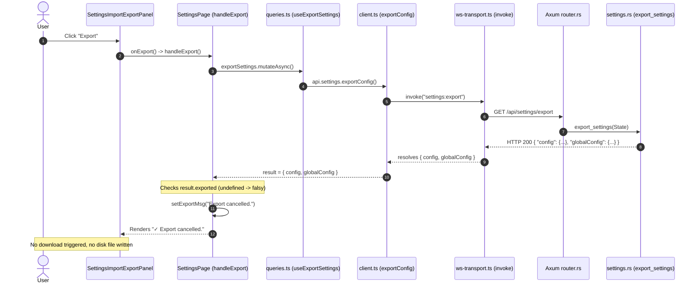
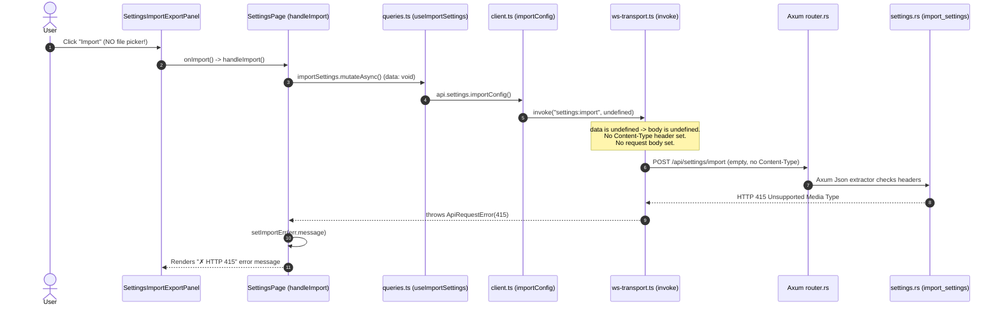

# Root Cause Analysis: Settings Page Import / Export Failure

**Report ID**: `debugger-260916-1428-settings-import-export-failure`  
**Target Issue**: Settings Page "Import Settings" and "Export Settings" buttons non-functional; export shows "Export cancelled." with no file generated; import lacks file picker and fails with HTTP 415 or "Import cancelled."  
**Affected Subsystems**:
- `packages/ui/src/components/pages/settings-page/SettingsImportExportPanel.tsx`
- `packages/ui/src/components/pages/SettingsPage.tsx`
- `packages/ui/src/api/queries.ts`
- `packages/ui/src/api/client.ts`
- `packages/ui/src/api/ws-transport.ts`
- `server/src/api/settings.rs`
- `server/src/api/router.rs`
- Historical migration: Commit `2150e13d` (Electron IPC) vs commits `85791a07` / `c061b615` / `3aade9ef` (Rust + Web migration)

---

## 1. Executive Summary

### Issue Description & Symptoms
On the Settings page (`/settings`), under "Import / Export Settings":
1. **Export Settings**: Clicking "Export" button executes mutation, but no file downloads, no file saves to disk, and UI displays `✓ Export cancelled.` (green checkmark for cancellation message).
2. **Import Settings**: Clicking "Import" button triggers mutation immediately without file selection dialog. Request fails with HTTP 415 / error message, or displays `✓ Import cancelled.`. No settings imported, no config reloaded.

### Root Cause Identification
Root cause: **Incomplete architectural migration from Electron desktop IPC to Web/Rust HTTP architecture**.
1. **Ghost Contract in UI**: UI in `SettingsPage.tsx` expects Electron IPC response shapes `{ exported: boolean; path?: string }` and `{ imported: boolean }` from commit `2150e13d`.
2. **Export Contract Mismatch**: Axum server `export_settings` (`server/src/api/settings.rs:55-63`) returns `{ "config": Value, "globalConfig": Value }`. Client receives response where `result.exported` is `undefined` (falsy), immediately branching to `"Export cancelled."`. No browser download (`Blob`/`<a>`) or server file save triggered.
3. **Export Format & Copy Mismatch**: UI copy promises saving `dam-hopper.toml` with "Preserves all formatting and comments". Backend returns raw JSON derived from deserialized Rust structs, stripping all TOML formatting, whitespace, and comments.
4. **Import Missing UI Affordance**: Neither `SettingsImportExportPanel.tsx` nor `SettingsPage.tsx` contains an `<input type="file">`, dropzone, or path input. Button directly invokes parameterless mutation.
5. **Import Request & Extractor Failure**: UI passes `undefined` data; `ws-transport.ts` dispatches `POST /api/settings/import` with no body and no `Content-Type: application/json` header. Axum's `Json(body): Json<ImportBody>` extractor rejects request with HTTP 415 (`Unsupported Media Type`).
6. **Import Payload & Scope Collision**: Backend `ImportBody` only contains `global_config: Option<GlobalConfig>`, completely ignoring workspace `config`. If valid JSON body were posted, server would return `{ "ok": true }`. UI expects `{ imported: boolean }`, so `result.imported` is `undefined`, triggering `"Import cancelled."` and preventing TanStack Query cache invalidations.

---

## 2. Technical Analysis & Call Chain

### Call Chain: Export Settings



### Call Chain: Import Settings



---

## 3. Historical Migration Forensic Analysis

### 1. Original Desktop Architecture (Commit `2150e13d`, March 2026)
In `packages/electron/src/main/ipc/settings.ts`:
- **Native File Dialogs**:
  ```typescript
  // Export Settings
  ipcMain.handle(CH.SETTINGS_EXPORT, async () => {
    const ctx = holder.current;
    if (!ctx) throw new Error("No workspace loaded");
    const result = await dialog.showSaveDialog({
      title: "Export workspace settings",
      defaultPath: "dev-hub.toml",
      filters: [{ name: "TOML", extensions: ["toml"] }],
    });
    if (result.canceled || !result.filePath) return { exported: false };
    const raw = await readFile(ctx.configPath, "utf-8");
    await writeFile(result.filePath, raw, "utf-8");
    return { exported: true, path: result.filePath };
  });

  // Import Settings
  ipcMain.handle(CH.SETTINGS_IMPORT, async () => {
    const ctx = holder.current;
    if (!ctx) throw new Error("No workspace loaded");
    const result = await dialog.showOpenDialog({
      title: "Import workspace settings",
      filters: [{ name: "TOML", extensions: ["toml"] }],
      properties: ["openFile"],
    });
    if (result.canceled || result.filePaths.length === 0) return { imported: false };
    const sourcePath = result.filePaths[0];
    const validated = await readConfig(sourcePath);
    await writeConfig(ctx.configPath, validated);
    ctx.config = await readConfig(ctx.configPath);
    holder.sendEvent(EV.CONFIG_CHANGED, {});
    return { imported: true };
  });
  ```
- **Analysis**:
  - UI `handleExport()` checked `result.exported ? ... : "Export cancelled."` because Electron's `dialog.showSaveDialog` returned `{ canceled: true }` when user closed dialog.
  - UI `handleImport()` checked `result.imported ? ... : "Import cancelled."` because `dialog.showOpenDialog` returned `{ canceled: true }`.
  - Export read raw TOML text from `ctx.configPath`, preserving comments.
  - User selected target file via native OS dialog invoked directly by Electron main process.

### 2. Fastify Web Server Transition (Commit `4bdaf1c` / `85791a07~1`)
In `packages/server/src/routes/settings.ts`:
- `GET /api/settings/export`: returned raw TOML with `Content-Disposition: attachment; filename="dev-hub.toml"`.
- `POST /api/settings/import`: accepted TOML body text.
- **Defect**: Frontend `client.ts` was mapped to HTTP endpoints via `ws-transport.ts`, but `client.ts` signatures and `SettingsPage.tsx` handlers were never updated to handle browser file download or file upload.

### 3. Rust Axum Server Rewrite (Commits `3aade9ef`, `85791a07`, `c061b615`)
- In `server/src/api/settings.rs`:
  - `export_settings` rewritten to return JSON dump of in-memory `AppState` (`config` + `global_config`).
  - `import_settings` rewritten with `ImportBody { global_config: Option<GlobalConfig> }`.
  - Workspace config completely omitted from `import_settings`.
  - Node & Electron packages deleted (`85791a07`). Electron types dropped (`c061b615`).
  - Frontend remained frozen with Electron IPC expectations.

---

## 4. Line-by-Line Code Evidence

### 1. UI Layer: `packages/ui/src/components/pages/SettingsPage.tsx`
Lines 80-116:
```typescript
80:  async function handleExport() {
81:    setExportMsg(null);
82:    setExportErr(null);
83:    try {
84:      const result = await exportSettings.mutateAsync();
85:      setExportMsg(
86:        result.exported
87:          ? `Exported → ${result.path ?? "saved"}`
88:          : "Export cancelled.",
89:      );
90:    } catch (err) {
91:      setExportErr(err instanceof Error ? err.message : String(err));
92:    }
93:    setTimeout(() => {
94:      setExportMsg(null);
95:      setExportErr(null);
96:    }, 5000);
97:  }
98:
99:  async function handleImport() {
100:    setImportMsg(null);
101:    setImportErr(null);
102:    try {
103:      const result = await importSettings.mutateAsync();
104:      setImportMsg(
105:        result.imported
106:          ? "Settings imported and config reloaded."
107:          : "Import cancelled.",
108:      );
109:    } catch (err) {
110:      setImportErr(err instanceof Error ? err.message : String(err));
111:    }
112:    setTimeout(() => {
113:      setImportMsg(null);
114:      setImportErr(null);
115:    }, 6000);
116:  }
```
**Defects**:
- Line 84-86: Expects `result.exported: boolean`. Backend returns `{ config, globalConfig }`. `result.exported` is `undefined`. Line 88 evaluates to `"Export cancelled."`.
- Line 103: `importSettings.mutateAsync()` called with zero arguments. No file data passed.
- Line 105: Expects `result.imported: boolean`. Backend returns `{ "ok": true }`. `result.imported` is `undefined`. Line 107 evaluates to `"Import cancelled."`.

### 2. Panel Component: `packages/ui/src/components/pages/settings-page/SettingsImportExportPanel.tsx`
Lines 53-61, 88-96:
```typescript
53:          <button
54:            type="button"
55:            className="btn-bracket"
56:            onClick={onExport}
57:            disabled={exportPending}
58:          >
59:            {exportPending ? "Exporting…" : "Export"}
60:          </button>
...
88:          <button
89:            type="button"
90:            className="btn-bracket"
91:            onClick={onImport}
92:            disabled={importPending}
93:          >
94:            {importPending ? "Importing…" : "Import"}
95:          </button>
```
**Defects**:
- Line 30-36: Copy says: `"Save a copy of the current dam-hopper.toml to a chosen location. Preserves all formatting and comments."` (False: server sends JSON, no comments, no file chosen).
- Line 64-72: Copy says: `"Replace the current workspace config with a .toml file. The file is validated before being written."` (False: backend only imports `global_config`, ignores workspace config).
- Line 88-96: Plain button. Zero `<input type="file">` elements exist in DOM. User cannot select any file.

### 3. Query Layer: `packages/ui/src/api/queries.ts`
Lines 1396-1414:
```typescript
1396:export function useExportSettings() {
1397:  return useMutation({
1398:    mutationFn: () => api.settings.exportConfig(),
1399:  });
1400:}
1401:
1402:export function useImportSettings() {
1403:  const qc = useQueryClient();
1404:  return useMutation({
1405:    mutationFn: () => api.settings.importConfig(),
1406:    onSuccess: (result) => {
1407:      if (result?.imported) {
1408:        void qc.invalidateQueries({ queryKey: ["config"] });
1409:        void qc.invalidateQueries({ queryKey: ["projects"] });
1410:        void qc.invalidateQueries({ queryKey: ["workspace"] });
1411:      }
1412:    },
1413:  });
1414:}
```
**Defects**:
- Line 1405: `mutationFn` accepts no parameters, passes nothing to `importConfig()`.
- Line 1407: Query invalidation gated on `result?.imported`. Since backend returns `{ ok: true }`, invalidation never executes.

### 4. Client Layer: `packages/ui/src/api/client.ts`
Lines 2130-2136:
```typescript
2130:    exportConfig: () =>
2131:      getTransport().invoke<{ exported: boolean; path?: string }>(
2132:        "settings:export",
2133:      ),
2134:    importConfig: () =>
2135:      getTransport().invoke<{ imported: boolean }>("settings:import"),
```
**Defects**:
- Line 2131: Type `{ exported: boolean; path?: string }` is false declaration; does not match server response `{ config: DevHubConfig; globalConfig: GlobalConfig }`.
- Line 2135: Type `{ imported: boolean }` is false declaration; does not match server response `{ ok: true }`. Takes no file or content parameters.

### 5. Transport Layer: `packages/ui/src/api/ws-transport.ts`
Lines 483-486, 2187-2212:
```typescript
483:    case "settings:export":
484:      return { method: "GET", url: "/api/settings/export" };
485:    case "settings:import":
486:      return { method: "POST", url: "/api/settings/import", body: data };
...
2196:    if (body !== undefined) {
2197:      headers["Content-Type"] = "application/json";
2198:    }
...
2209:    if (body !== undefined) {
2210:      init.body = JSON.stringify(body);
2211:    }
```
**Defects**:
- When `data` is `undefined`, `body` is `undefined`.
- Request dispatched as `POST /api/settings/import` with no `Content-Type` header and no request body.

### 6. Server Layer: `server/src/api/settings.rs`
Lines 55-95:
```rust
55:pub async fn export_settings(State(state): State<AppState>) -> impl IntoResponse {
56:    let cfg = state.config.read().await;
57:    let gc = state.global_config.read().await;
58:    let export = serde_json::json!({
59:        "config": *cfg,
60:        "globalConfig": *gc,
61:    });
62:    Json(export).into_response()
63:}
64:
65:// ---------------------------------------------------------------------------
66:// POST /api/settings/import  { config?, globalConfig? }
67:// ---------------------------------------------------------------------------
68:
69:#[derive(Deserialize)]
70:#[serde(rename_all = "camelCase")]
71:pub struct ImportBody {
72:    pub global_config: Option<crate::config::GlobalConfig>,
73:}
74:
75:pub async fn import_settings(
76:    State(state): State<AppState>,
77:    Json(body): Json<ImportBody>,
78:) -> Result<impl IntoResponse, ApiError> {
79:    if let Some(mut gc) = body.global_config {
80:        let current_cfg = state.config.read().await;
81:        if gc.server.idle_suspend != Default::default()
82:            && gc.server.idle_suspend != current_cfg.server.idle_suspend
83:        {
84:            return Err(ApiError::from_app(crate::error::AppError::InvalidInput(
85:                "Terminal idle-suspend timing must be configured via PATCH /api/system/idle-suspend/v1/timing and enablement is startup-owned".to_string(),
86:            )));
87:        }
88:        gc.server.idle_suspend = current_cfg.server.idle_suspend.clone();
89:        drop(current_cfg);
90:        let gc_path = crate::config::global_config_path();
91:        crate::config::write_global_config_at(&gc_path, &gc).map_err(ApiError::from_app)?;
92:        *state.global_config.write().await = gc;
93:    }
94:    Ok(Json(serde_json::json!({ "ok": true })))
95:}
```
**Defects**:
- Line 62: `export_settings` returns raw JSON of in-memory data instead of a downloadable file or `{ exported: true }`.
- Line 66: Comment states `{ config?, globalConfig? }`, but line 71-73 `ImportBody` omits `config` entirely.
- Line 77: `Json(body): Json<ImportBody>` rejects requests missing `Content-Type: application/json` with HTTP 415.
- Line 79-93: Only writes `global_config_path()`. Zero support for importing active workspace configuration (`dam-hopper.toml`).
- Line 94: Returns `{ "ok": true }`, conflicting with UI expectation `{ "imported": true }`.

---

## 5. Remediation Options & Architectural Recommendations

Three architectural paths exist depending on product requirements:

### Option A: Standard Browser Web Pattern (Recommended for Web App)
Leverages existing browser download pattern (`packages/ui/src/lib/download-json.ts`).

1. **Export Settings**:
   - **Endpoint**: Two choices:
     - *Raw TOML Workspace Export*: `GET /api/settings/export/toml` reads raw file at `state.config.read().await.config_path` using `tokio::fs::read_to_string`, returning `Content-Type: application/toml` with `Content-Disposition: attachment; filename="dam-hopper.toml"`. Preserves comments and exact TOML structure as UI copy promises.
     - *JSON Full Export*: Keep `GET /api/settings/export` returning `{ config, globalConfig }`.
   - **Frontend**: Update `handleExport()` in `SettingsPage.tsx`:
     - If downloading TOML: trigger browser download via hidden `<a href="/api/settings/export/toml" download="dam-hopper.toml">` or fetch text and create Blob URL (`URL.createObjectURL(new Blob([tomlText], { type: "text/plain" }))`).
     - If downloading JSON: call `downloadJson(result, { filePrefix: "dam-hopper-settings" })` using `download-json.ts`.
     - Update UI state to display `Exported → ${fileName}`.

2. **Import Settings**:
   - **Frontend UI**:
     - Add hidden `<input type="file" ref={fileInputRef} accept=".toml,.json" onChange={handleFileSelected} className="hidden" />` to `SettingsImportExportPanel.tsx`.
     - Button click triggers `fileInputRef.current?.click()`.
     - `handleFileSelected` reads file content in browser via `file.text()`.
   - **API & Transport**:
     - Update `api.settings.importConfig(content: string, filename: string)` to send payload `{ content, filename }` or raw TOML text.
   - **Server Handler**:
     - Parse incoming TOML using `crate::config::parser::read_config` on a temporary path or parse string via `toml::from_str`.
     - Validate workspace config schema.
     - Write to `state.config.read().await.config_path` using `atomic_write`.
     - Reload runtime state via `reload_config(&state)` (as done in `server/src/api/config.rs:614-631`).
     - Return `{ "imported": true, "path": config_path.to_string_lossy() }`.

### Option B: Native Desktop Dialog Pattern (Tauri Specific)
If DamHopper targets native desktop via `apps/native` (Tauri):
- Use `@tauri-apps/plugin-dialog` (`save()` and `open()`) in frontend to pick local file paths.
- Frontend passes chosen `filePath` to backend.
- Backend reads/writes local file directly.
- *Trade-off*: Breaks when accessing server remotely via browser over LAN/web. Option A works identically in both browser and Tauri.

### Option C: Explicit Separation of Workspace vs Global Settings
Current UI conflates:
- Workspace config: `dam-hopper.toml` (projects, terminals, workspace root).
- Global config: `~/.config/dam-hopper/config.toml` (known workspaces, defaults, UI preferences).
- Full System Backup: JSON dump of both.

**Recommendation**:
In `SettingsImportExportPanel.tsx`, separate into distinct sections:
1. **Workspace Config (`dam-hopper.toml`)**:
   - Export: Download active `dam-hopper.toml` as raw TOML text preserving comments.
   - Import: Upload `.toml` file, validate against `DamHopperConfig` schema, replace active `dam-hopper.toml`, reload workspace.
2. **Global Settings (`config.toml`)**:
   - Export: Download global settings as JSON or TOML.
   - Import: Upload and merge global settings.

---

## 6. Unresolved Questions

1. **Scope of Export**: Should "Export Settings" produce a raw `dam-hopper.toml` file (preserving comments for the active workspace, as claimed in UI description), or a full JSON snapshot containing both `workspace` and `global_config`?
2. **Scope of Import**: Should "Import Settings" allow replacing the active workspace's `dam-hopper.toml`, or updating global settings (`~/.config/dam-hopper/config.toml`), or both with a format selector?
3. **Desktop vs Web Strategy**: Will DamHopper be deployed primarily as a browser web app (accessed over network/host port), or as a local Tauri desktop app? If browser web app, browser Blob download/upload (`FileReader`) is mandatory since browser sandboxing prevents arbitrary server filesystem path selection.
4. **Safety & Backup on Import**: When an imported TOML file is applied to the active workspace, should the server automatically create a timestamped backup (`dam-hopper.toml.bak`) before overwriting?
5. **Idle-Suspend Timing Constraint**: `import_settings` in `server/src/api/settings.rs:81-87` explicitly rejects changes to `idle_suspend` unless identical to current config. Should imported configurations silently preserve active idle-suspend settings, or fail with a validation error if idle-suspend fields differ?
