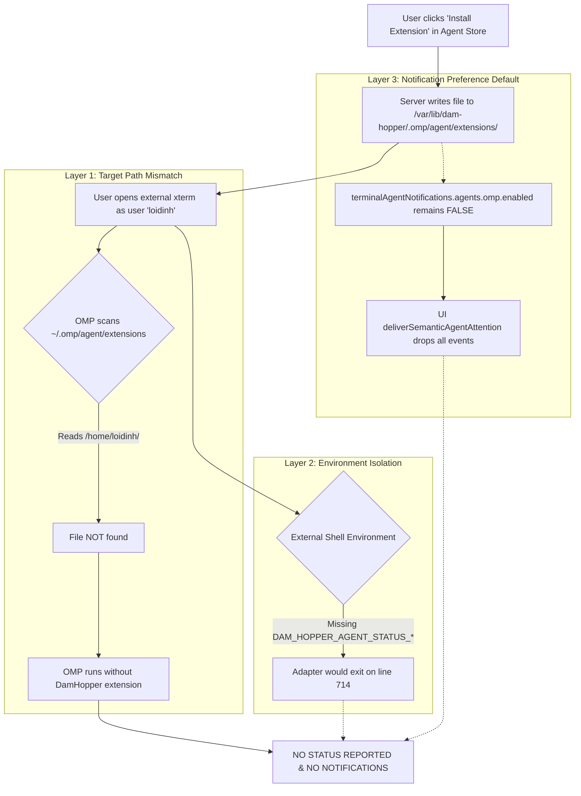

# Diagnostic Report: OMP Agent Tracking Failure & Notification Root Cause Analysis

**Date:** 2026-09-28  
**Scope:** OMP Agent Status Tracking, Extension Target Path, Environment Isolation, and UI Notification Pipeline (Ports 4802/4801)  
**Target File:** `plans/reports/debugger-260928-2225-omp-agent-tracking-not-notifying.md`  

---

## 1. Executive Summary

### Issue Description
In production deployment (`dam-hopper-web` on port 4802, `dam-hopper-api` on port 4801), user enabled OMP extension in Agent Store ("Integrations" tab), ran `omp` in a terminal (`xterm`), requested it to count 1 to 5, but received no agent status updates or turn notifications. The user noted the displayed target path was `/var/lib/dam-hopper/.omp/agent/extensions/dam-hopper-agent-status.ts` and questioned whether this path was the root cause.

### Root Cause Verdict
**YES, the target path `/var/lib/dam-hopper/.omp/agent/extensions/dam-hopper-agent-status.ts` IS a primary root cause, but it is part of a multi-layer failure chain.**

Three distinct failure layers prevented notifications:
1. **Target Path & Identity Mismatch:** `dam-hopper-api.service` runs as service user `dam-hopper` (`HOME=/var/lib/dam-hopper`). The Agent Store installed the extension into `/var/lib/dam-hopper/.omp/agent/extensions/`. When the developer opened desktop `xterm`, `omp` executed as developer user `loidinh` (`HOME=/home/loidinh`). OMP only scans `~/.omp/agent/extensions/` (`/home/loidinh/.omp/agent/extensions/`). Furthermore, `/var/lib/dam-hopper/` has `0700` permissions owned by `dam-hopper:dam-hopper`, making it inaccessible to `loidinh`. OMP never loaded the adapter script.
2. **Terminal Environment Isolation & Missing Credentials:** The standalone adapter (`server/src/agent_status/assets/omp-agent-status.ts`) explicitly requires two environment variables: `DAM_HOPPER_AGENT_STATUS_URL` and `DAM_HOPPER_AGENT_STATUS_TOKEN`. These variables are generated per-PTY incarnation and injected *exclusively* into PTY sessions managed inside DamHopper (`server/src/pty/manager.rs`). External desktop terminal windows (`xterm`) lack these variables. Without them, the adapter immediately exits on line 714 without registering any lifecycle hooks.
3. **Opt-In Notification Policy (Scenario C16):** Installing the extension via Agent Store *only* writes the `.ts` file to disk; it does *not* modify notification preferences. Per architecture scenario C16 (`packages/ui/src/lib/ui-config.ts` and `server/src/config/schema.rs`), OMP notifications are default-off (`enabled: false`). Even if `omp` had run inside a managed terminal and reported status to port 4801, `deliverSemanticAgentAttention()` in the UI client drops all attention events when `terminalAgentNotifications.agents.omp.enabled === false`.

### Recommended Resolution Priorities
- **P0 (Operational / User Guidance):** Document and clarify that OMP agent tracking currently functions inside DamHopper's integrated web terminals (managed PTYs), not external desktop `xterm` windows, unless explicit environment variables and profile directories are linked.
- **P1 (Agent Store Path Awareness):** Allow Agent Store extension manager to target the developer's user profile (e.g. `/home/<user>/.omp/agent`) or accept a configurable target path, rather than silently defaulting to the daemon account's home directory.
- **P2 (Settings / Store Cohesion):** When installing the extension in Agent Store, provide an option or prominent banner informing the user that OMP notifications remain disabled by default in `Settings -> Terminal -> Agent Notifications`.
- **P3 (External Terminal Ingress / CLI Utility):** If external terminals (`xterm`, tmux, host shells) must be supported, provide a helper command (e.g. `dam-hopper terminal env <terminal-id>`) to export valid reporter credentials.

---

## 2. Technical Analysis

### 2.1 Extension Target Path Resolution (Service User vs Developer User)

#### Server-Side Target Resolution
In `server/src/api/agent_status.rs:29-53`:
```rust
fn resolve_target_agent_dir(explicit: Option<&str>) -> Result<PathBuf, IntegrationError> {
    if let Some(raw) = explicit {
        let trimmed = raw.trim();
        if !trimmed.is_empty() {
            let p = PathBuf::from(trimmed);
            if !p.is_absolute() {
                return Err(IntegrationError::NonAbsolutePath(p));
            }
            return Ok(p);
        }
    }

    if let Ok(dir) = std::env::var("PI_CODING_AGENT_DIR") {
        let p = PathBuf::from(dir);
        if p.is_absolute() {
            return Ok(p);
        }
    }

    dirs::home_dir()
        .map(|h| h.join(".omp").join("agent"))
        .ok_or_else(|| {
            IntegrationError::InvalidAgentDirectory(PathBuf::from("~/.omp/agent"))
        })
}
```

#### Why `/var/lib/dam-hopper/.omp/agent/` was targeted:
- In production, `dam-hopper-api.service` runs under:
  ```text
  User=dam-hopper
  Group=dam-hopper
  WorkingDirectory=/var/lib/dam-hopper
  Environment=HOME=/var/lib/dam-hopper
  ```
  (`deploy/systemd/dam-hopper-api.service.in:8-13`).
- In the frontend, `OmpExtensionManager.tsx:25, 33` invokes `useOmpExtensionStatus(undefined)` and `installMutation.mutateAsync(undefined)`. Neither query passes an explicit `agentDir`.
- `PI_CODING_AGENT_DIR` is not set in `dam-hopper-api.service`.
- `dirs::home_dir()` resolves to the process's `$HOME`: `/var/lib/dam-hopper`.
- The target path resolves to `/var/lib/dam-hopper/.omp/agent/extensions/dam-hopper-agent-status.ts`.

#### OMP Extension Discovery in External `xterm` vs Managed Web PTY:
| Context | Running OS User | Effective `$HOME` | OMP Extension Scan Directory | Status File Present? | File Permissions |
| :--- | :--- | :--- | :--- | :--- | :--- |
| **External desktop `xterm`** | `loidinh` (UID 1000) | `/home/loidinh` | `/home/loidinh/.omp/agent/extensions/` | **NO** (Installed in `/var/lib/dam-hopper/`) | `/var/lib/dam-hopper/` is `0700` (`dam-hopper:dam-hopper`), inaccessible to `loidinh` |
| **DamHopper Web PTY** | `dam-hopper` (UID 978) | `/var/lib/dam-hopper` | `/var/lib/dam-hopper/.omp/agent/extensions/` | **YES** (`dam-hopper-agent-status.ts`) | Owned by `dam-hopper:dam-hopper`, readable |

When the user launched `omp` in desktop `xterm`, OMP inspected `/home/loidinh/.omp/agent/extensions/` where no extension existed.

---

### 2.2 Terminal Environment Isolation & Reporter Credentials

#### Adapter Guard Logic
In `server/src/agent_status/assets/omp-agent-status.ts:710-728`:
```typescript
export default function damHopperAgentStatusExtension(pi: OmpExtensionAPI): void {
  const rawUrl = process.env.DAM_HOPPER_AGENT_STATUS_URL;
  const token = process.env.DAM_HOPPER_AGENT_STATUS_TOKEN;
  if (!rawUrl || !token) {
    return;
  }

  if (process.env.OMPCODE === "1") {
    return;
  }

  const validUrl = validateLoopbackWsUrl(rawUrl);
  if (!validUrl) {
    return;
  }

  if (token.length > 128 || !/^[\x21-\x7E]+$/.test(token)) {
    return;
  }
```

- If `DAM_HOPPER_AGENT_STATUS_URL` or `DAM_HOPPER_AGENT_STATUS_TOKEN` is unset or empty, the factory returns immediately.
- It registers zero event listeners (`session_start`, `agent_start`, `agent_end`, `tool_approval_requested`).
- The extension remains completely dormant.

#### Credential Lifecycle & Injection Boundaries
- In `server/src/pty/manager.rs:1490-1496` and `4254-4260`:
  ```rust
  if let Some(res) = &status_reservation {
      cmd.env(crate::agent_status::ENV_AGENT_STATUS_URL, res.url());
      cmd.env(crate::agent_status::ENV_AGENT_STATUS_TOKEN, res.token());
  } else {
      cmd.env_remove(crate::agent_status::ENV_AGENT_STATUS_URL);
      cmd.env_remove(crate::agent_status::ENV_AGENT_STATUS_TOKEN);
  }
  ```
- In `server/src/pty/manager.rs:4758-4761`:
  ```rust
  pub fn is_reserved_agent_status_env_var(key: &str) -> bool {
      key.eq_ignore_ascii_case(crate::agent_status::ENV_AGENT_STATUS_URL)
          || key.eq_ignore_ascii_case(crate::agent_status::ENV_AGENT_STATUS_TOKEN)
  }
  ```
- These environment variables are:
  1. Ephemeral, random, single-incarnation tokens tied to a specific PTY allocation in `AgentStatusRuntime`.
  2. Striped from parent and user-supplied environment configurations.
  3. Injected ONLY into processes spawned through DamHopper's PTY manager.
- **External `xterm` Outcome:** Neither variable is set in the desktop desktop shell. Even if the adapter file had been manually symlinked into `/home/loidinh/.omp/agent/extensions/`, the adapter exits on line 714.

#### Integrated Terminal Identity
- In `server/src/pty/manager.rs:4589-4620`:
  The PTY manager spawns shells via `CommandBuilder::new(&exe)`.
  There are no `setuid`, `setgid`, or `sudo` calls.
- In production under `dam-hopper-api.service`, the integrated terminal runs under the service UID (`dam-hopper`).
- In `server/src/pty/manager.rs:4689-4706`, `resolve_current_user_account()` detects EUID `dam-hopper`, sets `USER=dam-hopper`, `HOME=/var/lib/dam-hopper`.
- The integrated terminal inherits the service account identity and receives the injected loopback credentials.

---

### 2.3 Notification Preferences & UI Bridge Architecture

#### Notification Defaults (Commit `1ecb00bc` & Schema)
In `packages/ui/src/lib/ui-config.ts:23-27`:
```typescript
const DEFAULT_AGENT_POLICY: TerminalAgentNotificationPolicy = {
  enabled: false,
  toast: true,
  browser: true,
  sound: false,
  volume: 100,
  pattern: "default",
};
```
In `server/src/config/schema.rs:852-862`:
```rust
impl Default for TerminalAgentNotificationPolicy {
    fn default() -> Self {
        Self {
            enabled: false,
            toast: true,
            browser: true,
            sound: false,
            volume: default_terminal_notification_sound_volume(),
            pattern: TerminalAgentNotificationSoundPattern::Default,
        }
    }
}
```
- Per Acceptance Scenario C16 (`plans/260928-0318-agent-status-omp-first/acceptance-scenarios.md`):
  *"Notification master/channel toggles, default OMP off, focus/hidden, permission denied; duplicate delivery"*
- OMP agent notifications are **OFF by default** (`enabled: false`).

#### Disconnect Between Agent Store and Notification Settings
- In `packages/ui/src/components/organisms/OmpExtensionManager.tsx:30-49`:
  - Clicking "Install Extension" triggers `POST /api/agent-status/omp/extension/install`.
  - The API endpoint only creates the directory and writes `dam-hopper-agent-status.ts` to disk.
  - It does NOT touch `useSettingsStore` or `terminalAgentNotifications` settings.
- In `packages/ui/src/lib/terminal-agent-notification-integration.ts:41-43`:
  ```typescript
  export function deliverSemanticAgentAttention(
    owner: ConnectionRef,
    row: TerminalAgentStatusRow,
    attention: AgentAttentionEvent,
  ): void {
    ...
    const policy =
      useSettingsStore.getState().terminalAgentNotifications.agents.omp;
    if (!policy.enabled) return;
  ```
- **Result:** Even when status events successfully reach the browser, `deliverSemanticAgentAttention()` bails out immediately if `policy.enabled === false`. The notification toast, bell item, sound, and browser popup are discarded.

#### Port 4802 to Port 4801 Web UI Communication Pipeline
```text
[ Browser (port 4802) ]
       │
       ├─ Fetch /__dam-hopper/runtime-config.json  --> returns apiUrl: "http://<host>:4801"
       │
       ├─ dam-hopper-app.tsx mounts <AgentStatusBridge />
       │      │
       │      └─ useAgentStatusConnections()
       │             │
       │             ├─ GET http://<host>:4801/api/agent-status/v1/snapshot (Baseline state)
       │             │
       │             └─ WebSocket ws://<host>:4801/ws (Persistent push channel)
       │                    │
       │                    ├─ Receives "terminal:agentStatusChanged"
       │                    │
       │                    └─ Dispatches applyAgentStatusChanged(owner, event)
       │                           │
       │                           └─ If event.attention present -> deliverSemanticAgentAttention()
       │                                  │
       │                                  └─ Evaluates: policy.enabled === true ?
       │                                         ├── true  --> addNotification(), sound, browserPopup
       │                                         └── false --> SILENT DROP
```

---

## 3. Failure Chain Synthesis

The failure to notify when the user asked `omp` to count 1 to 5 is a three-layer cascade:



1. **Failure Point 1 (Path):** Extension installed in `/var/lib/dam-hopper/...` instead of `/home/loidinh/...`. `omp` in desktop `xterm` did not execute the extension code.
2. **Failure Point 2 (Environment):** Desktop `xterm` had no `DAM_HOPPER_AGENT_STATUS_URL` or `DAM_HOPPER_AGENT_STATUS_TOKEN`. Even if copied, the extension would have exited dormant.
3. **Failure Point 3 (Preferences):** Even if Points 1 and 2 had passed (e.g. executed inside DamHopper's web terminal), the UI dropped attention events because OMP notifications are opt-in and disabled by default.

---

## 4. Actionable Recommendations (Without Fix Implementation)

### 4.1 Short-Term Operational Guidance (Immediate)
1. **Clarify Operational Surface:** Document that DamHopper OMP Agent Status tracking is designed for sessions running **inside DamHopper's integrated web terminals** (`http://<host>:4802`), where PTY credentials and the service environment exist.
2. **Manual Installation for Developer User (CLI):**
   If running OMP in developer terminals is desired, run the CLI utility under the developer user account:
   ```bash
   dam-hopper-server integration omp install --agent-dir "$HOME/.omp/agent"
   ```
   *(Note: This installs the adapter script, but external terminal sessions still require loopback PTY credentials to report).*
3. **Enable Notifications in Settings:**
   Direct users to navigate to:
   `Settings -> Terminal -> Agent Notifications -> OMP` and toggle **"Enable OMP notifications"** to `true`.

### 4.2 Architectural Improvements (Long-Term)
1. **Agent Store Target Directory Resolution:**
   - Instead of falling back blindly to `dirs::home_dir()` (which evaluates to `/var/lib/dam-hopper` under systemd), `server/src/api/agent_status.rs` should support detecting the primary interactive user account or accept an explicit `agentDir` parameter from the UI.
   - In `packages/ui/src/components/organisms/OmpExtensionManager.tsx`, add an optional input field or dropdown allowing operators to choose between `/var/lib/dam-hopper/.omp/agent` and active user home directories (e.g. `/home/loidinh/.omp/agent`).
2. **Agent Store & Notification Policy Pairing:**
   - When a user successfully installs the OMP extension in Agent Store, display a banner or toggle:
     *"Extension installed. Notifications for OMP are currently disabled in Settings. [Enable Notifications Now]"*
   - Avoid surprise silent drops.
3. **External Terminal Session Support (Ingress Protocol):**
   - If developers need status tracking from external terminals (desktop `xterm`, tmux, SSH sessions outside DamHopper), design a manual token issuance mechanism or CLI wrapper:
     ```bash
     eval $(dam-hopper agent-session create --terminal-name "Desktop xterm")
     omp
     ```
   - This would allocate an incarnation in `AgentStatusRuntime` and export the required `DAM_HOPPER_AGENT_STATUS_URL` and `DAM_HOPPER_AGENT_STATUS_TOKEN`.

---

## 5. Supporting Evidence

### Code and Configuration Evidence Reference Table
| Concern | File | Lines | Key Observation |
| :--- | :--- | :--- | :--- |
| **Service User & Home** | `deploy/systemd/dam-hopper-api.service.in` | 8–13 | `User=@API_USER@`, `Environment=HOME=@API_HOME@` (`/var/lib/dam-hopper`). |
| **Server Target Path Resolver** | `server/src/api/agent_status.rs` | 48–53 | `dirs::home_dir().map(\|h\| h.join(".omp").join("agent"))` evaluates to `/var/lib/dam-hopper/.omp/agent`. |
| **UI Extension Query** | `packages/ui/src/components/organisms/OmpExtensionManager.tsx` | 25, 33 | `useOmpExtensionStatus(undefined)` passes no `agentDir`. |
| **Extension Credential Guard** | `server/src/agent_status/assets/omp-agent-status.ts` | 711–715 | Exits dormant if `!rawUrl \|\| !token`. |
| **PTY Credential Injection** | `server/src/pty/manager.rs` | 1490–1496 | Injects `DAM_HOPPER_AGENT_STATUS_URL` and `_TOKEN` only into managed PTY commands. |
| **Default OMP Policy (UI)** | `packages/ui/src/lib/ui-config.ts` | 23–27 | `DEFAULT_AGENT_POLICY.enabled = false`. |
| **Default OMP Policy (Server)** | `server/src/config/schema.rs` | 852–862 | `TerminalAgentNotificationPolicy.default().enabled = false`. |
| **Attention Drop on Disabled Policy** | `packages/ui/src/lib/terminal-agent-notification-integration.ts` | 41–43 | `if (!policy.enabled) return;` silently discards attention event. |
| **UI Connection Bridge** | `packages/ui/src/embed/dam-hopper-app.tsx` | 352 | `<AgentStatusBridge />` mounts `useAgentStatusConnections()`. |

---

## 6. Unresolved Questions

1. Is there an intended workflow for developers who run `omp` exclusively in external desktop terminals (`xterm` / Alacritty / tmux) rather than DamHopper's web terminal to participate in status tracking and attention notifications?
2. Should the Agent Store "Integrations" tab automatically offer to enable `terminalAgentNotifications.agents.omp.enabled` when the user installs the extension, or is the strict opt-in separation required by security/UX policy?
3. Should the release-manager / systemd installer provision a symlink from developer accounts (`/home/<user>/.omp/agent/extensions/dam-hopper-agent-status.ts`) to the managed adapter when `--service-user` differs from the developer account?
