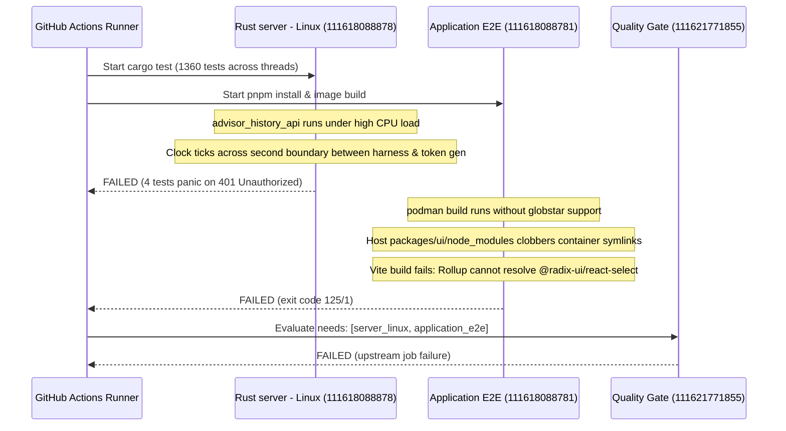

# CI Log Analysis & Failure Diagnostic Report: PR #46

- **Date:** 2026-10-05
- **PR:** [#46 (fix/cloudflared-tunnel-isolation)](https://github.com/loidinhm31/dam-hopper/pull/46)
- **Workflow:** `PR Quality Gate`
- **Run ID:** `37264416062`
- **Head SHA:** `cad858983e472b227998d0734789184117e889cf`
- **Failed Jobs:**
  1. `Rust server - Linux` (Job ID: `111618088878`)
  2. `Application E2E journeys` (Job ID: `111618088781`)
  3. `Quality Gate` (Job ID: `111621771855` — downstream gate dependency)

---

## 1. Executive Summary

### 1.1 Issue Description & Business Impact
PR #46 fixes cloudflared tunnel host file isolation and zombie status. All 19 tunnel unit tests pass. However, the CI pipeline failed on two independent jobs: `Rust server - Linux` and `Application E2E journeys`, blocking merge via the downstream `Quality Gate`.

### 1.2 Root Cause Identification
Neither failure was introduced by PR #46's tunnel changes (`server/src/tunnel/cloudflared.rs`, `server/src/tunnel/manager.rs`, `server/src/tunnel/tests.rs`). Both are latent infrastructure and test harness concurrency defects:
1. **`Rust server - Linux`:** Second-boundary clock drift race in `server/tests/advisor_history_api.rs`. `create_harness` and `generate_auth_token` independently invoke `chrono::Utc::now()`. Under multi-threaded CI test execution (1360 tests running concurrently), execution delays cause `claims.exp != session.expires_at.timestamp()`. Rule 7 of `evaluate_session_policy` rejects the token with `FullLoginRequired`, causing 4 tests to fail with `HTTP 401 Unauthorized`.
2. **`Application E2E journeys`:** Container engine divergence and Podman 3.4.4 globstar bug. The workflow prefetches MongoDB via `docker pull`, but `image-builder.ts` detects and invokes `podman`. On `ubuntu-22.04` runners, Podman 3.4.4 does not support globstar `**` in `.dockerignore`. `**/node_modules` fails to exclude `packages/ui/node_modules`. Step 16 (`COPY packages/ui ./packages/ui`) copies host `node_modules` with host symlinks into `/build/packages/ui`, corrupting container pnpm symlinks. Vite Rollup fails to resolve `@radix-ui/react-select` during `apps/web` build.

### 1.3 Recommended Solutions & Priority
| Priority | Target | Action |
|---|---|---|
| **P0** | `server/tests/advisor_history_api.rs` | Align test auth expiration to deterministic `MOCK_EXPIRY_SECS` constant or return token from `create_harness`. |
| **P0** | `.github/workflows/pr-quality-gate.yml` | Set `CONTAINER_ENGINE: docker` in `application_e2e` job `env` block. |
| **P1** | `.dockerignore` | Add explicit non-globstar paths (`packages/*/node_modules`, `apps/*/node_modules`). |
| **P1** | `apps/web/package.json` | Declare `@radix-ui/react-select` in dependencies to eliminate fragile cross-package node_modules traversal. |

---

## 2. Technical Analysis

### 2.1 Timeline of Events in CI Run 37264416062


### 2.2 Job 1: `Rust server - Linux` (ID 111618088878)

#### Symptoms & Failed Tests
Command: `cargo test --manifest-path server/Cargo.toml`
Exit code: `101`
Test binary: `tests/advisor_history_api.rs`
Result: `8 passed; 4 failed; finished in 2.32s`

Failed assertions:
1. `test_advisor_cookie_session_allowed`:
   ```
   thread 'test_advisor_cookie_session_allowed' panicked at tests/advisor_history_api.rs:241:5:
   assertion `left == right` failed
     left: 401
    right: 200
   ```
2. `test_advisor_default_app_state_uses_effective_home`:
   ```
   thread 'test_advisor_default_app_state_uses_effective_home' panicked at tests/advisor_history_api.rs:583:5:
   assertion `left == right` failed
     left: 401
    right: 200
   ```
3. `test_advisor_disable_clears_snapshots`:
   ```
   thread 'test_advisor_disable_clears_snapshots' panicked at tests/advisor_history_api.rs:531:59:
   called `Option::unwrap()` on a `None` value
   ```
   (Step 2 `POST /api/advisor/history/refresh` returned 401 error JSON; `refresh_json["snapshotId"]` was `None`).
4. `test_advisor_history_lifecycle_against_fixtures`:
   ```
   thread 'test_advisor_history_lifecycle_against_fixtures' panicked at tests/advisor_history_api.rs:326:5:
   assertion `left == right` failed
     left: 401
    right: 200
   ```
   (Step 0 `PATCH /api/advisor/settings` returned 401 instead of 200).

#### Root Cause Analysis
In `server/tests/advisor_history_api.rs`:
```rust
// Lines 31-42:
fn generate_auth_token(subject: &str, sid: &str) -> String {
    let now = chrono::Utc::now(); // T2
    let claims = AuthClaims {
        iat: now.timestamp() as usize,
        exp: (now.timestamp() + 3600) as usize, // T2 + 3600
        ...
    };
    claims.encode(TEST_JWT_SECRET).unwrap()
}

// Lines 128-163 in create_harness:
    let now = chrono::Utc::now(); // T1
    let exp = chrono::DateTime::from_timestamp((now.timestamp() + 3600) as i64, 0).unwrap(); // T1 + 3600
    let session = AuthSession {
        expires_at: chrono_to_bson(exp),
        ...
    };
```
In each test:
```rust
let (router, _state) = create_harness(...).await; // captures T1
let token = generate_auth_token("admin-user", "session-admin"); // captures T2
```
Between T1 and T2, `create_harness` writes `dam-hopper.toml` to disk, instantiates `AppState`, and constructs the router with dozens of routes and middleware layers via `build_router`.
Under heavy concurrency in CI (all 1360 server tests executing across CPU cores), thread scheduling delays allow the second counter to tick (`T2.timestamp() = T1.timestamp() + 1`).
When `authenticate_request` runs `evaluate_session_policy` (`server/src/auth/policy.rs:149-154`):
```rust
// Rule 7: Claim and session document absolute-expiry agreement
if claims.exp != expires_at.timestamp() as usize {
    return AuthDecision::FullLoginRequired {
        reason: "Token expiration does not match session document expiration",
    };
}
```
Because `claims.exp != expires_at.timestamp()`, authentication fails with `AuthDecision::FullLoginRequired`. The middleware returns `401 Unauthorized` (`AUTH_REQUIRED`), failing all 4 assertions.

Other test suites in `server/tests/` (e.g., `fs_mutate.rs:38`, `fs_upload.rs:38`, `browser_debug_artifacts.rs:73`) avoid this by binding `exp` to the constant `MOCK_EXPIRY_SECS = 2_000_000_000`.

---

### 2.3 Job 2: `Application E2E journeys` (ID 111618088781)

#### Symptoms & Error Trace
Command: `pnpm --filter @dam-hopper/ui test:e2e:build-images`
Underlying: `podman build -t dam-hopper:production -f Dockerfile .`
Failing stage: `web-builder` (Step 17/17 `RUN pnpm build`)
Failing sub-command: `pnpm --filter @dam-hopper/web build` (`vite build`)
Error trace:
```
[vite]: Rollup failed to resolve import "@radix-ui/react-select" from "/build/packages/ui/src/components/ui/Select.tsx".
This is most likely unintended because it can break your application at runtime.
If you do want to externalize this module explicitly add it to `build.rollupOptions.external`
    at viteLog (file:///build/node_modules/.pnpm/vite@6.4.1_@types+node@26.1.1_jiti@2.6.1_lightningcss@1.32.0/node_modules/vite/dist/node/chunks/dep-D4NMHUTW.js:46374:15)
...
Error: error building at STEP "RUN pnpm build": error while running runtime: exit status 1
```

#### Root Cause Analysis
1. **Container Engine Detection Mismatch:**
   `.github/workflows/pr-quality-gate.yml:126` prefetches MongoDB via:
   `docker pull docker.io/library/mongo:8.2`
   However, `packages/ui/e2e/fixtures/container-client.ts:28-35` probes `podman` first before `docker`:
   ```ts
   try {
     await execFileAsync("podman", ["--version"], ...);
     resolvedEngine = "podman";
   } catch {
     resolvedEngine = "docker";
   }
   ```
   On GitHub Actions `ubuntu-22.04` runners, `podman` is pre-installed (version 3.4.4).
2. **Podman 3.4.4 Globstar Defect in `.dockerignore`:**
   `.dockerignore` specifies:
   ```
   node_modules
   **/node_modules
   ```
   Podman 3.4.4 does not support globstar `**` recursion in `.dockerignore` (fixed in Podman 4.x/5.x). As a result, `**/node_modules` does not match nested `packages/ui/node_modules`.
3. **Destructive Layer Overwrite:**
   In `Dockerfile`:
   - Step 10: `COPY packages/ui/package.json ./packages/ui/`
   - Step 11: `RUN pnpm install --frozen-lockfile` (creates clean container dependencies at `/build/packages/ui/node_modules` pointing into `/build/node_modules/.pnpm/`)
   - Step 16: `COPY packages/ui ./packages/ui`
   On the runner host, Step 4 (`Install dependencies`) already ran `pnpm install` in `/home/runner/work/dam-hopper/dam-hopper/packages/ui`.
   Because Podman 3.4.4 ignored `**/node_modules`, Step 16 copied host `packages/ui/node_modules` containing host-specific relative symlinks (`/home/runner/...`) over the container's valid `/build/packages/ui/node_modules`.
   Inside the container, those symlinks became broken dangling pointers.
4. **Resolution Failure:**
   `apps/web/vite.config.ts` aliases `@` to `packages/ui/src`. `Select.tsx` is imported as raw source. Vite/Rollup attempted to resolve `@radix-ui/react-select` by traversing up from `Select.tsx` into `/build/packages/ui/node_modules/@radix-ui/react-select`. The broken symlink triggered `Rollup failed to resolve import "@radix-ui/react-select"`.

---

### 2.4 Comparison Against Recent PR Changes (`server/src/tunnel/`)
Diff check (`git diff origin/main..cad858983e`):
```
 server/src/tunnel/cloudflared.rs |  73 +++++++++++-----
 server/src/tunnel/manager.rs     |  18 ++++
 server/src/tunnel/tests.rs       | 183 +++++++++++++++++++++++++++++++++++++++
 3 files changed, 252 insertions(+), 22 deletions(-)
```
- PR #46 only touched tunnel lifecycle and test files.
- All 19 tunnel tests in `server/src/tunnel/tests.rs` pass.
- No changes made to `server/tests/advisor_history_api.rs`.
- No changes made to `Dockerfile`, `packages/ui`, `apps/web`, or workflows.
- PR #46 did not cause either failure.

---

## 3. Actionable Recommendations

### 3.1 Immediate Fixes

#### Fix 1: Eliminate Timestamp Drift in `server/tests/advisor_history_api.rs`
Use the constant `MOCK_EXPIRY_SECS` (from `dam_hopper_server::auth::MOCK_EXPIRY_SECS`) for both token generation and mock session document creation.

**Diff:**
```diff
--- a/server/tests/advisor_history_api.rs
+++ b/server/tests/advisor_history_api.rs
@@ -10,6 +10,7 @@ use dam_hopper_server::api::build_router;
 use dam_hopper_server::auth::AuthService;
+use dam_hopper_server::auth::MOCK_EXPIRY_SECS;
 use dam_hopper_server::auth::model::{
     AuthClaims, AuthSession, UserRecord, UserRole, chrono_to_bson,
 };
@@ -32,13 +33,13 @@ fn generate_auth_token(subject: &str, sid: &str) -> String {
     let now = chrono::Utc::now();
     let claims = AuthClaims {
         v: 2,
         sub: subject.to_string(),
         sid: sid.to_string(),
         auth_version: 0,
         credential_version: 0,
         iat: now.timestamp() as usize,
-        exp: (now.timestamp() + 3600) as usize,
+        exp: MOCK_EXPIRY_SECS,
     };
     claims.encode(TEST_JWT_SECRET).unwrap()
 }
@@ -129,7 +130,7 @@ async fn create_harness(
     if !no_auth {
         let now = chrono::Utc::now();
-        let exp = chrono::DateTime::from_timestamp((now.timestamp() + 3600) as i64, 0).unwrap();
+        let exp = chrono::DateTime::from_timestamp(MOCK_EXPIRY_SECS as i64, 0).unwrap();
         let username = match role {
```

#### Fix 2: Enforce Docker Engine in CI E2E Workflow
Align `application_e2e` with the existing `docker pull` step by explicitly setting `CONTAINER_ENGINE: docker`.

**Diff:**
```diff
--- a/.github/workflows/pr-quality-gate.yml
+++ b/.github/workflows/pr-quality-gate.yml
@@ -111,6 +111,8 @@ jobs:
     runs-on: ubuntu-22.04
     timeout-minutes: 40
+    env:
+      CONTAINER_ENGINE: docker
     steps:
       - uses: actions/checkout@v4
```

#### Fix 3: Harden `.dockerignore` Against Non-Globstar Engines
Explicitly list nested directories in `.dockerignore` for engines lacking `**` support.

**Diff:**
```diff
--- a/.dockerignore
+++ b/.dockerignore
@@ -18,6 +18,10 @@ node_modules
 **/node_modules
+apps/*/node_modules
+packages/*/node_modules
 .pnpm-store
 **/.pnpm-store
+apps/*/dist
+packages/*/dist
```

#### Fix 4: Add Direct Dependency in `apps/web/package.json`
Prevent raw source import traversal issues by declaring `@radix-ui/react-select` in `apps/web`.

**Diff:**
```diff
--- a/apps/web/package.json
+++ b/apps/web/package.json
@@ -17,6 +17,7 @@
     "@dam-hopper/ui": "workspace:*",
+    "@radix-ui/react-select": "2.3.3",
     "@tanstack/react-query": "^5.67.0",
```

---

### 3.2 Long-Term Improvements
1. **Container Engine Parity:** Deprecate runtime auto-detection in `container-client.ts`; default to Docker in CI and local setups unless overridden.
2. **Deterministic Test Clocks:** Refactor all auth integration tests to pass an explicit `Clock` or use `AuthService::new_mock_with_claims` to prevent time-of-check to time-of-use discrepancies.
3. **Isolated Package Build Boundaries:** Pre-bundle `@dam-hopper/ui` to `dist/` rather than exposing raw `.tsx` source exports with internal `@/` aliases to consumer apps.

---

## 4. Supporting Evidence

### 4.1 CI Job 111618088878 Log Excerpt (`Rust server - Linux`)
```text
running 12 tests
test test_advisor_default_app_state_uses_effective_home ... FAILED
test test_advisor_history_lifecycle_against_fixtures ... FAILED
test test_advisor_disable_clears_snapshots ... FAILED
test test_advisor_cookie_session_allowed ... FAILED
test test_advisor_non_admin_denied ... ok
test test_advisor_no_auth_denied ... ok
test test_advisor_refresh_and_query_by_project_label ... ok
test test_advisor_status_and_toggle_when_disabled ... ok
test test_advisor_routing_with_missing_history_directory ... ok
test test_advisor_symlink_rejection_in_api ... ok
test test_advisor_unauthenticated_denied ... ok
test test_advisor_routing_endpoints_auth_matrix ... ok

failures:
---- test_advisor_cookie_session_allowed stdout ----
thread 'test_advisor_cookie_session_allowed' (20353) panicked at tests/advisor_history_api.rs:241:5:
assertion `left == right` failed
  left: 401
 right: 200

---- test_advisor_default_app_state_uses_effective_home stdout ----
thread 'test_advisor_default_app_state_uses_effective_home' (20354) panicked at tests/advisor_history_api.rs:583:5:
assertion `left == right` failed
  left: 401
 right: 200

test result: FAILED. 8 passed; 4 failed; 0 ignored; 0 measured; 0 filtered out; finished in 2.32s
```

### 4.2 CI Job 111618088781 Log Excerpt (`Application E2E journeys`)
```text
[e2e-image-builder] Building E2E images using podman (fingerprint: e2c410de99a7)...
Error: Command failed: podman build -t dam-hopper:production -f /home/runner/work/dam-hopper/dam-hopper/Dockerfile /home/runner/work/dam-hopper/dam-hopper
...
[2/3] STEP 16/17: COPY packages/ui ./packages/ui
--> 013fea28779
[2/3] STEP 17/17: RUN pnpm build
> @dam-hopper/web@0.10.1 build /build/apps/web
> vite build

vite v6.4.1 building for production...
transforming...
✓ 182 modules transformed.
✗ Build failed in 1.75s
error during build:
[vite]: Rollup failed to resolve import "@radix-ui/react-select" from "/build/packages/ui/src/components/ui/Select.tsx".
```

---

## 5. Unresolved Questions

1. Should `CONTAINER_ENGINE` default to `docker` across all environments in `container-client.ts`, eliminating `podman` fallback detection entirely?
2. Does `packages/ui` have plans to emit built `.js`/`.d.ts` bundles to completely isolate internal dependencies from consuming apps (`apps/web`, `apps/native`)?
