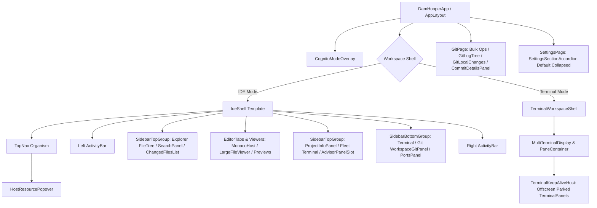

# Scout Report: Shared UI Component Architecture & State Topology

**Target Path**: `packages/ui/src/components/` (and colocated modules)  
**Date**: 2026-10-05  
**Scope**: IdeShell, TerminalPanel, GitPage/GitLogTree, FileTree, FileViewer (EditorTabs & previews), Advisor, HostResources, PortsPanel, CognitoOverlay, SettingsPage  

---

## 1. Executive Summary & Component Hierarchy

The DamHopper UI layer is built on React 19, TypeScript, Tailwind CSS, Zustand stores, and TanStack Query. It follows an Atomic Design hierarchy partitioned into templates/shells, page views, organisms, molecules, atoms, and subsystem feature views:



### Component Classification

| Category | Component / Module | Surface / Responsibility | State & Data Bindings |
| :--- | :--- | :--- | :--- |
| **Shell Template** | `IdeShell.tsx` | Multi-panel layout surface with top, sidebars, center editor, and resizable/maximizable split bottom slot | `localStorage` persistence, `useSidebarCollapse`, `useResizeHandle`, `useVerticalResizeHandle` |
| **Organism** | `TerminalPanel.tsx` | Individual xterm.js instance with WebGL addon, search find bar, suggestions ghost, and history list | PTY WebSocket / REST stream, `useSettingsStore`, `AndroidChromeInputPolicyContext`, `useAppZoom` |
| **Organism** | `PaneContainer.tsx` / `TerminalKeepAliveHost.tsx` | Multi-terminal split docking container (`@dnd-kit`) + offscreen parking host (`-10000px`) | `react-resizable-panels`, `attachTerminalsToHost`, `terminal-registry` |
| **Organism / Page** | `GitPage.tsx` / `GitLogTree.tsx` | Repository branch history graph, bulk fetch/pull/push, squash flow, commit inspector | `useGitHistoryStore`, `useGitRoots`, `useGitWithSshRetry`, `useLeasedGitPush`, CAS OID fence |
| **Organism** | `FileTree.tsx` | Virtualized project directory tree with CRUD, context menu, and language filtering | `react-arborist`, `useFsSubscription`, `useFsOps`, `useExplorerTreeStore`, `useGitDiff` |
| **Organism** | `EditorTabs.tsx` / `LargeFileViewer.tsx` | Active editor shell routing between Monaco, Markdown, HTML, Diff, and chunked LargeFileViewer | `useEditorStore`, `useEncryptMode`, `IntersectionObserver` range reads |
| **Subsystem Panel** | `AdvisorPanel.tsx` (`packages/ui/src/advisor/`) | Server-native Evcrate Advisor dashboard (Overview, History, Configuration, Evaluations) | Native REST API (`/api/advisor/*`), CAS `policy_bytes_etag`, `appReducer` |
| **Organism** | `HostResourcePopover.tsx` & Fleet Deck | Host CPU/RAM/Disk/Swap monitor, fleet metrics deck, incident alerts, idle-suspend status | SSE `/api/host-resources/stream`, REST snapshot fallback, `useMultiHostResources` |
| **Organism** | `PortsPanel.tsx` | Listening port scanner, Cloudflare Tunnel installer/manager, QR preview, session killer | `usePorts`, `isLocalServer`, `cloudflared` auto-installer, WebSocket tunnel state |
| **Organism** | `CognitoModeOverlay.tsx` | Privacy screen mask with window-capture event interception and DOM inert boundary | `useCognitoModeStore`, `useCognitoModeInputGuard`, `useSettingsStore` |
| **Page** | `SettingsPage.tsx` | Server profile selector and collapsed accordion sections for client and daemon preferences | `useSettingsStore`, `useConfig`, `useUpdateConfig`, `SettingsSectionAccordion` |

---

## 2. Layout Surfaces & State Bindings

### 2.1 IdeShell Layout Engine
`IdeShell` coordinates layout surfaces using CSS Grid and flex containers with four distinct tool docks:
- **Left Top Tool**: Explorer (`FileTree`), Search (`SearchPanel`), Commit (`ChangedFilesList`).
- **Left Bottom Tool**: Terminal (`MultiTerminalDisplay`), Git (`WorkspaceGitPanel`), Ports (`PortsPanel`).
- **Right Top Tool**: Project Info (`ProjectInfoPanel`), Fleet Terminal (`MultiTerminalDisplay`), Advisor (`AdvisorPanelSlot`).
- **Right Bottom Tool**: Shared bottom dock for split or multi-panel layouts.
- **Center Canvas**: `EditorTabs`.

#### State Bindings & Persistence Keys
- Left width: `dam-hopper:ide-tree-width` (min 140px, max 1000px, default 240px).
- Right width: `dam-hopper:ide-terminal-tree-width` (min 180px, max 1000px, default 260px).
- Bottom height: `dam-hopper:ide-bottom-height` (min 100px, max 600px, default 300px).
- Active tool IDs: `dam-hopper:ide-left-top`, `dam-hopper:ide-left-bottom`, `dam-hopper:ide-right-top`, `dam-hopper:ide-right-bottom`.
- **Bottom Panel Maximize**: Session-only boolean (`bottomMaximized`). Maximizing clears active top tools to remove Activity Bar highlights and covers the top area. Toggling off or selecting a top tool restores the normal layout.
- **Request Props**: Workspace events bridge into layout state via `activateLeftTopToolRequest`, `activateBottomToolRequest`, and `activateRightTopToolRequest` with monotonic nonces scheduled via `queueMicrotask` to avoid React effect-state cascades.

### 2.2 TerminalPanel, Docking, & Shortcuts
- **Keep-Alive Architecture (`TerminalKeepAliveHost`)**:
  - Live xterm.js instances are mounted once inside an offscreen parking container positioned at `top: -10000px, left: -10000px` with `visibility: hidden; pointer-events: none; aria-hidden="true"`.
  - When a pane becomes active in `PaneContainer`, `attachTerminalsToHost` reparents the `.xterm` DOM node into the visible pane container and triggers `scheduleTerminalFit`.
  - Sessions survive tab switching, split reorganization, and IDE mode toggling without dropping PTY state or restarting bash shells.
- **WebGL Acceleration**:
  - WebGL addon is enabled conditionally (`webglEnabledSessionIds`).
  - Automatically disabled when `isNativeWindowsHost()` is true or `appZoomLevel !== 100` to prevent blurry text and canvas artifacts.
- **Docking Grid (`TerminalDockPreview`)**:
  - Powered by `@dnd-kit/core` with droppable target zones over `PaneNode`:
    - `pane:${paneId}:edge:top` (Split Up)
    - `pane:${paneId}:edge:bottom` (Split Down)
    - `pane:${paneId}:edge:left` (Split Left)
    - `pane:${paneId}:edge:right` (Split Right)
    - `pane:${paneId}:center` (Move Here / Reparent)
- **Keyboard Shortcuts & Mutex (`resolveTerminalPanelShortcut`)**:
  - `Mod+Shift+Backquote`: Toggle Terminal Workspace mode (`DEFAULT_TERMINAL_WORKSPACE_SHORTCUT`).
  - `Mod+Shift+KeyG`: Toggle Git panel.
  - `Mod+Shift+KeyP`: Toggle Ports panel.
  - `Mod+Shift+KeyM`: Toggle Fleet Terminal panel.
  - `Mod+Shift+KeyZ`: Toggle Project panel.
  - `Mod+Shift+KeyE`: Toggle floating terminal file panel.
  - `Ctrl+Alt+Shift+Equal` / `Ctrl+Alt+Minus`: Terminal font size increase/decrease.
  - Mutex invariant: In `IdeShell`, Git and Ports share the left-bottom slot; Fleet Terminal owns the right-top slot. Activating one adjusts mutually exclusive peers while preserving unaffected tools.

### 2.3 GitPage & GitLogTree
- **Multi-Profile Target Resolution**:
  - Supports multiple concurrent server profiles. Bulk fetch and pull iterate over all connected profiles using `byProfile` batching. Bulk push is intentionally restricted to a single project target.
- **VCS Root Navigation**:
  - Resolves multi-root configurations via `useGitRoots`. Root selection triggers `historyActions.resetScope()` and re-evaluates branch availability.
- **Log Rendering (`GitLogTree`)**:
  - Interactive SVG column-based lane graph (`GRAPH_CELL_WIDTH = 14`, `ROW_HEIGHT = 44`, `RADIUS = 4`).
  - Calculates branch track routing with cubic bezier curves and color-coded lane dots from an 8-color palette.
  - Search switch: Typing in `GitHistoryToolbar` automatically shifts presentation from `"graph"` to `"list"`.
  - Debouncing: Search input is debounced by 300ms, cleared immediately on Escape, and guarded against IME composition interrupts (`compositionstart`/`compositionend`).
- **Commit Context Menu Constraints**:
  - `Drop commit`: Disabled if `entry.isPushed` is true.
  - `Undo Last Commit`: Available strictly when `isHead` is true and `!entry.isPushed`.
  - `Edit Commit Message`: Available only on local unpushed branches.
- **Squashing Flow (`GitSquashFlow`)**:
  - Checkbox selection across commit hashes (`squashSelectedHashes`).
  - Validates contiguous squash selections.
  - Initiates commit rewriting with leased publication (`useLeasedGitPush`) using exact-OID fencing against upstream divergence.

### 2.4 FileTree & FileViewer Hierarchy
- **FileTree (`react-arborist`)**:
  - High-performance virtualized directory tree.
  - Live FS sync via SSE subscription (`useFsSubscription`).
  - Language filtering (`ExplorerLanguageFilter`: `all`, `rust`, `javascript-typescript`, `java`) scans AST/extensions via `useExplorerLanguageScan`.
  - Real-time Git diff status badges (`modified`, `added`, `deleted`, `untracked`) using `useGitDiff`.
  - File reveal requests (`revealFileTreePath`) recursively expand ancestor nodes to scroll the target file into view.
- **File Tier Routing (`EditorTabs`)**:
  - `tier === "binary"`: `BinaryPreview` (hex dump with byte offset markers).
  - `tier === "diff"`: `DiffViewer` (side-by-side or unified diff).
  - `tier === "large"`: `LargeFileViewer` for files $\ge 5\text{ MB}$. Performs chunked 64 KB range reads on scroll via an `IntersectionObserver` sentinel, avoiding memory spikes.
  - `.md / .mdx`: `MarkdownHost` (Monaco editor + live Markdown renderer).
  - `.html / .htm`: `HtmlHost` (Monaco editor + sandboxed iframe preview).
  - Normal text/code: `MonacoHost` (lazy Monaco editor with git diff gutter indicators, conflict resolution modal `ConflictDialog`, and disk change detection warning).
  - Security: Integrated with `useEncryptMode` for client-side encrypted file reading and writing.

### 2.5 Native Advisor Subsystem
Replaces retired plugin architecture with native Rust endpoints and React components:
- **`OverviewView`**:
  - Summary rate metrics: Delivery ratio ($\text{adviceReady} / \text{completed}$), Outcome coverage ($\text{reportedOutcomes} / \text{completed}$), Resolution ratio ($\text{resolved} / \text{reportedOutcomes}$).
  - Latency percentiles ($P_{50}, P_{90}, P_{99}$ in milliseconds).
  - Outcome distributions: resolved, unresolved, regressed, missing outcome.
- **`HistoryView`**:
  - Paginated consultation history cards/tables with cursor-based pagination (`cursorHistory`).
  - Filterable by execution status, outcome result, search query, and date range.
  - Detail view: `HistoryDetail` inspects prompts, system reasoning, advice text, and outcome metadata.
- **`ConfigurationView`**:
  - Active owner routing policy editor (`PolicySummaryCard`, `RouteFieldset`).
  - Model introspection via `POST /api/advisor/models` across backends (`omp`, `pi`, `codex`, `claude`).
  - Compares active policy with historical route performance (`RouteGroupCard`).
  - Atomic CAS updates: Sends `policy_bytes_etag` in `PATCH /api/advisor/policy`.
- **`EvaluationsView`**:
  - Lists evaluation descriptors (`EvaluationDescriptorsSection`).
  - Bounded multi-candidate comparison (up to 32 items) with `ComparableGroupsSection`.
  - Performance breakdown: `CandidatePerformanceTable` and `ScoreProvenanceCard`.
  - Privacy guard: `revealCandidates` toggle obfuscates or reveals candidate identities.

### 2.6 HostResources Monitoring
- **Trigger**: Mounted in `TopNavUtilityStrip` showing status icon (health check, warning triangle, pulse), unread alert badge, and freshness indicator.
- **Fleet Deck vs Drilldown**:
  - Multi-profile environments (`fleetMode`) display `HostResourceFleetDeck` with `HostResourceFleetCard` for each configured profile.
  - Profile drilldown or single-profile setups render:
    - Host details: hostname, OS, kernel, sample timestamp.
    - `HostResourceGlance`: CPU %, Memory %, Pinned mount disk storage bar, Swap, Load average.
    - `HostIdleSuspendStatus`: Inactivity timer countdown and manual "Force Sleep" trigger (`ForceSleepDialog`).
    - Expandable `HostResourceDiagnosis`: `HostResourceStorageDetails` (all filesystem mounts) and `HostResourceIncidentDetails` (active and historical alert records).
- **Polling & Stream Invariant**:
  - 1-second host metrics polling is enabled **only** when popover is open and drilled down into a connected profile (`open && isDrilldown`).
  - Completely suspended in fleet deck overview, disconnected profiles, or when the popover is closed.

### 2.7 PortsPanel
- **Port Discovery**:
  - Scans active ports via `usePorts`.
  - Categorizes states: `listening`, `provisional`, `lost`.
  - Flags sensitive network ports (`DANGER_PORTS`: 22, 25, 53, 110, 143, 3306, 5432, 6379, 27017).
- **Public Tunnel Management**:
  - Integrates with Cloudflare Tunnel (`cloudflared`).
  - Auto-installer workflow for Linux/arm64 with progress percentage display; instructions for macOS (`brew`) and manual binaries.
  - Dispatches public tunnel creation with security disclaimer banner (`WARNED_KEY`).
  - Generates mobile QR codes (`QRCode` modal) for instant device testing.
  - Action buttons: open in embedded browser preview or kill backend process/terminal session (`Dialog` confirmation).

### 2.8 Cognito Privacy Mode
- **Visual Presentation (`CognitoModeOverlay`)**:
  - Fixed full-viewport overlay mounted via React Portal to `document.body`.
  - Default shortcut: `Mod+Alt+KeyB` (`DEFAULT_COGNITO_MODE_SHORTCUT`).
  - Mode styles:
    - `black-screen`: Pure `#000000`.
    - `heavy-blur`: Uses `backdrop-filter: blur(16px) saturate(180%)` with background `rgba(148, 163, 184, 0.12)`.
    - Fallback: Gracefully falls back to opaque `#000000` when `backdrop-filter` is unsupported or under `@media (prefers-reduced-transparency: reduce)`.
- **Capture-Phase Input Guard (`useCognitoModeInputGuard`)**:
  - Installs non-passive window listeners with `{ capture: true, passive: false }` for:
    - Pointer/mouse/touch: `pointerdown`, `pointerup`, `pointermove`, `mousedown`, `mouseup`, `mousemove`, `click`, `auxclick`, `contextmenu`, `touchstart`, `touchend`, `touchcancel`, `wheel`.
    - Keyboard: `keydown`, `keypress`, `keyup`.
    - Focus: `focus`, `focusin`, `blur`.
  - Swallows all input events, stops immediate propagation, and calls `preventDefault()`.
  - Physical code tracking (`consumedPhysicalCodesRef`) prevents held keys from triggering repeating toggles.
  - Focus trapping: Forcefully redirects focus to `[data-cognito-mode-overlay]`.
  - Productive DOM isolation: In `dam-hopper-app.tsx`, the application shell is wrapped in:
    ```tsx
    <div
      data-cognito-mode-content=""
      inert={cognitoActive ? true : undefined}
      aria-hidden={cognitoActive ? "true" : undefined}
      className="contents"
    >
    ```
  - Outside boundaries: Toast notification viewports (`TerminalNotificationToastViewport`) and audio remain outside `data-cognito-mode-content` and functional.
  - Settings capture exception: Shortcut configuration inputs marked with `[data-shortcut-capture="true"]` are exempted from global toggle interception while inactive.

### 2.9 SettingsPage Architecture (Commit aa35a91e)
- **Profile Routing**:
  - Top persistent section houses two uncollapsed server selectors:
    1. **Settings Target Server**: Governs workspace config, global machine defaults, usage insights, and maintenance.
    2. **Workbench Preferences Source**: Governs shared appearance, keyboard shortcuts, and notification rules.
- **Default-Collapsed Accordion Sections (Commit aa35a91e)**:
  - All sections are wrapped in `SettingsSectionAccordion`.
  - Per commit `aa35a91e`, all explicit `defaultOpen` props were removed, enforcing `defaultOpen = false` by default across all sections:
    1. **Appearance** (`SettingsAppearanceSection`)
    2. **Keyboard Shortcuts** (`SettingsKeyboardShortcutsSection`)
    3. **Usage Insights** (`SettingsUsageInsightsSection`)
    4. **Terminal Idle Suspend** (`SettingsIdleSuspendTimingSection`)
    5. **Global Settings** (`SettingsGlobalConfigPanel`)
    6. **Workspace Config** (`SettingsWorkspaceConfigPanel`)
    7. **Maintenance** (`SettingsMaintenancePanel`)
    8. **Import / Export Settings** (`SettingsImportExportPanel`)
    9. **Native Advisor** (`AdvisorSettingsSection`)
- **Safety Modals**:
  - `ConfirmDialog` modal with `variant="danger"` guards destructive operations: Nuclear Workspace Reset and Configuration Overwrite.

---

## 3. UI Invariants & Guardrails

1. **React 19 Radix UI Patches**:
   Unstable callback ref identities under React 19 cause infinite render cascades in Radix primitives. Patches `@radix-ui__react-compose-refs@1.1.2` and `@radix-ui__react-slot@1.2.3` must remain intact.
2. **Terminal Parking & Reparenting**:
   Terminal DOM nodes must never be unmounted during layout reconfiguration or tab switching. Reparenting via `TerminalKeepAliveHost` preserves xterm.js PTY buffers.
3. **Resource Polling Throttling**:
   Tiered 1-second SSE/REST polling for host metrics is strictly disabled unless `HostResourcePopover` is both open and drilled down into a specific connected server profile.
4. **Cognito Mode Event Suppression**:
   Input guarding requires window capture-phase (`capture: true, passive: false`) interception. Productive DOM must be marked `inert` and `aria-hidden="true"` while toast viewports remain interactive outside.
5. **Atomic Advisor Policy Writes**:
   Policy updates require CAS concurrency token verification (`policy_bytes_etag`) and mutex locking on the Rust backend; UI prevents race conditions via `policyOperationSeqRef`.
6. **Leased Git Rewrites**:
   Git history rewriting (squashing, dropping, reverting) requires detached publication leases verifying both root and tip OIDs before advancing refs to eliminate blind force-pushes.

---

## 4. Unresolved Questions

- None. All target components, layout hierarchies, state stores, and behaviors are mapped and verified against repository source code.
