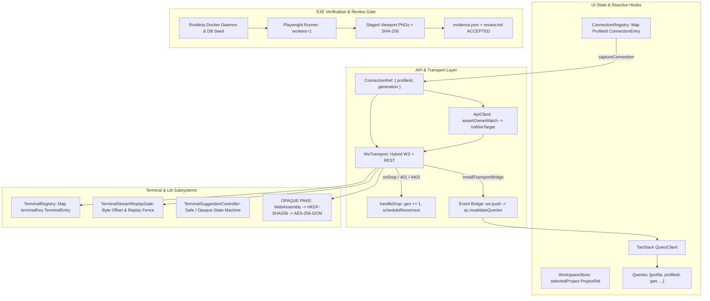

# Scout Report: UI Core Architecture, State Topology & E2E Validation

**Target**: `packages/ui/src/api/`, `packages/ui/src/stores/`, `packages/ui/src/hooks/`, `packages/ui/src/lib/`, `packages/ui/e2e/`  
**Date**: 2026-10-05  
**Scope**: Transport Envelopes, Multi-Server Profile Isolation, React Query Generation Scoping, xterm.js Terminal Architecture, OPAQUE Crypto Handshakes, Playwright E2E Isolation & Visual Evidence Gates  

---

## 1. Executive Summary & Core Topology

The `dam-hopper` UI core architecture is structured around five foundational pillars:
1. **Multi-Server Connection & Wire Boundary (`src/api/`)**: A hybrid WebSocket/REST transport (`WsTransport`) managed by a generation-fenced connection registry (`connections.ts`). All server interactions enforce identity isolation through tuple serialization (`[profileId, ...]`), rejecting cross-profile pollution and stripping local routing IDs before wire transmission.
2. **State Hierarchy & Persistence (`src/stores/`)**: Segregated Zustand stores managing workspace navigation, target availability, UI appearance preferences, and window-level privacy modes with localized profile-partitioned localStorage/sessionStorage persistence.
3. **Profile-Scoped Reactive Layer (`src/hooks/`)**: TanStack Query integration keyed explicitly by connection generation (`["profile", profileId, generation, ...]`), ensuring automatic cache eviction and request fencing across network drops or profile reconnects.
4. **Terminal & Cryptographic Infrastructure (`src/lib/`)**: Imperative xterm.js instance registry decoupled from React state, featuring byte-level stream offset reconciliation, historical replay gating, client-side fail-closed suggestion states, and zero-knowledge AES-256-GCM file encryption via OPAQUE PAKE.
5. **Hermetic E2E & Visual Review Gates (`e2e/`)**: Containerized Playwright test harnesses running against isolated rootless daemon backends with deterministic DB seeds, staged PNG capture validation, source fingerprint consistency checks, and `review.md` human review gating.



---

## 2. API Architecture & Transport Layer (`packages/ui/src/api/`)

### 2.1 Transport Lifecycle & Envelopes (`ws-transport.ts`)
`WsTransport` implements the abstract `Transport` interface combining full-duplex WebSocket messaging with HTTP REST endpoint invocation:
- **WebSocket Protocol Messages**:
  - `terminal:output`: Incremental PTY stream frames containing `{ id, offset, data, incarnation }`. Validated strictly with UTF-8 byte length math against `Number.isSafeInteger`. Malformed or lagged offsets fire `terminal:lagged` diagnostics.
  - `terminal:buffer`: Historical snapshot frames sent upon connection attach or recovery: `{ id, offset, data, reset, truncated, incarnation }`.
  - `terminal:lifecycle`: Server-validated shell state: `"unverified" | "editing" | "submitted" | "opaque"`.
  - `terminal:exit` / `process:restarted`: Exit codes, restart countdowns, and incarnation transitions.
  - `fs:tree_snapshot` / `fs:overflow` / `fs:error`: Virtual file system change notifications.
  - Chunked Binary Uploads: `fs:write_*` and `fs:upload_*` protocols using 128 KiB binary chunks with monotonic sequence counters (`seq`) and commit barriers.
  - OPAQUE Authentication: `auth:register_start`, `auth:register_finish`, `auth:login_start`, `auth:login_finish`, and encrypted saves (`fs:put_begin`, `fs:put_chunk`, `fs:put_commit`, `fs:put_save`).
- **REST Channel Invocations (`invoke<T>`)**:
  - Maps IPC channel strings to REST endpoints via `channelToEndpoint(channel, data)`.
  - Attaches Bearer authorization headers via profile-bound tokens.
  - AbortController lifecycle: Bound to caller cancellation signals and transport destruction.
  - Seamless 401 interception: REST responses indicating `MFA_REQUIRED` trigger immediate `onDrop` synthesis with code `4403`, while session expiration triggers code `4401`.

### 2.2 Connection Registry & Multi-Server Routing (`connections.ts`)
Connection state is managed by an ambient registry coordinating concurrent server profiles without cross-talk:
- **Entry Structure**: Each profile tracks `ConnectionEntry = { profileId, generation, status, intent, serverUrl, transport, api, backoffMs, reconnectTimer, snapshot }`.
- **Generation Monotonicity**: Every connection attempt, drop, or manual disconnect increments `generation += 1`. Asynchronous network operations capture `generation` and verify `!isStale(profileId, generation)` prior to committing state changes.
- **Backoff Reconnection Engine**:
  - Exponential backoff: Starts at 1,000ms (`INITIAL_BACKOFF_MS`), doubles up to 30,000ms (`MAX_BACKOFF_MS`).
  - Active intent preservation: Reconnection runs only when `intent: true` and profile is not tombstoned.
  - Halting conditions: Close code `4403` (`mfa-required`) or `4401` (`login-required`) sets status and halts automatic reconnection loops until explicit user authentication occurs.
- **Safe Ambient De-escalation**: Disconnecting a secondary profile verifies `entry.transport === currentAmbient` before reconfiguring the ambient transport to `IdleTransport`, preserving ambient connectivity for the primary profile.

### 2.3 Wire Target Projection & Identity Hierarchy (`ownership.ts`, `client.ts`)
Strict reference typing prevents accidental parameter swapping and cross-server command dispatch:
- **Identity Hierarchy**:
  - `ConnectionRef`: `{ profileId, generation }`
  - `ProjectRef`: `{ profileId?, project }`
  - `QualifiedProjectTargetRef`: `{ profileId, project, worktreePath }`
  - `TerminalRef`: `{ profileId, id }`
  - `TerminalInstanceRef`: `{ profileId, id, incarnation }`
- **Deterministic Ordered-Tuple Serialization**:
  - `projectKey`: `JSON.stringify([ref.profileId, ref.project])`
  - `projectTargetKey`: `JSON.stringify([ref.profileId, ref.project, ref.worktreePath ?? null])`
  - `terminalKey`: `JSON.stringify([ref.profileId, ref.id])`
  - `connectionKey`: `JSON.stringify([ref.profileId, ref.generation])`
- **Wire Target Sanitization**: `createApiClient` executes `assertOwnerMatch(owner, target, "project-target")` to verify ownership match before projecting to `ServerProjectTarget`, strictly omitting `profileId` from outbound HTTP/WS payloads.

---

## 3. State Management & Persistent Stores (`packages/ui/src/stores/`)

| Store | Location | State Shape & Key Responsibilities | Persistence Mechanism |
| :--- | :--- | :--- | :--- |
| **Workspace Store** | `workspace.ts` | `selectedProject: ProjectRef | null`, `navigationRevision: number` | LocalStorage: `dam-hopper:workspace-state` (v1). Enforces explicit `profileId` on selection. |
| **Server Profiles** | `server-config.ts` | `ServerProfile[]`, active profile ID, native scope mappings, endpoint-bound auth tokens | LocalStorage: `damhopper_server_profiles`, `damhopper_profile_auth_v2_<id>`. Revision versioned via `useSyncExternalStore`. |
| **Project Target Store** | `project-target.ts` | Active worktree per project, worktree root snapshot, unselectable/pruned target latching | In-memory Zustand store. Marks targets unavailable via `markProjectTargetUnavailable`. |
| **Workbench Selections** | `workbench-selections.ts` | Per-profile settings target, preferences snapshots, browser target profile ID | LocalStorage: `dam-hopper:settings-target:v1`. Automatically purges deleted profile state. |
| **Terminal Pins** | `terminal-pin-persistence.ts` | Persistent pinned terminal IDs per profile | LocalStorage: `dam-hopper:terminal-pins:v2:<profileId>`. Preserves pins across refreshes. |
| **Settings Store** | `settings.ts` | Appearance preferences, font size bounds (10–32px), keyboard ergonomics, custom shortcuts | Ephemeral store with debounced push to daemon config (`useUpdateUiConfig`). |
| **Cognito Privacy Mode** | `cognito-mode.ts` | `active: boolean`, triggering shortcut chord (`activationShortcut`) | In-memory Zustand store. Ephemeral state resets on tab reload or shortcut chord. |
| **Agent Status** | `agent-status.ts` | Live execution status of AI assistants (Codex, Claude, OMP, Pi) across all profiles | In-memory Zustand store updated via WebSocket bridge events (`agent:status`). |

---

## 4. Reactive Hooks & Query Scoping (`packages/ui/src/hooks/`)

### 4.1 React Query Profile-Scoping Architecture (`queries.ts`, `query-client.ts`)
To guarantee that background queries from severed or reconnected sessions never pollute UI components, query cache keys are structured hierarchically:
- **Canonical Key Format**:
  ```typescript
  // [profile, profileId, generation, ...domainParts]
  profileQueryKey(owner, "projects")
  profileQueryKey(owner, "git", project, worktreePath, "status")
  profileQueryKey(owner, "fs", project, worktreePath, path)
  profileQueryKey(owner, "system", "metrics")
  ```
- **Targeted Invalidation Scopes**:
  - Profile-level across all generations: `profileQueryPrefix(profileId)` (`["profile", profileId]`).
  - Connection-generation fencing: `profileGenerationQueryPrefix(owner)` (`["profile", profileId, generation]`).
  - Cache Key Hashing: `profileScopedQueryKeyHash` prepends the active profile ID to TanStack Query internal hashes.
- **Transport Generation Subscription (`use-transport-generation.ts`)**:
  - Uses `useSyncExternalStore` to observe `subscribeConnections`.
  - Returns signed integer: `+generation` when connected, `-generation` when disconnected or offline.

### 4.2 Push Event Query Invalidation Bridge (`use-sse.ts`)
`installTransportBridge(owner, transport, getRegisteredQueryClients)` subscribes to incoming transport push channels and dispatches targeted invalidations:
- `workspace:changed`: Invokes `handleWorkspaceChanged` to invalidate or reset workspace queries.
- `config:changed`: Invalidates `profileQueryKey(owner, "config")` and `profileQueryKey(owner, "projects")`.
- `terminal:changed`: Invalidates `profileQueryKey(owner, "terminal-sessions")`.
- `status:changed`: Invalidates `profileQueryKey(owner, "git", projectName, null)`.
- `host:alertChanged` / `host:alertsInvalidated`: Coordinated via microtask batching in `scheduleHistoryInvalidation`, checking `isCurrentConnection(owner)` before invalidating `["profile", profileId, gen, "system", "resource-alerts"]`.

### 4.3 Shortcut Interception & Window Input Guards (`use-cognito-mode-input-guard.ts`, `use-shortcuts.ts`)
- **Shortcut Engine**: `DoubleShiftDetector` tracks consecutive Shift keypresses within 450ms. Normalizes Mod keys (Command on macOS, Control on Linux/Windows).
- **Cognito Privacy Mode Input Guard**:
  - Registers nonpassive window listeners (`capture: true`) on `keydown`, `keyup`, `pointerdown`, `pointerup`, `mousedown`, `mouseup`, `click`, `contextmenu`, `touchstart`, `touchend`, `wheel`.
  - When Cognito Mode is active, all pointer/touch/wheel and typing events are immediately swallowed (`stopPropagation()`, `stopImmediatePropagation()`, `preventDefault()`).
  - Re-evaluates only the matching toggle chord (`DEFAULT_COGNITO_MODE_SHORTCUT = "Mod+Alt+KeyB"`) to release the privacy lock.
  - Productive DOM marked `inert` and `aria-hidden="true"` to prevent screen-reader leakage.

---

## 5. Terminal Engine & Cryptographic Subsystems (`packages/ui/src/lib/`)

### 5.1 Terminal Stream Reconciliation & Replay Gating (`terminal-stream-replay-gate.ts`, `terminal-buffer-replay.ts`)
- **Imperative Terminal Registry (`terminal-registry.ts`)**: Singleton map indexed by tuple string `terminalKey(ref)`. Holds active xterm `Terminal`, `FitAddon`, and `TerminalFindController` instances strictly outside React component state.
- **Stream Replay Gating**:
  - Historical buffer replaying sets `activeReplayWrites += 1`, locking the gate.
  - `shouldForwardTerminalData(gate)` returns `false` while replay writes are in flight, suppressing outbound user typing or escape queries from reaching the PTY during historical playback.
- **Offset Reconciliation Math (`reconcileTerminalOutput`)**:
  - `endOffset <= currentOffset`: Duplicate chunk -> Action: `discard`.
  - `startOffset === currentOffset`: Contiguous stream -> Action: `render`.
  - `startOffset < currentOffset < endOffset`: Partial overlap -> Action: `render` after slicing leading bytes via `sliceUtf8LeadingBytes`.
  - `startOffset > currentOffset`: Buffer gap -> Action: `gap`, triggering stream resynchronization and lagging recovery.

### 5.2 Terminal Suggestion State Machine (`terminal-suggestion-controller.ts`)
- Client-side suggestion engine that predicts shell completions from local command history without ever writing unconfirmed bytes to the PTY.
- **State Machine**:
  - `"disabled"`: Suggestions toggled off.
  - `"ready-clean"`: Ready at prompt; input buffer empty.
  - `"querying"`: Searching local command history.
  - `"ghost"`: Rendering inline virtual suggestion text.
  - `"explicit-list"`: Dropdown list navigation.
  - `"opaque"`: Fail-closed privacy/safety mode.
- **Fail-Closed Triggers for "opaque" State**:
  - Escape sequences classified as ambiguous or unverified.
  - Terminal enters password prompt or hidden input (`lifecycle === "opaque"`).
  - Active IME composition started (`handleComposition`).
  - Echo accumulation exceeds 4,096 bytes (`MAX_PENDING_ECHO_LENGTH`).
  - Ghost suggestions are completely hidden in opaque state, preventing credential leakage into suggestion overlays.

### 5.3 OPAQUE Protocol & AES-256-GCM Handshake (`opaque-session.ts`, `opaque-client.ts`, `crypto.ts`)
- **Zero-Knowledge Handshake Flow**:
  1. `opaqueRegisterStart(password)`: Computes client registration request.
  2. `transport.authRegisterStart`: Exchanges registration bytes with server.
  3. `transport.authRegisterFinish(identifier, regUpload, overwrite=true)`: Ephemeral server-side registration.
  4. `opaqueLoginStart(password)`: Computes initial login request.
  5. `transport.authLoginStart`: Exchanges login parameters; returns `session_id` and server response.
  6. `finishLogin(loginResponse)`: Validates server credentials and outputs shared `sessionKey`.
  7. `transport.authLoginFinish(session_id, finalizationBytes)`: Completes login mutual authentication.
- **Key Derivation (HKDF-SHA256)**:
  - Expands `sessionKey` into a 32-byte AES key:
    ```typescript
    crypto.subtle.deriveBits({
      name: "HKDF",
      hash: "SHA-256",
      salt: new Uint8Array(32), // 32 zero bytes matching Rust default
      info: new TextEncoder().encode("dam-hopper-aes-256-gcm-v1"),
    }, baseKey, 256);
    ```
- **Memory Zeroization**: Intermediate input keying material (IKM), export keys, and derived byte buffers are immediately wiped using `.fill(0)`. `EncryptContext` stores sessions in ephemeral `useRef<Map>` instances, explicitly zeroing keys on unmount or project lock deactivation.

---

## 6. Playwright E2E Runner & Visual Review Architecture (`packages/ui/e2e/`)

### 6.1 Test Execution & Container Isolation (`playwright.config.ts`, `fixtures/`)
- **Playwright Configuration**:
  - Single worker execution (`workers: 1`, `fullyParallel: false`) to eliminate concurrency races on shared ports.
  - Desktop Chrome viewport standardized at `1440x900` with animations disabled and font loading awaited.
  - Launch options automatically fall back to system Chromium binary (`/usr/bin/chromium-browser`, `/usr/bin/chromium`).
- **Containerized Service Fixture (`application-services.ts`)**:
  - Builds and starts an isolated containerized daemon backend (`application-runtime.Dockerfile`).
  - Generates deterministic test fixtures: SQLite database pre-seeded with known projects, SSH keys, and workspace targets. Computes `seedDigest`.
  - Injects pre-authenticated browser state via `storageState` with endpoint-bound session tokens.

### 6.2 Visual Checkpoint Staging & Verification Pipeline (`capture-evidence.ts`)
- **Unified Capture Policy (`capture-policy.ts`)**:
  - Explicit control via `E2E_CAPTURE` environment variable (`"1"` | `"true"` | `"0"` | `"false"`).
  - Default behavior: Automatically disabled on CI (`CI=true`), enabled by default during local development runs.
- **Two-Phase Staging & Publishing**:
  1. **Phase 1: Staging & Validation**:
     - Checkpoint screenshots are captured to ephemeral staging (`packages/ui/.e2e-staging/<runId>/<caseName>/<checkpoint>.png`).
     - `validatePngBuffer(buffer)`: Verifies 8-byte PNG signature (`89 50 4E 47 0D 0A 1A 0A`) and parses IHDR width/height.
     - Calculates SHA-256 checksum of raw image bytes.
  2. **Phase 2: Finalization & Source Fingerprint Guard**:
     - Computes initial source fingerprint (`computeSourceFingerprint`) of UI code and git HEAD.
     - Re-evaluates fingerprint upon test completion. If code was modified mid-run, staged assets are purged and an error is raised.
     - On functional pass and clean teardown, copies staged images to case folder (`packages/ui/e2e/<caseName>/`).
     - Generates `evidence.json` containing metadata: Run ID, Git HEAD, source fingerprint, seed digest, viewport, checkpoint SHA-256s, and outcome status.
     - Generates `review.md` initialized to `Status: PENDING_HUMAN_REVIEW`.

### 6.3 Human Review Gates (`review.md`)
- Visual regressions are gated by colocated human review records.
- Tests pass functionally in automated suites, but promotion or release verification requires the reviewer to inspect checkpoint screenshots and commit a signed review record (`Outcome: ACCEPTED` / `Status: ACCEPTED`).

---

## 7. Architectural Observations & Invariants

1. **Strict Ownership Barrier**: Internal UI keys are ordered JSON tuples (`[profileId, project]`). `toServerProjectTarget` guarantees local profile routing metadata never leaks to daemon endpoints.
2. **Generation Monotonicity Prevents Split-Brain**: Every reconnect or drop increments `generation`. TanStack Query keys include generation, automatically isolating in-flight queries from previous socket incarnations.
3. **Fail-Closed Terminal Privacy**: Password inputs and ambiguous escape streams immediately force the suggestion engine into `"opaque"` mode, preventing terminal input theft or display leaks.
4. **Zero-Knowledge Ephemeral Encryption**: OPAQUE PAKE derives symmetric AES keys entirely in client memory without transmitting passphrases over the wire; keys are zeroed upon session tear-down.
5. **Deterministic E2E Visual Verification**: Visual snapshots are staged, validated for PNG integrity and SHA-256 uniqueness, and guarded by source fingerprints before human review acceptance.

---

## 8. Unresolved Questions

- None. All target modules (`api/`, `stores/`, `hooks/`, `lib/`, `e2e/`) have been fully inspected and cross-referenced with repository source code.
